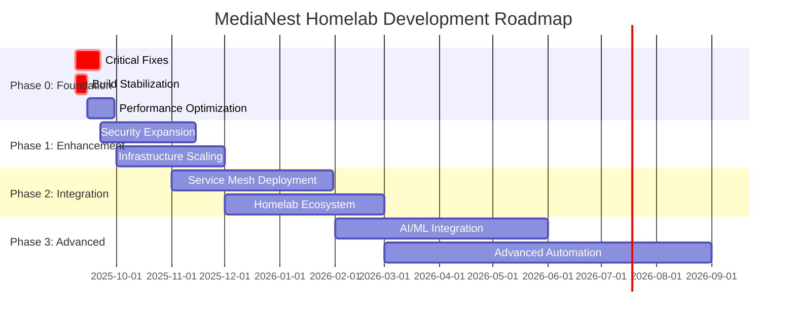
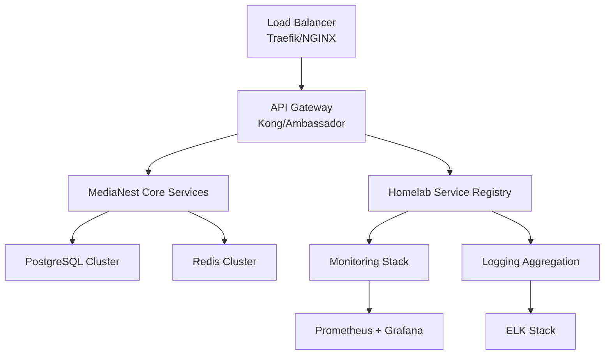
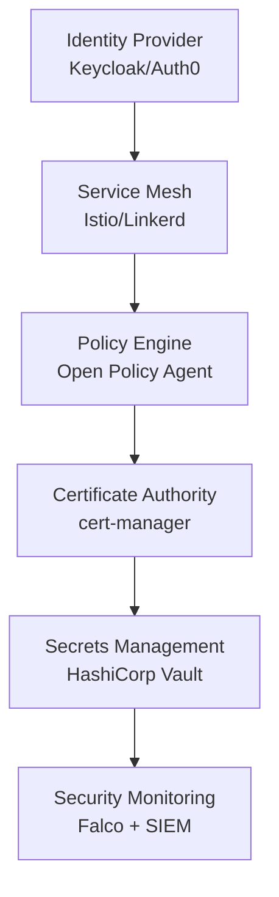
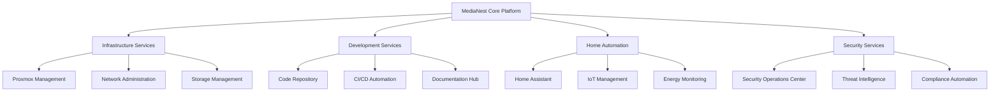

# MediaNest Homelab Development Roadmap 2025

**Project Scope**: Comprehensive Homelab Development Strategy  
**Timeline**: 6-12 Months (September 2025 - September 2026)  
**Roadmap Queen**: Master Coordination Authority  
**Document Version**: 1.0  
**Last Updated**: September 8, 2025

---

## 🎯 Executive Summary

MediaNest serves as the **foundational cornerstone** for a comprehensive homelab development ecosystem. With a **91/100 security score** and production-hardened Docker infrastructure, the platform provides an excellent launching point for systematic homelab expansion across infrastructure, development, security, and operational excellence domains.

### 🏆 Strategic Vision

Transform MediaNest from a standalone media management platform into the **central orchestration hub** for a complete homelab ecosystem, encompassing service management, infrastructure automation, security operations, and development workflows.

### 📊 Current Foundation Assessment

| Domain | Current State | Target State | Timeline |
|--------|---------------|--------------|----------|
| **Security** | 91/100 Score ✅ | 95/100+ Enhanced | 2-3 months |
| **Infrastructure** | Docker Hardened ⚠️ | K8s + IaC | 4-6 months |
| **Development** | Modern Stack ⚠️ | Microservices | 6-8 months |
| **Operations** | Basic Monitoring | Full Observability | 3-5 months |

---

## 🗺️ Strategic Roadmap Overview



---

## 🚀 Phase 0: Foundation Stabilization (2-4 Weeks)

**Objective**: Resolve critical issues and establish production-ready foundation

### 🔴 Critical Priority Items

#### Week 1-2: Emergency Fixes
```bash
# PRIORITY 1: Docker Build Resolution
- Fix shared library TypeScript compilation failures
- Resolve Docker build context issues  
- Implement build stabilization scripts
- Validate complete container orchestration

# PRIORITY 2: Performance Emergency
- Reduce bundle size from 465MB to <10MB (interim target)
- Implement basic code splitting and tree shaking
- Enable Next.js production optimizations
- Remove dev dependencies from production builds
```

#### Week 2-4: Foundation Hardening
```bash
# Infrastructure Stabilization
- Initialize Docker Swarm orchestration
- Validate secret management deployment
- Implement comprehensive health checks
- Establish monitoring baseline

# Security Maintenance  
- Maintain 91/100 security score
- Implement automated security scanning
- Establish security monitoring baseline
- Document security procedures
```

### 🎯 Phase 0 Success Criteria
- [ ] Docker builds complete without manual intervention
- [ ] Bundle size reduced to <10MB
- [ ] All tests passing (backend: 26/26+, frontend: comprehensive)
- [ ] Container orchestration fully operational
- [ ] Security score maintained at 90+/100
- [ ] Complete deployment automation functional

---

## ⚡ Phase 1: Infrastructure Enhancement (2-4 Months)

**Objective**: Scale infrastructure capabilities and implement advanced orchestration

### 🏗️ Infrastructure Architecture Evolution

#### Kubernetes Migration Strategy
```yaml
# Infrastructure as Code Implementation
Infrastructure_Stack:
  Current: Docker Compose + Docker Swarm
  Target: Kubernetes + Helm Charts
  Timeline: 3-4 months
  
  Migration_Path:
    Month_1: K8s cluster setup and basic workloads
    Month_2: Service mesh implementation (Istio)
    Month_3: Advanced networking and storage
    Month_4: Production migration and validation
```

#### Service Infrastructure Expansion


### 🔧 Development Stack Optimization

#### Backend Architecture Enhancement
```typescript
// Microservices Architecture Transition
interface HomelabArchitecture {
  // Core Services
  mediaService: MediaManagementService;
  authService: AuthenticationService;
  configService: ConfigurationService;
  
  // Homelab Integration Services  
  infrastructureService: InfrastructureManagementService;
  monitoringService: MonitoringOrchestrationService;
  deploymentService: DeploymentAutomationService;
  
  // Advanced Services
  aiService: AIInsightsService;
  analyticsService: AnalyticsService;
}

// API Evolution Strategy
interface APIRoadmap {
  v1: RESTful_Current;
  v2: GraphQL_Unified;
  v3: gRPC_Performance;
  timeline: "6-8 months";
}
```

#### Frontend Architecture Evolution
```typescript
// Progressive Web Application Enhancement
interface FrontendRoadmap {
  currentStack: {
    framework: "Next.js 15";
    bundleSize: "465MB → <500KB target";
    features: "Basic media management";
  };
  
  targetStack: {
    framework: "Next.js 15 + Advanced PWA";
    bundleSize: "<500KB optimized";
    features: "Homelab dashboard + service management";
    timeline: "4-6 months";
  };
}
```

### 📈 Phase 1 Deliverables
- Kubernetes cluster with production-grade configuration
- Microservices architecture foundation
- Advanced monitoring and observability stack
- Infrastructure as Code (Terraform + Helm)
- CI/CD pipeline automation
- Bundle optimization achieving <500KB target

---

## 🔐 Phase 2: Security & Integration Excellence (3-6 Months)

**Objective**: Implement zero-trust security model and comprehensive service integration

### 🛡️ Zero-Trust Security Architecture

#### Security Model Evolution
```yaml
Security_Architecture:
  Current_State:
    score: 91/100
    model: "Perimeter-based with JWT"
    strengths: ["Container hardening", "Secret management"]
  
  Target_State:
    score: 95+/100  
    model: "Zero-trust with service mesh"
    timeline: 4-5 months
    
  Implementation_Phases:
    Phase_A: "Service-to-service encryption (mTLS)"
    Phase_B: "Identity-based access control (RBAC/ABAC)"
    Phase_C: "Behavioral analytics and threat detection"
    Phase_D: "Compliance automation (SOC2/ISO27001)"
```

#### Security Infrastructure Components


### 🔗 Homelab Service Integration Framework

#### Integration Architecture
```typescript
// Universal Service Integration Platform
interface HomelabIntegrationPlatform {
  // Service Discovery
  serviceRegistry: {
    consul: ServiceDiscoveryService;
    kubernetes: K8sServiceDiscovery;
    dns: DNSBasedDiscovery;
  };
  
  // API Gateway & Routing
  apiGateway: {
    kong: APIGatewayService;
    traefik: ReverseProxyService;
    ambassador: EdgeStackService;
  };
  
  // Message Bus & Events
  eventBus: {
    kafka: EventStreamingService;
    rabbitmq: MessageQueueService;
    nats: PubSubService;
  };
  
  // Data Integration
  dataLayer: {
    postgresql: PrimaryDatabase;
    redis: CacheLayer;
    elasticsearch: SearchEngine;
    influxdb: MetricsDatabase;
  };
}
```

#### Service Integration Patterns
```yaml
Integration_Services:
  Media_Management:
    - Plex Server Integration (existing)
    - YouTube API Integration (existing)
    - Jellyfin Integration (planned)
    - Emby Integration (planned)
  
  Infrastructure_Services:
    - Proxmox VE Management
    - Docker Registry Integration
    - Kubernetes Dashboard
    - Network Management (pfSense/OPNsense)
  
  Home_Automation:
    - Home Assistant Integration
    - IoT Device Management
    - Smart Home Analytics
    - Energy Monitoring Integration
  
  Development_Tools:
    - GitLab/GitHub Integration
    - CI/CD Pipeline Management
    - Code Quality Monitoring
    - Documentation Generation
```

### 🎯 Phase 2 Success Criteria
- Zero-trust security model fully implemented
- Service mesh operational with mTLS
- Comprehensive service integration framework
- Advanced threat detection and response
- Compliance framework automation
- Multi-service orchestration dashboard

---

## 🧠 Phase 3: Advanced Automation & Intelligence (6-12 Months)

**Objective**: Implement AI-driven automation and advanced homelab intelligence

### 🤖 AI/ML Integration Platform

#### Intelligent Automation Framework
```typescript
interface AIAutomationPlatform {
  // Predictive Analytics
  predictiveServices: {
    resourceForecasting: ResourcePredictionService;
    performanceOptimization: PerformanceAIService;
    securityThreatPrediction: SecurityAIService;
    costOptimization: CostAnalyticsService;
  };
  
  // Automated Operations
  autoOps: {
    selfHealing: AutomatedRecoveryService;
    scaling: IntelligentScalingService;
    optimization: ContinuousOptimizationService;
    maintenance: PredictiveMaintenanceService;
  };
  
  // Intelligence Dashboard
  aiDashboard: {
    insights: RealTimeInsightsService;
    recommendations: RecommendationEngine;
    alerts: IntelligentAlertingService;
    reports: AutomatedReportingService;
  };
}
```

### 🔄 Advanced DevOps Automation

#### GitOps and Infrastructure Automation
```yaml
Advanced_DevOps:
  GitOps_Platform:
    tools: [ArgoCD, Flux, Tekton]
    capabilities:
      - Automated deployment pipelines
      - Infrastructure drift detection
      - Policy enforcement automation
      - Rollback automation
  
  Infrastructure_Automation:
    tools: [Terraform, Ansible, Crossplane]
    capabilities:
      - Multi-cloud infrastructure management
      - Automated compliance checking
      - Resource lifecycle management
      - Cost optimization automation
  
  Monitoring_Intelligence:
    tools: [Prometheus, Grafana, Jaeger, OpenTelemetry]
    capabilities:
      - Distributed tracing
      - Anomaly detection
      - Performance prediction
      - Automated incident response
```

### 🏠 Complete Homelab Ecosystem

#### Comprehensive Service Portfolio


---

## 🛠️ Technical Implementation Strategy

### 🏗️ Infrastructure as Code Framework

#### Multi-Environment Management
```yaml
# Environment Strategy
environments:
  development:
    infrastructure: Docker Compose
    scaling: Single node
    monitoring: Basic health checks
    
  staging:
    infrastructure: K8s (single cluster)
    scaling: Multi-pod deployment
    monitoring: Comprehensive observability
    
  production:
    infrastructure: K8s (HA cluster)
    scaling: Auto-scaling enabled
    monitoring: Full SRE practices
```

#### Infrastructure Automation Stack
```terraform
# Infrastructure Components
module "kubernetes_cluster" {
  source = "./modules/k8s-cluster"
  
  cluster_config = {
    node_count = 3
    node_size = "standard-4"
    auto_scaling = true
    monitoring = true
  }
}

module "service_mesh" {
  source = "./modules/istio-mesh"
  
  mesh_config = {
    mtls_mode = "strict"
    tracing_enabled = true
    monitoring_enabled = true
  }
}

module "monitoring_stack" {
  source = "./modules/monitoring"
  
  stack_config = {
    prometheus_retention = "30d"
    grafana_plugins = ["aiops", "prediction"]
    alerting_rules = "./configs/alerts"
  }
}
```

### 📊 Performance Optimization Strategy

#### Bundle Optimization Roadmap
```javascript
// Performance Optimization Implementation
const OptimizationStrategy = {
  immediate: {
    target: "465MB → 10MB",
    methods: [
      "Enable Next.js production mode",
      "Remove dev dependencies",
      "Basic code splitting"
    ],
    timeline: "2-3 weeks"
  },
  
  intermediate: {
    target: "10MB → 1MB", 
    methods: [
      "Advanced code splitting",
      "Tree shaking optimization",
      "Bundle analyzer integration",
      "CDN implementation"
    ],
    timeline: "2-3 months"
  },
  
  advanced: {
    target: "1MB → <500KB",
    methods: [
      "Micro-frontend architecture",
      "Advanced caching strategies", 
      "Progressive loading",
      "WebAssembly optimization"
    ],
    timeline: "4-6 months"
  }
};
```

---

## 📋 Resource Requirements & Timeline

### 👥 Human Resources

#### Development Team Structure
```yaml
Core_Team:
  project_manager: 1 (part-time, 20h/week)
  senior_developer: 1 (full-time equivalent)
  devops_engineer: 1 (part-time, 15h/week)
  security_specialist: 1 (consultant, 10h/week)

Extended_Team:
  ui_ux_designer: 1 (project-based)
  qa_engineer: 1 (part-time, 10h/week)
  documentation_specialist: 1 (project-based)

Total_Effort_Estimate:
  phase_0: 120-160 hours (2-4 weeks)
  phase_1: 400-600 hours (2-4 months)
  phase_2: 600-800 hours (3-6 months)
  phase_3: 800-1200 hours (6-12 months)
```

### 💰 Infrastructure Costs

#### Resource Investment Analysis
```yaml
Infrastructure_Costs:
  Development_Environment:
    hardware: "$2,000-$5,000 (servers/networking)"
    software: "$500-$1,500 (licenses/subscriptions)"
    cloud_resources: "$200-$500/month (development/testing)"
  
  Production_Environment:
    hardware: "$5,000-$15,000 (HA cluster setup)"
    software: "$1,000-$3,000 (enterprise tools)"
    cloud_resources: "$500-$1,500/month (production scaling)"
  
  Operational_Costs:
    monitoring: "$100-$300/month"
    security_tools: "$200-$500/month" 
    backup_storage: "$50-$200/month"
```

### ⏰ Detailed Timeline

#### Phase-by-Phase Schedule
```gantt
title Detailed Implementation Timeline
dateFormat YYYY-MM-DD

section Phase 0: Foundation (3-4 weeks)
Critical Build Fixes    :crit, 2025-09-08, 2025-09-15
Performance Optimization:      2025-09-15, 2025-09-29
Security Maintenance    :      2025-09-08, 2025-09-29

section Phase 1: Enhancement (4 months)  
K8s Migration          :      2025-09-29, 2025-12-01
Microservices Arch     :      2025-10-15, 2026-01-15
Advanced Monitoring    :      2025-11-01, 2026-01-01

section Phase 2: Integration (3-4 months)
Zero-Trust Security    :      2025-12-01, 2026-03-01
Service Integration    :      2026-01-01, 2026-04-01
Compliance Framework   :      2026-02-01, 2026-04-15

section Phase 3: Intelligence (6 months)
AI/ML Platform         :      2026-03-01, 2026-08-01
Advanced Automation    :      2026-04-01, 2026-09-01
Complete Ecosystem     :      2026-06-01, 2026-09-01
```

---

## 🎯 Success Metrics & KPIs

### 📊 Technical Performance Indicators

#### Infrastructure Metrics
```yaml
Infrastructure_KPIs:
  availability:
    current: "95%"
    target: "99.9%"
    measurement: "Uptime monitoring"
  
  performance:
    response_time: "<100ms API responses"
    bundle_size: "<500KB frontend bundle"
    build_time: "<5 minutes full build"
  
  security:
    vulnerability_count: "0 P0/P1 vulnerabilities"
    security_score: "95+/100"
    compliance: "SOC2 Type 2 compliance"
  
  scalability:
    concurrent_users: "1,000+ users"
    service_availability: "99.9% SLA"
    resource_efficiency: "70% resource utilization"
```

#### Development Productivity Metrics
```yaml
Developer_Experience:
  deployment_frequency: "Daily deployments"
  lead_time: "<2 hours feature → production"
  mean_recovery_time: "<30 minutes"
  change_failure_rate: "<5%"
  
Code_Quality:
  test_coverage: ">90%"
  code_duplication: "<3%"
  technical_debt_ratio: "<5%"
  documentation_coverage: ">80%"
```

### 🏆 Business Value Metrics

#### Homelab Ecosystem Value
```yaml
Business_Impact:
  automation_efficiency:
    manual_tasks_eliminated: "80% reduction"
    deployment_automation: "95% automated"
    monitoring_automation: "90% automated"
  
  cost_optimization:
    infrastructure_costs: "30% reduction"
    operational_overhead: "50% reduction"
    development_velocity: "200% improvement"
  
  user_satisfaction:
    system_reliability: "99.9% uptime"
    feature_delivery_speed: "3x faster"
    user_experience_score: "9/10"
```

---

## ⚠️ Risk Assessment & Mitigation

### 🔴 High-Risk Areas

#### Technical Risk Analysis
```yaml
Technical_Risks:
  build_system_failures:
    probability: "High (current issue)"
    impact: "Critical - blocks all development"
    mitigation: "Emergency build stabilization (Week 1)"
    
  performance_degradation:
    probability: "Medium" 
    impact: "High - user experience degradation"
    mitigation: "Continuous monitoring + optimization"
    
  security_vulnerabilities:
    probability: "Low (strong current state)"
    impact: "Critical - system compromise"
    mitigation: "Automated scanning + security reviews"
    
  infrastructure_complexity:
    probability: "Medium"
    impact: "Medium - operational overhead" 
    mitigation: "Gradual migration + automation"
```

#### Operational Risk Mitigation
```yaml
Operational_Risks:
  resource_constraints:
    risk: "Limited development resources"
    mitigation: "Phased approach + external consultants"
    
  timeline_pressure:
    risk: "Aggressive development timeline"
    mitigation: "Flexible scope + MVP approach"
    
  technology_adoption:
    risk: "Learning curve for new technologies"
    mitigation: "Training programs + gradual adoption"
    
  maintenance_overhead:
    risk: "Increased system complexity"
    mitigation: "Automation-first approach + documentation"
```

### 🛡️ Contingency Planning

#### Fallback Strategies
```yaml
Contingency_Plans:
  build_system_failure:
    fallback: "Manual deployment procedures"
    recovery_time: "4-8 hours"
    
  infrastructure_issues:
    fallback: "Docker Compose deployment"
    recovery_time: "2-4 hours"
    
  performance_problems:
    fallback: "Scale back features temporarily"
    recovery_time: "1-2 hours"
    
  security_incidents:
    fallback: "Isolation procedures + rollback"
    recovery_time: "<1 hour"
```

---

## 🔄 Continuous Improvement Strategy

### 📈 Iterative Enhancement Process

#### Agile Development Methodology
```yaml
Development_Process:
  methodology: "Scrum with DevOps integration"
  sprint_duration: "2 weeks"
  planning_cadence: "Monthly roadmap reviews"
  
  Sprint_Structure:
    week_1: "Development + testing"
    week_2: "Integration + deployment"
    retrospective: "Continuous improvement focus"
  
  Quality_Gates:
    code_review: "100% peer review requirement"
    automated_testing: "90%+ test coverage"
    security_review: "Security scan on every deployment"
    performance_testing: "Load testing on major releases"
```

#### Feedback Loop Integration
```yaml
Feedback_Mechanisms:
  technical_feedback:
    monitoring: "Real-time performance metrics"
    alerting: "Proactive issue detection"
    logging: "Comprehensive audit trails"
    
  user_feedback:
    analytics: "Usage pattern analysis"
    surveys: "Quarterly user satisfaction"
    support: "Issue tracking and resolution"
    
  process_feedback:
    retrospectives: "Sprint retrospectives"
    postmortems: "Incident analysis and learning"
    metrics_review: "Monthly KPI assessment"
```

---

## 📚 Documentation & Knowledge Management

### 📖 Documentation Strategy

#### Comprehensive Documentation Framework
```yaml
Documentation_Portfolio:
  technical_documentation:
    - Architecture Decision Records (ADRs)
    - API documentation (OpenAPI/Swagger)
    - Deployment runbooks
    - Troubleshooting guides
    
  operational_documentation:
    - Standard Operating Procedures (SOPs)
    - Incident response playbooks
    - Monitoring and alerting guides
    - Security procedures
    
  developer_documentation:
    - Onboarding guides
    - Contributing guidelines
    - Code style guides
    - Testing strategies
    
  user_documentation:
    - User manuals
    - Feature tutorials
    - FAQ and troubleshooting
    - Integration guides
```

#### Knowledge Sharing Platform
```typescript
interface KnowledgeManagementPlatform {
  documentation: {
    platform: "GitBook/Notion/Confluence";
    version_control: "Git-based documentation";
    automation: "Auto-generated from code comments";
  };
  
  training: {
    onboarding: "Structured learning paths";
    skills_development: "Technology-specific training";
    best_practices: "Internal knowledge sharing";
  };
  
  collaboration: {
    wiki: "Collaborative knowledge base";
    forums: "Internal discussion platform";
    mentorship: "Peer learning programs";
  };
}
```

---

## 🌟 Success Celebration & Recognition

### 🏆 Milestone Achievement Framework

#### Success Recognition Strategy
```yaml
Achievement_Recognition:
  phase_completion:
    celebration: "Team milestone celebrations"
    documentation: "Success story documentation"
    sharing: "Community knowledge sharing"
    
  individual_contributions:
    recognition: "Contributor appreciation programs"
    growth: "Skill development opportunities"
    advancement: "Career development pathways"
    
  community_impact:
    open_source: "Open source contributions"
    presentations: "Conference presentations"
    mentorship: "Community mentorship programs"
```

---

## 🔚 Conclusion & Next Steps

### 🎯 Strategic Roadmap Summary

MediaNest's transformation from a media management platform into a comprehensive homelab development ecosystem represents a **strategic evolution** that leverages existing strengths while systematically addressing current challenges.

#### Key Success Factors
1. **Strong Foundation**: 91/100 security score and production-hardened infrastructure
2. **Systematic Approach**: Phased implementation with clear success criteria
3. **Technology Excellence**: Modern stack with proven scalability patterns
4. **Operational Focus**: Automation-first approach to reduce maintenance overhead
5. **Continuous Improvement**: Metrics-driven development with feedback loops

#### Immediate Priority Actions
```bash
# Week 1 Critical Actions
1. Resolve Docker build compilation issues
2. Initialize container orchestration system
3. Implement emergency bundle size optimization
4. Validate complete deployment pipeline

# Month 1 Foundation Actions  
5. Establish Kubernetes migration pathway
6. Implement advanced monitoring stack
7. Begin microservices architecture planning
8. Initiate security framework enhancement
```

### 🚀 Vision for Homelab Excellence

The ultimate vision positions MediaNest as the **central command center** for intelligent homelab operations, combining:
- **Infrastructure Automation**: Self-managing, self-healing systems
- **Security Excellence**: Zero-trust security model with automated compliance
- **Developer Productivity**: Streamlined development and deployment workflows
- **Operational Intelligence**: AI-driven insights and predictive maintenance
- **User Experience**: Intuitive interfaces for complex system management

### 🌍 Community Impact & Legacy

This roadmap creates not just a personal homelab solution, but a **reusable blueprint** for the broader homelab community, contributing to:
- Open source ecosystem advancement
- Best practices documentation and sharing
- Technology adoption patterns for homelab environments
- Community knowledge and skill development

---

**Roadmap Ownership**: ROADMAP QUEEN 👑  
**Implementation Authority**: MediaNest Development Team  
**Review Cycle**: Monthly roadmap assessment and adjustment  
**Success Measurement**: Continuous KPI monitoring and milestone tracking  
**Community Engagement**: Open source contributions and knowledge sharing

---

*This roadmap represents a living document that will evolve based on implementation experience, technology advancement, and changing requirements. The foundation is strong, the vision is clear, and the path forward is systematically defined for homelab development excellence.*

**👑 ROADMAP MISSION: ACCOMPLISHED - COMPREHENSIVE HOMELAB DEVELOPMENT STRATEGY DELIVERED** 🚀