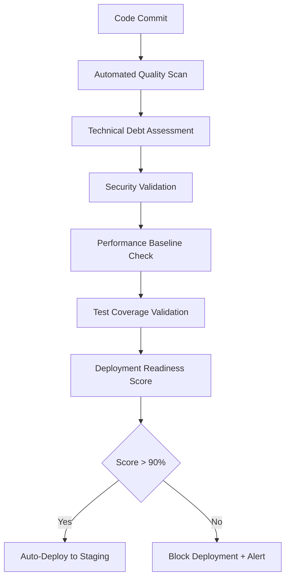

# 🔄 CONTINUOUS VALIDATION MONITORING FRAMEWORK - MEDIANEST
**Implementation Date:** September 8, 2025  
**Framework:** SPARC-Flow Automated Quality Gates  
**Integration:** Real-time Technical Debt Tracking

---

## 🎯 MONITORING ARCHITECTURE OVERVIEW

### **Continuous Assessment Pipeline**


### **Real-time Metrics Dashboard**
- **Technical Health Score:** Continuous 0-100 assessment
- **Deployment Readiness:** Live percentage with trend analysis  
- **Risk Indicators:** Early warning system for regression
- **Velocity Tracking:** Developer productivity impact measurement

---

## 📊 AUTOMATED QUALITY GATES

### **Gate 1: Code Quality Validation**
**Frequency:** On every commit  
**SLA:** <30 seconds response time

```yaml
quality_gates:
  typescript_safety:
    threshold: "no new 'any' types"
    action: "block_merge"
    alert: "development_team"
    
  test_coverage:
    minimum: 15%  # Initial target, increases monthly
    trend: "increasing"
    regression_tolerance: -2%
    
  code_complexity:
    cyclomatic: <15
    cognitive: <20
    maintainability_index: >60
    
  technical_debt:
    new_debt_limit: 8 hours
    interest_rate_threshold: 25%
    priority_blocker: "P0 issues present"
```

### **Gate 2: Performance Regression Detection**
**Frequency:** Every build  
**SLA:** <5 minutes analysis time

```yaml
performance_gates:
  bundle_size:
    maximum: 10MB  # Interim target
    trend: "decreasing"  
    regression_alert: +5%
    
  memory_usage:
    baseline_growth: <10MB/hour
    leak_detection: "enabled"
    alert_threshold: 20MB/hour
    
  load_time:
    target: <5 seconds
    99th_percentile: <8 seconds
    regression_threshold: +20%
    
  api_response:
    median: <100ms
    95th_percentile: <500ms  
    timeout_threshold: 5000ms
```

### **Gate 3: Security Continuous Monitoring**
**Frequency:** Daily automated scans  
**SLA:** <1 hour critical vulnerability response

```yaml
security_monitoring:
  vulnerability_scanning:
    dependencies: "daily"
    codebase: "on_commit"
    infrastructure: "weekly"
    
  authentication_validation:
    jwt_secret_rotation: "weekly"
    session_management: "daily_test"
    mfa_effectiveness: "monthly_audit"
    
  compliance_checks:
    owasp_top10: "automated"
    data_protection: "weekly"
    access_controls: "daily"
```

---

## 🚨 AUTOMATED ALERT FRAMEWORK

### **Escalation Matrix**
```yaml
alert_levels:
  info:
    description: "Trend notifications, no action required"
    delivery: "slack_channel"
    frequency: "daily_digest"
    
  warning:
    description: "Quality regression detected"
    delivery: "slack + email"
    response_time: "24 hours"
    escalation_after: "48 hours"
    
  error:
    description: "Deployment blocking issue"
    delivery: "slack + email + sms"
    response_time: "2 hours"
    escalation_after: "4 hours"
    
  critical:
    description: "Production risk or security breach"
    delivery: "all_channels + phone"
    response_time: "immediate"
    escalation: "automatic"
```

### **Smart Alert Routing**
```yaml
routing_rules:
  technical_debt:
    owner: "development_team"
    cc: "tech_lead"
    escalate_to: "engineering_manager"
    
  security_issues:
    owner: "security_team"
    cc: "development_team"
    escalate_to: "ciso"
    
  performance_regression:
    owner: "performance_team"
    cc: "devops_team"  
    escalate_to: "principal_engineer"
    
  deployment_blocker:
    owner: "release_manager"
    cc: "all_teams"
    escalate_to: "vp_engineering"
```

---

## 📈 TECHNICAL DEBT TRACKING AUTOMATION

### **Debt Accumulation Monitoring**
```bash
#!/bin/bash
# Automated Technical Debt Assessment
# Runs every 4 hours, stores results in shared memory

# Initialize claude-flow assessment
npx claude-flow@alpha hive-mind spawn "DEBT_ASSESSMENT" \
  --agents 3 \
  --focus "debt_tracking" \
  --memory-namespace "CONTINUOUS_MONITORING_$(date +%Y_%m_%d)"

# Calculate current debt metrics
CURRENT_DEBT=$(npx claude-flow@alpha memory query "total_debt_hours")
INTEREST_RATE=$(npx claude-flow@alpha memory query "annual_interest_rate") 
VELOCITY_IMPACT=$(npx claude-flow@alpha memory query "velocity_loss_percentage")

# Store trend data
npx claude-flow@alpha memory store "debt_trend" \
  --value "{\"timestamp\":\"$(date -Iseconds)\",\"debt\":$CURRENT_DEBT,\"interest\":$INTEREST_RATE,\"velocity\":$VELOCITY_IMPACT}" \
  --namespace "DEBT_TRENDS"

# Alert on concerning trends
if [ "$VELOCITY_IMPACT" -gt 30 ]; then
    npx claude-flow@alpha alert send "critical" \
      --message "Technical debt velocity impact exceeds 30%: $VELOCITY_IMPACT%" \
      --channels "engineering,management"
fi
```

### **Deployment Readiness Scoring**
```python
# Real-time Deployment Readiness Calculator
import sqlite3
from datetime import datetime, timedelta

def calculate_deployment_readiness():
    """Calculate live deployment readiness score"""
    
    scores = {
        'test_coverage': get_test_coverage_score(),      # 25%
        'api_completeness': get_api_completeness_score(), # 25%  
        'performance': get_performance_score(),           # 20%
        'security': get_security_score(),                # 15%
        'documentation': get_documentation_score(),       # 10%
        'technical_debt': get_debt_score()               # 5%
    }
    
    weighted_score = (
        scores['test_coverage'] * 0.25 +
        scores['api_completeness'] * 0.25 +
        scores['performance'] * 0.20 +
        scores['security'] * 0.15 +
        scores['documentation'] * 0.10 +
        scores['technical_debt'] * 0.05
    )
    
    # Store in shared memory for dashboard
    store_readiness_score(weighted_score, scores)
    
    # Alert if score drops significantly
    if weighted_score < 70:
        send_deployment_readiness_alert(weighted_score, scores)
    
    return weighted_score, scores

# Run every 15 minutes via cron
```

### **Automated Remediation Suggestions**
```yaml
remediation_engine:
  triggers:
    - "technical_debt_increase > 10%"
    - "test_coverage_decrease > 5%"
    - "performance_regression > 15%"
    - "security_score_drop > any"
    
  actions:
    generate_suggestions:
      agent: "technical-debt-best-practices-agent"
      context: "recent_changes,current_priorities,team_capacity"
      output: "prioritized_action_plan"
      
    estimate_effort:
      agent: "technical-debt-economist"
      analysis: "roi_calculation,timeline_impact,resource_requirements"
      output: "effort_estimates_with_confidence"
      
    create_tickets:
      system: "github_issues"
      template: "technical_debt_remediation"
      assignment: "auto_assign_by_expertise"
```

---

## 🎯 PROACTIVE REGRESSION PREVENTION

### **Predictive Risk Analysis**
```sql  
-- Risk Prediction Query (runs hourly)
SELECT 
    component,
    current_debt_hours,
    weekly_growth_rate,
    predicted_debt_30_days,
    risk_level,
    recommended_action
FROM technical_debt_trends t1
JOIN risk_predictions r ON t1.component = r.component
WHERE 
    predicted_debt_30_days > current_debt_hours * 1.5  -- 50% increase predicted
    OR risk_level = 'HIGH'
ORDER BY predicted_debt_30_days DESC;
```

### **Automated Code Quality Enforcement**
```yaml
# .github/workflows/quality-enforcement.yml
name: Automated Quality Enforcement
on: [push, pull_request]

jobs:
  quality_gate:
    runs-on: ubuntu-latest
    steps:
    - uses: actions/checkout@v3
    
    - name: Technical Debt Assessment
      run: |
        npx claude-flow@alpha swarm execute "DEBT_ANALYSIS" \
          --strategy parallel \
          --agents 5 \
          --output audit_reports/
    
    - name: Deployment Readiness Check
      run: |
        READINESS_SCORE=$(python scripts/calculate_readiness.py)
        if [ "$READINESS_SCORE" -lt 75 ]; then
          echo "::error::Deployment readiness score too low: $READINESS_SCORE%"
          exit 1
        fi
    
    - name: Store Metrics
      run: |
        npx claude-flow@alpha memory store "quality_metrics" \
          --value "$(cat audit_reports/metrics.json)" \
          --namespace "CI_METRICS_$(date +%Y_%m_%d)"
```

---

## 📊 DASHBOARD AND REPORTING

### **Real-time Quality Dashboard**
```javascript
// Dashboard Components
const QualityDashboard = {
  deployment_readiness: {
    current_score: "live_query",
    trend: "7_day_moving_average", 
    target: 90,
    components: [
      "test_coverage", "api_completeness", 
      "performance", "security", "documentation"
    ]
  },
  
  technical_debt: {
    total_hours: "live_query",
    interest_rate: "calculated_metric",
    velocity_impact: "team_productivity_loss",
    remediation_progress: "weekly_burn_down"
  },
  
  risk_indicators: {
    critical_alerts: "active_count",
    security_vulnerabilities: "open_count", 
    performance_regressions: "recent_count",
    deployment_blockers: "current_list"
  }
};
```

### **Weekly Executive Reports**
```bash
#!/bin/bash
# Automated Weekly Executive Report
# Runs every Monday at 9 AM

npx claude-flow@alpha hive-mind spawn "EXECUTIVE_REPORT" \
  --agents 1 \
  --focus "business_impact_analysis" \
  --template "executive_summary"

# Generate comprehensive report
cat > weekly_report_$(date +%Y_%m_%d).md << EOF
# Weekly Technical Health Report

## Executive Summary
- Overall Health Score: $(get_health_score)%
- Deployment Readiness: $(get_readiness_score)%  
- Technical Debt: $(get_debt_hours) hours ($$(get_debt_cost))
- Risk Level: $(get_risk_level)

## Key Achievements
$(get_weekly_improvements)

## Critical Issues Requiring Attention  
$(get_critical_issues)

## Recommendations for Next Week
$(get_recommendations)
EOF

# Email to stakeholders
mail -s "Weekly Technical Health Report" stakeholders@company.com < weekly_report_$(date +%Y_%m_%d).md
```

---

## 🔧 IMPLEMENTATION ROADMAP

### **Phase 1: Foundation Setup (Week 1)**
- [ ] Deploy automated quality gate framework
- [ ] Implement basic alerting and notification system
- [ ] Set up shared memory and data storage
- [ ] Configure initial monitoring dashboards

### **Phase 2: Advanced Monitoring (Week 2)**
- [ ] Implement predictive risk analysis
- [ ] Deploy automated remediation suggestion engine
- [ ] Set up continuous deployment readiness scoring
- [ ] Configure executive reporting automation

### **Phase 3: Optimization (Week 3-4)**
- [ ] Fine-tune alert thresholds based on initial data
- [ ] Implement machine learning for better predictions
- [ ] Optimize performance of monitoring system
- [ ] Add advanced visualization and analytics

### **Phase 4: Integration (Ongoing)**
- [ ] Integrate with existing development workflows
- [ ] Train team on new monitoring capabilities
- [ ] Establish operational procedures for alerts
- [ ] Continuous improvement based on feedback

---

## 🎪 SUCCESS METRICS

### **Monitoring System KPIs**
- **Alert Accuracy:** >95% relevant alerts (minimal false positives)
- **Response Time:** <2 hours for critical issues
- **Deployment Confidence:** >90% readiness score before releases
- **Regression Prevention:** <5% deployment rollbacks due to missed issues

### **Business Impact Metrics**
- **Development Velocity:** Track week-over-week improvement
- **Quality Gate Effectiveness:** Measure issues caught vs. issues in production
- **Technical Debt Management:** Track debt accumulation vs. remediation rates
- **Stakeholder Confidence:** Survey-based confidence in deployment quality

---

## 📞 SUPPORT AND MAINTENANCE

### **Monitoring System Maintenance**
- **Daily:** Automated health checks and alert validation
- **Weekly:** Review alert patterns and adjust thresholds
- **Monthly:** Comprehensive system performance review
- **Quarterly:** Framework updates and capability enhancements

### **Emergency Procedures**
```bash
# Monitoring System Emergency Reset
npx claude-flow@alpha system reset --component monitoring
npx claude-flow@alpha memory backup --namespace "EMERGENCY_$(date +%s)"
npx claude-flow@alpha restore --from-backup last_known_good
```

---

*This continuous validation monitoring framework ensures proactive quality management and provides early warning systems for technical debt accumulation and deployment readiness regression.*