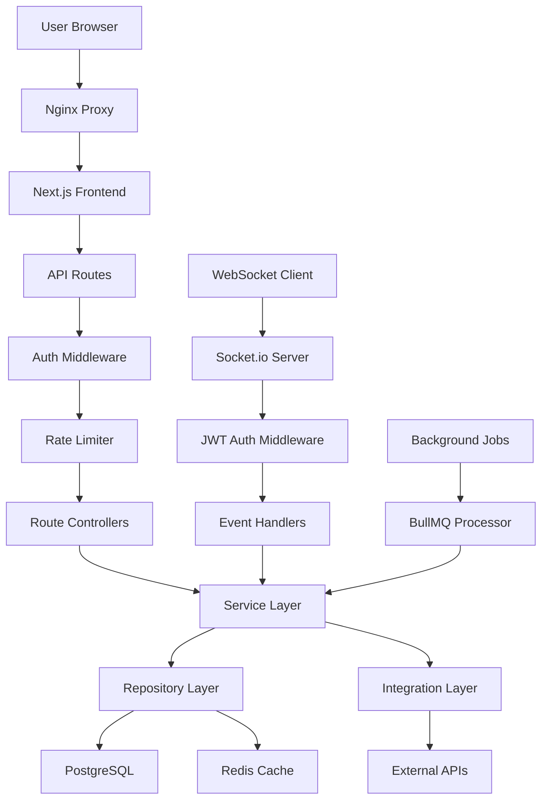
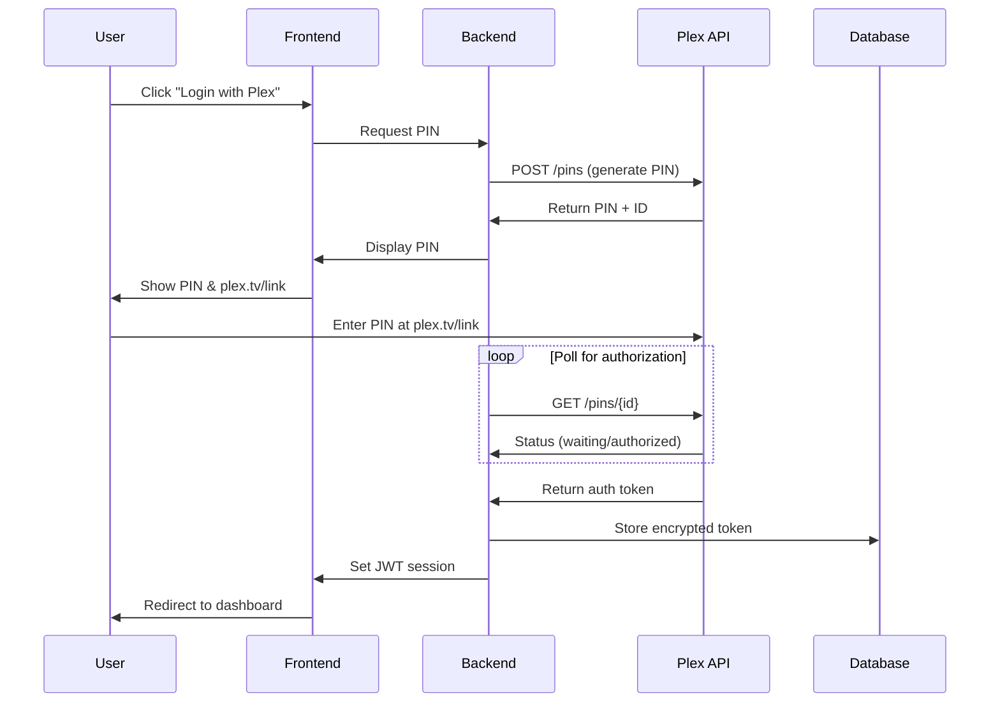

# MediaNest System Architecture Overview

**Document Version:** 1.0  
**Last Updated:** January 2025  
**Status:** Current Implementation

## Executive Summary

MediaNest is a unified web portal that consolidates multiple media management services into a single, authenticated interface. Built as a **monolithic architecture** optimized for 10-20 concurrent users, it leverages modern web technologies and containerization for easy deployment and maintenance.

### Key Architectural Decisions

- **Monolithic Design**: Simplified deployment and maintenance for small user base
- **Container-First**: Docker Compose V2 for consistent environments
- **Real-time Communication**: Socket.io for live status updates
- **Security by Default**: Plex OAuth, rate limiting, and AES-256-GCM encryption
- **Service Resilience**: Circuit breakers with graceful degradation

## System Context

```
┌─────────────────────────────────────────────────────────────────┐
│                      MediaNest Ecosystem                        │
├─────────────────────────────────────────────────────────────────┤
│                                                                 │
│  👥 Users (10-20)          📱 Admin Interface                  │
│  ├─ Desktop Browsers       ├─ Service Configuration             │
│  ├─ Mobile Browsers        ├─ User Management                   │
│  └─ Tablet Browsers        └─ System Monitoring                 │
│                                                                 │
│         │                              │                       │
│         ▼                              ▼                       │
│  ┌─────────────────────────────────────────────────────────┐   │
│  │                MediaNest Portal                         │   │
│  │  ┌─────────────────┐    ┌─────────────────────────────┐ │   │
│  │  │  Next.js 14     │    │    Express.js API          │ │   │
│  │  │  Frontend       │◄──►│    Backend                 │ │   │
│  │  │  - Auth UI      │    │    - Plex OAuth            │ │   │
│  │  │  - Dashboard    │    │    - Service Integration   │ │   │
│  │  │  - Media Browse │    │    - Download Processing   │ │   │
│  │  │  - Real-time UI │    │    - WebSocket Server      │ │   │
│  │  └─────────────────┘    └─────────────────────────────┘ │   │
│  └─────────────────────────────────────────────────────────┘   │
│                              │                                 │
│  ┌─────────────────────────────────────────────────────────┐   │
│  │                Data Layer                               │   │
│  │  ┌──────────────┐              ┌──────────────┐        │   │
│  │  │ PostgreSQL   │              │    Redis     │        │   │
│  │  │ - Users      │              │ - Sessions   │        │   │
│  │  │ - Requests   │              │ - Cache      │        │   │
│  │  │ - Downloads  │              │ - Job Queue  │        │   │
│  │  │ - Services   │              │ - Rate Limit │        │   │
│  │  └──────────────┘              └──────────────┘        │   │
│  └─────────────────────────────────────────────────────────┘   │
│                              │                                 │
├─────────────────────────────────────────────────────────────────┤
│                    External Services                            │
├─────────────────────────────────────────────────────────────────┤
│  🎬 Plex Server     📺 Overseerr      ⏰ Uptime Kuma           │
│  - Media Library    - Request Mgmt    - Monitoring              │
│  - Collections     - User Interface   - Health Checks          │
│  - OAuth Provider  - TMDB Integration - Status Dashboard        │
│                                                                 │
│  📺 YouTube (yt-dlp)     🌐 External APIs                      │
│  - Video Downloads       - TMDB Movie DB                        │
│  - Playlist Support      - Notification Services               │
│  - Format Selection      - Integration Webhooks                │
└─────────────────────────────────────────────────────────────────┘
```

## Technology Stack

### Frontend Technologies

- **Framework**: Next.js 14.2.30 with App Router
- **UI Framework**: React 18.3 with TypeScript 5.x
- **Styling**: Tailwind CSS 3.4.1 with shadcn/ui components
- **State Management**: TanStack Query (React Query)
- **Authentication**: NextAuth.js 4.24.7 with Plex OAuth
- **Real-time**: Socket.io Client 4.7.5
- **Forms**: React Hook Form with Zod 3.24.1 validation
- **Testing**: Vitest 1.6.1 with Testing Library

### Backend Technologies

- **Framework**: Express.js 4.18.2 with TypeScript 5.3.3
- **Database**: PostgreSQL 15.x with Prisma ORM 5.18.0
- **Cache/Queue**: Redis 7.x with BullMQ 5.1.2
- **Authentication**: JWT with secure httpOnly cookies
- **Real-time**: Socket.io Server 4.6.1
- **Security**: Helmet, CORS, bcrypt 5.1.1
- **Logging**: Winston 3.11.0 with daily rotation
- **Validation**: Zod 3.22.4 schemas

### Infrastructure Technologies

- **Container Platform**: Docker 24.x with Compose V2
- **Reverse Proxy**: Nginx 1.25.x for SSL termination
- **Process Management**: Node.js 20.x LTS native
- **Development**: Nodemon, ESLint, Prettier
- **Testing**: Vitest, Supertest, MSW, Playwright

## Request Flow Architecture



### Request Processing Steps

1. **Entry Point**: User accesses MediaNest through browser
2. **SSL Termination**: Nginx handles HTTPS and proxies to application
3. **Frontend Routing**: Next.js serves initial page and handles client-side routing
4. **API Authentication**: JWT tokens validate API requests
5. **Rate Limiting**: Redis-based rate limiting (100 req/min per user)
6. **Business Logic**: Backend processes requests and integrates with external services
7. **Real-time Updates**: Socket.io delivers live updates via WebSocket connections
8. **Background Processing**: BullMQ handles asynchronous job processing

## Data Architecture

### Database Schema (PostgreSQL)

```sql
-- Core entities
CREATE TABLE users (
    id UUID PRIMARY KEY DEFAULT gen_random_uuid(),
    plex_id VARCHAR(255) UNIQUE NOT NULL,
    plex_username VARCHAR(255) NOT NULL,
    email VARCHAR(255),
    role VARCHAR(50) DEFAULT 'user',
    plex_token TEXT, -- AES-256-GCM encrypted
    created_at TIMESTAMP DEFAULT CURRENT_TIMESTAMP,
    last_login_at TIMESTAMP,
    status VARCHAR(50) DEFAULT 'active'
);

-- Media request management
CREATE TABLE media_requests (
    id UUID PRIMARY KEY DEFAULT gen_random_uuid(),
    user_id UUID REFERENCES users(id),
    title VARCHAR(500) NOT NULL,
    media_type VARCHAR(50) NOT NULL,
    tmdb_id VARCHAR(100),
    status VARCHAR(50) DEFAULT 'pending',
    overseerr_id VARCHAR(255),
    created_at TIMESTAMP DEFAULT CURRENT_TIMESTAMP,
    completed_at TIMESTAMP
);

-- YouTube download queue (user-isolated)
CREATE TABLE youtube_downloads (
    id UUID PRIMARY KEY DEFAULT gen_random_uuid(),
    user_id UUID REFERENCES users(id) NOT NULL,
    playlist_url TEXT NOT NULL,
    playlist_title VARCHAR(500),
    status VARCHAR(50) DEFAULT 'queued',
    file_paths JSONB,
    plex_collection_id VARCHAR(255),
    created_at TIMESTAMP DEFAULT CURRENT_TIMESTAMP,
    completed_at TIMESTAMP,

    -- User isolation constraint
    CONSTRAINT youtube_downloads_user_isolation
        CHECK (user_id IS NOT NULL)
);

-- Service configuration (admin-managed)
CREATE TABLE service_config (
    id SERIAL PRIMARY KEY,
    service_name VARCHAR(100) UNIQUE NOT NULL,
    service_url TEXT NOT NULL,
    api_key TEXT, -- AES-256-GCM encrypted
    enabled BOOLEAN DEFAULT true,
    config_data JSONB,
    updated_at TIMESTAMP DEFAULT CURRENT_TIMESTAMP,
    updated_by UUID REFERENCES users(id)
);
```

### Redis Data Structures

```redis
# Session management
session:{sessionId} → {userId, role, expiresAt} [TTL: 24h]

# Rate limiting (atomic Lua scripts)
rate:api:{userId} → counter [TTL: 60s, limit: 100]
rate:youtube:{userId} → counter [TTL: 3600s, limit: 5]

# Job queue (BullMQ)
bull:youtube:waiting → [job1, job2, ...]
bull:youtube:active → {jobId: jobData}
bull:youtube:completed → {jobId: result}

# Service status cache
status:{serviceName} → {status, lastCheck, uptime, responseTime} [TTL: 5min]
```

## Security Architecture

### Authentication Flow (Plex PIN-based OAuth)



### Security Layers

1. **Network Security**
   - SSL/TLS encryption (Let's Encrypt ready)
   - Nginx rate limiting and CORS configuration
   - Container network isolation

2. **Application Security**
   - JWT token validation with secure httpOnly cookies
   - CSRF protection via SameSite cookies
   - Input sanitization and Zod validation
   - SQL injection prevention via Prisma ORM

3. **Data Security**
   - AES-256-GCM encryption for sensitive data
   - Bcrypt for admin password hashing
   - Secure session management with Redis
   - No sensitive data in application logs

### Role-Based Access Control

- **Admin Role**: Full system access, service configuration, user management
- **User Role**: Personal dashboard, media requests, own downloads only
- **Automatic Isolation**: Users can only access their own data

## Integration Architecture

### External Service Integration Pattern

All external services follow a consistent resilience pattern:

```typescript
class ServiceClient {
  constructor(config: ServiceConfig) {
    this.circuitBreaker = new CircuitBreaker({
      errorThresholdPercentage: 50,
      resetTimeout: 30000,
    });
    this.retryConfig = {
      retries: 3,
      factor: 2,
      minTimeout: 1000,
      maxTimeout: 10000,
    };
  }

  async request(endpoint: string, options: RequestOptions) {
    return this.circuitBreaker.execute(() =>
      this.withRetry(() => this.httpClient.request(endpoint, options)),
    );
  }
}
```

### Integrated Services

1. **Plex API**
   - OAuth authentication provider
   - Media library browsing
   - Collection management
   - Direct streaming integration

2. **Overseerr**
   - Media request submission
   - User approval workflows
   - TMDB integration for metadata
   - Webhook status updates

3. **Uptime Kuma**
   - Service health monitoring
   - Real-time status updates
   - Historical uptime tracking
   - Alert integration

4. **YouTube (yt-dlp)**
   - Video/playlist downloading
   - Format selection and quality options
   - Progress tracking and reporting
   - Plex collection integration

## Real-time Architecture

### WebSocket Implementation (Socket.io)

```typescript
// Server-side event handling
io.use(authenticateSocket); // JWT middleware

io.on('connection', (socket) => {
  // User-specific room for targeted updates
  socket.join(`user:${socket.userId}`);

  // Service status subscription
  socket.on('subscribe:status', () => {
    socket.join('status-updates');
  });

  // YouTube download progress
  socket.on('subscribe:downloads', () => {
    socket.join(`downloads:${socket.userId}`);
  });
});

// Event emission patterns
io.to('status-updates').emit('service:status', statusData);
io.to(`user:${userId}`).emit('notification', message);
io.to(`downloads:${userId}`).emit('download:progress', progress);
```

### Event Types

- `service:status` - Service health updates
- `request:update` - Media request status changes
- `download:progress` - YouTube download progress
- `user:notification` - User-specific alerts
- `system:alert` - System-wide notifications

## Performance & Scalability

### Current Optimizations

1. **Frontend Performance**
   - Next.js static generation where applicable
   - Image optimization and lazy loading
   - Code splitting and dynamic imports
   - Service worker for offline capability

2. **Backend Performance**
   - Database connection pooling (limit: 20 for 10-20 users)
   - Redis caching for frequent queries
   - HTTP connection reuse for external APIs
   - Gzip compression for responses

3. **Caching Strategy**
   - CDN-ready static assets (1 year cache)
   - API response caching (5 minutes)
   - Service status caching (60 seconds)
   - Plex library data caching (10 minutes)

### Scalability Considerations

While optimized for 10-20 users, the architecture supports growth:

- **Stateless Design**: Application instances can be horizontally scaled
- **Shared State**: Redis provides shared cache and session storage
- **Queue Processing**: BullMQ jobs can be distributed across workers
- **Database Scaling**: Read replicas and partitioning strategies ready

## Deployment Architecture

### Container Strategy

```yaml
# Production deployment structure
services:
  nginx:
    image: nginx:alpine
    ports: ['443:443', '80:80']
    depends_on: [app]

  app:
    build: .
    environment:
      NODE_ENV: production
      DATABASE_URL: postgresql://...
      REDIS_URL: redis://redis:6379
    depends_on: [postgres, redis]

  postgres:
    image: postgres:15-alpine
    volumes: [postgres_data:/var/lib/postgresql/data]

  redis:
    image: redis:7-alpine
    command: redis-server --appendonly yes
    volumes: [redis_data:/data]
```

### Environment Configuration

- **Development**: Docker Compose with hot reload
- **Testing**: Isolated containers with test databases
- **Production**: Multi-container deployment with secrets management

## Implementation Status

### Phase 1: Core Infrastructure ✅ Complete

- Plex OAuth authentication with PIN flow
- Database schema with Prisma ORM
- JWT authentication and RBAC middleware
- Rate limiting with Redis
- Winston logging with correlation IDs
- Error handling and API versioning

### Phase 2: External Service Integration ✅ Complete

- Plex API integration with circuit breakers
- Overseerr API integration for media requests
- Uptime Kuma integration for monitoring
- Service configuration management
- Health check endpoints

### Phase 3: Dashboard & Media UI ✅ Complete

- Real-time service status dashboard
- Media browsing with Plex integration
- Media request submission UI
- YouTube downloader frontend
- WebSocket-powered live updates

### Phase 4: YouTube Integration 🚧 In Progress

- ✅ Frontend interface complete
- ✅ Database schema and API routes
- ⏳ Backend processor implementation
- ⏳ BullMQ job processing
- ⏳ File management and Plex integration

### Phase 5: Advanced Features 📋 Planned

- Admin dashboard and user management
- Advanced search and filtering
- Notification system
- Backup and restore functionality
- Performance monitoring and analytics

## Quality Attributes

### Reliability

- Circuit breakers prevent cascading failures
- Graceful degradation when services unavailable
- Automatic retry logic with exponential backoff
- Health checks and status monitoring

### Security

- Authentication required for all routes except health checks
- Role-based access control with user isolation
- Rate limiting prevents abuse
- Encryption for sensitive data storage
- Input validation and SQL injection prevention

### Performance

- Response times < 200ms for cached requests
- < 2s for external service integrations
- Real-time updates via WebSocket
- Optimized database queries with proper indexing

### Maintainability

- Clear separation of concerns (MVC pattern)
- Comprehensive logging and error tracking
- Type safety with TypeScript
- Automated testing with good coverage
- Consistent code formatting and linting

## Monitoring & Observability

### Application Metrics

- Request rate and response times
- Error rates by endpoint and service
- Active user sessions and concurrent connections
- Queue depth and processing times

### Infrastructure Metrics

- CPU and memory utilization
- Database connection pool usage
- Redis memory usage and hit rates
- Disk space (especially for YouTube downloads)

### Business Metrics

- Daily active users
- Media requests submitted/completed
- YouTube downloads per user
- Service availability percentages

---

## Related Documentation

- [Container Architecture](./ARCHITECTURE_CONTAINERS.md) - Detailed container and deployment view
- [Component Architecture](./ARCHITECTURE_COMPONENTS.md) - Internal component structure
- [Code Architecture](./ARCHITECTURE_CODE.md) - Package structure and design patterns
- [Decision Records](./ARCHITECTURE_DECISIONS.md) - Architectural Decision Records (ADRs)
- [Deployment Architecture](./ARCHITECTURE_DEPLOYMENT.md) - Infrastructure and deployment details

---

_This document serves as the high-level architectural overview. For implementation details, refer to the specialized architecture documents linked above._
