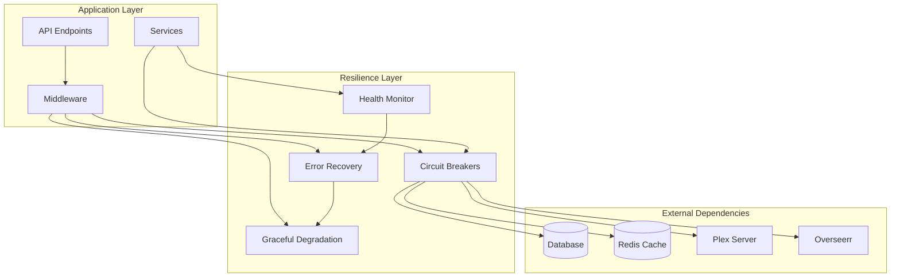

# MediaNest Resilience Framework Implementation

## Overview

This document outlines the comprehensive resilience framework implemented for the MediaNest project, focusing on error recovery, circuit breaker patterns, graceful degradation, and automated recovery mechanisms.

## Architecture



## Core Components

### 1. Circuit Breaker System (`CircuitBreaker`)

**Location:** `backend/src/utils/circuit-breaker.ts`

Advanced circuit breaker implementation with:

- Three states: CLOSED, OPEN, HALF_OPEN
- Configurable failure thresholds
- Exponential backoff and jitter
- Metrics collection and monitoring
- Event-driven state changes

**Features:**

- **Failure Detection:** Monitors request failures and response times
- **Automatic Recovery:** Transitions to half-open state for testing recovery
- **Metrics Collection:** Tracks success rates, error rates, and response times
- **Expected Error Handling:** Differentiates between expected and unexpected failures

**Configuration Example:**

```typescript
const circuitBreaker = CircuitBreakerFactory.create('plex-api', {
  failureThreshold: 5,
  resetTimeout: 30000,
  monitoringPeriod: 60000,
  halfOpenMaxCalls: 3,
  expectedErrors: ['ENOTFOUND', 'timeout', '5xx'],
});
```

### 2. Resilience Service (`ResilienceService`)

**Location:** `backend/src/services/resilience.service.ts`

Central orchestration service that:

- Manages service dependencies
- Coordinates circuit breakers
- Handles retry logic
- Implements bulkhead patterns
- Manages recovery strategies

**Key Methods:**

- `registerDependency()` - Register external service dependencies
- `executeWithCircuitBreaker()` - Execute operations with circuit breaker protection
- `executeWithRetry()` - Execute operations with retry logic
- `executeWithBulkhead()` - Execute operations with concurrency limits

### 3. Error Recovery Manager (`ErrorRecoveryManager`)

**Location:** `backend/src/utils/error-recovery.ts`

Intelligent error recovery system with:

- Priority-based recovery strategies
- Context-aware error handling
- Cascade failure prevention
- Recovery history tracking

**Recovery Strategies:**

1. **Database Reconnection:** Automatic database connection recovery
2. **Cache Fallback:** Serve cached responses when primary services fail
3. **Default Response:** Provide default responses for graceful degradation
4. **Queue for Later:** Queue failed operations for retry
5. **Circuit Breaker Reset:** Reset circuit breakers when appropriate

### 4. Health Monitor Service (`HealthMonitorService`)

**Location:** `backend/src/services/health-monitor.service.ts`

Comprehensive health monitoring with:

- Real-time component health checks
- Performance metrics tracking
- Alert system with configurable thresholds
- System-wide health aggregation

**Monitored Components:**

- Database connectivity and performance
- Redis cache availability
- External service health
- Circuit breaker states
- Memory and system resources

### 5. Resilience Middleware

**Location:** `backend/src/middleware/resilience.middleware.ts`

Express middleware providing:

- Circuit breaker integration
- Bulkhead pattern enforcement
- Automatic retry mechanisms
- Graceful degradation
- Error recovery coordination

## API Endpoints

### Health Check Endpoints

**Base Path:** `/api/v1/health`

- `GET /` - Basic health status
- `GET /comprehensive` - Detailed system health
- `GET /ready` - Kubernetes readiness probe
- `GET /live` - Kubernetes liveness probe
- `GET /database` - Database health status
- `GET /cache` - Redis cache health status
- `GET /external` - External services health
- `GET /circuit-breakers` - Circuit breaker states
- `GET /metrics` - Performance metrics

### Resilience Management Endpoints

**Base Path:** `/api/v1/resilience`

- `GET /health` - Overall system health status
- `GET /metrics` - Resilience metrics and statistics
- `GET /circuit-breakers` - Circuit breaker information
- `POST /circuit-breakers/:name/action` - Control circuit breakers
- `GET /dependencies` - Service dependency status
- `POST /dependencies` - Register new service dependencies
- `GET /recovery/history` - Error recovery history
- `POST /recovery/test` - Test error recovery mechanisms
- `GET /cascade-risk` - Assess cascade failure risk
- `GET /status` - Comprehensive resilience status with scoring

## Configuration

### Environment-Specific Settings

**Location:** `backend/src/config/resilience.config.ts`

The framework supports environment-specific configurations:

**Development:**

- Higher failure thresholds
- Faster recovery times
- Detailed logging

**Testing:**

- Disabled circuit breakers
- Minimal retry attempts
- Fast execution

**Production:**

- Optimized thresholds
- Comprehensive monitoring
- Full resilience features

### Service Dependencies

Predefined service dependencies with health check configurations:

```typescript
const serviceDependencies = [
  {
    name: 'database',
    type: 'database',
    criticalityLevel: 'critical',
    healthCheckFn: databaseHealthCheck,
  },
  {
    name: 'redis-cache',
    type: 'cache',
    criticalityLevel: 'important',
    healthCheckFn: redisHealthCheck,
  },
  {
    name: 'plex-media-server',
    type: 'external-api',
    criticalityLevel: 'important',
    healthCheckUrl: `${PLEX_URL}/identity`,
  },
];
```

## Implementation Patterns

### 1. Circuit Breaker Pattern

```typescript
// Automatic circuit breaker integration
await resilienceService.executeWithCircuitBreaker(
  'plex-api',
  () => plexClient.getLibraries(),
  () => getCachedLibraries(), // Fallback
);
```

### 2. Retry with Exponential Backoff

```typescript
// Automatic retry with backoff
await resilienceService.executeWithRetry(() => databaseQuery(), {
  maxAttempts: 3,
  initialDelay: 1000,
  factor: 2,
});
```

### 3. Bulkhead Pattern

```typescript
// Compartmentalized execution
await resilienceService.executeWithBulkhead(
  'user-operations',
  () => processUserRequest(),
  10, // Max concurrent operations
);
```

### 4. Error Recovery with Context

```typescript
// Context-aware error recovery
await withRecovery(
  () => fetchUserData(),
  {
    operation: 'user-fetch',
    service: 'database',
    userId: user.id,
  },
  {
    enableRecovery: true,
    maxAttempts: 3,
  },
);
```

## Monitoring and Alerting

### Health Check Dashboard

The framework provides comprehensive monitoring through:

1. **System Health Score:** Overall resilience rating (0-100)
2. **Component Status:** Individual component health
3. **Circuit Breaker Dashboard:** Real-time circuit breaker states
4. **Performance Metrics:** Response times, error rates, throughput
5. **Error Recovery Statistics:** Recovery success rates and strategies used

### Alert Thresholds

Configurable alert thresholds for:

- Error rate > 5% (warning), > 10% (critical)
- Response time > 2s (warning), > 5s (critical)
- Memory usage > 75% (warning), > 90% (critical)
- Circuit breakers open > 1 (warning), > 3 (critical)

## Testing

### Integration Tests

**Location:** `backend/tests/integration/resilience.test.ts`

Comprehensive test suite covering:

- Circuit breaker state transitions
- Error recovery mechanisms
- Health monitoring accuracy
- Performance under load
- Cascade failure prevention

### Test Scenarios

1. **Circuit Breaker Functionality**
   - Failure threshold testing
   - State transition validation
   - Recovery behavior testing

2. **Error Recovery**
   - Recovery strategy execution
   - Priority-based recovery
   - Context-aware recovery

3. **Health Monitoring**
   - Component health checks
   - Performance metrics accuracy
   - Alert threshold validation

4. **End-to-End Resilience**
   - Complete service failure scenarios
   - Cascade failure prevention
   - Performance under high error rates

## Benefits

### Operational Benefits

1. **Improved Reliability:** Automatic failure detection and recovery
2. **Reduced Downtime:** Graceful degradation instead of complete failures
3. **Better User Experience:** Fallback responses and cached content
4. **Operational Visibility:** Comprehensive health monitoring and metrics

### Performance Benefits

1. **Failure Isolation:** Circuit breakers prevent cascade failures
2. **Resource Protection:** Bulkhead patterns limit resource exhaustion
3. **Smart Retry:** Exponential backoff prevents system overload
4. **Proactive Recovery:** Automatic recovery strategies reduce manual intervention

### Development Benefits

1. **Easy Integration:** Middleware and service wrappers for automatic resilience
2. **Configurable:** Environment-specific settings for different deployment stages
3. **Observable:** Detailed logging and metrics for debugging
4. **Testable:** Comprehensive test coverage for reliability validation

## Usage Examples

### Basic Service Integration

```typescript
// Register service dependency
resilienceService.registerDependency({
  name: 'my-external-api',
  type: 'external-api',
  criticalityLevel: 'important',
  healthCheckUrl: 'https://api.example.com/health',
});

// Use with automatic resilience
const result = await resilienceService.executeWithCircuitBreaker(
  'my-external-api',
  () => externalApiCall(),
  () => getCachedResult(),
);
```

### Middleware Integration

```typescript
// Add resilience to routes
app.use(
  '/api/critical',
  comprehensiveResilienceMiddleware({
    serviceName: 'critical-service',
    enableCircuitBreaker: true,
    enableRetry: true,
    enableFallback: true,
    maxConcurrent: 20,
  }),
);
```

### Custom Recovery Strategy

```typescript
// Register custom recovery strategy
errorRecoveryManager.registerRecoveryAction({
  name: 'custom-fallback',
  priority: 8,
  shouldExecute: (error, context) => context.service === 'my-service' && error.code === 'TIMEOUT',
  execute: async (error, context) => {
    // Custom recovery logic
    return await getCustomFallback(context);
  },
});
```

## Conclusion

The MediaNest Resilience Framework provides a comprehensive solution for building resilient, fault-tolerant applications. Through circuit breakers, intelligent error recovery, health monitoring, and graceful degradation, the system maintains high availability and performance even under adverse conditions.

The framework is designed to be:

- **Production-ready** with comprehensive error handling
- **Highly configurable** for different environments and use cases
- **Observable** with detailed metrics and logging
- **Testable** with extensive integration test coverage
- **Maintainable** with clean abstractions and clear separation of concerns
