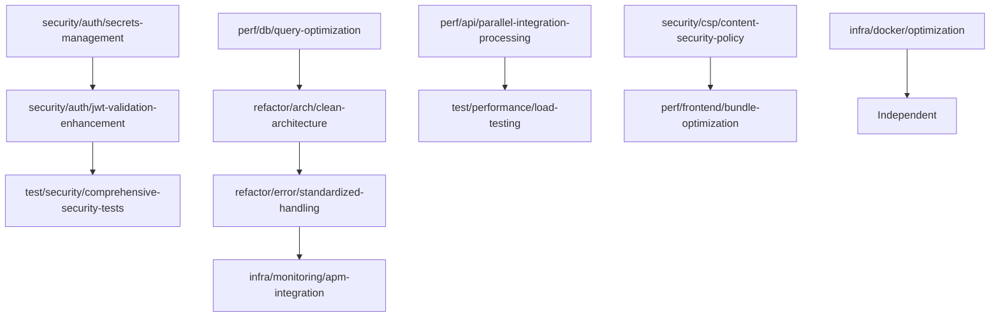

# MediaNest Feature Branch Specifications

**Document Version**: 1.0  
**Created By**: CODER AGENT (Hive Mind Collective Intelligence)  
**Date**: 2025-09-05  
**Coordination ID**: hive-medianest-audit

## Branch Strategy Overview

Based on the comprehensive analysis, this document defines feature branch specifications that align with technical debt reduction, performance optimization, and security enhancements.

## 1. Branch Naming Convention

### Structure

```
<type>/<scope>/<short-description>
```

### Types

- **feat**: New features or major functionality
- **fix**: Bug fixes and security patches
- **refactor**: Code refactoring without functional changes
- **perf**: Performance optimizations
- **security**: Security-related changes
- **test**: Testing improvements
- **docs**: Documentation updates
- **chore**: Maintenance tasks

### Scopes

- **auth**: Authentication and authorization
- **api**: Backend API changes
- **frontend**: Frontend/UI changes
- **db**: Database-related changes
- **integration**: External service integrations
- **infra**: Infrastructure and deployment
- **config**: Configuration management

### Examples

```
security/auth/jwt-validation-enhancement
perf/api/parallel-integration-processing
refactor/db/query-optimization
feat/frontend/bundle-splitting
```

## 2. Security Enhancement Branches

### Branch: `security/auth/secrets-management`

**Priority**: CRITICAL  
**Timeline**: 2 days  
**Dependencies**: None

#### Scope

- Remove hardcoded secrets from repository
- Implement environment validation system
- Create secure secret management infrastructure

#### Changes

```
backend/src/config/
├── environment.ts (new)
├── secrets-manager.ts (new)
└── validation.ts (new)

scripts/
├── setup-secrets.sh (new)
└── generate-keys.sh (new)

.env.template (new)
.env.production.template (new)
```

#### Acceptance Criteria

- [ ] No hardcoded secrets in any tracked files
- [ ] Environment validation throws errors for missing required vars
- [ ] Secrets rotation mechanism implemented
- [ ] All existing functionality preserved

### Branch: `security/auth/jwt-validation-enhancement`

**Priority**: HIGH  
**Timeline**: 1 day  
**Dependencies**: secrets-management

#### Scope

- Implement proper JWT validation for Socket.IO
- Add token blacklisting mechanism
- Enhance session management

#### Changes

```
backend/src/
├── middleware/socket-auth.ts (new)
├── services/token-blacklist.ts (new)
└── utils/jwt.ts (modify)

frontend/
├── server.js (modify)
└── src/lib/socket/auth.ts (new)
```

#### Acceptance Criteria

- [ ] Socket.IO connections require valid JWT
- [ ] Token blacklisting prevents reuse of invalidated tokens
- [ ] Session expiry properly handled
- [ ] Real-time disconnection on token expiry

### Branch: `security/csp/content-security-policy`

**Priority**: HIGH  
**Timeline**: 0.5 days  
**Dependencies**: None

#### Scope

- Remove unsafe-eval from CSP
- Implement nonce-based script loading
- Enhance security headers

#### Changes

```
backend/src/
├── middleware/security-headers.ts (modify)
└── config/csp-config.ts (new)

frontend/src/
└── app/layout.tsx (modify - add nonce support)
```

## 3. Performance Optimization Branches

### Branch: `perf/api/parallel-integration-processing`

**Priority**: HIGH  
**Timeline**: 3 days  
**Dependencies**: None

#### Scope

- Refactor integration routes for parallel processing
- Implement circuit breaker enhancements
- Add integration response caching

#### Changes

```
backend/src/
├── services/integration-orchestrator.ts (new)
├── routes/integrations.ts (major refactor)
├── utils/circuit-breaker.ts (enhance)
└── config/cache-config.ts (new)

tests/
├── integration/integration-orchestrator.test.ts (new)
└── performance/api-performance.test.ts (new)
```

#### Performance Targets

- **API Response Time**: Reduce by 60%
- **Concurrent Request Handling**: Improve by 3x
- **Error Recovery**: Sub-5-second circuit breaker recovery

### Branch: `perf/frontend/bundle-optimization`

**Priority**: HIGH  
**Timeline**: 2 days  
**Dependencies**: None

#### Scope

- Implement code splitting and lazy loading
- Optimize Next.js configuration
- Tree shake unused dependencies

#### Changes

```
frontend/
├── next.config.js (major enhancement)
├── src/components/LazyComponents.tsx (new)
├── src/utils/dynamic-imports.ts (new)
└── webpack.config.optimization.js (new)

package.json (dependencies optimization)
```

#### Performance Targets

- **Bundle Size**: Reduce by 40%
- **First Load Time**: Improve by 50%
- **Lighthouse Score**: Target >90

### Branch: `perf/db/query-optimization`

**Priority**: HIGH  
**Timeline**: 4 days  
**Dependencies**: None

#### Scope

- Eliminate N+1 query problems
- Add database indexing strategy
- Implement query result caching

#### Changes

```
backend/src/
├── repositories/ (all files - major refactor)
├── database/indexes.sql (new)
├── services/query-cache.ts (new)
└── utils/query-optimizer.ts (new)

prisma/
├── migrations/add-indexes.sql (new)
└── schema.prisma (add indexes)
```

#### Performance Targets

- **Database Query Time**: Reduce by 70%
- **N+1 Queries**: Eliminate all instances
- **Cache Hit Rate**: Target >85%

## 4. Architecture Refactoring Branches

### Branch: `refactor/arch/clean-architecture`

**Priority**: MEDIUM  
**Timeline**: 5 days  
**Dependencies**: query-optimization

#### Scope

- Implement domain-driven design structure
- Separate business logic from infrastructure
- Create standardized interfaces

#### Changes

```
backend/src/
├── domains/
│   ├── authentication/
│   ├── media-management/
│   └── integrations/
├── shared/
│   ├── interfaces/
│   ├── types/
│   └── utils/
└── infrastructure/
    ├── database/
    ├── cache/
    └── external-services/
```

#### Acceptance Criteria

- [ ] Clear domain boundaries established
- [ ] Business logic independent of infrastructure
- [ ] All interfaces properly defined
- [ ] Dependency injection implemented

### Branch: `refactor/error/standardized-handling`

**Priority**: MEDIUM  
**Timeline**: 2 days  
**Dependencies**: clean-architecture

#### Scope

- Implement unified error handling system
- Standardize error response formats
- Add proper error logging and monitoring

#### Changes

```
backend/src/
├── errors/
│   ├── ApplicationError.ts (new)
│   ├── ValidationError.ts (new)
│   └── error-types.ts (new)
├── middleware/
│   └── global-error-handler.ts (major refactor)
└── utils/
    └── error-logger.ts (new)
```

## 5. Testing Enhancement Branches

### Branch: `test/security/comprehensive-security-tests`

**Priority**: HIGH  
**Timeline**: 3 days  
**Dependencies**: jwt-validation-enhancement

#### Scope

- Add comprehensive security test suite
- Implement penetration testing automation
- Create security regression tests

#### Changes

```
tests/
├── security/
│   ├── authentication.security.test.ts (enhance)
│   ├── authorization.security.test.ts (new)
│   ├── input-validation.security.test.ts (new)
│   └── session-management.security.test.ts (new)
├── penetration/
│   ├── sql-injection.test.ts (new)
│   ├── xss-prevention.test.ts (new)
│   └── csrf-protection.test.ts (new)
└── utils/
    └── security-test-utils.ts (new)
```

### Branch: `test/performance/load-testing`

**Priority**: MEDIUM  
**Timeline**: 2 days  
**Dependencies**: parallel-integration-processing

#### Scope

- Implement automated load testing
- Create performance benchmarks
- Add CI/CD performance gates

#### Changes

```
tests/
├── performance/
│   ├── load-tests/
│   ├── benchmarks/
│   └── stress-tests/
├── utils/
│   └── performance-utils.ts (new)
└── config/
    └── performance-config.ts (new)

.github/workflows/
└── performance-testing.yml (new)
```

## 6. Infrastructure Enhancement Branches

### Branch: `infra/docker/optimization`

**Priority**: MEDIUM  
**Timeline**: 2 days  
**Dependencies**: None

#### Scope

- Implement multi-stage Docker builds
- Add resource limits and health checks
- Optimize container startup time

#### Changes

```
Dockerfile (complete rewrite)
docker-compose.yml (resource limits)
docker-compose.production.yml (new)
.dockerignore (optimization)

scripts/
├── docker-build.sh (new)
└── docker-health-check.sh (new)
```

### Branch: `infra/monitoring/apm-integration`

**Priority**: LOW  
**Timeline**: 3 days  
**Dependencies**: standardized-handling

#### Scope

- Integrate application performance monitoring
- Add structured logging with correlation IDs
- Create performance dashboards

#### Changes

```
backend/src/
├── monitoring/
│   ├── performance-monitor.ts (new)
│   ├── metrics-collector.ts (new)
│   └── apm-integration.ts (new)
├── middleware/
│   └── request-correlation.ts (enhance)
└── config/
    └── monitoring-config.ts (new)
```

## 7. Branch Dependencies Map



## 8. Development Workflow

### Branch Creation Process

```bash
# 1. Create feature branch from develop
git checkout develop
git pull origin develop
git checkout -b feat/scope/description

# 2. Set up worktree (see worktree-structure.md)
git worktree add ../medianest-feat-scope-description feat/scope/description

# 3. Begin implementation
cd ../medianest-feat-scope-description
npm install
```

### Pull Request Process

```bash
# 1. Ensure branch is up to date
git checkout develop
git pull origin develop
git checkout feat/scope/description
git merge develop

# 2. Run tests and quality checks
npm run test
npm run lint
npm run typecheck
npm run security:audit

# 3. Create pull request with template
gh pr create --template .github/pull_request_template.md
```

### Merge Requirements

- [ ] All tests passing (unit, integration, e2e)
- [ ] Code coverage >85%
- [ ] Security scan passed
- [ ] Performance benchmarks met
- [ ] Code review approved by 2+ reviewers
- [ ] Documentation updated

## 9. Quality Gates

### Automated Checks

```yaml
# .github/workflows/feature-branch-ci.yml
- Security vulnerability scan
- Dependency audit
- Unit test coverage >85%
- Integration test suite
- Performance regression tests
- Bundle size analysis
- Code quality metrics
```

### Manual Reviews

- Architecture review for refactoring branches
- Security review for authentication changes
- Performance review for optimization branches
- UX review for frontend changes

## 10. Branch Lifecycle Management

### Active Development

- Daily rebases against develop branch
- Continuous integration feedback
- Regular code reviews
- Performance monitoring

### Pre-merge

- Final security scan
- Performance validation
- Documentation review
- Integration testing

### Post-merge

- Feature flag deployment
- Production monitoring
- Performance metrics collection
- User feedback collection

## 11. Risk Mitigation

### High-Risk Branches

- **security/auth/secrets-management**: Complete authentication system refactor
- **perf/db/query-optimization**: Database schema and query changes
- **refactor/arch/clean-architecture**: Major structural changes

### Mitigation Strategies

- Feature flags for gradual rollout
- Blue-green deployment capability
- Automated rollback procedures
- Comprehensive monitoring and alerting

### Rollback Plans

```bash
# Emergency rollback procedure
git checkout main
git revert <commit-hash> --no-edit
git push origin main

# Database rollback (if applicable)
npm run migrate:rollback
```

## 12. Success Metrics

### Development Efficiency

- **Branch Creation Time**: Target <30 minutes
- **CI/CD Pipeline Time**: Target <15 minutes
- **Code Review Time**: Target <24 hours
- **Merge to Production Time**: Target <48 hours

### Quality Metrics

- **Test Coverage**: Maintain >85%
- **Security Vulnerabilities**: Target 0 critical
- **Performance Regression**: <5% acceptable
- **Code Quality Score**: Target >8.5/10

### Team Collaboration

- **Branch Conflicts**: Target <10%
- **Rework Rate**: Target <15%
- **Knowledge Sharing**: Weekly architecture reviews
- **Documentation Coverage**: Target >80%

---

**Coordination Notes**: This branch specification will be used to create detailed worktree structure and implementation roadmap. Each branch should coordinate with the Tester agent for comprehensive test planning.

**Next Steps**: Create worktree structure document with specific git commands and directory organization.
