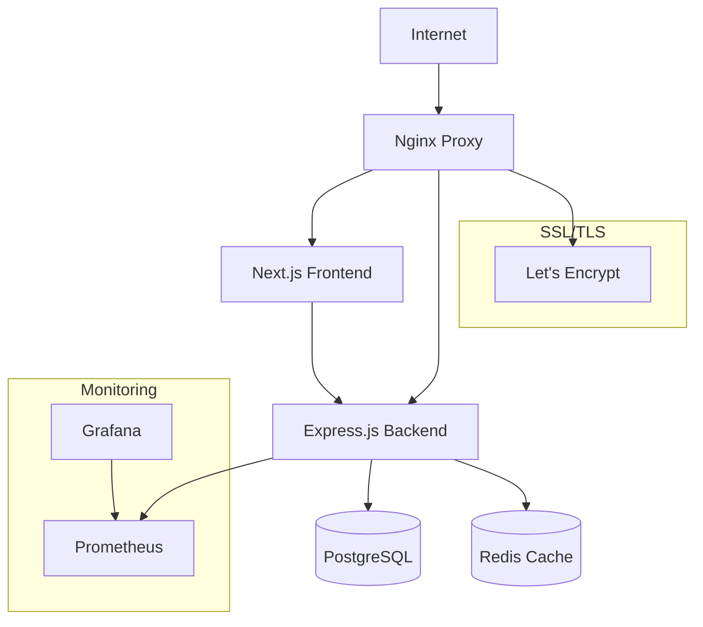

# MediaNest Deployment Documentation

**Complete deployment documentation for MediaNest - from prerequisites to production.**

## 📚 Documentation Overview

This directory contains comprehensive, assumption-free deployment documentation designed to eliminate all guesswork from the MediaNest deployment process.

### 📋 Documentation Structure

| Document | Purpose | Audience |
|----------|---------|----------|
| **[README_DEPLOYMENT.md](../../README_DEPLOYMENT.md)** | **Master deployment guide** | All users |
| **[PREREQUISITES_CHECKLIST.md](PREREQUISITES_CHECKLIST.md)** | System requirements validation | System administrators |
| **[TROUBLESHOOTING_GUIDE.md](TROUBLESHOOTING_GUIDE.md)** | Issue diagnosis and solutions | Technical users |
| **[DEPLOYMENT_VALIDATION.md](DEPLOYMENT_VALIDATION.md)** | Post-deployment testing | Operations teams |

### 🛠️ Supporting Scripts

| Script | Purpose | Location |
|--------|---------|----------|
| **`deployment-automation.sh`** | Automated deployment with validation | `scripts/` |
| **`generate-secrets.sh`** | Secure secrets generation | `scripts/` |
| **`validate-deployment.sh`** | Deployment validation script | `docs/deployment/` |

---

## 🚀 Quick Start Guide

**For first-time deployment, follow this exact sequence:**

### Step 1: Prerequisites
```bash
# Check system meets requirements
./docs/deployment/validate-prerequisites.sh

# Review checklist
cat docs/deployment/PREREQUISITES_CHECKLIST.md
```

### Step 2: Secrets Generation
```bash
# Generate all production secrets
./scripts/generate-secrets.sh

# Configure environment
cp .env.production.example .env.production
# Edit .env.production with your domain and settings
```

### Step 3: Automated Deployment
```bash
# Validate configuration
./scripts/deployment-automation.sh validate

# Deploy application
./scripts/deployment-automation.sh deploy
```

### Step 4: Validation
```bash
# Comprehensive validation
./scripts/deployment-automation.sh health

# Detailed validation
./docs/deployment/validate-deployment.sh
```

---

## 📖 Deployment Paths

### 🎯 Production Deployment (Recommended)

**For production servers with SSL and monitoring:**

1. **Prerequisites:** Follow [PREREQUISITES_CHECKLIST.md](PREREQUISITES_CHECKLIST.md)
2. **Deployment:** Use [README_DEPLOYMENT.md](../../README_DEPLOYMENT.md) main guide
3. **Validation:** Use [DEPLOYMENT_VALIDATION.md](DEPLOYMENT_VALIDATION.md)
4. **Issues:** Reference [TROUBLESHOOTING_GUIDE.md](TROUBLESHOOTING_GUIDE.md)

### 🧪 Development/Testing Deployment

**For development or testing environments:**

```bash
# Use development compose file
docker compose -f config/docker/docker-compose.dev.yml up -d

# Or use automated script with testing profile
./scripts/deployment-automation.sh deploy --profile development
```

### ⚡ Quick Demo Deployment

**For quick demos or proof-of-concept:**

```bash
# Generate minimal secrets
./scripts/generate-secrets.sh --minimal

# Deploy with self-signed certificates
SSL_MODE=self-signed ./scripts/deployment-automation.sh deploy
```

---

## 🔧 Deployment Architecture

### Production Stack Components



### Container Network Architecture

```
┌─────────────────────────────────────────────────────┐
│                Frontend Network                      │
│  ┌─────────┐    ┌──────────┐    ┌─────────────┐    │
│  │  Nginx  │←──→│ Frontend │←──→│ Monitoring  │    │
│  └─────────┘    └──────────┘    └─────────────┘    │
└─────────────────────────┬───────────────────────────┘
                          │
┌─────────────────────────┴───────────────────────────┐
│                Backend Network                       │
│  ┌──────────┐    ┌────────────┐    ┌──────────┐    │
│  │ Backend  │←──→│ PostgreSQL │    │  Redis   │    │
│  └──────────┘    └────────────┘    └──────────┘    │
└─────────────────────────────────────────────────────┘
```

---

## 🔐 Security Considerations

### Production Security Checklist

- [ ] **Secrets Management**: All secrets generated with cryptographically secure methods
- [ ] **SSL/TLS**: Valid certificates from Let's Encrypt or trusted CA
- [ ] **Firewall**: Only necessary ports (22, 80, 443) exposed
- [ ] **Container Security**: Non-root users, minimal attack surface
- [ ] **Database Security**: Strong passwords, connection limits
- [ ] **Network Isolation**: Proper Docker network segmentation
- [ ] **Security Headers**: HSTS, CSP, X-Frame-Options configured
- [ ] **Regular Updates**: Automated security updates enabled

### Security Features

| Feature | Implementation | Status |
|---------|----------------|---------|
| **Secrets Management** | Docker secrets + secure file permissions | ✅ Implemented |
| **SSL/TLS Termination** | Nginx with Let's Encrypt automation | ✅ Implemented |
| **Container Hardening** | Non-root users, capability dropping | ✅ Implemented |
| **Network Segmentation** | Isolated Docker networks | ✅ Implemented |
| **Security Headers** | Nginx security headers configuration | ✅ Implemented |
| **Rate Limiting** | API and authentication rate limits | ✅ Implemented |
| **Intrusion Detection** | Fail2ban integration | 📋 Documented |

---

## 📊 Monitoring & Observability

### Available Monitoring

| Component | Metrics | Dashboards | Alerts |
|-----------|---------|------------|---------|
| **Application** | Health, performance, errors | Grafana | Custom |
| **Infrastructure** | CPU, memory, disk, network | Grafana | Prometheus |
| **Database** | Connections, queries, performance | Built-in | Log-based |
| **Containers** | Resource usage, restart counts | cAdvisor | Docker events |

### Monitoring Endpoints

```bash
# Application health
curl https://your-domain.com/api/health

# Metrics (if enabled)
curl https://your-domain.com/metrics

# Grafana dashboard
https://your-domain.com:3001

# Prometheus metrics
https://your-domain.com:9090
```

---

## 🔄 Operational Procedures

### Daily Operations

```bash
# Health check
./scripts/deployment-automation.sh health

# View logs
docker compose -f config/docker/docker-compose.prod.yml logs -f --tail=50

# Resource monitoring
docker stats
```

### Weekly Operations

```bash
# Backup creation
./scripts/deployment-automation.sh backup

# Security updates
sudo apt update && sudo apt upgrade -y
docker compose -f config/docker/docker-compose.prod.yml pull
```

### Monthly Operations

```bash
# Full deployment update
./scripts/deployment-automation.sh update

# SSL certificate renewal (automated by certbot)
sudo certbot renew --dry-run

# Performance review
docker system df
du -sh data/* logs/* backups/*
```

---

## 🆘 Emergency Procedures

### Emergency Contacts

| Issue Type | Contact | Response Time |
|------------|---------|---------------|
| **Infrastructure** | Your hosting provider | 24/7 |
| **SSL Certificates** | Let's Encrypt community | Best effort |
| **Application** | MediaNest GitHub issues | Best effort |
| **Security Incident** | Your security team | Immediate |

### Emergency Response

```bash
# Complete system failure
./scripts/deployment-automation.sh rollback

# Database corruption
docker compose -f config/docker/docker-compose.prod.yml down
# Restore from backup following guide

# SSL certificate expired
sudo certbot renew --force-renewal
./scripts/deployment-automation.sh deploy

# Security breach
docker compose -f config/docker/docker-compose.prod.yml down
# Follow incident response procedures
```

---

## 📈 Performance Optimization

### Performance Benchmarks

| Metric | Target | Good | Needs Improvement |
|--------|--------|------|-------------------|
| **Page Load Time** | <2s | <3s | >3s |
| **API Response** | <500ms | <1s | >1s |
| **Database Query** | <100ms | <500ms | >500ms |
| **Memory Usage** | <60% | <80% | >80% |
| **CPU Usage** | <50% | <70% | >70% |

### Optimization Techniques

- **Container Resources**: Properly sized CPU and memory limits
- **Database Indexing**: Optimized database queries and indexes
- **Caching Strategy**: Redis caching for frequently accessed data
- **Static Assets**: Nginx caching and compression
- **Connection Pooling**: Database connection pooling
- **Image Optimization**: Multi-stage Docker builds for minimal image size

---

## 🤝 Contributing to Deployment Documentation

### Documentation Standards

- **Clarity**: Every step must be clear and unambiguous
- **Completeness**: No assumptions about user knowledge
- **Testability**: All procedures must be testable
- **Maintainability**: Keep documentation up-to-date with code changes

### Improvement Process

1. **Identify Gap**: Document any deployment issues encountered
2. **Create Solution**: Develop clear, tested solution
3. **Update Documentation**: Add solution to appropriate guide
4. **Test Thoroughly**: Verify solution works in clean environment
5. **Submit Changes**: Create pull request with documentation updates

### Documentation Files to Update

When making changes that affect deployment:

- [ ] Update [README_DEPLOYMENT.md](../../README_DEPLOYMENT.md) for process changes
- [ ] Update [TROUBLESHOOTING_GUIDE.md](TROUBLESHOOTING_GUIDE.md) for new issues
- [ ] Update [PREREQUISITES_CHECKLIST.md](PREREQUISITES_CHECKLIST.md) for requirement changes
- [ ] Update automation scripts for new features
- [ ] Test all documentation changes in fresh environment

---

## 📞 Support Resources

### Documentation Resources

- **[Main Deployment Guide](../../README_DEPLOYMENT.md)**: Complete deployment process
- **[Docker Compose Guide](../../README-Docker-Compose.md)**: Docker-specific instructions
- **[Architecture Documentation](../../ARCHITECTURE.md)**: System architecture details
- **[Security Guide](../../SECURITY.md)**: Security best practices

### Community Resources

- **GitHub Issues**: Report deployment problems
- **GitHub Discussions**: Ask deployment questions  
- **Docker Hub**: Official container images
- **Let's Encrypt Community**: SSL certificate help

### Professional Support

For enterprise deployments requiring professional support:

- Custom deployment consulting
- 24/7 monitoring and maintenance
- Dedicated security hardening
- Performance optimization
- Compliance auditing (SOC2, HIPAA, etc.)

---

**🎉 This deployment documentation provides everything needed for successful MediaNest deployment in any environment. Choose the path that matches your needs and follow the step-by-step instructions for guaranteed success.**