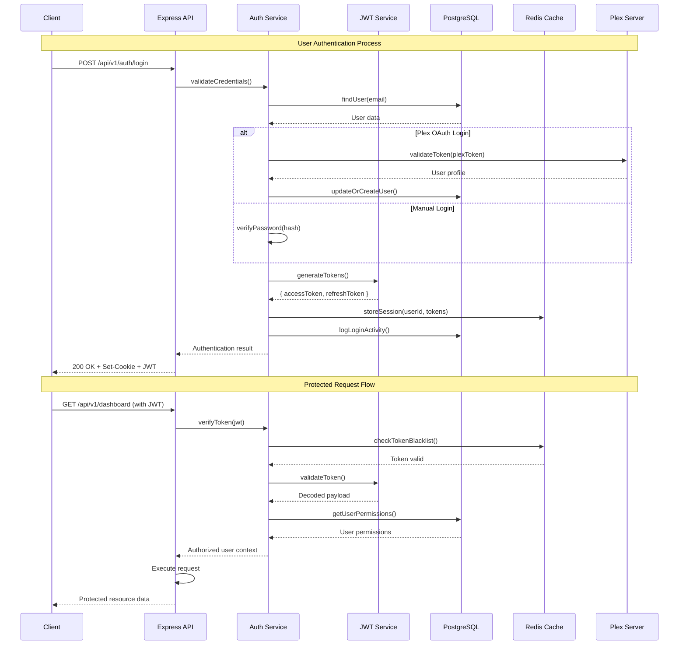
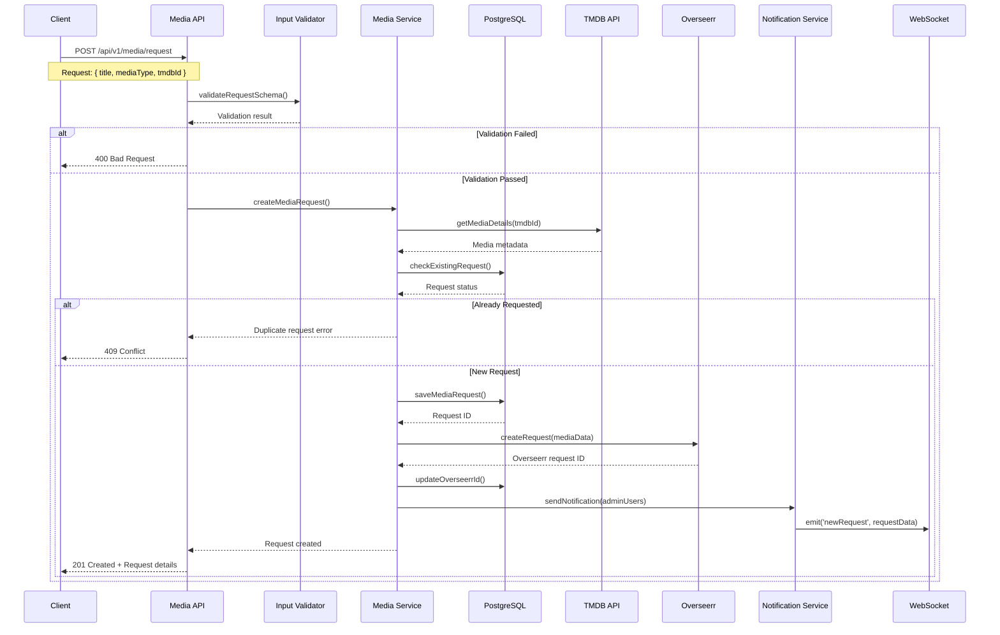
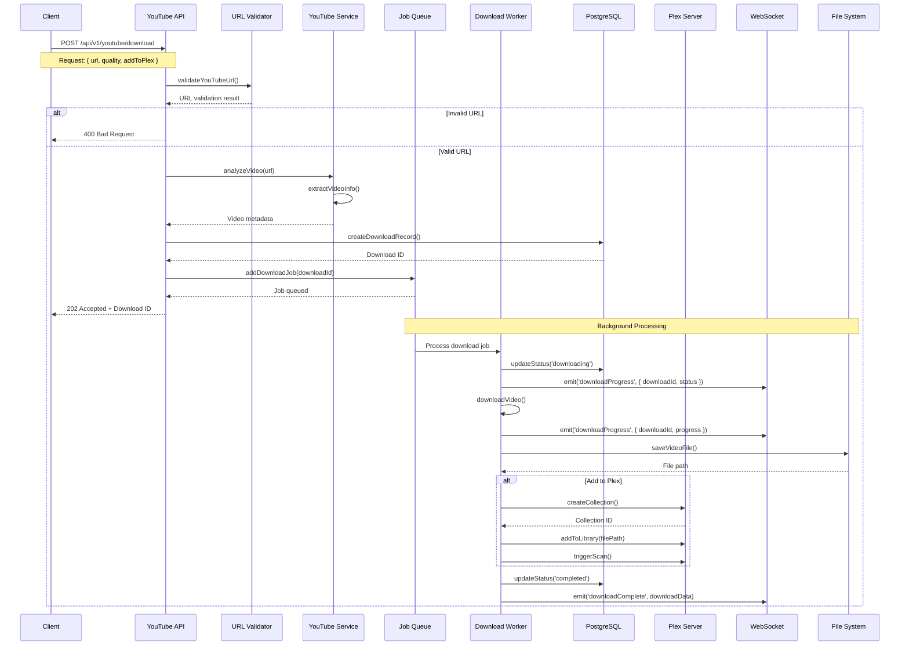
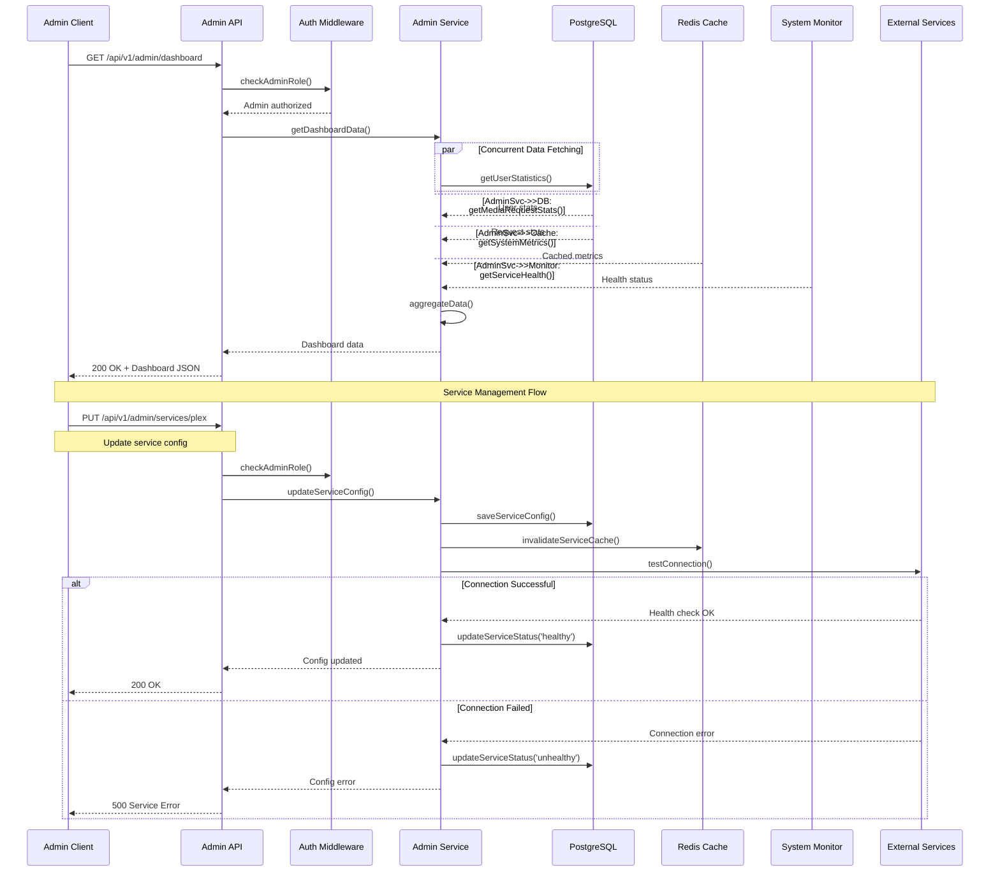
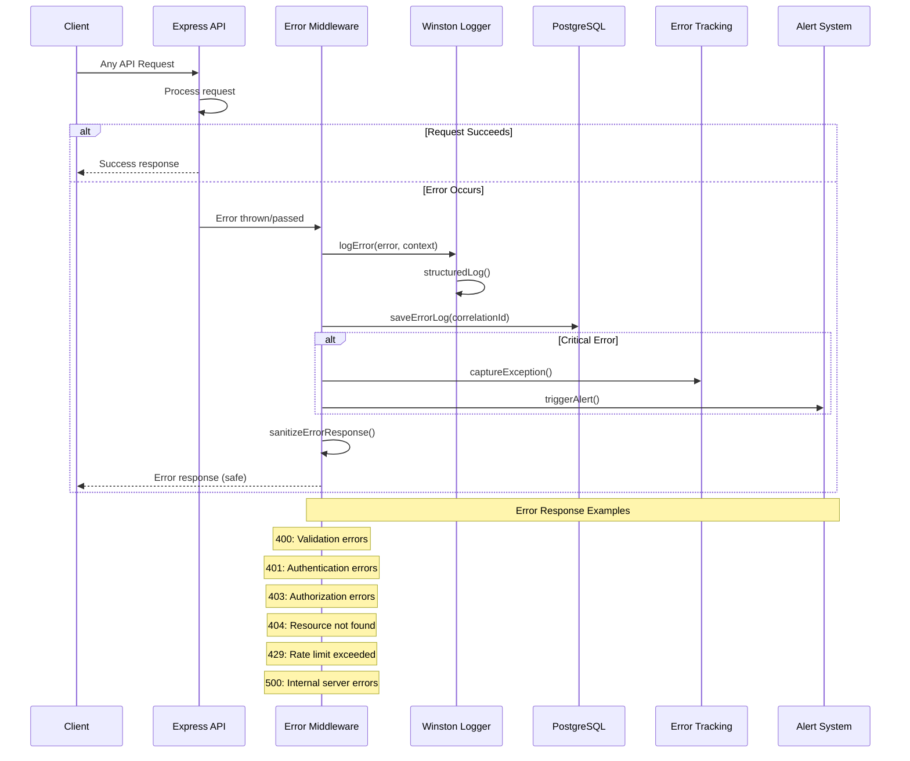
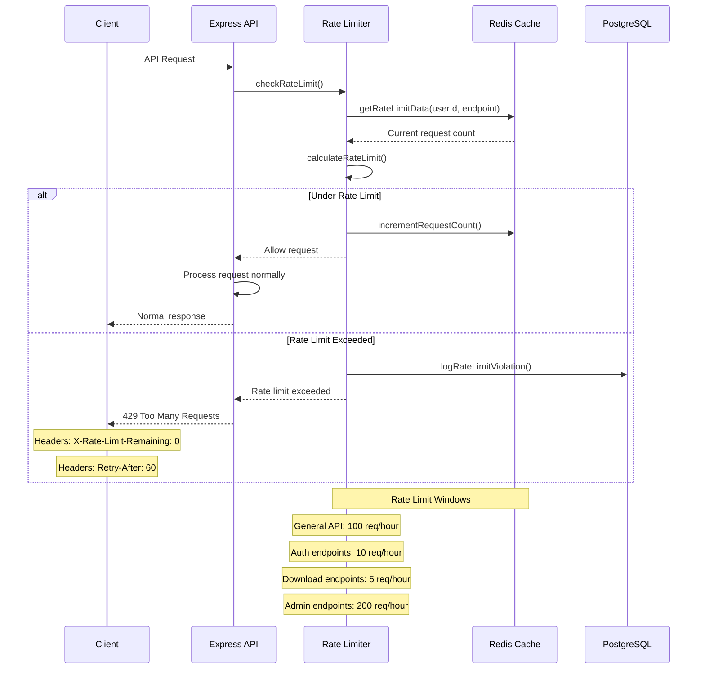
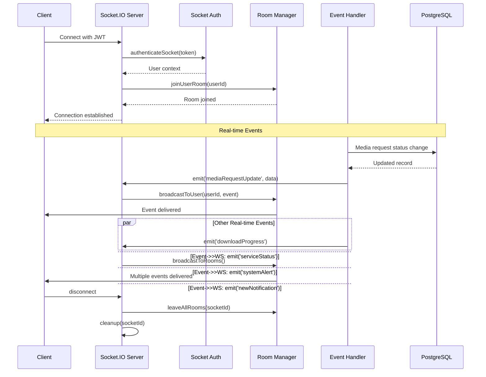

# API Sequence Diagrams

## Authentication Flow

## Media Request API Flow

## YouTube Download API Flow

## Admin Dashboard API Flow

## Error Handling Flow

## Rate Limiting Flow

## WebSocket Real-time Flow

