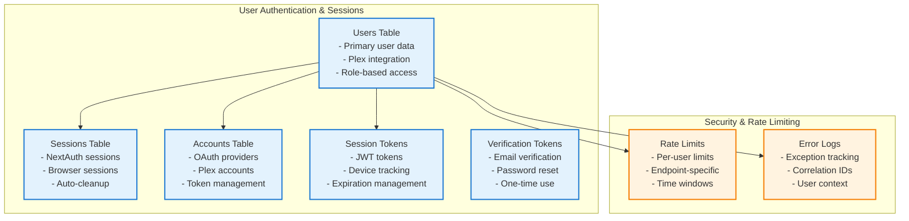
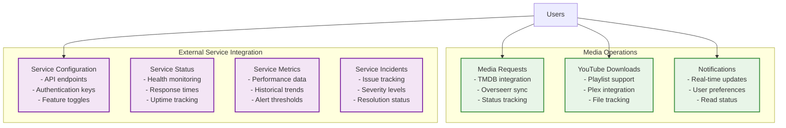
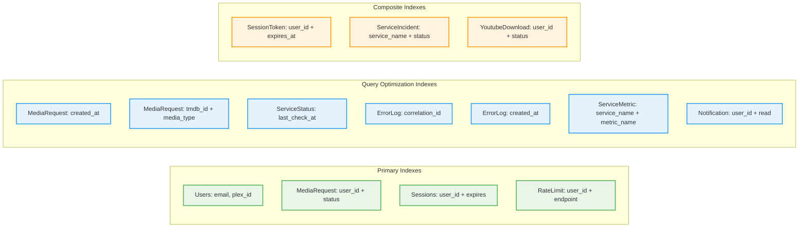
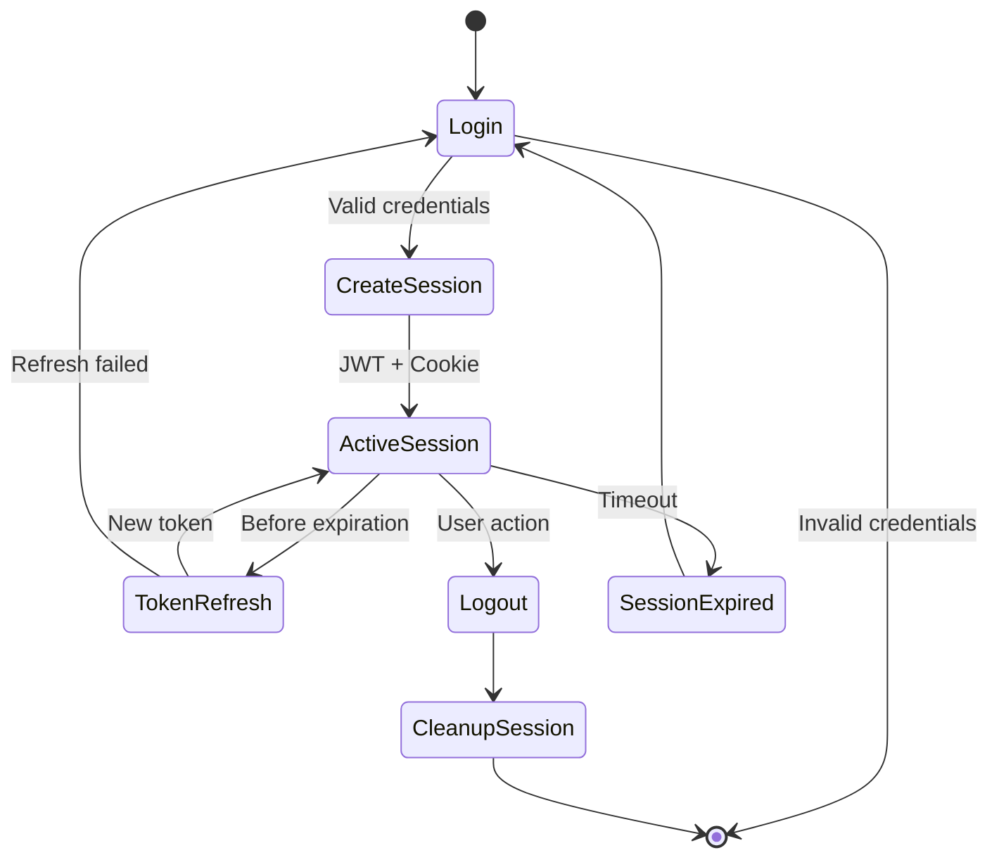
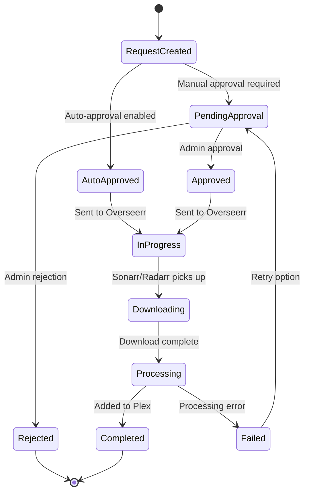

# Database Schema and Entity Relationships

## Entity Relationship Diagram

```mermaid
erDiagram
    User {
        string id PK
        string plex_id UK "nullable"
        string plex_username "nullable"
        string email UK
        string name "nullable"
        string role "default: USER"
        string plex_token "nullable"
        string image "nullable"
        boolean requires_password_change "default: false"
        timestamp created_at "default: now()"
        timestamp last_login_at "nullable"
        string status "default: active"
    }

    MediaRequest {
        string id PK
        string user_id FK
        string title
        string media_type
        string tmdb_id "nullable"
        string status "default: pending"
        string overseerr_id "nullable"
        timestamp created_at "default: now()"
        timestamp completed_at "nullable"
    }

    YoutubeDownload {
        string id PK
        string user_id FK
        string playlist_url
        string playlist_title "nullable"
        string status "default: queued"
        json file_paths "nullable"
        string plex_collection_id "nullable"
        timestamp created_at "default: now()"
        timestamp completed_at "nullable"
    }

    ServiceStatus {
        int id PK
        string service_name UK
        string status "nullable"
        int response_time_ms "nullable"
        timestamp last_check_at "nullable"
        decimal uptime_percentage "nullable, 5,2"
    }

    RateLimit {
        int id PK
        string user_id FK
        string endpoint
        int request_count "default: 0"
        timestamp window_start "default: now()"
    }

    ServiceConfig {
        int id PK
        string service_name UK
        string service_url
        string api_key "nullable"
        boolean enabled "default: true"
        json config_data "nullable"
        timestamp updated_at "default: now()"
        string updated_by FK "nullable"
    }

    SessionToken {
        string id PK
        string user_id FK
        string token_hash UK
        timestamp expires_at
        timestamp created_at "default: now()"
        timestamp last_used_at "nullable"
    }

    Account {
        string id PK
        string user_id FK
        string type
        string provider
        string provider_account_id
        text refresh_token "nullable"
        text access_token "nullable"
        int expires_at "nullable"
        string token_type "nullable"
        string scope "nullable"
        text id_token "nullable"
        string session_state "nullable"
    }

    Session {
        string id PK
        string session_token UK
        string user_id FK
        timestamp expires
    }

    VerificationToken {
        string identifier
        string token UK
        timestamp expires
    }

    ErrorLog {
        string id PK
        string correlation_id
        string user_id FK
        string error_code
        string error_message
        text stack_trace "nullable"
        string request_path
        string request_method
        int status_code "nullable"
        json metadata "nullable"
        timestamp created_at "default: now()"
    }

    ServiceMetric {
        string id PK
        string service_name
        string metric_name
        float metric_value
        timestamp timestamp "default: now()"
        json metadata "nullable"
    }

    ServiceIncident {
        string id PK
        string service_name
        string incident_type
        string description
        string severity "default: low"
        string status "default: open"
        timestamp created_at "default: now()"
        timestamp resolved_at "nullable"
        json metadata "nullable"
    }

    Notification {
        string id PK
        string user_id FK
        string type
        string title
        string message
        boolean read "default: false"
        timestamp created_at "default: now()"
        timestamp read_at "nullable"
        json metadata "nullable"
    }

    %% Relationships
    User ||--o{ MediaRequest : "creates"
    User ||--o{ YoutubeDownload : "initiates"
    User ||--o{ RateLimit : "has"
    User ||--o{ SessionToken : "owns"
    User ||--o{ Account : "has"
    User ||--o{ Session : "has"
    User ||--o{ ErrorLog : "generates"
    User ||--o{ Notification : "receives"
    User ||--o{ ServiceConfig : "updates"

    %% Indexes
    MediaRequest }o--|| User : "user_id, status"
    YoutubeDownload }o--|| User : "user_id"
    RateLimit }o--|| User : "user_id, endpoint"
    SessionToken }o--|| User : "user_id, expires_at"
    ErrorLog }o--|| User : "correlation_id, created_at"
    ServiceMetric }o--|| ServiceMetric : "service_name, metric_name"
    ServiceIncident }o--|| ServiceIncident : "service_name, status"
    Notification }o--|| User : "user_id, read"
```

## Database Schema Details

### Core User Management

### Media Management System

## Index Strategy

### Performance-Critical Indexes

## Data Flow Patterns

### User Session Lifecycle

### Media Request Lifecycle

