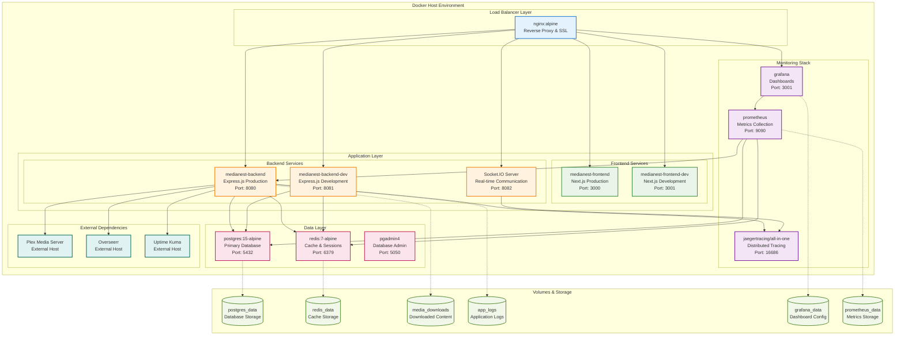
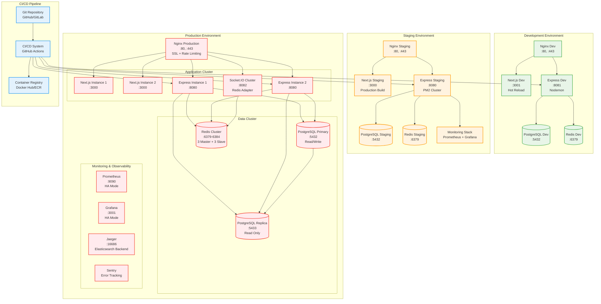
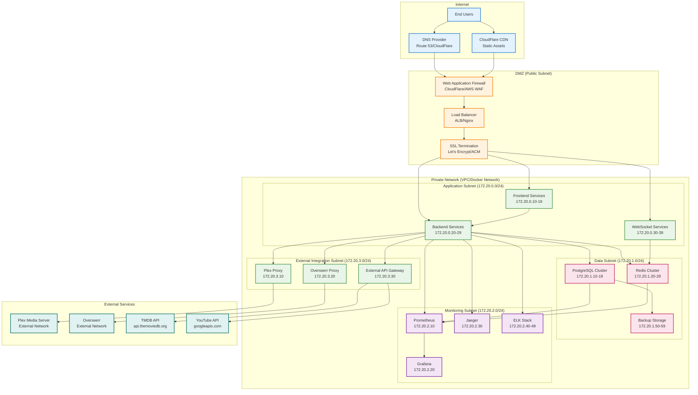
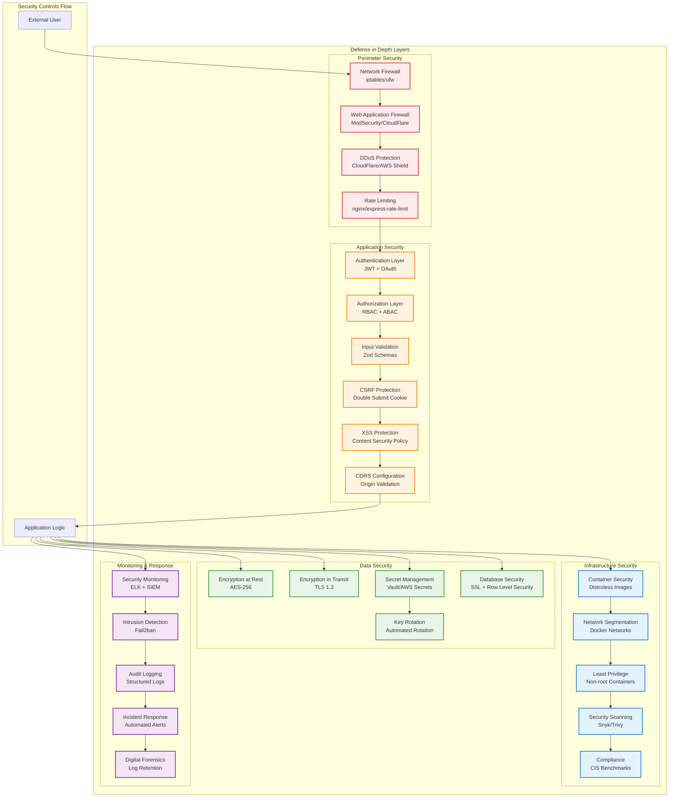

# Deployment and Infrastructure Diagrams

## Container Architecture



## Multi-Environment Deployment



## Network Architecture



## Security Architecture



## Scalability Architecture

```mermaid
graph TB
    subgraph "Load Balancing Tier"
        GLOBAL_LB[Global Load Balancer<br/>CloudFlare/Route 53]
        REGIONAL_LB[Regional Load Balancer<br/>ALB/NLB]
        APP_LB[Application Load Balancer<br/>Nginx/HAProxy]
    end

    subgraph "Auto-Scaling Groups"
        subgraph "Frontend Scaling"
            FRONTEND_ASG[Frontend Auto Scaling Group]
            FRONTEND_1[Frontend Instance 1]
            FRONTEND_2[Frontend Instance 2]
            FRONTEND_N[Frontend Instance N]

            FRONTEND_ASG --> FRONTEND_1
            FRONTEND_ASG --> FRONTEND_2
            FRONTEND_ASG --> FRONTEND_N
        end

        subgraph "Backend Scaling"
            BACKEND_ASG[Backend Auto Scaling Group]
            BACKEND_1[Backend Instance 1]
            BACKEND_2[Backend Instance 2]
            BACKEND_N[Backend Instance N]

            BACKEND_ASG --> BACKEND_1
            BACKEND_ASG --> BACKEND_2
            BACKEND_ASG --> BACKEND_N
        end

        subgraph "Worker Scaling"
            WORKER_ASG[Worker Auto Scaling Group]
            WORKER_1[Download Worker 1]
            WORKER_2[Download Worker 2]
            WORKER_N[Download Worker N]

            WORKER_ASG --> WORKER_1
            WORKER_ASG --> WORKER_2
            WORKER_ASG --> WORKER_N
        end
    end

    subgraph "Data Tier Scaling"
        subgraph "Database Scaling"
            DB_CLUSTER[PostgreSQL Cluster]
            DB_PRIMARY[Primary (Write)]
            DB_REPLICA_1[Read Replica 1]
            DB_REPLICA_2[Read Replica 2]
            DB_REPLICA_N[Read Replica N]

            DB_CLUSTER --> DB_PRIMARY
            DB_CLUSTER --> DB_REPLICA_1
            DB_CLUSTER --> DB_REPLICA_2
            DB_CLUSTER --> DB_REPLICA_N
        end

        subgraph "Cache Scaling"
            REDIS_CLUSTER[Redis Cluster]
            REDIS_SHARD_1[Redis Shard 1<br/>Master + Slave]
            REDIS_SHARD_2[Redis Shard 2<br/>Master + Slave]
            REDIS_SHARD_N[Redis Shard N<br/>Master + Slave]

            REDIS_CLUSTER --> REDIS_SHARD_1
            REDIS_CLUSTER --> REDIS_SHARD_2
            REDIS_CLUSTER --> REDIS_SHARD_N
        end
    end

    subgraph "Message Queue Scaling"
        QUEUE_CLUSTER[Queue Cluster<br/>Redis/RabbitMQ]
        QUEUE_1[Queue Instance 1]
        QUEUE_2[Queue Instance 2]
        QUEUE_N[Queue Instance N]

        QUEUE_CLUSTER --> QUEUE_1
        QUEUE_CLUSTER --> QUEUE_2
        QUEUE_CLUSTER --> QUEUE_N
    end

    subgraph "Monitoring Scaling"
        METRICS_CLUSTER[Metrics Cluster]
        PROMETHEUS_1[Prometheus 1]
        PROMETHEUS_2[Prometheus 2]
        GRAFANA_HA[Grafana HA]

        METRICS_CLUSTER --> PROMETHEUS_1
        METRICS_CLUSTER --> PROMETHEUS_2
        METRICS_CLUSTER --> GRAFANA_HA
    end

    %% Traffic Flow
    GLOBAL_LB --> REGIONAL_LB
    REGIONAL_LB --> APP_LB

    APP_LB --> FRONTEND_ASG
    APP_LB --> BACKEND_ASG

    BACKEND_ASG --> DB_CLUSTER
    BACKEND_ASG --> REDIS_CLUSTER
    BACKEND_ASG --> QUEUE_CLUSTER

    WORKER_ASG --> QUEUE_CLUSTER
    WORKER_ASG --> DB_CLUSTER

    %% Monitoring Connections
    FRONTEND_ASG --> METRICS_CLUSTER
    BACKEND_ASG --> METRICS_CLUSTER
    WORKER_ASG --> METRICS_CLUSTER
    DB_CLUSTER --> METRICS_CLUSTER

    %% Auto-scaling Triggers
    METRICS_CLUSTER -.-> FRONTEND_ASG
    METRICS_CLUSTER -.-> BACKEND_ASG
    METRICS_CLUSTER -.-> WORKER_ASG

    classDef loadbalancer fill:#e3f2fd,stroke:#1976d2,stroke-width:2px
    classDef frontend fill:#e8f5e8,stroke:#388e3c,stroke-width:2px
    classDef backend fill:#fff3e0,stroke:#f57c00,stroke-width:2px
    classDef data fill:#fce4ec,stroke:#c2185b,stroke-width:2px
    classDef queue fill:#f3e5f5,stroke:#7b1fa2,stroke-width:2px
    classDef monitoring fill:#e0f2f1,stroke:#00695c,stroke-width:2px

    class GLOBAL_LB,REGIONAL_LB,APP_LB loadbalancer
    class FRONTEND_ASG,FRONTEND_1,FRONTEND_2,FRONTEND_N frontend
    class BACKEND_ASG,BACKEND_1,BACKEND_2,BACKEND_N,WORKER_ASG,WORKER_1,WORKER_2,WORKER_N backend
    class DB_CLUSTER,DB_PRIMARY,DB_REPLICA_1,DB_REPLICA_2,DB_REPLICA_N,REDIS_CLUSTER,REDIS_SHARD_1,REDIS_SHARD_2,REDIS_SHARD_N data
    class QUEUE_CLUSTER,QUEUE_1,QUEUE_2,QUEUE_N queue
    class METRICS_CLUSTER,PROMETHEUS_1,PROMETHEUS_2,GRAFANA_HA monitoring
```
