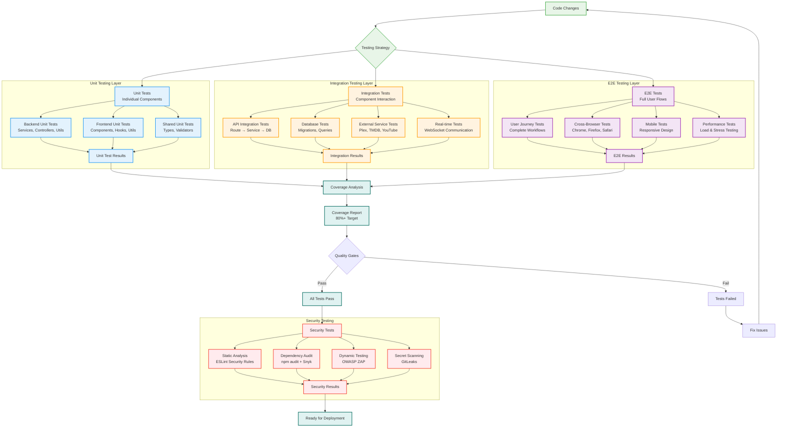
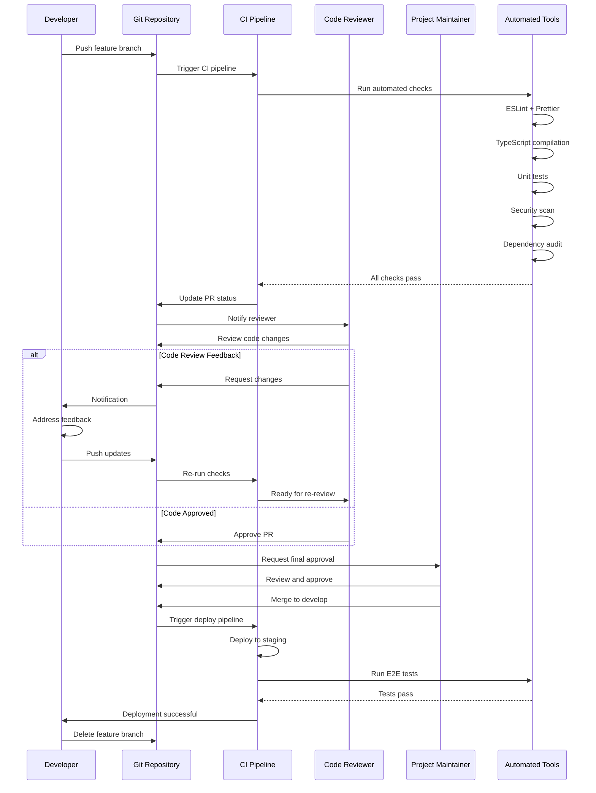

# Development Workflow Diagrams

## Git Branching Strategy

```mermaid
gitgraph
    commit id: "Initial Setup"

    branch develop
    checkout develop
    commit id: "Base Development"

    branch feature/authentication
    checkout feature/authentication
    commit id: "Add JWT auth"
    commit id: "Add Plex OAuth"
    commit id: "Add session management"

    checkout develop
    merge feature/authentication
    commit id: "Merge auth feature"

    branch feature/media-requests
    checkout feature/media-requests
    commit id: "Add TMDB integration"
    commit id: "Add request system"
    commit id: "Add Overseerr sync"

    checkout develop
    merge feature/media-requests
    commit id: "Merge media requests"

    branch feature/youtube-downloads
    checkout feature/youtube-downloads
    commit id: "Add YouTube API"
    commit id: "Add download queue"
    commit id: "Add Plex integration"

    checkout develop
    merge feature/youtube-downloads
    commit id: "Merge YouTube feature"

    branch release/v2.0.0
    checkout release/v2.0.0
    commit id: "Prepare release"
    commit id: "Update docs"
    commit id: "Version bump"

    checkout main
    merge release/v2.0.0
    commit id: "Release v2.0.0"

    checkout develop
    merge main
    commit id: "Sync develop with main"

    branch hotfix/security-patch
    checkout hotfix/security-patch
    commit id: "Security fix"

    checkout main
    merge hotfix/security-patch
    commit id: "Hotfix v2.0.1"

    checkout develop
    merge main
    commit id: "Sync hotfix to develop"
```

## CI/CD Pipeline Flow

```mermaid
graph TD
    DEV_COMMIT[Developer Commits] --> GIT_PUSH[Git Push to Branch]
    GIT_PUSH --> TRIGGER_CI[Trigger CI Pipeline]

    TRIGGER_CI --> PR_CHECKS{Pull Request?}
    PR_CHECKS -->|Yes| PR_PIPELINE[PR Validation Pipeline]
    PR_CHECKS -->|No| BRANCH_PIPELINE[Branch Pipeline]

    subgraph "Pull Request Pipeline"
        PR_PIPELINE --> PR_LINT[ESLint + Prettier]
        PR_LINT --> PR_TYPE[TypeScript Check]
        PR_TYPE --> PR_TEST[Run Test Suite]
        PR_TEST --> PR_SECURITY[Security Scan]
        PR_SECURITY --> PR_BUILD[Build Validation]
        PR_BUILD --> PR_E2E[E2E Tests]
        PR_E2E --> PR_COVERAGE[Coverage Report]
        PR_COVERAGE --> PR_REVIEW[Code Review Required]
    end

    subgraph "Branch Pipeline"
        BRANCH_PIPELINE --> BRANCH_LINT[ESLint + Prettier]
        BRANCH_LINT --> BRANCH_TYPE[TypeScript Check]
        BRANCH_TYPE --> BRANCH_TEST[Unit + Integration Tests]
        BRANCH_TEST --> BRANCH_BUILD[Build Application]
        BRANCH_BUILD --> BRANCH_DEPLOY[Deploy to Dev Environment]
    end

    PR_REVIEW --> MERGE_DECISION{Approved?}
    MERGE_DECISION -->|No| PR_FEEDBACK[Address Feedback]
    PR_FEEDBACK --> PR_PIPELINE
    MERGE_DECISION -->|Yes| MERGE_TO_DEVELOP[Merge to Develop]

    MERGE_TO_DEVELOP --> DEVELOP_PIPELINE[Develop Pipeline]
    BRANCH_DEPLOY --> DEVELOP_PIPELINE

    subgraph "Develop Pipeline"
        DEVELOP_PIPELINE --> DEV_FULL_TEST[Full Test Suite]
        DEV_FULL_TEST --> DEV_BUILD[Build All Services]
        DEV_BUILD --> DEV_DOCKER[Build Docker Images]
        DEV_DOCKER --> DEV_DEPLOY[Deploy to Staging]
        DEV_DEPLOY --> DEV_E2E[Staging E2E Tests]
        DEV_E2E --> DEV_PERFORMANCE[Performance Tests]
        DEV_PERFORMANCE --> DEV_SECURITY[Security Audit]
    end

    DEV_SECURITY --> RELEASE_READY{Ready for Release?}
    RELEASE_READY -->|No| CONTINUE_DEV[Continue Development]
    RELEASE_READY -->|Yes| CREATE_RELEASE[Create Release Branch]

    CREATE_RELEASE --> RELEASE_PIPELINE[Release Pipeline]

    subgraph "Release Pipeline"
        RELEASE_PIPELINE --> REL_FREEZE[Code Freeze]
        REL_FREEZE --> REL_DOCS[Update Documentation]
        REL_DOCS --> REL_VERSION[Version Bump]
        REL_VERSION --> REL_BUILD[Production Build]
        REL_BUILD --> REL_TEST[Final Testing]
        REL_TEST --> REL_APPROVE[Release Approval]
    end

    REL_APPROVE --> PROD_DEPLOY[Deploy to Production]

    subgraph "Production Deployment"
        PROD_DEPLOY --> PROD_BACKUP[Backup Current Version]
        PROD_BACKUP --> PROD_DEPLOY_APP[Deploy Application]
        PROD_DEPLOY_APP --> PROD_SMOKE[Smoke Tests]
        PROD_SMOKE --> PROD_MONITOR[Monitor Deployment]
        PROD_MONITOR --> PROD_VERIFY[Verify Health Checks]
    end

    PROD_VERIFY --> DEPLOYMENT_SUCCESS{Deployment Successful?}
    DEPLOYMENT_SUCCESS -->|No| ROLLBACK[Automatic Rollback]
    DEPLOYMENT_SUCCESS -->|Yes| RELEASE_COMPLETE[Release Complete]

    ROLLBACK --> INCIDENT_RESPONSE[Incident Response]
    RELEASE_COMPLETE --> POST_DEPLOY[Post-Deployment Tasks]

    classDef trigger fill:#e8f5e8,stroke:#4caf50,stroke-width:2px
    classDef pipeline fill:#e3f2fd,stroke:#2196f3,stroke-width:2px
    classDef decision fill:#fff3e0,stroke:#ff9800,stroke-width:2px
    classDef deploy fill:#f3e5f5,stroke:#9c27b0,stroke-width:2px
    classDef error fill:#ffebee,stroke:#f44336,stroke-width:2px

    class DEV_COMMIT,GIT_PUSH,TRIGGER_CI trigger
    class PR_PIPELINE,BRANCH_PIPELINE,DEVELOP_PIPELINE,RELEASE_PIPELINE pipeline
    class PR_CHECKS,MERGE_DECISION,RELEASE_READY,DEPLOYMENT_SUCCESS decision
    class MERGE_TO_DEVELOP,DEV_DEPLOY,PROD_DEPLOY,RELEASE_COMPLETE deploy
    class ROLLBACK,INCIDENT_RESPONSE error
```



## Testing Strategy Flow



## Development Environment Setup

```mermaid
flowchart TD
    START([New Developer Onboarding]) --> PREREQ[Check Prerequisites]

    PREREQ --> NODE_CHECK{Node.js 20+?}
    NODE_CHECK -->|No| INSTALL_NODE[Install Node.js 20+]
    NODE_CHECK -->|Yes| DOCKER_CHECK{Docker Installed?}

    INSTALL_NODE --> DOCKER_CHECK
    DOCKER_CHECK -->|No| INSTALL_DOCKER[Install Docker Desktop]
    DOCKER_CHECK -->|Yes| GIT_CHECK{Git Configured?}

    INSTALL_DOCKER --> GIT_CHECK
    GIT_CHECK -->|No| CONFIGURE_GIT[Configure Git]
    GIT_CHECK -->|Yes| CLONE_REPO[Clone Repository]

    CONFIGURE_GIT --> CLONE_REPO
    CLONE_REPO --> SETUP_ENV[Setup Environment Files]

    subgraph "Environment Configuration"
        SETUP_ENV --> COPY_ENV[Copy .env.example to .env]
        COPY_ENV --> CONFIG_DB[Configure Database URLs]
        CONFIG_DB --> CONFIG_REDIS[Configure Redis URLs]
        CONFIG_REDIS --> CONFIG_EXTERNAL[Configure External APIs]
        CONFIG_EXTERNAL --> CONFIG_JWT[Generate JWT Secrets]
    end

    CONFIG_JWT --> INSTALL_DEPS[Install Dependencies]

    subgraph "Dependency Installation"
        INSTALL_DEPS --> INSTALL_ROOT[npm install (root)]
        INSTALL_ROOT --> INSTALL_BACKEND[npm install (backend)]
        INSTALL_BACKEND --> INSTALL_FRONTEND[npm install (frontend)]
        INSTALL_FRONTEND --> INSTALL_SHARED[npm install (shared)]
    end

    INSTALL_SHARED --> START_SERVICES[Start Development Services]

    subgraph "Service Startup"
        START_SERVICES --> START_DB[Start PostgreSQL Container]
        START_DB --> START_REDIS[Start Redis Container]
        START_REDIS --> RUN_MIGRATIONS[Run Database Migrations]
        RUN_MIGRATIONS --> SEED_DATA[Seed Development Data]
    end

    SEED_DATA --> START_DEV[Start Development Servers]

    subgraph "Development Servers"
        START_DEV --> START_BACKEND[npm run dev:backend]
        START_DEV --> START_FRONTEND[npm run dev:frontend]
        START_BACKEND --> BACKEND_READY[Backend: localhost:8081]
        START_FRONTEND --> FRONTEND_READY[Frontend: localhost:3001]
    end

    BACKEND_READY --> VERIFY_SETUP[Verify Setup]
    FRONTEND_READY --> VERIFY_SETUP

    subgraph "Setup Verification"
        VERIFY_SETUP --> TEST_HEALTH[Test Health Endpoints]
        TEST_HEALTH --> TEST_AUTH[Test Authentication]
        TEST_AUTH --> TEST_DB[Test Database Connection]
        TEST_DB --> RUN_TESTS[Run Test Suite]
    end

    RUN_TESTS --> SETUP_COMPLETE{Setup Successful?}
    SETUP_COMPLETE -->|No| TROUBLESHOOT[Troubleshoot Issues]
    SETUP_COMPLETE -->|Yes| DEV_READY[Development Ready!]

    TROUBLESHOOT --> CHECK_LOGS[Check Logs]
    CHECK_LOGS --> CHECK_PORTS[Check Port Conflicts]
    CHECK_PORTS --> CHECK_ENV[Verify Environment Variables]
    CHECK_ENV --> RESTART_SERVICES[Restart Services]
    RESTART_SERVICES --> VERIFY_SETUP

    DEV_READY --> WORKFLOW_GUIDE[Show Development Workflow]

    subgraph "Development Workflow Guide"
        WORKFLOW_GUIDE --> CREATE_BRANCH[Create Feature Branch]
        CREATE_BRANCH --> MAKE_CHANGES[Make Code Changes]
        MAKE_CHANGES --> RUN_LINTING[Run Linting/Formatting]
        RUN_LINTING --> RUN_UNIT_TESTS[Run Unit Tests]
        RUN_UNIT_TESTS --> COMMIT_CHANGES[Commit Changes]
        COMMIT_CHANGES --> PUSH_BRANCH[Push Branch]
        PUSH_BRANCH --> CREATE_PR[Create Pull Request]
    end

    classDef start fill:#e8f5e8,stroke:#4caf50,stroke-width:2px
    classDef check fill:#e3f2fd,stroke:#2196f3,stroke-width:2px
    classDef install fill:#fff3e0,stroke:#ff9800,stroke-width:2px
    classDef config fill:#f3e5f5,stroke:#9c27b0,stroke-width:2px
    classDef service fill:#e0f2f1,stroke:#00695c,stroke-width:2px
    classDef verify fill:#fce4ec,stroke:#c2185b,stroke-width:2px
    classDef complete fill:#e8f5e8,stroke:#4caf50,stroke-width:2px

    class START,DEV_READY,WORKFLOW_GUIDE start
    class NODE_CHECK,DOCKER_CHECK,GIT_CHECK,SETUP_COMPLETE check
    class INSTALL_NODE,INSTALL_DOCKER,INSTALL_DEPS,INSTALL_ROOT,INSTALL_BACKEND,INSTALL_FRONTEND,INSTALL_SHARED install
    class SETUP_ENV,COPY_ENV,CONFIG_DB,CONFIG_REDIS,CONFIG_EXTERNAL,CONFIG_JWT config
    class START_SERVICES,START_DB,START_REDIS,RUN_MIGRATIONS,SEED_DATA,START_DEV,START_BACKEND,START_FRONTEND service
    class VERIFY_SETUP,TEST_HEALTH,TEST_AUTH,TEST_DB,RUN_TESTS verify
    class CREATE_BRANCH,MAKE_CHANGES,RUN_LINTING,RUN_UNIT_TESTS,COMMIT_CHANGES,PUSH_BRANCH,CREATE_PR complete
```

## Code Review Process


