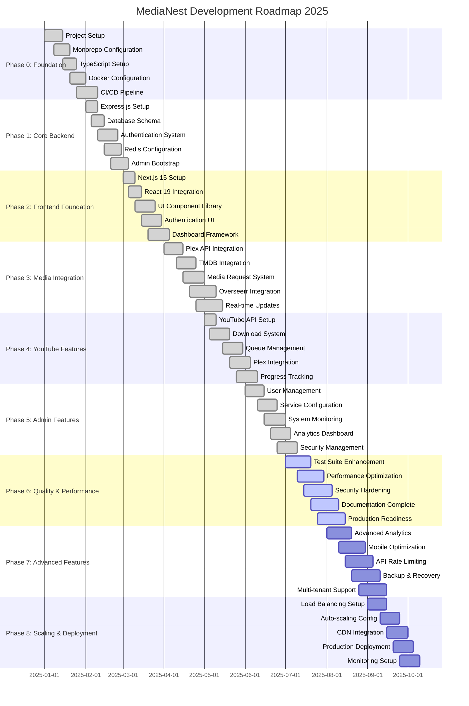
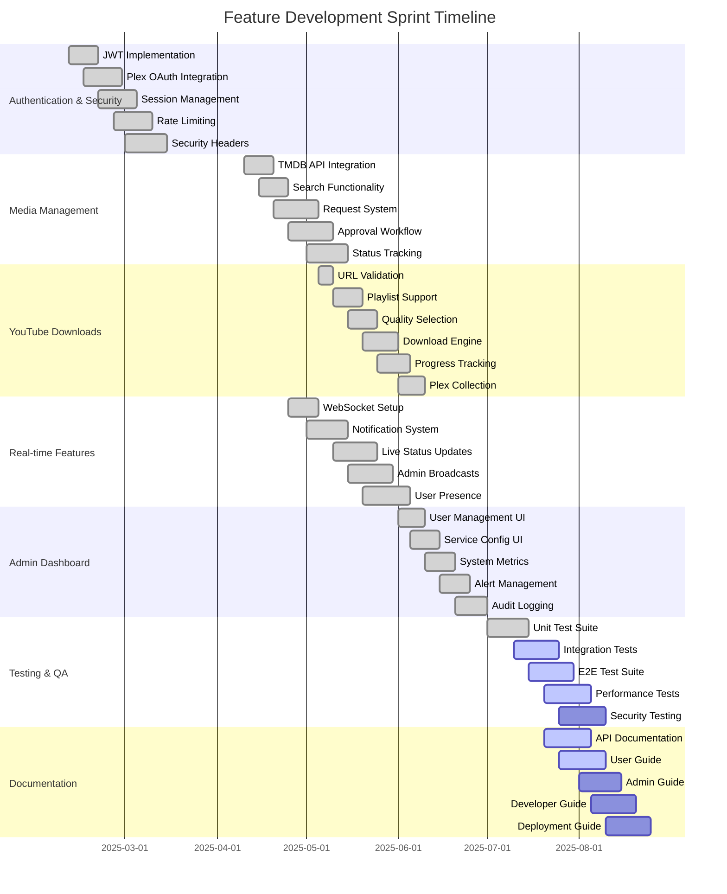
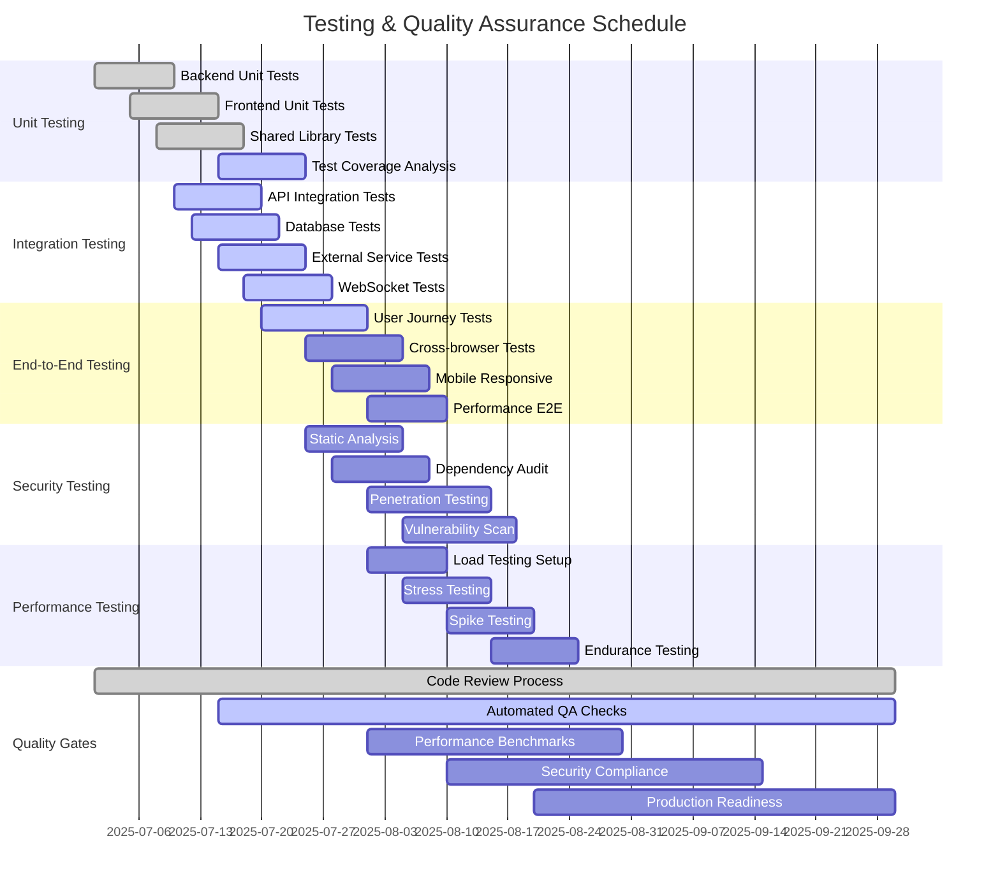
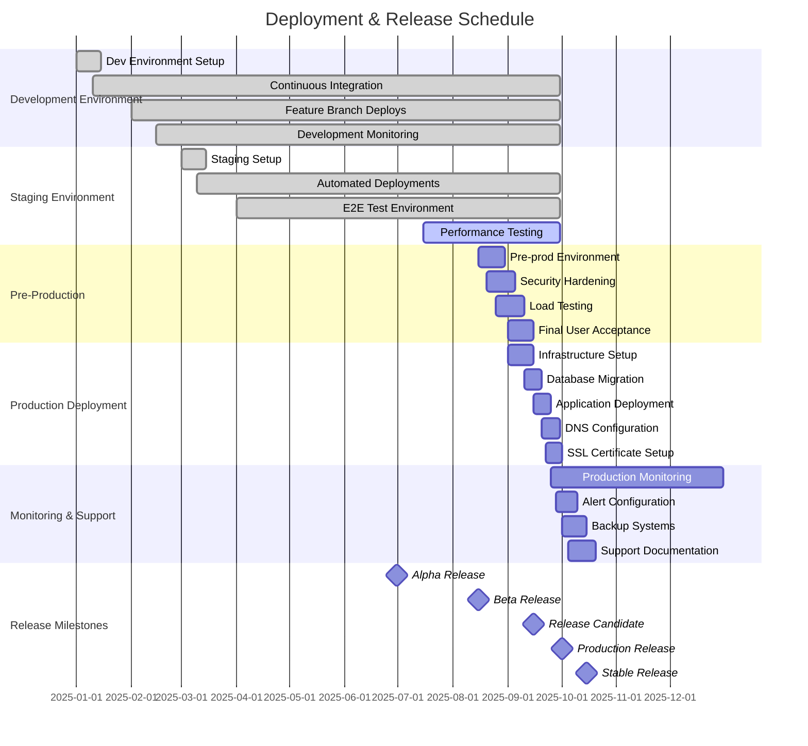

# Project Roadmap and Development Gantt Charts

## Development Roadmap Timeline



## Feature Development Timeline



## Testing & Quality Assurance Timeline



## Deployment & Release Timeline



## Maintenance & Support Timeline

```mermaid
gantt
    title Post-Launch Maintenance & Support Schedule
    dateFormat  YYYY-MM-DD
    
    section Immediate Post-Launch (Month 1)
    Critical Bug Fixes     :crit, post-1, 2025-10-01, 2025-10-31
    Performance Monitoring :post-2, 2025-10-01, 2025-10-31
    User Feedback Collection :post-3, 2025-10-01, 2025-10-31
    Hotfix Deployment     :post-4, 2025-10-01, 2025-10-31
    
    section Short-term Support (Months 2-3)
    Feature Enhancements   :short-1, 2025-11-01, 2025-12-31
    Security Updates      :short-2, 2025-11-01, 2025-12-31
    Documentation Updates :short-3, 2025-11-01, 2025-12-31
    User Training        :short-4, 2025-11-15, 2025-12-15
    
    section Medium-term Roadmap (Months 4-6)
    Mobile App Development :med-1, 2026-01-01, 2026-03-31
    API v2 Development    :med-2, 2026-01-15, 2026-04-15
    Advanced Analytics    :med-3, 2026-02-01, 2026-04-30
    Multi-language Support :med-4, 2026-02-15, 2026-05-15
    
    section Long-term Evolution (Months 7-12)
    Microservices Migration :long-1, 2026-04-01, 2026-09-30
    Machine Learning Features :long-2, 2026-05-01, 2026-10-31
    Enterprise Features   :long-3, 2026-06-01, 2026-11-30
    Cloud-native Optimization :long-4, 2026-07-01, 2026-12-31
    
    section Continuous Activities
    Security Monitoring   :continuous, cont-1, 2025-10-01, 2026-12-31
    Performance Optimization :continuous, cont-2, 2025-10-01, 2026-12-31
    User Support         :continuous, cont-3, 2025-10-01, 2026-12-31
    Regular Updates      :continuous, cont-4, 2025-10-01, 2026-12-31
    
    section Version Releases
    v2.1.0 Minor Release  :milestone, v21, 2025-11-15, 0d
    v2.2.0 Minor Release  :milestone, v22, 2026-01-15, 0d
    v3.0.0 Major Release  :milestone, v30, 2026-04-01, 0d
    v3.1.0 Minor Release  :milestone, v31, 2026-07-01, 0d
    v4.0.0 Major Release  :milestone, v40, 2026-10-01, 0d
```