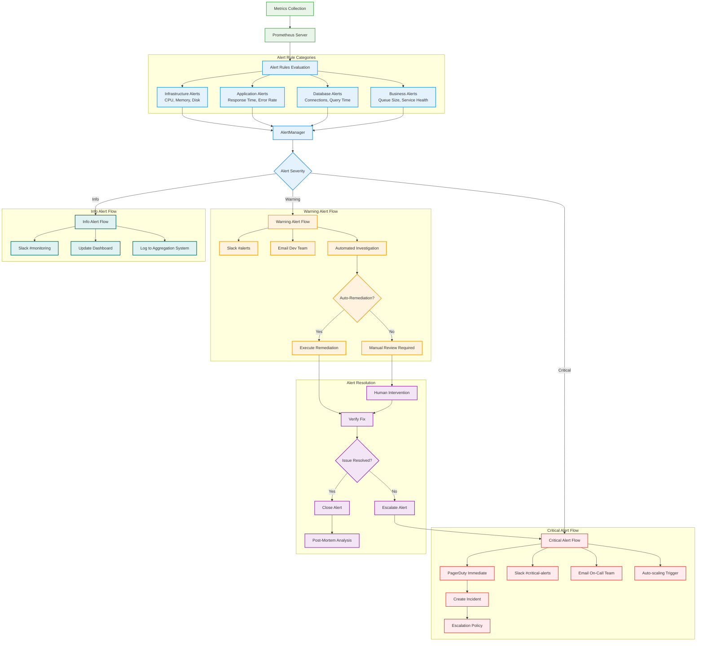
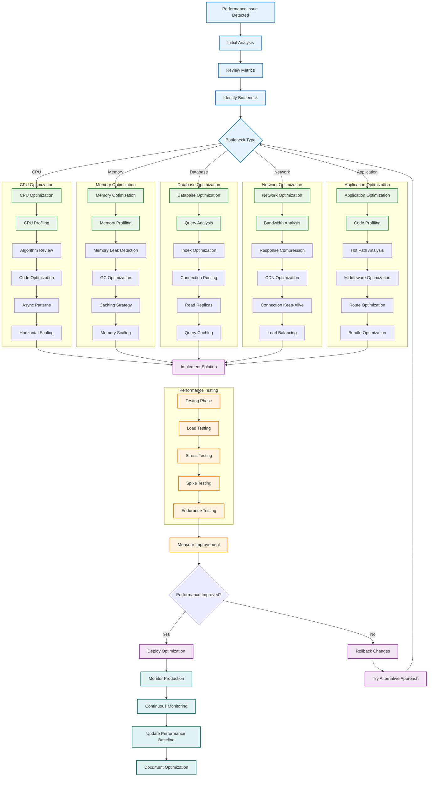
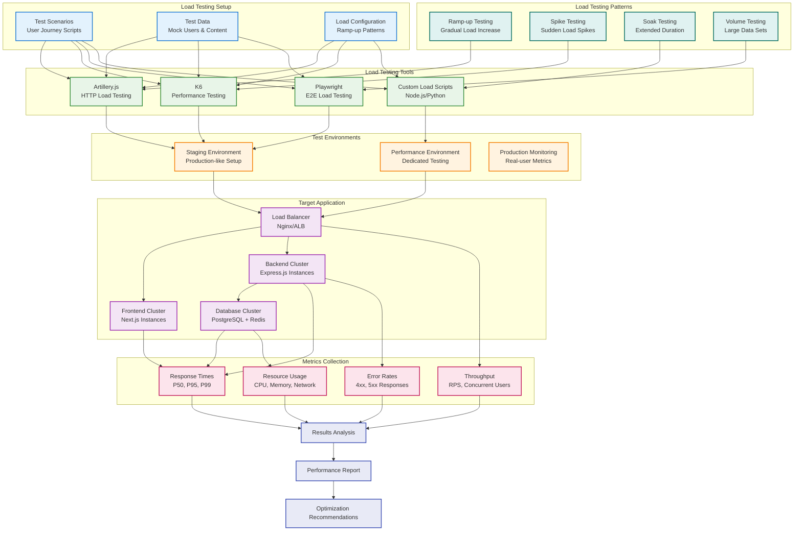

# Performance Monitoring Diagrams

## Performance Metrics Collection Flow

```mermaid
graph TD
    subgraph "Application Layer Metrics"
        EXPRESS[Express.js Application]
        MIDDLEWARE[Performance Middleware]
        ROUTES[API Routes]
        WEBSOCKET[Socket.IO Server]

        EXPRESS --> MIDDLEWARE
        MIDDLEWARE --> ROUTES
        EXPRESS --> WEBSOCKET
    end

    subgraph "Infrastructure Metrics"
        NODE_METRICS[Node.js Process Metrics]
        CONTAINER_METRICS[Container Metrics]
        SYSTEM_METRICS[System Metrics]
        NETWORK_METRICS[Network Metrics]
    end

    subgraph "Database Metrics"
        PG_METRICS[PostgreSQL Metrics]
        REDIS_METRICS[Redis Metrics]
        QUERY_METRICS[Query Performance]
        CONNECTION_METRICS[Connection Pool Metrics]
    end

    subgraph "External Service Metrics"
        PLEX_METRICS[Plex API Metrics]
        TMDB_METRICS[TMDB API Metrics]
        YOUTUBE_METRICS[YouTube API Metrics]
        OVERSEERR_METRICS[Overseerr Metrics]
    end

    subgraph "Custom Business Metrics"
        USER_METRICS[User Activity Metrics]
        MEDIA_METRICS[Media Request Metrics]
        DOWNLOAD_METRICS[Download Performance]
        ERROR_METRICS[Error Rate Metrics]
    end

    subgraph "Metrics Collection & Storage"
        PROMETHEUS[Prometheus Server]
        GRAFANA[Grafana Dashboard]
        ALERTMANAGER[Alert Manager]
        PUSHGATEWAY[Push Gateway]
    end

    subgraph "Alerting & Notification"
        SLACK[Slack Notifications]
        EMAIL[Email Alerts]
        WEBHOOK[Webhook Endpoints]
        PAGERDUTY[PagerDuty Integration]
    end

    %% Application Metrics Flow
    MIDDLEWARE --> PROMETHEUS
    ROUTES --> PROMETHEUS
    WEBSOCKET --> PROMETHEUS

    %% Infrastructure Metrics Flow
    NODE_METRICS --> PROMETHEUS
    CONTAINER_METRICS --> PROMETHEUS
    SYSTEM_METRICS --> PROMETHEUS
    NETWORK_METRICS --> PROMETHEUS

    %% Database Metrics Flow
    PG_METRICS --> PROMETHEUS
    REDIS_METRICS --> PROMETHEUS
    QUERY_METRICS --> PROMETHEUS
    CONNECTION_METRICS --> PROMETHEUS

    %% External Service Metrics Flow
    PLEX_METRICS --> PUSHGATEWAY
    TMDB_METRICS --> PUSHGATEWAY
    YOUTUBE_METRICS --> PUSHGATEWAY
    OVERSEERR_METRICS --> PUSHGATEWAY
    PUSHGATEWAY --> PROMETHEUS

    %% Custom Metrics Flow
    USER_METRICS --> PROMETHEUS
    MEDIA_METRICS --> PROMETHEUS
    DOWNLOAD_METRICS --> PROMETHEUS
    ERROR_METRICS --> PROMETHEUS

    %% Dashboard & Alerting Flow
    PROMETHEUS --> GRAFANA
    PROMETHEUS --> ALERTMANAGER

    ALERTMANAGER --> SLACK
    ALERTMANAGER --> EMAIL
    ALERTMANAGER --> WEBHOOK
    ALERTMANAGER --> PAGERDUTY

    classDef application fill:#e3f2fd,stroke:#1976d2,stroke-width:2px
    classDef infrastructure fill:#fff3e0,stroke:#f57c00,stroke-width:2px
    classDef database fill:#e8f5e8,stroke:#388e3c,stroke-width:2px
    classDef external fill:#f3e5f5,stroke:#9c27b0,stroke-width:2px
    classDef business fill:#fce4ec,stroke:#c2185b,stroke-width:2px
    classDef monitoring fill:#e0f2f1,stroke:#00695c,stroke-width:2px
    classDef alerting fill:#ffebee,stroke:#f44336,stroke-width:2px

    class EXPRESS,MIDDLEWARE,ROUTES,WEBSOCKET application
    class NODE_METRICS,CONTAINER_METRICS,SYSTEM_METRICS,NETWORK_METRICS infrastructure
    class PG_METRICS,REDIS_METRICS,QUERY_METRICS,CONNECTION_METRICS database
    class PLEX_METRICS,TMDB_METRICS,YOUTUBE_METRICS,OVERSEERR_METRICS external
    class USER_METRICS,MEDIA_METRICS,DOWNLOAD_METRICS,ERROR_METRICS business
    class PROMETHEUS,GRAFANA,PUSHGATEWAY monitoring
    class ALERTMANAGER,SLACK,EMAIL,WEBHOOK,PAGERDUTY alerting
```

## Real-time Performance Dashboard

```mermaid
graph TD
    subgraph "Dashboard Layout"
        subgraph "System Health Overview"
            CPU_GAUGE[CPU Usage Gauge<br/>0-100%]
            MEMORY_GAUGE[Memory Usage Gauge<br/>0-100%]
            DISK_GAUGE[Disk Usage Gauge<br/>0-100%]
            UPTIME[System Uptime<br/>Days:Hours:Minutes]
        end

        subgraph "Application Performance"
            RESPONSE_TIME[Response Time<br/>95th Percentile]
            THROUGHPUT[Requests per Second<br/>Real-time Graph]
            ERROR_RATE[Error Rate %<br/>Last 5 minutes]
            ACTIVE_USERS[Active Users<br/>WebSocket Connections]
        end

        subgraph "Database Performance"
            DB_CONNECTIONS[Active Connections<br/>Pool Usage]
            QUERY_TIME[Average Query Time<br/>Last 100 queries]
            SLOW_QUERIES[Slow Queries<br/>Queries > 1s]
            CACHE_HIT_RATE[Redis Cache Hit Rate<br/>%]
        end

        subgraph "Business Metrics"
            MEDIA_REQUESTS[Media Requests<br/>Today/This Week]
            DOWNLOAD_QUEUE[Download Queue Size<br/>Pending/In Progress]
            USER_ACTIVITY[User Activity<br/>Login/Actions]
            SERVICE_STATUS[External Services<br/>Health Status]
        end

        subgraph "Alerts & Incidents"
            ACTIVE_ALERTS[Active Alerts<br/>Critical/Warning]
            RECENT_INCIDENTS[Recent Incidents<br/>Last 24 hours]
            SLA_STATUS[SLA Status<br/>Uptime %]
            PERFORMANCE_TRENDS[Performance Trends<br/>Week over Week]
        end
    end

    subgraph "Data Sources"
        PROMETHEUS_DS[Prometheus Data Source]
        LOKI[Loki Log Data]
        JAEGER_DS[Jaeger Tracing Data]
        CUSTOM_METRICS[Custom Application Metrics]
    end

    %% Data Flow to Dashboard Components
    PROMETHEUS_DS --> CPU_GAUGE
    PROMETHEUS_DS --> MEMORY_GAUGE
    PROMETHEUS_DS --> DISK_GAUGE
    PROMETHEUS_DS --> UPTIME

    PROMETHEUS_DS --> RESPONSE_TIME
    PROMETHEUS_DS --> THROUGHPUT
    PROMETHEUS_DS --> ERROR_RATE
    PROMETHEUS_DS --> ACTIVE_USERS

    PROMETHEUS_DS --> DB_CONNECTIONS
    PROMETHEUS_DS --> QUERY_TIME
    PROMETHEUS_DS --> SLOW_QUERIES
    PROMETHEUS_DS --> CACHE_HIT_RATE

    CUSTOM_METRICS --> MEDIA_REQUESTS
    CUSTOM_METRICS --> DOWNLOAD_QUEUE
    CUSTOM_METRICS --> USER_ACTIVITY
    CUSTOM_METRICS --> SERVICE_STATUS

    PROMETHEUS_DS --> ACTIVE_ALERTS
    LOKI --> RECENT_INCIDENTS
    PROMETHEUS_DS --> SLA_STATUS
    PROMETHEUS_DS --> PERFORMANCE_TRENDS

    classDef overview fill:#e3f2fd,stroke:#1976d2,stroke-width:2px
    classDef performance fill:#e8f5e8,stroke:#388e3c,stroke-width:2px
    classDef database fill:#fff3e0,stroke:#f57c00,stroke-width:2px
    classDef business fill:#f3e5f5,stroke:#9c27b0,stroke-width:2px
    classDef alerts fill:#ffebee,stroke:#f44336,stroke-width:2px
    classDef datasource fill:#e0f2f1,stroke:#00695c,stroke-width:2px

    class CPU_GAUGE,MEMORY_GAUGE,DISK_GAUGE,UPTIME overview
    class RESPONSE_TIME,THROUGHPUT,ERROR_RATE,ACTIVE_USERS performance
    class DB_CONNECTIONS,QUERY_TIME,SLOW_QUERIES,CACHE_HIT_RATE database
    class MEDIA_REQUESTS,DOWNLOAD_QUEUE,USER_ACTIVITY,SERVICE_STATUS business
    class ACTIVE_ALERTS,RECENT_INCIDENTS,SLA_STATUS,PERFORMANCE_TRENDS alerts
    class PROMETHEUS_DS,LOKI,JAEGER_DS,CUSTOM_METRICS datasource
```

## Performance Alert Flow

## Performance Optimization Workflow

## Load Testing Architecture

