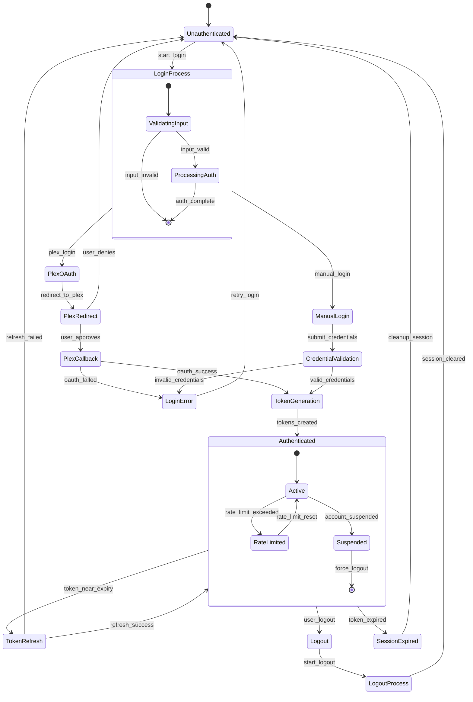
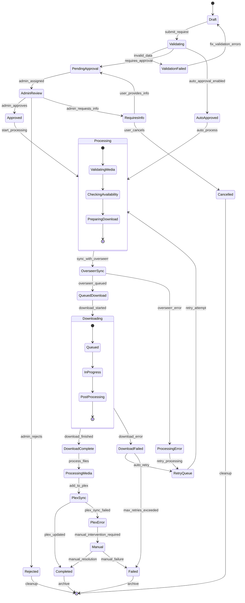
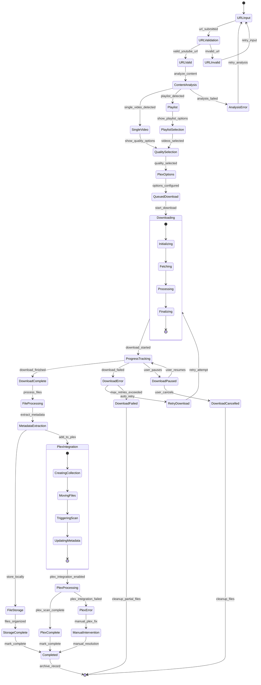
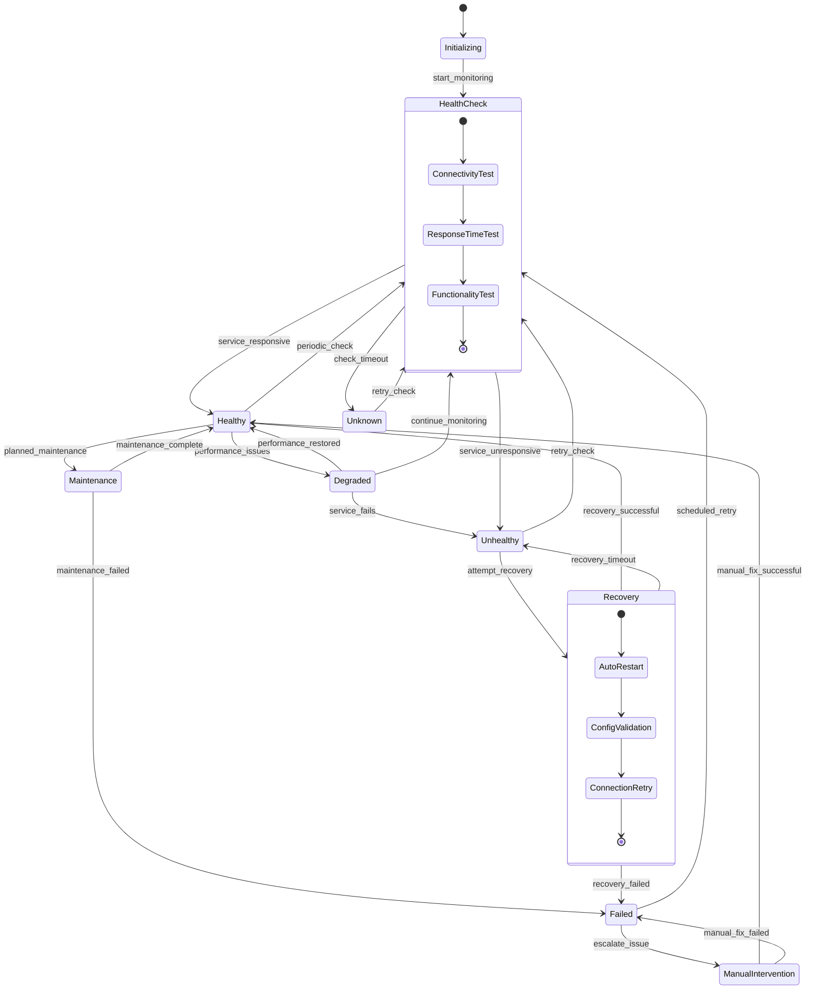
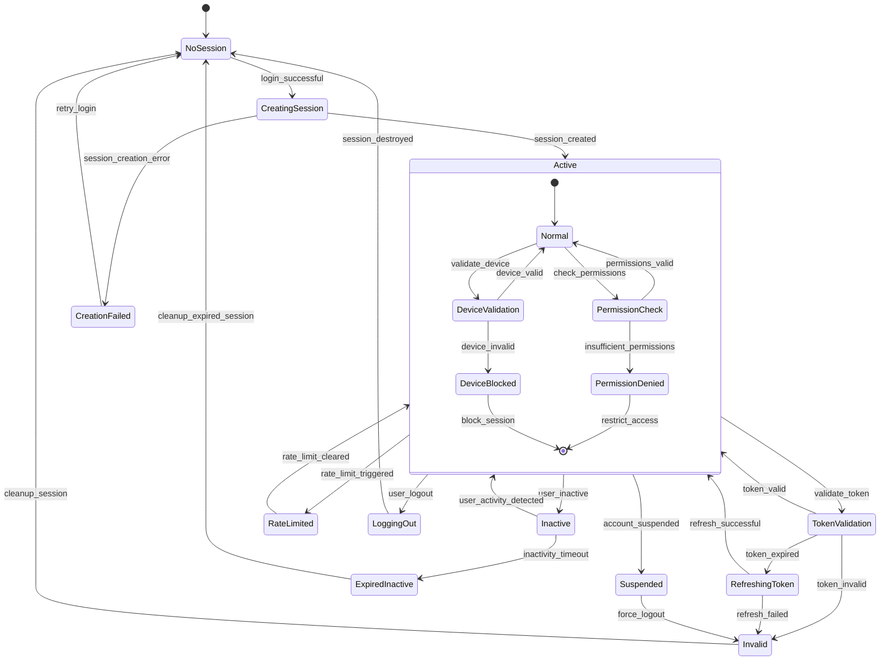
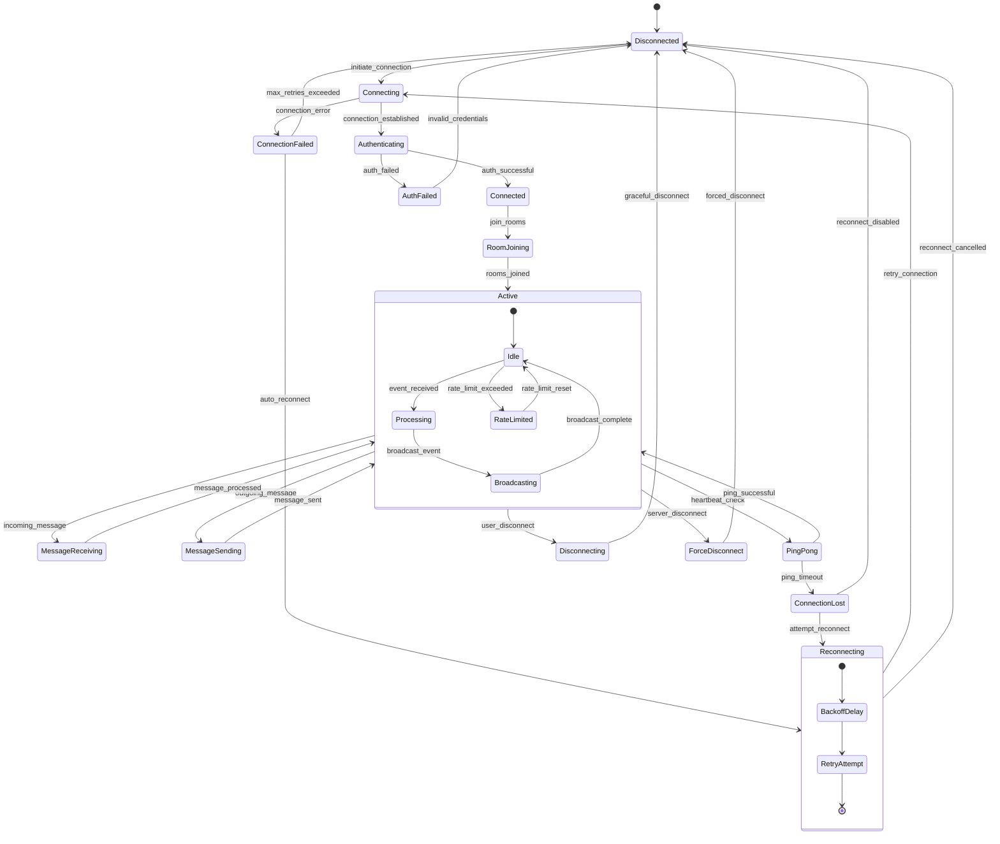

# State Machine Diagrams

## User Authentication State Machine

## Media Request State Machine

## YouTube Download State Machine

## Service Health State Machine

## User Session State Machine

## WebSocket Connection State Machine

