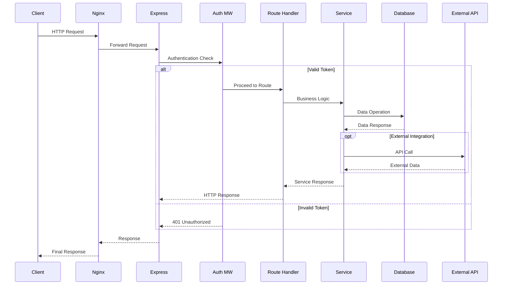

# MediaNest System Architecture Diagrams

## High-Level System Architecture

```mermaid
graph TB
    subgraph "Client Layer"
        WEB[Web Browser<br/>Next.js Frontend]
        MOBILE[Mobile App<br/>Future Implementation]
        API_CLIENT[API Clients<br/>Third-party Integrations]
    end

    subgraph "Load Balancer & Reverse Proxy"
        NGINX[Nginx<br/>SSL Termination & Load Balancing]
    end

    subgraph "Application Layer"
        EXPRESS[Express.js Server<br/>TypeScript + Node.js 20+]
        SOCKET[Socket.IO Server<br/>Real-time Communication]
        
        subgraph "API Routes v1"
            HEALTH[Health Check API]
            AUTH_API[Authentication API<br/>JWT + OAuth]
            MEDIA_API[Media Management API]
            PLEX_API[Plex Integration API]
            DASH_API[Dashboard API]
            ADMIN_API[Admin Management API]
            YOUTUBE_API[YouTube Download API]
            WEBHOOK_API[Webhooks API]
        end
    end

    subgraph "Business Logic Layer"
        subgraph "Controllers"
            AUTH_CTRL[Auth Controller<br/>User Authentication]
            MEDIA_CTRL[Media Controller<br/>Request Management]
            PLEX_CTRL[Plex Controller<br/>Server Integration]
            DASH_CTRL[Dashboard Controller<br/>Analytics & Status]
            ADMIN_CTRL[Admin Controller<br/>System Management]
            YT_CTRL[YouTube Controller<br/>Video Downloads]
        end

        subgraph "Services"
            PLEX_SVC[Plex Service<br/>Library Management]
            MEDIA_SVC[Media Service<br/>Content Discovery]
            AUTH_SVC[Authentication Service<br/>JWT Management]
            CACHE_SVC[Cache Service<br/>Redis Operations]
            NOTIF_SVC[Notification Service<br/>Real-time Updates]
            ENCRYPTION_SVC[Encryption Service<br/>Data Security]
            YOUTUBE_SVC[YouTube Service<br/>Video Processing]
        end

        subgraph "Middleware Stack"
            AUTH_MW[Authentication Middleware]
            VALIDATION_MW[Input Validation]
            RATE_LIMIT_MW[Rate Limiting]
            ERROR_MW[Error Handling]
            SECURITY_MW[Security Headers]
            PERFORMANCE_MW[Performance Monitoring]
            TIMEOUT_MW[Request Timeout]
        end
    end

    subgraph "Data Persistence Layer"
        POSTGRES[(PostgreSQL 15+<br/>Primary Database)]
        REDIS[(Redis 7+<br/>Cache & Sessions)]
        
        subgraph "Database Models"
            USERS[Users & Accounts]
            MEDIA_REQ[Media Requests]
            YT_DL[YouTube Downloads]
            SERVICE_STATUS[Service Status]
            NOTIFICATIONS[Notifications]
            ERROR_LOGS[Error Logs]
            SESSIONS[User Sessions]
            RATE_LIMITS[Rate Limit Tracking]
            SERVICE_METRICS[Performance Metrics]
        end
    end

    subgraph "External Services"
        PLEX_SERVER[Plex Media Server<br/>Content Library]
        OVERSEERR[Overseerr<br/>Request Management]
        TMDB[The Movie DB<br/>Metadata Provider]
        YOUTUBE[YouTube API<br/>Video Downloads]
        UPTIME_KUMA[Uptime Kuma<br/>Service Monitoring]
    end

    subgraph "Monitoring & Observability"
        PROMETHEUS[Prometheus<br/>Metrics Collection]
        GRAFANA[Grafana<br/>Dashboard & Alerts]
        OPENTEL[OpenTelemetry<br/>Distributed Tracing]
        SENTRY[Sentry<br/>Error Tracking]
        WINSTON[Winston Logger<br/>Structured Logging]
    end

    %% Client to Load Balancer
    WEB --> NGINX
    MOBILE --> NGINX
    API_CLIENT --> NGINX

    %% Load Balancer to Application
    NGINX --> EXPRESS
    NGINX --> SOCKET

    %% API Routes
    EXPRESS --> HEALTH
    EXPRESS --> AUTH_API
    EXPRESS --> MEDIA_API
    EXPRESS --> PLEX_API
    EXPRESS --> DASH_API
    EXPRESS --> ADMIN_API
    EXPRESS --> YOUTUBE_API
    EXPRESS --> WEBHOOK_API

    %% Middleware Processing
    EXPRESS --> AUTH_MW
    EXPRESS --> VALIDATION_MW
    EXPRESS --> RATE_LIMIT_MW
    EXPRESS --> ERROR_MW
    EXPRESS --> SECURITY_MW
    EXPRESS --> PERFORMANCE_MW
    EXPRESS --> TIMEOUT_MW

    %% API to Controllers
    AUTH_API --> AUTH_CTRL
    MEDIA_API --> MEDIA_CTRL
    PLEX_API --> PLEX_CTRL
    DASH_API --> DASH_CTRL
    ADMIN_API --> ADMIN_CTRL
    YOUTUBE_API --> YT_CTRL

    %% Controllers to Services
    AUTH_CTRL --> AUTH_SVC
    MEDIA_CTRL --> MEDIA_SVC
    PLEX_CTRL --> PLEX_SVC
    DASH_CTRL --> CACHE_SVC
    DASH_CTRL --> NOTIF_SVC
    YT_CTRL --> YOUTUBE_SVC
    AUTH_CTRL --> ENCRYPTION_SVC

    %% Services to Database
    AUTH_SVC --> POSTGRES
    MEDIA_SVC --> POSTGRES
    PLEX_SVC --> POSTGRES
    NOTIF_SVC --> POSTGRES
    YOUTUBE_SVC --> POSTGRES

    %% Services to Cache
    CACHE_SVC --> REDIS
    AUTH_SVC --> REDIS
    RATE_LIMIT_MW --> REDIS

    %% Database Models
    POSTGRES --> USERS
    POSTGRES --> MEDIA_REQ
    POSTGRES --> YT_DL
    POSTGRES --> SERVICE_STATUS
    POSTGRES --> NOTIFICATIONS
    POSTGRES --> ERROR_LOGS
    POSTGRES --> SESSIONS
    POSTGRES --> RATE_LIMITS
    POSTGRES --> SERVICE_METRICS

    %% External Integrations
    PLEX_SVC --> PLEX_SERVER
    MEDIA_SVC --> OVERSEERR
    MEDIA_SVC --> TMDB
    YOUTUBE_SVC --> YOUTUBE
    DASH_CTRL --> UPTIME_KUMA

    %% Monitoring
    EXPRESS --> OPENTEL
    EXPRESS --> PROMETHEUS
    EXPRESS --> WINSTON
    ERROR_MW --> SENTRY
    PROMETHEUS --> GRAFANA

    %% Real-time Communication
    SOCKET --> NOTIF_SVC
    SOCKET --> AUTH_SVC

    classDef client fill:#e1f5fe,stroke:#01579b,stroke-width:2px
    classDef infrastructure fill:#f3e5f5,stroke:#4a148c,stroke-width:2px
    classDef api fill:#e8f5e8,stroke:#1b5e20,stroke-width:2px
    classDef business fill:#fff3e0,stroke:#e65100,stroke-width:2px
    classDef data fill:#fce4ec,stroke:#880e4f,stroke-width:2px
    classDef external fill:#f1f8e9,stroke:#33691e,stroke-width:2px
    classDef monitoring fill:#e0f2f1,stroke:#004d40,stroke-width:2px

    class WEB,MOBILE,API_CLIENT client
    class NGINX,EXPRESS,SOCKET infrastructure
    class HEALTH,AUTH_API,MEDIA_API,PLEX_API,DASH_API,ADMIN_API,YOUTUBE_API,WEBHOOK_API api
    class AUTH_CTRL,MEDIA_CTRL,PLEX_CTRL,DASH_CTRL,ADMIN_CTRL,YT_CTRL,AUTH_SVC,MEDIA_SVC,PLEX_SVC,CACHE_SVC,NOTIF_SVC,ENCRYPTION_SVC,YOUTUBE_SVC,AUTH_MW,VALIDATION_MW,RATE_LIMIT_MW,ERROR_MW,SECURITY_MW,PERFORMANCE_MW,TIMEOUT_MW business
    class POSTGRES,REDIS,USERS,MEDIA_REQ,YT_DL,SERVICE_STATUS,NOTIFICATIONS,ERROR_LOGS,SESSIONS,RATE_LIMITS,SERVICE_METRICS data
    class PLEX_SERVER,OVERSEERR,TMDB,YOUTUBE,UPTIME_KUMA external
    class PROMETHEUS,GRAFANA,OPENTEL,SENTRY,WINSTON monitoring
```

## Component Interaction Flow

```mermaid
sequenceDiagram
    participant C as Client
    participant N as Nginx
    participant E as Express
    participant A as Auth MW
    participant R as Route Handler
    participant S as Service
    participant D as Database
    participant X as External API

    C->>N: HTTP Request
    N->>E: Forward Request
    E->>A: Authentication Check
    alt Valid Token
        A->>R: Proceed to Route
        R->>S: Business Logic
        S->>D: Data Operation
        D-->>S: Data Response
        opt External Integration
            S->>X: API Call
            X-->>S: External Data
        end
        S-->>R: Service Response
        R-->>E: HTTP Response
    else Invalid Token
        A-->>E: 401 Unauthorized
    end
    E-->>N: Response
    N-->>C: Final Response
```