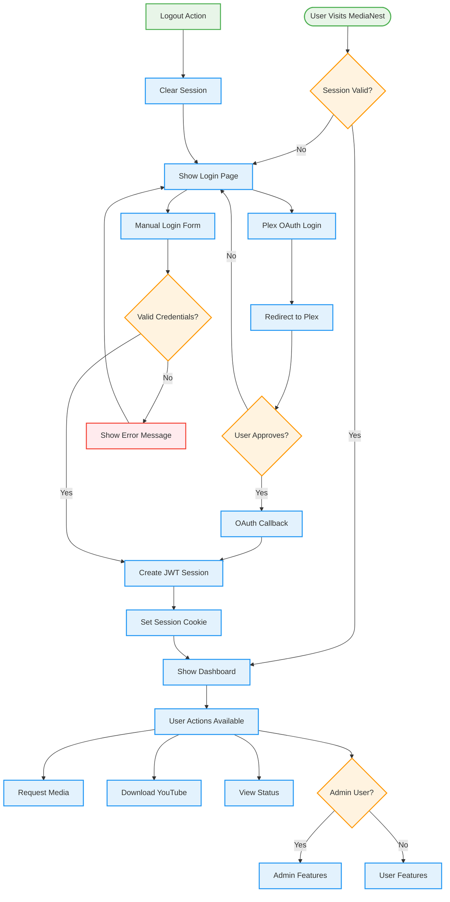
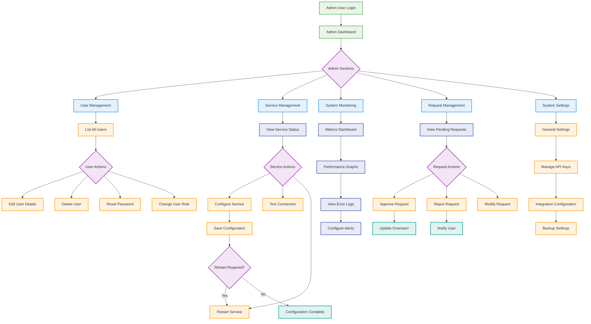

# User Journey Flow Diagrams

## User Authentication Journey



## Media Request Journey

```mermaid
graph TD
    USER_LOGIN[User Logged In] --> SEARCH_MEDIA[Search for Media]

    SEARCH_MEDIA --> SEARCH_TYPE{Search Type}
    SEARCH_TYPE -->|Movie| MOVIE_SEARCH[Search Movies via TMDB]
    SEARCH_TYPE -->|TV Show| TV_SEARCH[Search TV Shows via TMDB]

    MOVIE_SEARCH --> DISPLAY_RESULTS[Display Search Results]
    TV_SEARCH --> DISPLAY_RESULTS

    DISPLAY_RESULTS --> SELECT_MEDIA[User Selects Media]
    SELECT_MEDIA --> CHECK_AVAILABILITY{Already Available?}

    CHECK_AVAILABILITY -->|Yes| ALREADY_AVAILABLE[Show "Already Available"]
    CHECK_AVAILABILITY -->|No| REQUEST_FORM[Show Request Form]

    REQUEST_FORM --> QUALITY_SELECT[Select Quality Preferences]
    QUALITY_SELECT --> SUBMIT_REQUEST[Submit Request]

    SUBMIT_REQUEST --> VALIDATE_REQUEST{Valid Request?}
    VALIDATE_REQUEST -->|No| SHOW_ERROR[Show Validation Error]
    SHOW_ERROR --> REQUEST_FORM

    VALIDATE_REQUEST -->|Yes| SAVE_REQUEST[Save to Database]
    SAVE_REQUEST --> NOTIFY_ADMINS[Notify Administrators]
    NOTIFY_ADMINS --> OVERSEERR_SYNC[Sync with Overseerr]

    OVERSEERR_SYNC --> REQUEST_STATUS[Set Status: Pending]
    REQUEST_STATUS --> WEBSOCKET_UPDATE[Send Real-time Update]
    WEBSOCKET_UPDATE --> USER_NOTIFICATION[User Receives Notification]

    USER_NOTIFICATION --> ADMIN_APPROVAL{Admin Approval Required?}
    ADMIN_APPROVAL -->|Yes| WAIT_APPROVAL[Wait for Admin Approval]
    ADMIN_APPROVAL -->|No| AUTO_DOWNLOAD[Automatic Download]

    WAIT_APPROVAL --> ADMIN_REVIEW[Admin Reviews Request]
    ADMIN_REVIEW --> ADMIN_DECISION{Admin Decision}
    ADMIN_DECISION -->|Approve| AUTO_DOWNLOAD
    ADMIN_DECISION -->|Reject| REJECT_REQUEST[Mark as Rejected]

    AUTO_DOWNLOAD --> SONARR_RADARR[Trigger Sonarr/Radarr]
    SONARR_RADARR --> DOWNLOAD_STATUS[Update Download Status]
    DOWNLOAD_STATUS --> PLEX_SCAN[Plex Library Scan]
    PLEX_SCAN --> COMPLETE_REQUEST[Mark Request Complete]

    COMPLETE_REQUEST --> FINAL_NOTIFICATION[Send Completion Notification]
    REJECT_REQUEST --> REJECTION_NOTIFICATION[Send Rejection Notification]

    ALREADY_AVAILABLE --> VIEW_IN_PLEX[Link to Plex]

    classDef user fill:#e8f5e8,stroke:#4caf50,stroke-width:2px
    classDef process fill:#e3f2fd,stroke:#2196f3,stroke-width:2px
    classDef decision fill:#fff3e0,stroke:#ff9800,stroke-width:2px
    classDef external fill:#f3e5f5,stroke:#9c27b0,stroke-width:2px
    classDef notification fill:#e0f2f1,stroke:#009688,stroke-width:2px
    classDef error fill:#ffebee,stroke:#f44336,stroke-width:2px

    class USER_LOGIN,SELECT_MEDIA,SUBMIT_REQUEST user
    class SEARCH_MEDIA,MOVIE_SEARCH,TV_SEARCH,DISPLAY_RESULTS,REQUEST_FORM,QUALITY_SELECT,SAVE_REQUEST,REQUEST_STATUS,AUTO_DOWNLOAD,DOWNLOAD_STATUS,COMPLETE_REQUEST,VIEW_IN_PLEX process
    class SEARCH_TYPE,CHECK_AVAILABILITY,VALIDATE_REQUEST,ADMIN_APPROVAL,ADMIN_DECISION decision
    class OVERSEERR_SYNC,SONARR_RADARR,PLEX_SCAN external
    class NOTIFY_ADMINS,WEBSOCKET_UPDATE,USER_NOTIFICATION,FINAL_NOTIFICATION,REJECTION_NOTIFICATION notification
    class SHOW_ERROR,REJECT_REQUEST error
```

## YouTube Download Journey

```mermaid
graph TD
    USER_AUTH[Authenticated User] --> YT_PAGE[Navigate to YouTube Download]

    YT_PAGE --> PASTE_URL[Paste YouTube URL]
    PASTE_URL --> VALIDATE_URL{Valid YouTube URL?}

    VALIDATE_URL -->|No| URL_ERROR[Show URL Error]
    URL_ERROR --> PASTE_URL

    VALIDATE_URL -->|Yes| DETECT_TYPE{Content Type}
    DETECT_TYPE -->|Single Video| VIDEO_OPTIONS[Show Video Options]
    DETECT_TYPE -->|Playlist| PLAYLIST_OPTIONS[Show Playlist Options]

    VIDEO_OPTIONS --> SELECT_QUALITY[Select Video Quality]
    PLAYLIST_OPTIONS --> SELECT_VIDEOS[Select Videos from Playlist]
    SELECT_VIDEOS --> SELECT_QUALITY

    SELECT_QUALITY --> CHOOSE_FORMAT[Choose Download Format]
    CHOOSE_FORMAT --> PLEX_INTEGRATION{Add to Plex?}

    PLEX_INTEGRATION -->|Yes| SELECT_LIBRARY[Select Plex Library]
    PLEX_INTEGRATION -->|No| START_DOWNLOAD

    SELECT_LIBRARY --> CREATE_COLLECTION[Create Plex Collection]
    CREATE_COLLECTION --> START_DOWNLOAD[Start Download Process]

    START_DOWNLOAD --> QUEUE_JOB[Add to Download Queue]
    QUEUE_JOB --> WEBSOCKET_START[Send Start Notification]
    WEBSOCKET_START --> DOWNLOAD_PROGRESS[Show Progress Bar]

    DOWNLOAD_PROGRESS --> PROCESSING[Video Processing]
    PROCESSING --> PROGRESS_UPDATE[Real-time Progress Updates]
    PROGRESS_UPDATE --> DOWNLOAD_COMPLETE{Download Complete?}

    DOWNLOAD_COMPLETE -->|No| PROGRESS_UPDATE
    DOWNLOAD_COMPLETE -->|Yes| FILE_PROCESSING[Process Downloaded Files]

    FILE_PROCESSING --> METADATA_EXTRACT[Extract Metadata]
    METADATA_EXTRACT --> PLEX_ADD{Add to Plex?}

    PLEX_ADD -->|Yes| MOVE_TO_PLEX[Move Files to Plex Library]
    PLEX_ADD -->|No| STORE_FILES[Store in Downloads Folder]

    MOVE_TO_PLEX --> PLEX_SCAN_LIB[Trigger Plex Library Scan]
    PLEX_SCAN_LIB --> UPDATE_COLLECTION[Update Plex Collection]
    UPDATE_COLLECTION --> COMPLETION_NOTIFY

    STORE_FILES --> COMPLETION_NOTIFY[Send Completion Notification]
    COMPLETION_NOTIFY --> DOWNLOAD_HISTORY[Update Download History]

    DOWNLOAD_HISTORY --> VIEW_RESULTS[Display Download Results]

    classDef user fill:#e8f5e8,stroke:#4caf50,stroke-width:2px
    classDef process fill:#e3f2fd,stroke:#2196f3,stroke-width:2px
    classDef decision fill:#fff3e0,stroke:#ff9800,stroke-width:2px
    classDef plex fill:#f3e5f5,stroke:#9c27b0,stroke-width:2px
    classDef notification fill:#e0f2f1,stroke:#009688,stroke-width:2px
    classDef error fill:#ffebee,stroke:#f44336,stroke-width:2px
    classDef progress fill:#e8eaf6,stroke:#3f51b5,stroke-width:2px

    class USER_AUTH,PASTE_URL,SELECT_VIDEOS,SELECT_QUALITY,CHOOSE_FORMAT user
    class YT_PAGE,VIDEO_OPTIONS,PLAYLIST_OPTIONS,START_DOWNLOAD,QUEUE_JOB,FILE_PROCESSING,METADATA_EXTRACT,STORE_FILES,DOWNLOAD_HISTORY,VIEW_RESULTS process
    class VALIDATE_URL,DETECT_TYPE,PLEX_INTEGRATION,DOWNLOAD_COMPLETE,PLEX_ADD decision
    class SELECT_LIBRARY,CREATE_COLLECTION,MOVE_TO_PLEX,PLEX_SCAN_LIB,UPDATE_COLLECTION plex
    class WEBSOCKET_START,COMPLETION_NOTIFY notification
    class URL_ERROR error
    class DOWNLOAD_PROGRESS,PROCESSING,PROGRESS_UPDATE progress
```



## Admin Dashboard Journey


