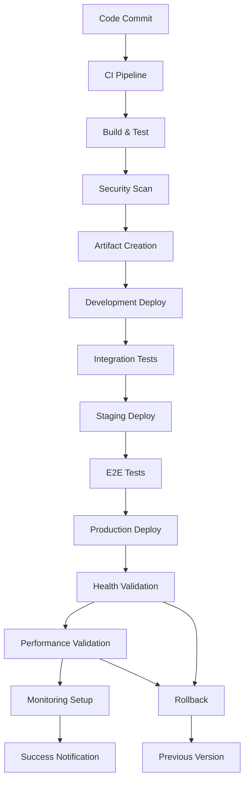

# Deployment Automation Strategy - MediaNest DevOps

## Executive Summary

Automated deployment is critical for MediaNest's operational efficiency, reliability, and scalability. This document outlines a comprehensive deployment automation strategy that encompasses zero-downtime deployments, rollback procedures, and automated validation processes, building upon existing infrastructure.

## Current Deployment Infrastructure Analysis

### Existing Automation Assets
MediaNest has established deployment foundations:

#### GitHub Actions Workflows
- **Secure Production Build**: Multi-stage security-hardened builds
- **Automated Rollback**: Failure detection and automatic reversion
- **Performance Monitoring**: Post-deployment validation
- **Security Monitoring**: Continuous security scanning

#### Container Infrastructure
- **Multi-environment Docker Compose**: Development, staging, production configurations
- **Security-hardened containers**: Non-root users, read-only filesystems
- **Production-ready images**: Optimized for performance and security

#### Deployment Scripts
- **Production deployment scripts**: Automated infrastructure setup
- **Monitoring stack automation**: Comprehensive observability deployment
- **Security validation scripts**: Automated security compliance checking

## Comprehensive Deployment Automation Architecture

### Deployment Pipeline Overview


### Multi-Environment Strategy
```yaml
deployment_environments:
  development:
    purpose: "Feature development and integration"
    deployment_trigger: "Push to feature branches"
    automation_level: "Fully automated"
    validation_requirements:
      - unit_tests: required
      - integration_tests: required
      - security_scan: basic
    
  staging:
    purpose: "Pre-production validation"
    deployment_trigger: "Merge to develop branch"
    automation_level: "Automated with approval gates"
    validation_requirements:
      - e2e_tests: required
      - performance_tests: required
      - security_scan: comprehensive
      - manual_qa: required
    
  production:
    purpose: "Live customer-facing environment"
    deployment_trigger: "Manual promotion from staging"
    automation_level: "Automated with multiple approval gates"
    validation_requirements:
      - staging_validation: passed
      - security_approval: required
      - change_management: required
      - business_approval: required
```

## Zero-Downtime Deployment Strategies

### Blue-Green Deployment Implementation

#### Architecture Overview
```yaml
blue_green_architecture:
  concept: "Two identical production environments"
  benefits:
    - Zero downtime deployments
    - Instant rollback capability
    - Production testing validation
    - Reduced deployment risk
  
  implementation:
    blue_environment:
      status: "Currently serving traffic"
      version: "v1.2.3"
      health: "Healthy"
    
    green_environment:
      status: "Deployment target"
      version: "v1.2.4"
      health: "Preparing"
```

#### Blue-Green Deployment Script
```bash
#!/bin/bash
# Blue-Green Deployment Automation

set -euo pipefail

# Configuration
STACK_NAME="medianest"
REGISTRY="ghcr.io/medianest"
NEW_VERSION="${1:-latest}"
HEALTH_CHECK_TIMEOUT=300
VALIDATION_TIMEOUT=600

# Colors for output
RED='\033[0;31m'
GREEN='\033[0;32m'
YELLOW='\033[0;33m'
BLUE='\033[0;34m'
NC='\033[0m'

log() {
    echo -e "${BLUE}[$(date +'%Y-%m-%d %H:%M:%S')]${NC} $1"
}

error() {
    echo -e "${RED}[ERROR]${NC} $1" >&2
}

success() {
    echo -e "${GREEN}[SUCCESS]${NC} $1"
}

warning() {
    echo -e "${YELLOW}[WARNING]${NC} $1"
}

# Determine current active environment
get_current_environment() {
    local current_color
    current_color=$(docker service inspect ${STACK_NAME}_traefik --format '{{index .Spec.TaskTemplate.ContainerSpec.Labels "traefik.http.routers.app.service"}}' 2>/dev/null)
    
    if [[ "$current_color" == *"blue"* ]]; then
        echo "blue"
    elif [[ "$current_color" == *"green"* ]]; then
        echo "green"
    else
        echo "blue"  # Default to blue if uncertain
    fi
}

# Deploy to inactive environment
deploy_to_inactive_environment() {
    local current_env="$1"
    local target_env
    
    if [[ "$current_env" == "blue" ]]; then
        target_env="green"
    else
        target_env="blue"
    fi
    
    log "Deploying version $NEW_VERSION to $target_env environment"
    
    # Create environment-specific Docker Compose override
    cat > docker-compose.${target_env}.yml <<EOF
version: '3.8'

services:
  app-${target_env}:
    image: ${REGISTRY}/app:${NEW_VERSION}
    environment:
      - ENVIRONMENT_COLOR=${target_env}
      - APP_VERSION=${NEW_VERSION}
    labels:
      - traefik.enable=true
      - traefik.http.routers.app-${target_env}.rule=Host(\`\${DOMAIN}\`)
      - traefik.http.services.app-${target_env}.loadbalancer.server.port=4000
    networks:
      - ${target_env}-network
    deploy:
      replicas: 3
      placement:
        constraints:
          - node.labels.tier == application
      update_config:
        parallelism: 1
        delay: 30s
        failure_action: rollback
        order: start-first
    healthcheck:
      test: ["CMD", "curl", "-f", "http://localhost:4000/health"]
      interval: 30s
      timeout: 10s
      retries: 3
      start_period: 60s

networks:
  ${target_env}-network:
    driver: overlay
EOF

    # Deploy to target environment
    docker stack deploy -c docker-compose.production.yml -c docker-compose.${target_env}.yml ${STACK_NAME}-${target_env}
    
    echo "$target_env"
}

# Health check validation
validate_environment_health() {
    local env="$1"
    local start_time=$(date +%s)
    
    log "Validating health of $env environment"
    
    while true; do
        local current_time=$(date +%s)
        local elapsed=$((current_time - start_time))
        
        if [[ $elapsed -gt $HEALTH_CHECK_TIMEOUT ]]; then
            error "Health check timeout after ${HEALTH_CHECK_TIMEOUT}s"
            return 1
        fi
        
        # Check service health
        local healthy_replicas
        healthy_replicas=$(docker service ls --filter name=${STACK_NAME}-${env}_app-${env} --format "{{.Replicas}}" | cut -d'/' -f1)
        local total_replicas
        total_replicas=$(docker service ls --filter name=${STACK_NAME}-${env}_app-${env} --format "{{.Replicas}}" | cut -d'/' -f2)
        
        if [[ "$healthy_replicas" == "$total_replicas" ]] && [[ "$healthy_replicas" -gt 0 ]]; then
            # Validate application health endpoint
            if validate_application_health "$env"; then
                success "Environment $env is healthy ($healthy_replicas/$total_replicas replicas)"
                return 0
            fi
        fi
        
        log "Waiting for $env environment to be healthy ($healthy_replicas/$total_replicas replicas ready)..."
        sleep 10
    done
}

# Application-level health validation
validate_application_health() {
    local env="$1"
    local app_url="http://localhost:4000"  # Internal health check
    
    # Get container ID for health check
    local container_id
    container_id=$(docker ps --filter "label=com.docker.swarm.service.name=${STACK_NAME}-${env}_app-${env}" --format "{{.ID}}" | head -1)
    
    if [[ -z "$container_id" ]]; then
        warning "No containers found for $env environment"
        return 1
    fi
    
    # Execute health check inside container
    if docker exec "$container_id" curl -sf "$app_url/health" >/dev/null 2>&1; then
        return 0
    else
        return 1
    fi
}

# Comprehensive validation suite
run_validation_suite() {
    local env="$1"
    log "Running comprehensive validation suite for $env environment"
    
    # Health check validation
    if ! validate_environment_health "$env"; then
        error "Health validation failed for $env environment"
        return 1
    fi
    
    # Performance validation
    log "Running performance validation..."
    if ! run_performance_tests "$env"; then
        error "Performance validation failed for $env environment"
        return 1
    fi
    
    # Security validation
    log "Running security validation..."
    if ! run_security_tests "$env"; then
        error "Security validation failed for $env environment"
        return 1
    fi
    
    # Business logic validation
    log "Running business logic validation..."
    if ! run_smoke_tests "$env"; then
        error "Smoke test validation failed for $env environment"
        return 1
    fi
    
    success "All validation tests passed for $env environment"
    return 0
}

# Performance testing
run_performance_tests() {
    local env="$1"
    local test_duration=60
    local acceptable_response_time=1000  # 1 second
    
    log "Running $test_duration second performance test..."
    
    # Simple performance test using curl
    local response_times=()
    for i in {1..10}; do
        local start_time=$(date +%s%N)
        if docker exec "$(docker ps --filter "label=com.docker.swarm.service.name=${STACK_NAME}-${env}_app-${env}" --format "{{.ID}}" | head -1)" curl -sf http://localhost:4000/health >/dev/null 2>&1; then
            local end_time=$(date +%s%N)
            local response_time=$(( (end_time - start_time) / 1000000 ))  # Convert to milliseconds
            response_times+=($response_time)
        else
            warning "Performance test request failed"
            return 1
        fi
        sleep 1
    done
    
    # Calculate average response time
    local total=0
    for time in "${response_times[@]}"; do
        total=$((total + time))
    done
    local average=$((total / ${#response_times[@]}))
    
    log "Average response time: ${average}ms (acceptable: <${acceptable_response_time}ms)"
    
    if [[ $average -lt $acceptable_response_time ]]; then
        return 0
    else
        return 1
    fi
}

# Security testing
run_security_tests() {
    local env="$1"
    
    # Basic security validation
    log "Validating security headers..."
    
    local container_id
    container_id=$(docker ps --filter "label=com.docker.swarm.service.name=${STACK_NAME}-${env}_app-${env}" --format "{{.ID}}" | head -1)
    
    if [[ -z "$container_id" ]]; then
        error "No container found for security testing"
        return 1
    fi
    
    # Check for security headers
    local security_headers_present=true
    
    if ! docker exec "$container_id" curl -sI http://localhost:4000/health | grep -i "x-content-type-options" >/dev/null; then
        warning "Missing X-Content-Type-Options header"
        security_headers_present=false
    fi
    
    if ! docker exec "$container_id" curl -sI http://localhost:4000/health | grep -i "x-frame-options" >/dev/null; then
        warning "Missing X-Frame-Options header"
        security_headers_present=false
    fi
    
    if [[ "$security_headers_present" == true ]]; then
        return 0
    else
        return 1
    fi
}

# Smoke testing
run_smoke_tests() {
    local env="$1"
    
    log "Running smoke tests..."
    
    local container_id
    container_id=$(docker ps --filter "label=com.docker.swarm.service.name=${STACK_NAME}-${env}_app-${env}" --format "{{.ID}}" | head -1)
    
    if [[ -z "$container_id" ]]; then
        error "No container found for smoke testing"
        return 1
    fi
    
    # Test critical endpoints
    local endpoints=(
        "/health"
        "/api/health"
        "/api/v1/status"
    )
    
    for endpoint in "${endpoints[@]}"; do
        if docker exec "$container_id" curl -sf "http://localhost:4000$endpoint" >/dev/null 2>&1; then
            log "✅ Endpoint $endpoint is accessible"
        else
            error "❌ Endpoint $endpoint is not accessible"
            return 1
        fi
    done
    
    return 0
}

# Traffic switching
switch_traffic() {
    local new_env="$1"
    
    log "Switching traffic to $new_env environment"
    
    # Update load balancer configuration to point to new environment
    docker service update \
        --label-rm "traefik.http.routers.app.service" \
        --label-add "traefik.http.routers.app.service=app-${new_env}" \
        ${STACK_NAME}_traefik
    
    # Wait for load balancer to update
    sleep 30
    
    # Validate traffic is being served by new environment
    if validate_traffic_switch "$new_env"; then
        success "Traffic successfully switched to $new_env environment"
        return 0
    else
        error "Traffic switch validation failed"
        return 1
    fi
}

# Validate traffic switch
validate_traffic_switch() {
    local env="$1"
    local retries=10
    
    for ((i=1; i<=retries; i++)); do
        # Check if requests are being served by the new environment
        local response_env
        response_env=$(curl -s http://localhost/health | jq -r '.environment' 2>/dev/null || echo "unknown")
        
        if [[ "$response_env" == "$env" ]]; then
            return 0
        fi
        
        log "Attempt $i/$retries: Traffic still being served by $response_env, expected $env"
        sleep 5
    done
    
    return 1
}

# Rollback procedure
rollback_deployment() {
    local current_env="$1"
    local previous_env
    
    if [[ "$current_env" == "blue" ]]; then
        previous_env="green"
    else
        previous_env="blue"
    fi
    
    warning "Rolling back from $current_env to $previous_env"
    
    # Switch traffic back to previous environment
    if switch_traffic "$previous_env"; then
        success "Rollback completed successfully"
        
        # Clean up failed deployment
        log "Cleaning up failed $current_env deployment"
        docker stack rm ${STACK_NAME}-${current_env}
        
        return 0
    else
        error "Rollback failed"
        return 1
    fi
}

# Cleanup old environment
cleanup_old_environment() {
    local old_env="$1"
    
    log "Cleaning up old $old_env environment"
    
    # Wait for cooldown period
    sleep 120
    
    # Remove old environment stack
    docker stack rm ${STACK_NAME}-${old_env}
    
    # Remove temporary compose file
    rm -f docker-compose.${old_env}.yml
    
    success "Cleanup completed for $old_env environment"
}

# Main deployment process
main() {
    if [[ $# -eq 0 ]]; then
        error "Usage: $0 <version>"
        error "Example: $0 v1.2.4"
        exit 1
    fi
    
    log "Starting Blue-Green deployment for MediaNest"
    log "Target version: $NEW_VERSION"
    
    # Step 1: Determine current environment
    local current_env
    current_env=$(get_current_environment)
    log "Current active environment: $current_env"
    
    # Step 2: Deploy to inactive environment
    local target_env
    target_env=$(deploy_to_inactive_environment "$current_env")
    log "Deployed to target environment: $target_env"
    
    # Step 3: Run validation suite
    if run_validation_suite "$target_env"; then
        success "Validation suite passed"
    else
        error "Validation suite failed"
        rollback_deployment "$target_env"
        exit 1
    fi
    
    # Step 4: Switch traffic
    if switch_traffic "$target_env"; then
        success "Traffic switched successfully"
    else
        error "Traffic switch failed"
        rollback_deployment "$target_env"
        exit 1
    fi
    
    # Step 5: Final validation in production
    log "Running final production validation..."
    sleep 60  # Allow traffic to stabilize
    
    if run_validation_suite "$target_env"; then
        success "Production validation passed"
    else
        error "Production validation failed"
        rollback_deployment "$target_env"
        exit 1
    fi
    
    # Step 6: Cleanup old environment
    cleanup_old_environment "$current_env"
    
    success "🎉 Blue-Green deployment completed successfully!"
    success "   New version: $NEW_VERSION"
    success "   Active environment: $target_env"
    success "   Previous environment: $current_env (cleaned up)"
    
    # Send success notification
    send_deployment_notification "success" "$NEW_VERSION" "$target_env"
}

# Notification system
send_deployment_notification() {
    local status="$1"
    local version="$2"
    local environment="$3"
    
    local webhook_url="${DEPLOYMENT_WEBHOOK_URL:-}"
    
    if [[ -n "$webhook_url" ]]; then
        local payload="{
            \"status\": \"$status\",
            \"version\": \"$version\",
            \"environment\": \"$environment\",
            \"timestamp\": \"$(date -Iseconds)\",
            \"service\": \"medianest\"
        }"
        
        curl -X POST \
            -H "Content-Type: application/json" \
            -d "$payload" \
            "$webhook_url" || warning "Failed to send notification"
    fi
}

# Error handling
trap 'error "Deployment failed at line $LINENO"' ERR

# Run main deployment process
main "$@"
```

### Canary Deployment Strategy

#### Canary Implementation
```bash
#!/bin/bash
# Canary Deployment Automation

set -euo pipefail

STACK_NAME="medianest"
NEW_VERSION="$1"
CANARY_TRAFFIC_PERCENTAGES=(10 25 50 75 100)
VALIDATION_INTERVAL=300  # 5 minutes between traffic increases

canary_deployment() {
    local version="$1"
    
    log "Starting canary deployment for version $version"
    
    # Deploy canary version
    deploy_canary_version "$version"
    
    # Gradual traffic increase
    for percentage in "${CANARY_TRAFFIC_PERCENTAGES[@]}"; do
        log "Increasing canary traffic to $percentage%"
        
        # Update traffic split
        update_traffic_split "$percentage"
        
        # Validation period
        log "Validation period: monitoring for ${VALIDATION_INTERVAL}s"
        sleep "$VALIDATION_INTERVAL"
        
        # Validate metrics
        if validate_canary_metrics; then
            success "Canary validation passed for $percentage% traffic"
        else
            error "Canary validation failed at $percentage% traffic"
            rollback_canary
            exit 1
        fi
    done
    
    # Promote canary to full production
    promote_canary_to_production
    success "Canary deployment completed successfully"
}

deploy_canary_version() {
    local version="$1"
    
    # Create canary service configuration
    cat > docker-compose.canary.yml <<EOF
version: '3.8'

services:
  app-canary:
    image: ${REGISTRY}/app:${version}
    environment:
      - CANARY_DEPLOYMENT=true
      - APP_VERSION=${version}
    labels:
      - traefik.enable=true
      - traefik.http.routers.app-canary.rule=Host(\`\${DOMAIN}\`) && Headers(\`X-Canary\`, \`true\`)
      - traefik.http.services.app-canary.loadbalancer.server.port=4000
      - traefik.http.services.app-canary.loadbalancer.sticky.cookie=true
    networks:
      - production-network
    deploy:
      replicas: 1
      placement:
        constraints:
          - node.labels.tier == application
    healthcheck:
      test: ["CMD", "curl", "-f", "http://localhost:4000/health"]
      interval: 30s
      timeout: 10s
      retries: 3
EOF

    docker stack deploy -c docker-compose.production.yml -c docker-compose.canary.yml $STACK_NAME
}

update_traffic_split() {
    local canary_percentage="$1"
    local stable_percentage=$((100 - canary_percentage))
    
    # Update Traefik weighted routing
    docker service update \
        --label-add "traefik.http.services.app-weighted.loadbalancer.server.port=4000" \
        --label-add "traefik.http.services.app-weighted.loadbalancer.sticky.cookie=true" \
        --label-add "traefik.http.middlewares.canary-split.weighted.services[0].name=app-stable" \
        --label-add "traefik.http.middlewares.canary-split.weighted.services[0].weight=${stable_percentage}" \
        --label-add "traefik.http.middlewares.canary-split.weighted.services[1].name=app-canary" \
        --label-add "traefik.http.middlewares.canary-split.weighted.services[1].weight=${canary_percentage}" \
        ${STACK_NAME}_traefik
}

validate_canary_metrics() {
    # Query Prometheus for canary metrics
    local error_rate_query='rate(http_requests_total{service="app-canary",status=~"5.."}[5m])'
    local latency_query='histogram_quantile(0.95, rate(http_request_duration_seconds_bucket{service="app-canary"}[5m]))'
    
    local error_rate
    error_rate=$(curl -s "http://localhost:9090/api/v1/query?query=${error_rate_query}" | jq -r '.data.result[0].value[1] // 0')
    
    local latency
    latency=$(curl -s "http://localhost:9090/api/v1/query?query=${latency_query}" | jq -r '.data.result[0].value[1] // 0')
    
    # Validation thresholds
    if (( $(echo "$error_rate > 0.01" | bc -l) )); then
        error "Canary error rate too high: $error_rate"
        return 1
    fi
    
    if (( $(echo "$latency > 1.0" | bc -l) )); then
        error "Canary latency too high: $latency"
        return 1
    fi
    
    return 0
}
```

## Automated Rollback Procedures

### Rollback Triggers
```yaml
rollback_triggers:
  health_check_failures:
    threshold: "50% of health checks failing"
    duration: "2 minutes"
    action: "immediate_rollback"
  
  error_rate_increase:
    threshold: "Error rate > 5%"
    duration: "5 minutes"
    action: "automatic_rollback"
  
  performance_degradation:
    threshold: "95th percentile latency > 2s"
    duration: "10 minutes"
    action: "automatic_rollback"
  
  user_experience_impact:
    threshold: "User satisfaction score < 85%"
    duration: "15 minutes"
    action: "rollback_with_approval"
```

### Intelligent Rollback System
```bash
#!/bin/bash
# Intelligent Rollback System

monitor_deployment_health() {
    local deployment_id="$1"
    local monitoring_duration=1800  # 30 minutes
    local check_interval=30
    
    log "Starting deployment health monitoring for $monitoring_duration seconds"
    
    local start_time=$(date +%s)
    
    while true; do
        local current_time=$(date +%s)
        local elapsed=$((current_time - start_time))
        
        if [[ $elapsed -gt $monitoring_duration ]]; then
            success "Monitoring period completed successfully"
            break
        fi
        
        # Check multiple health indicators
        local health_score=0
        
        # Health check validation (25 points)
        if validate_health_checks; then
            health_score=$((health_score + 25))
        fi
        
        # Error rate validation (25 points)
        if validate_error_rates; then
            health_score=$((health_score + 25))
        fi
        
        # Performance validation (25 points)
        if validate_performance_metrics; then
            health_score=$((health_score + 25))
        fi
        
        # Business metrics validation (25 points)
        if validate_business_metrics; then
            health_score=$((health_score + 25))
        fi
        
        log "Deployment health score: $health_score/100"
        
        # Trigger rollback if health score is too low
        if [[ $health_score -lt 70 ]]; then
            error "Deployment health score below threshold: $health_score/100"
            trigger_automatic_rollback "$deployment_id"
            return 1
        fi
        
        sleep $check_interval
    done
    
    return 0
}

trigger_automatic_rollback() {
    local deployment_id="$1"
    
    warning "Triggering automatic rollback for deployment $deployment_id"
    
    # Create rollback incident
    create_incident "automatic_rollback" "$deployment_id"
    
    # Execute rollback procedure
    if execute_rollback_procedure; then
        success "Automatic rollback completed successfully"
        send_rollback_notification "success" "$deployment_id"
    else
        error "Automatic rollback failed - manual intervention required"
        send_rollback_notification "failed" "$deployment_id"
        escalate_to_oncall
    fi
}

execute_rollback_procedure() {
    log "Executing rollback procedure"
    
    # Step 1: Stop new deployments
    pause_all_deployments
    
    # Step 2: Revert to previous version
    local previous_version
    previous_version=$(get_previous_stable_version)
    
    if [[ -z "$previous_version" ]]; then
        error "No previous stable version found"
        return 1
    fi
    
    log "Rolling back to version: $previous_version"
    
    # Step 3: Deploy previous version
    if deploy_version "$previous_version"; then
        success "Rollback deployment successful"
    else
        error "Rollback deployment failed"
        return 1
    fi
    
    # Step 4: Validate rollback
    if validate_rollback_success; then
        success "Rollback validation successful"
    else
        error "Rollback validation failed"
        return 1
    fi
    
    # Step 5: Resume normal operations
    resume_deployments
    
    return 0
}
```

## Infrastructure as Code Integration

### Terraform Integration
```hcl
# Terraform configuration for deployment automation
resource "docker_service" "medianest_app" {
  name = "medianest_app"
  
  task_spec {
    container_spec {
      image = var.app_image
      
      env = {
        NODE_ENV = var.environment
        APP_VERSION = var.app_version
        DATABASE_URL = var.database_url
      }
      
      healthcheck {
        test = ["CMD", "curl", "-f", "http://localhost:4000/health"]
        interval = "30s"
        timeout = "10s"
        retries = 3
        start_period = "60s"
      }
    }
    
    resources {
      limits {
        memory_bytes = 1073741824  # 1GB
        nano_cpus = 2000000000     # 2 CPUs
      }
      
      reservation {
        memory_bytes = 536870912   # 512MB
        nano_cpus = 500000000      # 0.5 CPU
      }
    }
    
    placement {
      constraints = ["node.labels.tier==application"]
    }
    
    restart_policy {
      condition = "on-failure"
      delay = "5s"
      max_attempts = 3
      window = "120s"
    }
  }
  
  mode {
    replicated {
      replicas = var.app_replicas
    }
  }
  
  update_config {
    parallelism = 1
    delay = "30s"
    failure_action = "rollback"
    monitor = "60s"
    order = "start-first"
  }
  
  rollback_config {
    parallelism = 1
    delay = "10s"
    failure_action = "pause"
    monitor = "60s"
  }
}

# Load balancer configuration
resource "docker_service" "traefik" {
  name = "medianest_traefik"
  
  task_spec {
    container_spec {
      image = "traefik:v3.0"
      
      args = [
        "--providers.docker.swarmMode=true",
        "--providers.docker.exposedbydefault=false",
        "--entrypoints.web.address=:80",
        "--entrypoints.websecure.address=:443",
        "--certificatesresolvers.letsencrypt.acme.httpchallenge=true",
        "--certificatesresolvers.letsencrypt.acme.httpchallenge.entrypoint=web",
        "--certificatesresolvers.letsencrypt.acme.email=${var.acme_email}",
        "--certificatesresolvers.letsencrypt.acme.storage=/letsencrypt/acme.json"
      ]
      
      labels = {
        "traefik.enable" = "true"
        "traefik.http.routers.api.rule" = "Host(`traefik.${var.domain}`)"
        "traefik.http.routers.api.entrypoints" = "websecure"
        "traefik.http.routers.api.tls.certresolver" = "letsencrypt"
        "traefik.http.routers.api.service" = "api@internal"
      }
    }
    
    placement {
      constraints = ["node.role==manager"]
    }
  }
  
  endpoint_spec {
    ports {
      target_port = "80"
      published_port = "80"
      publish_mode = "ingress"
    }
    
    ports {
      target_port = "443"  
      published_port = "443"
      publish_mode = "ingress"
    }
  }
}
```

### Ansible Playbook Integration
```yaml
---
# Ansible playbook for deployment automation
- name: MediaNest Deployment Automation
  hosts: swarm_managers
  become: yes
  vars:
    app_version: "{{ app_version | default('latest') }}"
    environment: "{{ environment | default('production') }}"
    
  tasks:
    - name: Ensure Docker is running
      service:
        name: docker
        state: started
        enabled: yes
    
    - name: Create application directories
      file:
        path: "{{ item }}"
        state: directory
        owner: docker
        group: docker
        mode: '0755'
      loop:
        - /opt/medianest/config
        - /opt/medianest/data
        - /opt/medianest/logs
        - /opt/medianest/backups
    
    - name: Template Docker Compose configuration
      template:
        src: docker-compose.production.yml.j2
        dest: /opt/medianest/docker-compose.production.yml
        owner: docker
        group: docker
        mode: '0644'
    
    - name: Deploy application stack
      command: |
        docker stack deploy 
        -c /opt/medianest/docker-compose.production.yml 
        medianest
      environment:
        APP_VERSION: "{{ app_version }}"
        ENVIRONMENT: "{{ environment }}"
    
    - name: Wait for services to be ready
      uri:
        url: "http://localhost:4000/health"
        method: GET
        status_code: 200
      retries: 30
      delay: 10
    
    - name: Validate deployment
      command: /opt/medianest/scripts/validate-deployment.sh
      register: validation_result
      failed_when: validation_result.rc != 0
    
    - name: Send deployment notification
      uri:
        url: "{{ deployment_webhook_url }}"
        method: POST
        headers:
          Content-Type: application/json
        body_format: json
        body:
          status: success
          version: "{{ app_version }}"
          environment: "{{ environment }}"
          timestamp: "{{ ansible_date_time.iso8601 }}"
      when: deployment_webhook_url is defined
```

## Comprehensive Validation Framework

### Multi-Layer Validation
```yaml
validation_framework:
  infrastructure_validation:
    - container_health_checks
    - resource_availability
    - network_connectivity
    - storage_accessibility
    
  application_validation:
    - service_health_endpoints
    - api_functionality_tests
    - database_connectivity
    - cache_availability
    
  integration_validation:
    - end_to_end_user_flows
    - third_party_integrations
    - authentication_systems
    - external_api_connections
    
  performance_validation:
    - response_time_benchmarks
    - throughput_capacity_tests
    - resource_utilization_limits
    - concurrent_user_simulation
    
  security_validation:
    - vulnerability_scanning
    - penetration_testing
    - access_control_verification
    - security_header_validation
```

### Automated Validation Suite
```bash
#!/bin/bash
# Comprehensive Validation Suite

run_comprehensive_validation() {
    local environment="$1"
    local validation_passed=true
    
    log "Starting comprehensive validation for $environment environment"
    
    # Infrastructure Validation
    if ! validate_infrastructure "$environment"; then
        error "Infrastructure validation failed"
        validation_passed=false
    fi
    
    # Application Validation
    if ! validate_application "$environment"; then
        error "Application validation failed"
        validation_passed=false
    fi
    
    # Performance Validation
    if ! validate_performance "$environment"; then
        error "Performance validation failed"
        validation_passed=false
    fi
    
    # Security Validation
    if ! validate_security "$environment"; then
        error "Security validation failed"
        validation_passed=false
    fi
    
    # Business Logic Validation
    if ! validate_business_logic "$environment"; then
        error "Business logic validation failed"
        validation_passed=false
    fi
    
    if [[ "$validation_passed" == true ]]; then
        success "All validation tests passed for $environment"
        return 0
    else
        error "Validation failed for $environment"
        return 1
    fi
}

validate_infrastructure() {
    local env="$1"
    
    log "Validating infrastructure for $env"
    
    # Check service health
    local services=("app" "postgres" "redis" "traefik")
    for service in "${services[@]}"; do
        if ! docker service ls --filter name=${STACK_NAME}_${service} --format "{{.Replicas}}" | grep -q "^[1-9]"; then
            error "Service $service is not running"
            return 1
        fi
    done
    
    # Check network connectivity
    if ! docker network ls | grep -q "${STACK_NAME}_"; then
        error "Application networks not found"
        return 1
    fi
    
    # Check storage
    if ! docker volume ls | grep -q "${STACK_NAME}_"; then
        error "Application volumes not found"
        return 1
    fi
    
    return 0
}

validate_application() {
    local env="$1"
    
    log "Validating application for $env"
    
    # Health endpoint validation
    local endpoints=(
        "http://localhost:4000/health"
        "http://localhost:4000/api/health"
        "http://localhost:4000/api/v1/status"
    )
    
    for endpoint in "${endpoints[@]}"; do
        if ! curl -sf "$endpoint" >/dev/null 2>&1; then
            error "Health endpoint $endpoint is not accessible"
            return 1
        fi
    done
    
    # Database connectivity
    local container_id
    container_id=$(docker ps --filter "name=${STACK_NAME}_app" --format "{{.ID}}" | head -1)
    
    if ! docker exec "$container_id" node -e "
        const { Pool } = require('pg');
        const pool = new Pool({ connectionString: process.env.DATABASE_URL });
        pool.query('SELECT 1').then(() => {
            console.log('Database connection successful');
            process.exit(0);
        }).catch(err => {
            console.error('Database connection failed:', err);
            process.exit(1);
        });
    " >/dev/null 2>&1; then
        error "Database connectivity validation failed"
        return 1
    fi
    
    # Redis connectivity
    if ! docker exec "$container_id" node -e "
        const redis = require('redis');
        const client = redis.createClient({ url: process.env.REDIS_URL });
        client.connect().then(() => {
            return client.ping();
        }).then(() => {
            console.log('Redis connection successful');
            client.quit();
            process.exit(0);
        }).catch(err => {
            console.error('Redis connection failed:', err);
            process.exit(1);
        });
    " >/dev/null 2>&1; then
        error "Redis connectivity validation failed"
        return 1
    fi
    
    return 0
}

validate_performance() {
    local env="$1"
    
    log "Validating performance for $env"
    
    # Load test with multiple concurrent requests
    local concurrent_requests=50
    local total_requests=1000
    local acceptable_failure_rate=0.01  # 1%
    
    # Use Apache Bench for performance testing
    local ab_output
    ab_output=$(ab -n "$total_requests" -c "$concurrent_requests" "http://localhost:4000/health" 2>/dev/null)
    
    # Extract metrics
    local failure_rate
    failure_rate=$(echo "$ab_output" | grep "Failed requests" | awk '{print $3}')
    failure_rate=$((failure_rate / total_requests))
    
    local mean_response_time
    mean_response_time=$(echo "$ab_output" | grep "Time per request" | head -1 | awk '{print $4}')
    
    # Validate performance metrics
    if (( $(echo "$failure_rate > $acceptable_failure_rate" | bc -l) )); then
        error "Failure rate too high: $failure_rate"
        return 1
    fi
    
    if (( $(echo "$mean_response_time > 1000" | bc -l) )); then
        error "Mean response time too high: ${mean_response_time}ms"
        return 1
    fi
    
    log "Performance validation passed: ${mean_response_time}ms mean response time, ${failure_rate}% failure rate"
    return 0
}

validate_security() {
    local env="$1"
    
    log "Validating security for $env"
    
    # Security headers validation
    local security_headers=(
        "X-Content-Type-Options"
        "X-Frame-Options"
        "Strict-Transport-Security"
        "X-XSS-Protection"
    )
    
    for header in "${security_headers[@]}"; do
        if ! curl -sI "http://localhost:4000/health" | grep -i "$header" >/dev/null; then
            warning "Security header $header not found"
            # Don't fail for missing headers in development
            if [[ "$env" == "production" ]]; then
                return 1
            fi
        fi
    done
    
    # SSL/TLS validation for production
    if [[ "$env" == "production" ]]; then
        if ! curl -sI "https://localhost/health" >/dev/null 2>&1; then
            error "HTTPS endpoint not accessible"
            return 1
        fi
    fi
    
    return 0
}

validate_business_logic() {
    local env="$1"
    
    log "Validating business logic for $env"
    
    # API functionality tests
    local api_tests=(
        "GET /api/v1/status"
        "GET /api/v1/health"
    )
    
    for test in "${api_tests[@]}"; do
        local method=$(echo "$test" | cut -d' ' -f1)
        local endpoint=$(echo "$test" | cut -d' ' -f2)
        
        case "$method" in
            "GET")
                if ! curl -sf "http://localhost:4000$endpoint" >/dev/null 2>&1; then
                    error "API test failed: $test"
                    return 1
                fi
                ;;
            "POST")
                if ! curl -sf -X POST "http://localhost:4000$endpoint" >/dev/null 2>&1; then
                    error "API test failed: $test"
                    return 1
                fi
                ;;
        esac
    done
    
    return 0
}
```

## Monitoring and Alerting Integration

### Deployment Monitoring
```yaml
deployment_monitoring:
  metrics_collection:
    - deployment_frequency
    - deployment_duration
    - deployment_success_rate
    - rollback_frequency
    
  performance_monitoring:
    - post_deployment_response_times
    - error_rate_changes
    - throughput_variations
    - resource_utilization_changes
    
  business_impact_monitoring:
    - user_experience_metrics
    - conversion_rate_changes
    - feature_usage_analytics
    - customer_satisfaction_scores
```

### Alert Configuration for Deployments
```yaml
# Prometheus alerts for deployment monitoring
groups:
  - name: deployment.rules
    rules:
      - alert: DeploymentFailure
        expr: increase(deployment_failures_total[1h]) > 0
        for: 0s
        labels:
          severity: critical
        annotations:
          summary: "Deployment failure detected"
          description: "{{ $value }} deployment failures in the last hour"

      - alert: HighRollbackRate
        expr: rate(deployment_rollbacks_total[24h]) > 0.1
        for: 5m
        labels:
          severity: warning
        annotations:
          summary: "High rollback rate detected"
          description: "Rollback rate is {{ $value }} per day"

      - alert: PostDeploymentPerformanceRegression
        expr: |
          (
            avg_over_time(http_request_duration_seconds{quantile="0.95"}[10m]) -
            avg_over_time(http_request_duration_seconds{quantile="0.95"}[10m] offset 1h)
          ) > 0.5
        for: 10m
        labels:
          severity: warning
        annotations:
          summary: "Performance regression after deployment"
          description: "95th percentile response time increased by {{ $value }}s"
```

## Success Metrics and KPIs

### Deployment Performance Metrics
- **Deployment Frequency**: Daily deployments to production
- **Lead Time**: < 4 hours from commit to production
- **Mean Time to Recovery**: < 15 minutes
- **Change Failure Rate**: < 5%
- **Deployment Success Rate**: > 98%

### Operational Excellence Metrics
- **Zero-Downtime Deployments**: 100% of productions deployments
- **Rollback Success Rate**: > 99% when triggered
- **Automated Validation Coverage**: > 95% of critical paths
- **Manual Intervention Rate**: < 2% of deployments

## Implementation Roadmap

### Phase 1: Foundation (Weeks 1-2)
- [ ] Blue-green deployment scripts
- [ ] Basic validation framework
- [ ] Rollback automation
- [ ] Monitoring integration

### Phase 2: Enhancement (Weeks 3-4)
- [ ] Canary deployment capability
- [ ] Advanced validation suite
- [ ] Performance testing integration
- [ ] Security validation automation

### Phase 3: Optimization (Weeks 5-6)
- [ ] Intelligent rollback system
- [ ] Infrastructure as Code integration
- [ ] Comprehensive monitoring
- [ ] Documentation and training

## Conclusion

This deployment automation strategy transforms MediaNest's deployment processes into a reliable, secure, and efficient system. The implementation provides multiple deployment strategies, comprehensive validation, and intelligent rollback capabilities while maintaining the highest standards of security and performance.

The automation framework ensures consistent, predictable deployments with minimal manual intervention, enabling the development team to focus on feature development while maintaining operational excellence. The strategy scales with organizational growth and provides the foundation for continuous delivery practices.