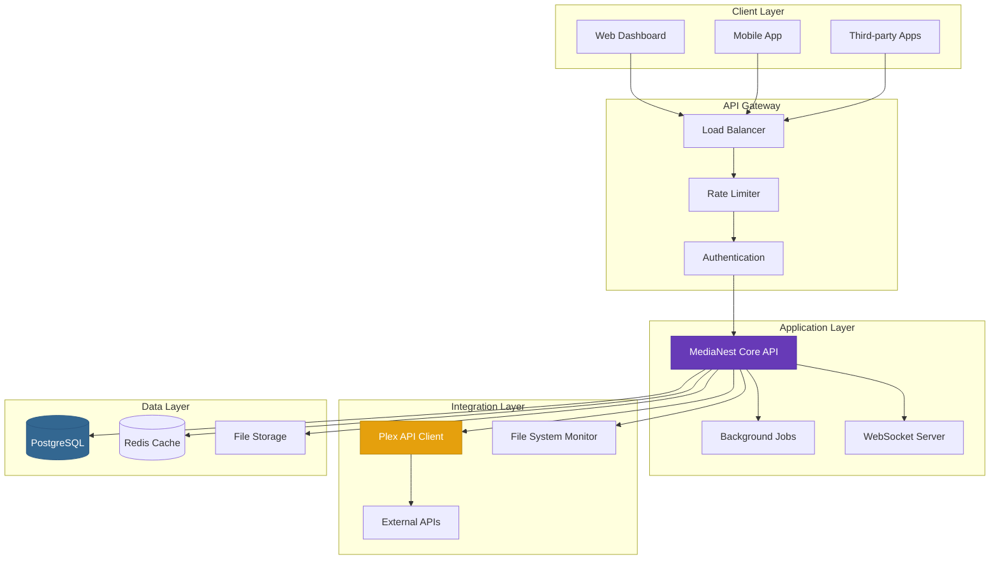

# Welcome to MediaNest Documentation

<div class="hero-section">
  <div class="hero-content">
    <h1 class="hero-title">MediaNest</h1>
    <p class="hero-subtitle">Advanced Media Management Platform with Plex Integration</p>
    <div class="hero-actions">
      <a href="getting-started/" class="md-button md-button--primary">Get Started</a>
      <a href="api/" class="md-button">API Reference</a>
      <a href="https://github.com/kinginyellow/medianest" class="md-button" target="_blank" rel="noopener">
        <span class="twemoji github">
          <svg xmlns="http://www.w3.org/2000/svg" viewBox="0 0 24 24">
            <path d="M12 0c-6.626 0-12 5.373-12 12 0 5.302 3.438 9.8 8.207 11.387.599.111.793-.261.793-.577v-2.234c-3.338.726-4.033-1.416-4.033-1.416-.546-1.387-1.333-1.756-1.333-1.756-1.089-.745.083-.729.083-.729 1.205.084 1.839 1.237 1.839 1.237 1.07 1.834 2.807 1.304 3.492.997.107-.775.418-1.305.762-1.604-2.665-.305-5.467-1.334-5.467-5.931 0-1.311.469-2.381 1.236-3.221-.124-.303-.535-1.524.117-3.176 0 0 1.008-.322 3.301 1.23.957-.266 1.983-.399 3.003-.404 1.02.005 2.047.138 3.006.404 2.291-1.552 3.297-1.23 3.297-1.23.653 1.653.242 2.874.118 3.176.77.84 1.235 1.911 1.235 3.221 0 4.609-2.807 5.624-5.479 5.921.43.372.823 1.102.823 2.222v3.293c0 .319.192.694.801.576 4.765-1.589 8.199-6.086 8.199-11.386 0-6.627-5.373-12-12-12z"/>
          </svg>
        </span>
        GitHub
      </a>
    </div>
  </div>
  <div class="hero-image">
    
  </div>
</div>

## What is MediaNest?

MediaNest is a comprehensive media management platform designed to seamlessly integrate with Plex Media Server and provide advanced media organization, metadata management, and automation capabilities. Built with modern technologies and containerized deployment, MediaNest offers both powerful API capabilities and an intuitive user interface.

<div class="feature-grid">
  <div class="feature-card md3-card" data-tag="media">
    <div class="feature-card__icon">🎬</div>
    <h3 class="feature-card__title">Media Management</h3>
    <p class="feature-card__description">
      Advanced media organization with automated metadata extraction, intelligent file naming, and comprehensive library management capabilities.
    </p>
    <div class="feature-card__tags">
      <span class="md3-chip" data-tag="media">Media</span>
      <span class="md3-chip" data-tag="tutorial">Tutorial</span>
    </div>
    <a href="user-guides/media-management/" class="md3-button md3-button--text feature-card__link">Learn More</a>
  </div>

  <div class="feature-card md3-card" data-tag="plex">
    <div class="feature-card__icon">🔌</div>
    <h3 class="feature-card__title">Plex Integration</h3>
    <p class="feature-card__description">
      Seamless integration with Plex Media Server for synchronized library management, metadata synchronization, and enhanced media discovery.
    </p>
    <div class="feature-card__tags">
      <span class="md3-chip" data-tag="plex">Plex</span>
      <span class="md3-chip" data-tag="setup">Setup</span>
    </div>
    <a href="api/plex/" class="md3-button md3-button--text feature-card__link">Explore Integration</a>
  </div>

  <div class="feature-card md3-card" data-tag="api" data-api-endpoint="/api">
    <div class="feature-card__icon">⚡</div>
    <h3 class="feature-card__title">REST API</h3>
    <p class="feature-card__description">
      Comprehensive REST API with OpenAPI specification, authentication, rate limiting, and extensive endpoint coverage for all platform features.
    </p>
    <div class="feature-card__tags">
      <span class="md3-chip" data-tag="api">API</span>
      <span class="md3-chip" data-tag="reference">Reference</span>
    </div>
    <div class="feature-card__actions">
      <a href="api/" class="md3-button md3-button--text feature-card__link">API Docs</a>
      <button class="md3-button md3-button--outlined api-try-button">🚀 Try Live</button>
    </div>
  </div>

  <div class="feature-card md3-card" data-tag="docker">
    <div class="feature-card__icon">🐳</div>
    <h3 class="feature-card__title">Docker Ready</h3>
    <p class="feature-card__description">
      Fully containerized deployment with Docker Compose, multi-stage builds, health checks, and production-ready orchestration.
    </p>
    <div class="feature-card__tags">
      <span class="md3-chip" data-tag="docker">Docker</span>
      <span class="md3-chip" data-tag="setup">Setup</span>
    </div>
    <a href="installation/docker/" class="md3-button md3-button--text feature-card__link">Docker Setup</a>
  </div>

  <div class="feature-card md3-card" data-tag="security">
    <div class="feature-card__icon">🔒</div>
    <h3 class="feature-card__title">Security First</h3>
    <p class="feature-card__description">
      Enterprise-grade security with JWT authentication, role-based access control, API rate limiting, and comprehensive audit logging.
    </p>
    <div class="feature-card__tags">
      <span class="md3-chip" data-tag="security">Security</span>
      <span class="md3-chip" data-tag="advanced">Advanced</span>
    </div>
    <a href="security/" class="md3-button md3-button--text feature-card__link">Security Guide</a>
  </div>

  <div class="feature-card md3-card" data-tag="performance">
    <div class="feature-card__icon">📊</div>
    <h3 class="feature-card__title">Analytics & Monitoring</h3>
    <p class="feature-card__description">
      Built-in analytics dashboard, performance monitoring, health checks, and comprehensive logging for operational excellence.
    </p>
    <div class="feature-card__tags">
      <span class="md3-chip" data-tag="performance">Performance</span>
      <span class="md3-chip" data-tag="monitoring">Monitoring</span>
    </div>
    <a href="operations/MONITORING/" class="md3-button md3-button--text feature-card__link">Monitoring</a>
  </div>
</div>

## Quick Start

<div class="quick-search-section">
  <div class="md3-search-bar">
    <span class="md3-search-icon">🔍</span>
    <input type="text" class="md3-search-input" placeholder="Search documentation... (Ctrl+K)" id="quick-search">
    <div class="search-suggestions" style="display: none;"></div>
  </div>
  <div class="quick-links">
    <button class="md3-chip md3-chip--filter" data-filter="setup">Quick Setup</button>
    <button class="md3-chip md3-chip--filter" data-filter="api">API Guide</button>
    <button class="md3-chip md3-chip--filter" data-filter="docker">Docker</button>
    <button class="md3-chip md3-chip--filter" data-filter="troubleshooting">Help</button>
  </div>
</div>

Get MediaNest up and running in minutes with our streamlined setup process:

=== "Docker (Recommended)"

    ```bash
    # Clone the repository
    git clone https://github.com/kinginyellow/medianest.git
    cd medianest
    
    # Start with Docker Compose
    docker-compose up -d
    
    # Access the application
    open http://localhost:3000
    ```

=== "Manual Installation"

    ```bash
    # Prerequisites: Node.js 18+, PostgreSQL 14+
    
    # Install dependencies
    npm install
    
    # Configure environment
    cp .env.example .env
    
    # Run database migrations
    npm run db:migrate
    
    # Start the application
    npm run dev
    ```

=== "Production Deployment"

    ```bash
    # Build production image
    docker build -t medianest:latest .
    
    # Deploy with production configuration
    docker-compose -f docker-compose.prod.yml up -d
    
    # Verify deployment
    curl http://localhost:3000/api/health
    ```

## Architecture Overview

MediaNest is built on a modern, scalable architecture designed for reliability and performance:



## Key Features

### 🎯 Core Capabilities

- **Advanced Media Organization**: Intelligent file detection, automated metadata extraction, and customizable organization rules
- **Plex Synchronization**: Real-time sync with Plex libraries, metadata harmonization, and collection management
- **REST API**: Comprehensive API with OpenAPI 3.0 specification, authentication, and rate limiting
- **User Management**: Role-based access control, user profiles, and activity tracking
- **Performance Monitoring**: Built-in metrics, health checks, and performance analytics

### 🛠 Technical Features

- **Modern Tech Stack**: Node.js, Express, PostgreSQL, Redis, Docker
- **Scalable Architecture**: Microservices-ready design with horizontal scaling support
- **Security Focused**: JWT authentication, RBAC, input validation, and audit logging
- **DevOps Ready**: CI/CD pipelines, automated testing, and containerized deployment
- **Extensible**: Plugin system, webhook support, and modular architecture

### 📈 Performance & Reliability

- **High Availability**: Load balancing, failover support, and health monitoring
- **Performance Optimized**: Database indexing, caching layers, and query optimization  
- **Monitoring**: Comprehensive logging, metrics collection, and alerting
- **Backup & Recovery**: Automated backups, point-in-time recovery, and disaster planning

## Documentation Sections

<div class="doc-sections">
  <div class="doc-section">
    <h3>📚 User Guides</h3>
    <p>Step-by-step guides for end users covering all platform features and workflows.</p>
    <ul>
      <li><a href="user-guides/media-management/">Media Management</a></li>
      <li><a href="user-guides/file-organization/">File Organization</a></li>
      <li><a href="user-guides/search-filtering/">Search & Filtering</a></li>
      <li><a href="user-guides/collections/">Collections</a></li>
    </ul>
  </div>
  
  <div class="doc-section">
    <h3>🔧 Installation & Setup</h3>
    <p>Complete installation instructions for various deployment scenarios.</p>
    <ul>
      <li><a href="installation/docker/">Docker Installation</a></li>
      <li><a href="installation/manual/">Manual Installation</a></li>
      <li><a href="installation/configuration/">Configuration</a></li>
      <li><a href="installation/database/">Database Setup</a></li>
    </ul>
  </div>
  
  <div class="doc-section">
    <h3>⚡ API Reference</h3>
    <p>Comprehensive API documentation with examples and interactive explorer.</p>
    <ul>
      <li><a href="api/REST_API_REFERENCE/">REST API Reference</a></li>
      <li><a href="api/WEBSOCKET_API_REFERENCE/">WebSocket API</a></li>
      <li><a href="api/authentication/">Authentication</a></li>
      <li><a href="api/interactive-explorer/">Interactive Explorer</a></li>
    </ul>
  </div>
  
  <div class="doc-section">
    <h3>🏗 Architecture & Development</h3>
    <p>Technical documentation for developers and system administrators.</p>
    <ul>
      <li><a href="architecture/SYSTEM_ARCHITECTURE/">System Architecture</a></li>
      <li><a href="developers/CODEBASE_STRUCTURE_MAP/">Codebase Structure</a></li>
      <li><a href="developers/CONTRIBUTING/">Contributing Guide</a></li>
      <li><a href="developers/TESTING/">Testing Guide</a></li>
    </ul>
  </div>
</div>

## Community & Support

<div class="community-links">
  <div class="community-card">
    <h3>🐛 Report Issues</h3>
    <p>Found a bug or have a feature request?</p>
    <a href="https://github.com/kinginyellow/medianest/issues" target="_blank" rel="noopener" class="md-button">GitHub Issues</a>
  </div>
  
  <div class="community-card">
    <h3>💬 Discussion</h3>
    <p>Join the community discussion and get help.</p>
    <a href="https://github.com/kinginyellow/medianest/discussions" target="_blank" rel="noopener" class="md-button">Discussions</a>
  </div>
  
  <div class="community-card">
    <h3>🤝 Contributing</h3>
    <p>Help improve MediaNest for everyone.</p>
    <a href="developers/CONTRIBUTING/" class="md-button">Contribute</a>
  </div>
</div>

---

<div class="footer-notice">
  <p><strong>MediaNest</strong> is open source software released under the MIT License. 
     Built with ❤️ by the MediaNest community.</p>
  <p>Documentation built with <a href="https://squidfunk.github.io/mkdocs-material/" target="_blank" rel="noopener">Material for MkDocs</a></p>
</div>

<style>
/* Hero Section */
.hero-section {
  display: grid;
  grid-template-columns: 2fr 1fr;
  gap: 2rem;
  align-items: center;
  margin: 3rem 0 4rem 0;
  padding: 2rem 0;
  background: linear-gradient(135deg, #f3e5f5 0%, #ede7f6 100%);
  border-radius: 12px;
  overflow: hidden;
}

.hero-content {
  padding: 0 2rem;
}

.hero-title {
  font-size: 3.5rem;
  font-weight: 700;
  background: linear-gradient(135deg, #673ab7, #9c27b0);
  -webkit-background-clip: text;
  -webkit-text-fill-color: transparent;
  background-clip: text;
  margin: 0 0 1rem 0;
  line-height: 1.1;
}

.hero-subtitle {
  font-size: 1.25rem;
  color: var(--md-default-fg-color--light);
  margin: 0 0 2rem 0;
  line-height: 1.4;
}

.hero-actions {
  display: flex;
  gap: 1rem;
  flex-wrap: wrap;
}

.hero-image {
  padding: 1rem;
  text-align: center;
}

/* Documentation Sections Grid */
.doc-sections {
  display: grid;
  grid-template-columns: repeat(auto-fit, minmax(300px, 1fr));
  gap: 2rem;
  margin: 3rem 0;
}

.doc-section {
  background: var(--md-default-bg-color);
  border: 1px solid var(--md-default-fg-color--lightest);
  border-radius: 8px;
  padding: 1.5rem;
  transition: all 0.3s ease;
}

.doc-section:hover {
  box-shadow: 0 4px 12px rgba(103, 58, 183, 0.1);
  transform: translateY(-2px);
}

.doc-section h3 {
  margin: 0 0 1rem 0;
  color: var(--mn-primary);
  font-size: 1.1rem;
}

.doc-section p {
  margin: 0 0 1rem 0;
  color: var(--md-default-fg-color--light);
  font-size: 0.9rem;
  line-height: 1.5;
}

.doc-section ul {
  margin: 0;
  padding-left: 1rem;
}

.doc-section li {
  margin: 0.25rem 0;
  font-size: 0.9rem;
}

.doc-section a {
  color: var(--mn-primary);
  text-decoration: none;
  transition: color 0.2s ease;
}

.doc-section a:hover {
  color: var(--mn-primary-dark);
  text-decoration: underline;
}

/* Community Links */
.community-links {
  display: grid;
  grid-template-columns: repeat(auto-fit, minmax(250px, 1fr));
  gap: 1.5rem;
  margin: 3rem 0;
}

.community-card {
  text-align: center;
  padding: 2rem 1.5rem;
  background: var(--md-default-bg-color);
  border: 1px solid var(--md-default-fg-color--lightest);
  border-radius: 8px;
  transition: all 0.3s ease;
}

.community-card:hover {
  box-shadow: 0 4px 12px rgba(103, 58, 183, 0.1);
  transform: translateY(-2px);
}

.community-card h3 {
  margin: 0 0 1rem 0;
  color: var(--mn-primary);
  font-size: 1.1rem;
}

.community-card p {
  margin: 0 0 1.5rem 0;
  color: var(--md-default-fg-color--light);
  font-size: 0.9rem;
  line-height: 1.5;
}

/* Footer Notice */
.footer-notice {
  text-align: center;
  padding: 2rem 0;
  border-top: 1px solid var(--md-default-fg-color--lightest);
  margin-top: 4rem;
}

.footer-notice p {
  margin: 0.5rem 0;
  color: var(--md-default-fg-color--light);
  font-size: 0.85rem;
}

.footer-notice a {
  color: var(--mn-primary);
  text-decoration: none;
}

.footer-notice a:hover {
  text-decoration: underline;
}

/* Dark Mode Adjustments */
[data-md-color-scheme="slate"] .hero-section {
  background: linear-gradient(135deg, #2d2d30 0%, #3e3e42 100%);
}

[data-md-color-scheme="slate"] .doc-section {
  background: var(--md-code-bg-color);
  border-color: var(--md-default-fg-color--lightest);
}

[data-md-color-scheme="slate"] .doc-section:hover,
[data-md-color-scheme="slate"] .community-card:hover {
  box-shadow: 0 4px 12px rgba(0, 0, 0, 0.3);
}

[data-md-color-scheme="slate"] .community-card {
  background: var(--md-code-bg-color);
  border-color: var(--md-default-fg-color--lightest);
}

/* Responsive Design */
@media screen and (max-width: 768px) {
  .hero-section {
    grid-template-columns: 1fr;
    margin: 2rem 0 3rem 0;
    padding: 1.5rem;
  }
  
  .hero-title {
    font-size: 2.5rem;
  }
  
  .hero-subtitle {
    font-size: 1.1rem;
  }
  
  .hero-actions {
    justify-content: center;
  }
  
  .doc-sections {
    grid-template-columns: 1fr;
    gap: 1.5rem;
  }
  
  .community-links {
    grid-template-columns: 1fr;
    gap: 1rem;
  }
  
  .community-card {
    padding: 1.5rem;
  }
}

@media screen and (max-width: 480px) {
  .hero-section {
    padding: 1rem;
    margin: 1rem 0 2rem 0;
  }
  
  .hero-content {
    padding: 0;
  }
  
  .hero-title {
    font-size: 2rem;
  }
  
  .hero-actions {
    flex-direction: column;
    align-items: stretch;
  }
  
  .doc-section,
  .community-card {
    padding: 1rem;
  }
}
</style>