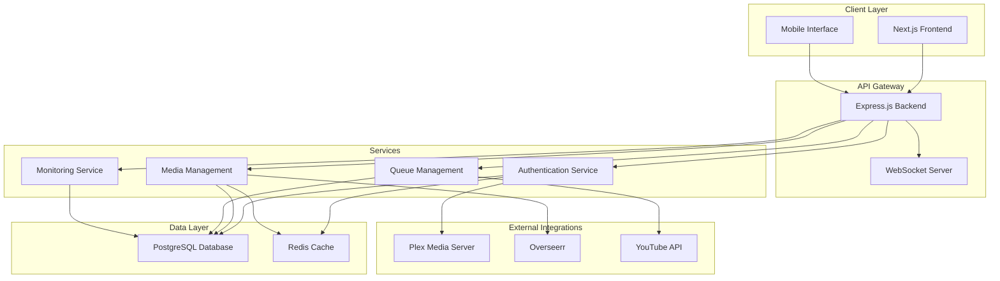

# MediaNest Documentation

  <h1>🎬 MediaNest</h1>
  
<strong>A unified web portal for managing Plex media server and related services</strong>

  
  
  
  
  

## Welcome to MediaNest

MediaNest consolidates multiple media management tools into a single, secure, and user-friendly interface designed for friends and family who access your Plex media server. Built with modern full-stack technologies and enterprise-grade architecture, MediaNest provides seamless authentication, advanced media request management, and comprehensive system monitoring.

## 🚀 Quick Navigation

-   :material-rocket-launch-outline: **[Quick Start](getting-started.md)**
    
    ---
    
    Get MediaNest up and running in minutes with our comprehensive installation guide.

-   :material-architecture: **[Architecture](architecture/overview.md)**
    
    ---
    
    Understand the system design, components, and how everything works together.

-   :material-code-braces: **[Development](development/environment.md)**
    
    ---
    
    Set up your development environment and start contributing to MediaNest.

-   :material-api: **[API Reference](api/auth.md)**
    
    ---
    
    Complete API documentation with examples and integration guides.

## ✨ Key Features

### 🔐 **Unified Authentication**
Single sign-on with Plex OAuth integration, providing seamless access control across all integrated services.

### 📺 **Media Request Management**
Streamlined interface for content requests via Overseerr integration, with approval workflows and status tracking.

### 📊 **Real-time Monitoring**
Live system health and performance dashboards with WebSocket-powered updates and comprehensive metrics.

### 🎯 **Smart Queue Management**
Intelligent YouTube content downloading and processing with progress tracking and queue optimization.

### ⚡ **Modern Architecture**
Built with TypeScript, React, Node.js, and PostgreSQL for performance, scalability, and maintainability.

### 🛡️ **Enterprise Security**
JWT-based authentication, rate limiting, CORS protection, and comprehensive security middleware.

## 🏗️ Architecture Overview

MediaNest follows a modern monorepo structure with clear separation of concerns:

## 📋 Technology Stack

### Frontend
- **Next.js 15** - React framework with SSR and SSG capabilities
- **React 19** - Modern UI library with latest features
- **TypeScript** - Type-safe JavaScript development
- **Tailwind CSS** - Utility-first CSS framework
- **Radix UI** - Accessible component primitives

### Backend
- **Node.js 20+** - JavaScript runtime environment
- **Express.js** - Fast, unopinionated web framework
- **Prisma ORM** - Type-safe database access
- **Socket.IO** - Real-time bidirectional communication
- **JWT** - Secure authentication tokens

### Database & Caching
- **PostgreSQL 14+** - Robust relational database
- **Redis 6+** - In-memory data structure store

### DevOps & Tooling
- **Docker** - Containerization platform
- **Vitest** - Fast unit testing framework
- **ESLint** - Code linting and quality
- **Prettier** - Code formatting
- **TypeScript** - Static type checking

## 🎯 Project Health

Based on comprehensive validation by our development swarm:

!!! success "Environment Health: 78%"
    Our validation framework has established quality gates and continuous monitoring for optimal performance.

### Key Metrics
- **257 files** optimized and cleaned
- **Shared package** created for cross-workspace utilities
- **Docker infrastructure** production-ready
- **Testing framework** with 80% coverage thresholds
- **Quality gates** established for code review

## 📚 Documentation Sections

### For Users
- **[Getting Started](getting-started.md)** - Installation and basic setup
- **[Configuration Guide](getting-started/configuration.md)** - Environment and service configuration
- **[FAQ](faq.md)** - Frequently asked questions

### For Developers
- **[Development Environment](development/environment.md)** - Local development setup
- **[Architecture Guide](architecture/overview.md)** - System design and components
- **[API Documentation](api/auth.md)** - Complete API reference
- **[Testing Guide](testing/strategy.md)** - Testing strategies and frameworks

### For Contributors
- **[Contributing Guide](contributing/guide.md)** - How to contribute to MediaNest
- **[Code Standards](development/standards.md)** - Coding guidelines and best practices
- **[Pull Request Process](contributing/pull-requests.md)** - How to submit changes

## 🤝 Community & Support

- **GitHub Issues** - [Report bugs or request features](https://github.com/medianest/medianest/issues)
- **GitHub Discussions** - [Community discussion and Q&A](https://github.com/medianest/medianest/discussions)
- **Documentation** - [Comprehensive guides and references](https://medianest.io/docs)

## 📄 License

MediaNest is open source software licensed under the [MIT License](../LICENSE).

---

  
<strong>MediaNest</strong> - Simplifying media management for modern households 🏠✨

