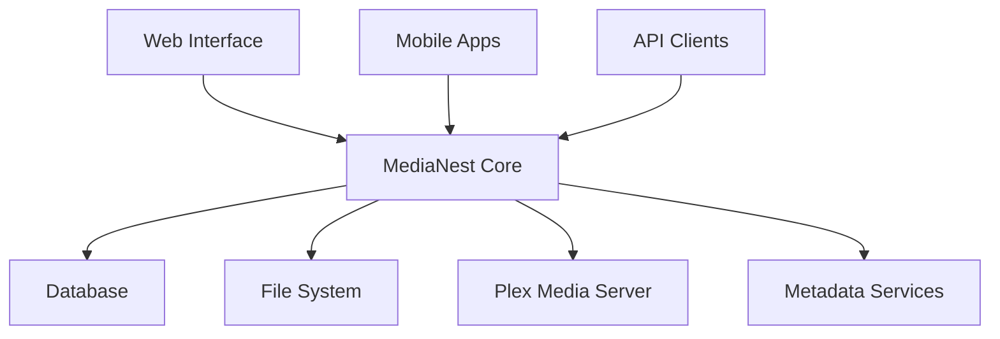

# MediaNest Documentation

Welcome to the comprehensive documentation for **MediaNest** - the advanced media management platform with Plex integration, powerful API, and developer-friendly architecture.

## Quick Navigation

-   :material-rocket-launch:{ .lg .middle } **Getting Started**

    ---

    New to MediaNest? Start here for installation, setup, and your first configuration.

    [:octicons-arrow-right-24: Quick Start](getting-started/quickstart.md)

-   :material-account-multiple:{ .lg .middle } **User Guides**

    ---

    Learn how to manage your media, organize collections, and use advanced features.

    [:octicons-arrow-right-24: User Guides](user-guides/index.md)

-   :material-api:{ .lg .middle } **API Reference**

    ---

    Complete REST API documentation with examples, authentication, and SDKs.

    [:octicons-arrow-right-24: API Docs](api/index.md)

-   :material-code-braces:{ .lg .middle } **Developer Docs**

    ---

    Architecture, contribution guidelines, and development environment setup.

    [:octicons-arrow-right-24: Developer Guide](developers/index.md)

## What is MediaNest?

MediaNest is a powerful, self-hosted media management platform that provides:

- **🎬 Advanced Media Organization**: Intelligent file organization with metadata extraction
- **🔍 Powerful Search & Filtering**: Find your content instantly with advanced queries
- **📚 Collection Management**: Create and manage custom media collections
- **🔗 Plex Integration**: Seamless integration with your existing Plex Media Server
- **🚀 RESTful API**: Full-featured API for automation and integrations
- **🏠 Self-Hosted**: Complete control over your media and privacy
- **🐋 Docker Ready**: Easy deployment with Docker and Docker Compose

## Architecture Overview

## Key Features

### Media Management
- Automated file organization and metadata extraction
- Support for movies, TV shows, music, and audiobooks
- Duplicate detection and management
- Batch operations and bulk editing

### Search & Discovery
- Full-text search across all metadata
- Advanced filtering by genre, year, rating, and more
- Tag-based organization system
- Recently added and trending content

### Integration & Automation
- Plex Media Server synchronization
- Webhook support for automation
- REST API for custom integrations
- Plugin system for extensibility

## System Requirements

### Minimum Requirements
- **CPU**: 2 cores, 2.0 GHz
- **RAM**: 4 GB
- **Storage**: 20 GB free space
- **OS**: Linux, macOS, or Windows (with Docker)

### Recommended for Production
- **CPU**: 4 cores, 3.0 GHz+
- **RAM**: 8 GB+
- **Storage**: SSD with 50 GB+ free space
- **Network**: Gigabit Ethernet

## Community & Support

- **📖 Documentation**: You're reading it!
- **💬 Discord**: [Join our community](https://discord.gg/medianest)
- **🐛 Issues**: [GitHub Issues](https://github.com/medianest/medianest/issues)
- **💡 Discussions**: [GitHub Discussions](https://github.com/medianest/medianest/discussions)

## License

MediaNest is released under the [MIT License](https://github.com/medianest/medianest/blob/main/LICENSE).

## Comprehensive Documentation Guide

### 🚀 For New Users
- [**Getting Started Guide**](user-guides/getting-started/) - Complete onboarding and setup
- [**User Guide Overview**](user-guides/) - Basic features and workflows
- [**Troubleshooting**](troubleshooting/common-issues/) - Common issues and solutions

### ⚡ For Power Users  
- [**Advanced Features**](user-guides/advanced-features/) - Power user workflows and automation
- [**API Integration**](api/) - REST and WebSocket API documentation
- [**Performance Optimization**](api/performance/) - System performance and monitoring

### 👨‍💼 For Administrators
- [**Administrator Guide**](user-guides/admin-guide/) - Complete admin documentation
- [**System Configuration**](configuration/) - Setup and configuration
- [**Security Management**](security/) - Security best practices

### 🔧 For Developers
- [**API Reference**](api/) - Complete REST and WebSocket documentation
- [**Error Handling**](api/ERROR_CODES_REFERENCE/) - Comprehensive error codes
- [**OpenAPI Specification**](api/OPENAPI_SPECIFICATION_V3.yaml) - API specification
- [**Architecture**](architecture/) - System design and architecture

### 📊 Technical Resources
- [**Performance Monitoring**](api/performance/) - System performance and optimization
- [**Installation Guides**](installation/) - Setup and deployment
- [**Testing Strategies**](testing/) - Testing and quality assurance
- [**Operations Manual**](operations/) - Deployment and maintenance

---

*Ready to get started?* Head to our [Getting Started Guide](user-guides/getting-started/) for a complete introduction to MediaNest.