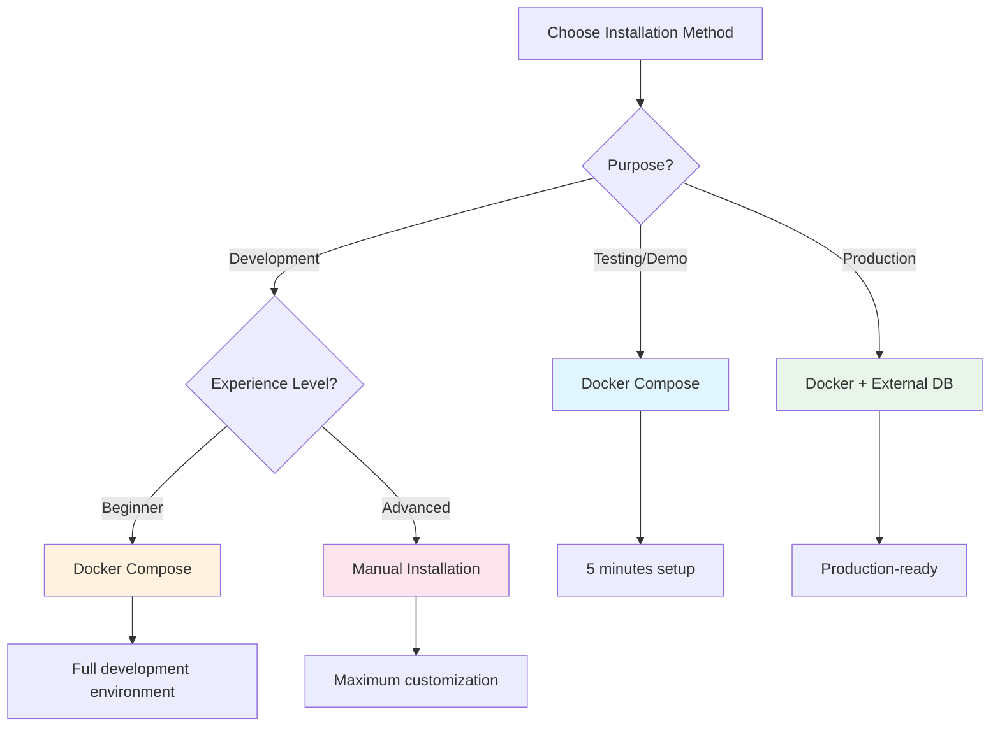

# Installation Guide

This section provides comprehensive installation instructions for MediaNest across different environments and deployment scenarios.

## Installation Options

<div class="grid cards" markdown>

- :fontawesome-brands-docker: **Docker Installation**

  ***

  Recommended for most users. Quick setup with all dependencies included.

  **Best for:** Production deployments, testing, quick starts

  [Docker Setup Guide](docker.md){ .md-button .md-button--primary }

- :material-console: **Manual Installation**

  ***

  Install MediaNest directly on your system for development or custom deployments.

  **Best for:** Development, customization, specific OS requirements

  [Manual Setup Guide](manual.md){ .md-button }

</div>

## System Requirements

### Minimum Requirements

| Component   | Requirement                                        |
| ----------- | -------------------------------------------------- |
| **OS**      | Linux (Ubuntu 20.04+), macOS (10.15+), Windows 10+ |
| **CPU**     | 2 cores (x86_64 or ARM64)                          |
| **RAM**     | 4GB                                                |
| **Storage** | 10GB free space                                    |
| **Network** | Internet access for initial setup                  |

### Recommended Requirements

| Component   | Recommendation            |
| ----------- | ------------------------- |
| **CPU**     | 4+ cores                  |
| **RAM**     | 8GB+                      |
| **Storage** | 100GB+ SSD storage        |
| **Network** | 1Gbps for media streaming |

### Large Scale Deployments

For enterprise or high-volume deployments:

| Component    | Enterprise                  |
| ------------ | --------------------------- |
| **CPU**      | 8+ cores                    |
| **RAM**      | 32GB+                       |
| **Storage**  | 1TB+ NVMe SSD               |
| **Database** | Dedicated PostgreSQL server |
| **Cache**    | Redis cluster               |

## Supported Platforms

### Operating Systems

=== "Linux" - Ubuntu 20.04 LTS or later - CentOS 8 or later - Debian 11 or later - Alpine Linux 3.15+ - Amazon Linux 2

=== "macOS" - macOS 10.15 (Catalina) or later - Apple Silicon (M1/M2) supported - Intel-based Macs supported

=== "Windows" - Windows 10 (version 1909) or later - Windows Server 2019 or later - WSL2 recommended for best experience

### Container Platforms

- Docker 20.10+
- Docker Compose 1.29+
- Kubernetes 1.20+
- Podman 3.0+

## Installation Paths

### Quick Installation Decision Tree



## Dependencies

### Required Dependencies

| Dependency      | Version                  | Purpose             |
| --------------- | ------------------------ | ------------------- |
| **Node.js**     | 18+                      | Runtime environment |
| **Database**    | PostgreSQL 13+ or SQLite | Data storage        |
| **FFmpeg**      | 4.4+                     | Media processing    |
| **ImageMagick** | 7.0+                     | Image processing    |

### Optional Dependencies

| Dependency        | Version | Purpose              |
| ----------------- | ------- | -------------------- |
| **Redis**         | 6.0+    | Caching and sessions |
| **Elasticsearch** | 7.10+   | Advanced search      |
| **NGINX**         | 1.20+   | Reverse proxy        |

## Pre-Installation Checklist

Before starting the installation:

- [ ] Verify system meets minimum requirements
- [ ] Ensure all required ports are available (8080, 5432, 6379)
- [ ] Have administrator/sudo access
- [ ] Plan storage locations for media files
- [ ] Prepare database credentials (if using external DB)
- [ ] Configure firewall rules if needed

## Installation Guides

### 1. Docker Installation (Recommended)

Perfect for most users who want a quick, reliable setup:

```bash
git clone https://github.com/medianest/medianest.git
cd medianest
docker-compose up -d
```

[Complete Docker Guide →](docker.md)

### 2. Manual Installation

For developers and advanced users who need full control:

```bash
npm install -g @medianest/cli
medianest init my-project
cd my-project && medianest start
```

[Complete Manual Guide →](manual.md)

### 3. Configuration

Essential configuration steps for any installation:

- Environment variables setup
- Database configuration
- Storage backend selection
- Security settings

[Configuration Guide →](configuration.md)

## Post-Installation

After installation, you'll need to:

1. **[Configure Environment Variables](environment.md)** - Set up essential configuration
2. **[Set Up Database](database.md)** - Initialize and configure your database
3. **Complete Initial Setup** - Run the setup wizard
4. **Create Admin Account** - Set up administrative access
5. **Configure Storage** - Set media storage locations

## Migration from Other Platforms

If you're migrating from another media management system:

- **Plex**: Use our Plex migration tool
- **Jellyfin**: Direct database import available
- **Custom Solutions**: API-based migration scripts

## Upgrade Guide

To upgrade an existing MediaNest installation:

```bash
# Docker
docker-compose pull && docker-compose up -d

# Manual
medianest upgrade
```

## Getting Help

If you encounter issues during installation:

1. Check our [Troubleshooting Guide](../troubleshooting/)
2. Review [Common Issues](../troubleshooting/common-issues.md)
3. Search [GitHub Issues](https://github.com/medianest/medianest/issues)
4. Join our [Community Discussions](https://github.com/medianest/medianest/discussions)

---

Ready to install? Choose your preferred method above to get started!
