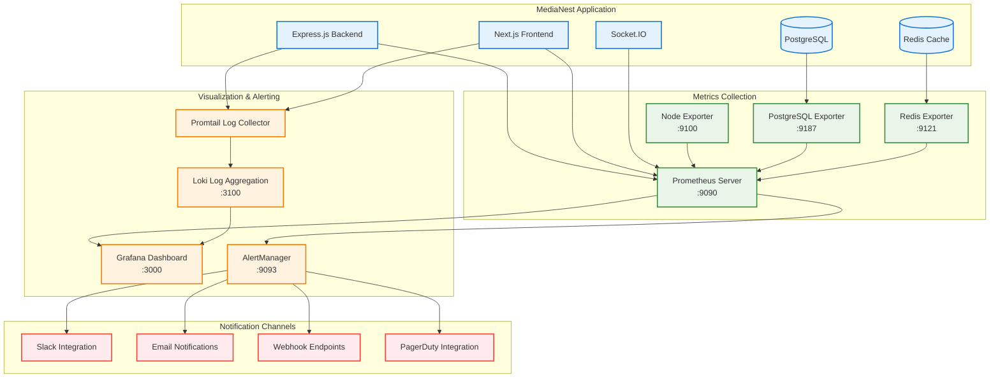

# MediaNest Monitoring Stack

## 📊 Overview

MediaNest implements a comprehensive monitoring and observability stack using Prometheus, Grafana, AlertManager, and Loki for complete system visibility and operational excellence.

## 🏗️ Architecture



## 🚀 Quick Start

### Local Development Setup

```bash
# Start the complete monitoring stack
cd monitoring
docker-compose up -d

# Verify stack health
./scripts/validate-stack.sh

# Access dashboards
open http://localhost:3000  # Grafana (admin/admin)
open http://localhost:9090  # Prometheus
open http://localhost:9093  # AlertManager
```

### Production Deployment

```bash
# Deploy with Docker Swarm
docker stack deploy -c docker-swarm-stack.yml medianest-monitoring

# Or with Kubernetes
kubectl apply -f docs/kubernetes-backup-20250911/
```

## 📈 Key Metrics Tracked

### Application Metrics

- **HTTP Requests**: Duration, count, size, status codes
- **WebSocket Connections**: Active connections, message counts, errors
- **Authentication**: Login attempts, rate limit hits, security events
- **API Performance**: Response times (P50, P95, P99), throughput
- **Business Logic**: Media requests, user actions, queue processing

### Infrastructure Metrics

- **System Resources**: CPU, memory, disk usage, network I/O
- **Database Performance**: Query duration, connection pool, slow queries
- **Cache Performance**: Redis operations, hit ratio, memory usage
- **Container Health**: Docker container stats, Kubernetes metrics

### External Service Metrics

- **Plex API**: Response times, error rates, availability
- **TMDB API**: Request counts, rate limiting, failures
- **YouTube API**: Download performance, queue metrics
- **Overseerr Integration**: Service health, request processing

## 📊 Grafana Dashboards

### Available Dashboards

1. **Overview Dashboard** (`/monitoring/grafana/dashboards/overview.json`)
   - System health summary
   - Key performance indicators
   - Alert status overview

2. **API Performance** (`/monitoring/grafana/dashboards/api-performance.json`)
   - Request/response metrics
   - Endpoint performance analysis
   - Error rate tracking

3. **Infrastructure** (`/monitoring/grafana/dashboards/infrastructure.json`)
   - Server resource utilization
   - Database performance
   - Cache statistics

4. **Business Metrics** (`/monitoring/grafana/dashboards/business-metrics.json`)
   - User activity patterns
   - Media request trends
   - Download queue analysis

5. **Logs Dashboard** (`/monitoring/grafana/dashboards/logs.json`)
   - Centralized log analysis
   - Error pattern detection
   - Performance correlation

### Dashboard Access

- **URL**: `http://localhost:3000` (development) or `https://grafana.yourdomain.com` (production)
- **Default Credentials**: admin/admin (change on first login)
- **Data Sources**: Prometheus, Loki automatically configured

## 🚨 Alerting Configuration

### Alert Categories

#### Infrastructure Alerts (`/monitoring/prometheus/alerts/infrastructure-alerts.yml`)

- **High CPU Usage**: >80% for 5 minutes
- **High Memory Usage**: >85% for 3 minutes
- **Disk Space Critical**: >90% usage
- **Service Down**: Health check failures

#### Application Alerts (`/monitoring/prometheus/alerts/application-alerts.yml`)

- **High Response Time**: P95 >2s for 2 minutes
- **High Error Rate**: >5% for 1 minute
- **Database Slow Queries**: >1s query time
- **Queue Backlog**: >100 pending jobs

#### Business Alerts (`/monitoring/prometheus/alerts/business-alerts.yml`)

- **Failed Media Requests**: >10% failure rate
- **User Authentication Issues**: >5% failed logins
- **External Service Failures**: API downtime
- **Download Queue Stalled**: No progress for 10 minutes

### Notification Channels

- **Slack**: `#alerts` channel for warnings, `#critical-alerts` for critical
- **Email**: Dev team for warnings, on-call for critical
- **PagerDuty**: Critical alerts only with escalation
- **Webhooks**: Custom integrations for incident management

## 📝 Log Management with Loki

### Log Collection Setup

```yaml
# promtail configuration
clients:
  - url: http://loki:3100/loki/api/v1/push

scrape_configs:
  - job_name: medianest-backend
    static_configs:
      - targets:
          - localhost
        labels:
          job: medianest-backend
          __path__: /var/log/medianest/*.log
```

### Log Labels and Structure

- **Application Logs**: Structured JSON with correlation IDs
- **Access Logs**: HTTP request/response details
- **Error Logs**: Stack traces with context
- **Security Logs**: Authentication and authorization events

### Log Analysis Queries

```logql
# Error rate over time
rate({job="medianest-backend"} |= "ERROR" [5m])

# Slow API requests
{job="medianest-backend"} | json | duration > 2s

# Authentication failures
{job="medianest-backend"} |= "authentication" |= "failed"
```

## 🔧 Maintenance and Operations

### Daily Operations

- **Dashboard Review**: Check overview dashboard for anomalies
- **Alert Triage**: Review and acknowledge alerts
- **Performance Analysis**: Identify trends and bottlenecks
- **Log Review**: Check for errors and security events

### Weekly Operations

- **Capacity Planning**: Review resource utilization trends
- **Alert Tuning**: Adjust thresholds based on false positives
- **Dashboard Updates**: Add new metrics and visualizations
- **Backup Verification**: Ensure monitoring data retention

### Monthly Operations

- **Performance Baseline**: Update performance benchmarks
- **Alert Runbook**: Review and update troubleshooting guides
- **Metrics Cleanup**: Remove unused metrics and dashboards
- **Security Review**: Audit monitoring access and configurations

## 🛠️ Troubleshooting

### Common Issues

#### Prometheus Not Scraping

```bash
# Check Prometheus targets
curl http://localhost:9090/api/v1/targets

# Verify network connectivity
docker exec prometheus ping medianest-backend

# Check configuration
docker logs prometheus | grep -i error
```

#### Grafana Dashboard Not Loading

```bash
# Check data source connectivity
curl http://localhost:3000/api/datasources

# Verify Prometheus queries
curl "http://localhost:9090/api/v1/query?query=up"

# Check Grafana logs
docker logs grafana | tail -50
```

#### AlertManager Not Sending Notifications

```bash
# Check AlertManager status
curl http://localhost:9093/api/v1/status

# Verify webhook configuration
curl -X POST http://localhost:9093/api/v1/alerts

# Test notification channels
./scripts/validate-alerts.sh
```

### Performance Optimization

#### High Memory Usage

1. **Check Prometheus retention**: Adjust `--storage.tsdb.retention.time`
2. **Optimize metric cardinality**: Reduce label dimensions
3. **Enable compression**: Use `--storage.tsdb.wal-compression`

#### Slow Dashboard Loading

1. **Optimize queries**: Use recording rules for complex calculations
2. **Adjust time ranges**: Limit query time windows
3. **Cache improvements**: Configure Grafana caching

## 📚 Related Documentation

- [Performance Monitoring Diagrams](../diagrams/performance-monitoring.md)
- [Architecture Documentation](../architecture/system-overview.md)
- [API Monitoring Guide](../api/overview.md#monitoring)
- [Deployment Architecture](../visuals/deployment-architecture.md)

## 🔐 Security Considerations

### Access Control

- **Grafana Authentication**: LDAP/OAuth integration
- **Prometheus Security**: Network-level access restrictions
- **Alert Webhooks**: Secure endpoint authentication
- **Log Privacy**: PII scrubbing and data retention policies

### Data Retention

- **Metrics**: 15 days local, 90 days remote storage
- **Logs**: 7 days local, 30 days compressed storage
- **Backups**: Daily snapshots with encryption
- **GDPR Compliance**: Automated data anonymization

## 📞 Support and Escalation

### L1 Support (Application Issues)

- **Response Time**: 15 minutes during business hours
- **Escalation**: High error rates, service downtime
- **Tools**: Grafana dashboards, basic log analysis

### L2 Support (Infrastructure Issues)

- **Response Time**: 30 minutes during business hours
- **Escalation**: System resource exhaustion, database issues
- **Tools**: Advanced Prometheus queries, infrastructure analysis

### L3 Support (Critical Incidents)

- **Response Time**: 5 minutes 24/7
- **Escalation**: Data loss, security breaches, complete outages
- **Tools**: Full monitoring stack, direct system access

---

_For operational runbooks and detailed troubleshooting procedures, see the [Operations Runbook](./runbooks/) directory._
