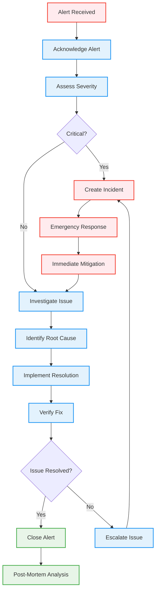

# MediaNest Alert Runbooks

## 🚨 Alert Response Procedures

This document provides step-by-step procedures for responding to MediaNest monitoring alerts.

## 📋 General Alert Response Workflow



## 🏃‍♂️ Infrastructure Alerts

### HIGH_CPU_USAGE

**Alert**: CPU usage >80% for 5 minutes

#### Investigation Steps

1. **Check current CPU usage**:

   ```bash
   # Via Grafana: Infrastructure Dashboard
   # Via CLI:
   top -o %CPU
   ps aux --sort=-%cpu | head -10
   ```

2. **Identify top processes**:

   ```bash
   # Find process consuming CPU
   htop
   # Or via monitoring
   # Grafana: Node Exporter Full Dashboard
   ```

3. **Check system load**:
   ```bash
   uptime
   cat /proc/loadavg
   ```

#### Common Causes & Resolutions

| Cause                | Symptoms                | Resolution                             |
| -------------------- | ----------------------- | -------------------------------------- |
| **High traffic**     | Increased HTTP requests | Scale horizontally, enable caching     |
| **Database queries** | Slow DB responses       | Optimize queries, add indexes          |
| **Memory pressure**  | High swap usage         | Increase memory, optimize memory usage |
| **Background jobs**  | Queue processing spikes | Tune job concurrency, optimize jobs    |

#### Immediate Actions

- **Scale up**: Add more instances if auto-scaling available
- **Reduce load**: Enable maintenance mode if necessary
- **Kill processes**: Terminate non-critical processes if needed
- **Restart services**: Last resort for stuck processes

### HIGH_MEMORY_USAGE

**Alert**: Memory usage >85% for 3 minutes

#### Investigation Steps

1. **Check memory consumption**:

   ```bash
   free -h
   cat /proc/meminfo
   # Via Grafana: Node Exporter Dashboard
   ```

2. **Identify memory-consuming processes**:

   ```bash
   ps aux --sort=-%mem | head -10
   # Check for memory leaks
   valgrind --tool=memcheck --leak-check=yes node app.js
   ```

3. **Check swap usage**:
   ```bash
   swapon -s
   cat /proc/swaps
   ```

#### Resolutions

- **Restart Node.js**: Clear memory leaks `pm2 restart all`
- **Optimize queries**: Reduce database connection pools
- **Clear caches**: `redis-cli FLUSHDB` if safe
- **Scale memory**: Add more RAM or instances

### DISK_SPACE_CRITICAL

**Alert**: Disk usage >90%

#### Investigation Steps

1. **Check disk usage**:

   ```bash
   df -h
   du -sh /* | sort -hr
   ```

2. **Find large files**:
   ```bash
   find / -type f -size +100M -exec ls -lh {} \;
   du -ah /var/log | sort -hr | head -10
   ```

#### Immediate Actions

- **Clean logs**: `logrotate -f /etc/logrotate.conf`
- **Remove temp files**: `rm -rf /tmp/*`
- **Clear Docker**: `docker system prune -f`
- **Archive data**: Move old data to cold storage

## 🚀 Application Alerts

### HIGH_RESPONSE_TIME

**Alert**: P95 response time >2s for 2 minutes

#### Investigation Steps

1. **Check endpoint performance**:

   ```bash
   # Grafana: API Performance Dashboard
   # Look for slow endpoints
   ```

2. **Database performance**:

   ```bash
   # Check slow queries
   SELECT query, mean_time, calls
   FROM pg_stat_statements
   ORDER BY mean_time DESC LIMIT 10;
   ```

3. **External API calls**:
   ```bash
   # Check external service response times
   curl -w "%{time_total}\n" -o /dev/null -s https://api.plex.tv/
   ```

#### Resolutions

- **Database**: Optimize slow queries, add indexes
- **Caching**: Implement/fix Redis caching
- **External APIs**: Implement circuit breakers
- **Code**: Profile and optimize hot paths

### HIGH_ERROR_RATE

**Alert**: Error rate >5% for 1 minute

#### Investigation Steps

1. **Check error logs**:

   ```bash
   # Via Loki/Grafana
   {job="medianest-backend"} |= "ERROR"
   # Via CLI
   tail -f /var/log/medianest/error.log
   ```

2. **Identify error patterns**:

   ```bash
   grep -c "ERROR" /var/log/medianest/*.log
   grep "500\|502\|503\|504" /var/log/nginx/access.log
   ```

3. **Check service dependencies**:
   ```bash
   # Database connection
   pg_isready -h localhost -p 5432
   # Redis connection
   redis-cli ping
   # External services
   curl -I https://api.themoviedb.org/3/configuration
   ```

#### Common Error Types & Fixes

| Error Type                | Investigation              | Resolution                               |
| ------------------------- | -------------------------- | ---------------------------------------- |
| **Database errors**       | Connection pool exhaustion | Increase pool size, optimize queries     |
| **External API failures** | Service downtime           | Implement fallbacks, circuit breakers    |
| **Authentication errors** | JWT token issues           | Check token expiration, key rotation     |
| **Validation errors**     | Input data issues          | Improve input validation, error messages |

### DATABASE_SLOW_QUERIES

**Alert**: Queries taking >1s

#### Investigation Steps

1. **Identify slow queries**:

   ```sql
   SELECT query, mean_time, calls, total_time
   FROM pg_stat_statements
   WHERE mean_time > 1000
   ORDER BY mean_time DESC;
   ```

2. **Check query plans**:

   ```sql
   EXPLAIN ANALYZE <slow_query>;
   ```

3. **Index analysis**:
   ```sql
   SELECT schemaname, tablename, attname, n_distinct, correlation
   FROM pg_stats
   WHERE tablename = 'your_table';
   ```

#### Optimization Actions

- **Add indexes**: Create appropriate indexes for slow queries
- **Query optimization**: Rewrite inefficient queries
- **Connection pooling**: Optimize pool configuration
- **Vacuum analyze**: Run database maintenance

## 📊 Business Logic Alerts

### FAILED_MEDIA_REQUESTS

**Alert**: >10% media request failure rate

#### Investigation Steps

1. **Check request status**:

   ```bash
   # Grafana: Business Metrics Dashboard
   # Look at media request success/failure rates
   ```

2. **External service health**:

   ```bash
   # Check Plex connectivity
   curl -H "X-Plex-Token: $PLEX_TOKEN" \
        "http://plex-server:32400/status/sessions"

   # Check TMDB API
   curl "https://api.themoviedb.org/3/configuration?api_key=$TMDB_KEY"
   ```

3. **Queue status**:
   ```bash
   # Check processing queues
   redis-cli LLEN media_request_queue
   ```

#### Resolutions

- **Service recovery**: Restart failed external integrations
- **Queue clearing**: Process stuck queue items
- **Fallback activation**: Switch to backup data sources
- **User notification**: Inform users of temporary issues

### USER_AUTHENTICATION_ISSUES

**Alert**: >5% failed login attempts

#### Investigation Steps

1. **Check auth patterns**:

   ```bash
   # Look for brute force attacks
   grep "authentication failed" /var/log/medianest/auth.log | tail -20
   ```

2. **Plex OAuth status**:

   ```bash
   # Verify Plex PIN service
   curl "https://plex.tv/pins.xml"
   ```

3. **Rate limiting**:
   ```bash
   # Check if rate limits are being hit
   redis-cli GET "rate_limit:auth:$IP_ADDRESS"
   ```

#### Security Actions

- **Block IPs**: Add malicious IPs to blocklist
- **Increase rate limits**: Temporarily if legitimate traffic
- **OAuth refresh**: Regenerate OAuth tokens if compromised
- **User communication**: Notify users of authentication issues

## 🔄 Recovery Procedures

### Service Restart Sequence

1. **Graceful restart**:

   ```bash
   # Docker Compose
   docker-compose restart medianest-backend

   # PM2
   pm2 restart all

   # Kubernetes
   kubectl rollout restart deployment/medianest-backend
   ```

2. **Database restart**:

   ```bash
   # Only if absolutely necessary
   sudo systemctl restart postgresql
   # Or Docker
   docker-compose restart database
   ```

3. **Full stack restart**:
   ```bash
   # Emergency only
   docker-compose down && docker-compose up -d
   ```

### Rollback Procedures

1. **Application rollback**:

   ```bash
   # Docker
   docker-compose down
   docker pull medianest:previous-version
   docker-compose up -d

   # Kubernetes
   kubectl rollout undo deployment/medianest-backend
   ```

2. **Database rollback**:
   ```bash
   # Restore from backup
   pg_restore -d medianest /backups/medianest_backup.sql
   ```

### Emergency Contacts

| Severity     | Contact           | Response Time |
| ------------ | ----------------- | ------------- |
| **Critical** | On-call engineer  | 5 minutes     |
| **High**     | Team lead         | 15 minutes    |
| **Medium**   | Development team  | 1 hour        |
| **Low**      | Next business day | 24 hours      |

## 📝 Post-Incident Procedures

### Immediate Actions (0-2 hours)

1. **Verify resolution**: Confirm all systems operational
2. **Update status page**: Communicate resolution to users
3. **Document timeline**: Record incident timeline and actions
4. **Collect artifacts**: Save logs, metrics, and configuration

### Short-term Actions (2-24 hours)

1. **Root cause analysis**: Identify underlying causes
2. **Impact assessment**: Quantify user and business impact
3. **Initial report**: Share preliminary findings with stakeholders
4. **Monitoring review**: Check if monitoring detected issue appropriately

### Long-term Actions (1-7 days)

1. **Post-mortem meeting**: Conduct blameless post-mortem
2. **Action items**: Create specific follow-up tasks
3. **Documentation update**: Update runbooks and procedures
4. **Preventive measures**: Implement safeguards to prevent recurrence

### Post-Mortem Template

```markdown
# Incident Post-Mortem: [Date] - [Brief Description]

## Summary

Brief description of what happened, impact, and resolution.

## Timeline

- **Detection**: When and how was the incident detected?
- **Response**: Initial response actions taken
- **Resolution**: Steps taken to resolve the issue
- **Recovery**: Return to normal operation

## Root Cause

What was the underlying cause of the incident?

## Impact

- Users affected: X users/percentage
- Duration: X minutes/hours
- Services impacted: List affected services
- Business impact: Revenue, reputation, etc.

## What Went Well

- Quick detection due to monitoring
- Effective communication
- Fast resolution

## What Could Be Improved

- Earlier detection possible
- Faster response time
- Better communication

## Action Items

- [ ] Improve monitoring for X
- [ ] Update runbook for Y
- [ ] Implement safeguard Z
- [ ] Training on procedure A

## Lessons Learned

Key takeaways for future incidents.
```

---

_This runbook should be reviewed and updated monthly based on incident learnings and system changes._
