# Dependencies & Timeline Analysis

**Version:** 1.0  
**Last Updated:** September 2025  
**Purpose:** Comprehensive dependency mapping and critical path analysis for MediaNest development

## Executive Summary

This document provides detailed analysis of feature dependencies, critical development paths, and timeline constraints for MediaNest development. Understanding these relationships is crucial for successful project delivery and resource allocation.

## Critical Path Overview

The MediaNest development follows a carefully orchestrated sequence where certain features must be completed before others can begin. This analysis identifies bottlenecks, parallel development opportunities, and risk mitigation strategies.


## Phase-by-Phase Dependency Analysis

### Q1 2025: Foundation Dependencies ✅ Complete

#### Authentication System Dependencies

**Status:** Complete  
**Dependency Chain:** Core → All Future Features


**Dependent Features:**

- ✅ Advanced Dashboard (requires user context)
- ✅ Security Hardening (builds on auth foundation)
- ✅ Enterprise Features (extends RBAC)
- ✅ Mobile Applications (inherits authentication)

**Key Deliverables Completed:**

- Plex PIN-based OAuth flow
- JWT token validation middleware
- Role-based access control
- User session management
- Secure credential storage

---

#### Database Architecture Dependencies

**Status:** Complete  
**Impact:** High - affects all data-driven features


**Dependent Features:**

- ✅ Performance Optimization (query optimization)
- 📋 AI Recommendations (user behavior data)
- 📋 Enterprise Features (multi-tenancy)
- 📋 Advanced Analytics (data aggregation)

**Critical Schema Components:**

- User isolation and data security
- Service configuration management
- Audit logging framework
- Performance optimization indexes

---

### Q2 2025: Current Phase Dependencies 🚧 In Progress

#### Performance Optimization → AI Features

**Criticality:** High  
**Timeline Impact:** 6-8 week dependency



```mermaid
gantt
    title Performance → AI Dependencies
    dateFormat YYYY-MM-DD

    section Performance Layer
    Redis Caching Implementation    :active, perf1, 2025-05-01, 2025-05-31
    Database Query Optimization     :active, perf2, 2025-05-15, 2025-06-15
    API Response Optimization       :perf3, 2025-05-01, 2025-06-30

    section AI Readiness
    ML Data Pipeline Setup         :ai-prep, after perf2, 30d
    Model Training Infrastructure   :ai-model, after ai-prep, 21d
    Recommendation API             :ai-api, after ai-model, 14d
```

**Why This Dependency Exists:**

- AI features require sub-100ms data access
- ML models need optimized query performance
- Recommendation engine depends on cached user data
- Training pipelines require performant data extraction

**Risk Mitigation:**

- Parallel development of ML models with mock data
- Performance benchmarking at each milestone
- Incremental optimization approach
- Fallback to simplified recommendations if needed

---

#### Dashboard → Enterprise Features

**Criticality:** Medium  
**Timeline Impact:** 4-6 week dependency


**Dependency Rationale:**

- Enterprise features need monitoring infrastructure
- Multi-tenant dashboards build on single-tenant design
- Resource usage visualization requires base dashboard
- Admin interfaces extend user dashboard patterns

---

#### Notification System → Mobile Applications

**Criticality:** High  
**Timeline Impact:** 8-10 week dependency


**Critical Components:**

- Push notification service infrastructure
- User preference management system
- Mobile-specific notification formatting
- Background synchronization framework

---

### Q3 2025: Intelligence Layer Dependencies 📋 Planned

#### Multi-Service Integration → Developer Platform

**Criticality:** High  
**Timeline Impact:** 10-12 week dependency


**Why This Sequence Matters:**

1. **Service Registry** must be stable before plugin registration
2. **API Abstraction** needed for consistent plugin interfaces
3. **Health Monitoring** required for plugin reliability
4. **Configuration Management** essential for plugin settings

**Technical Implementation:**

```typescript
// Service Integration Foundation (Q3 Early)
interface ServiceIntegration {
  id: string;
  name: string;
  version: string;
  capabilities: ServiceCapability[];
  healthEndpoint: string;
  configSchema: JSONSchema;
}

// Developer Platform Extension (Q3 Late)
interface PluginDefinition extends ServiceIntegration {
  author: string;
  repository: string;
  documentation: string;
  permissions: Permission[];
  marketplace: MarketplaceMetadata;
}
```

---

#### AI Recommendations → Advanced Analytics

**Criticality:** Medium  
**Timeline Impact:** 6-8 week dependency


**Data Flow Dependencies:**

- User interaction data from AI system feeds analytics
- Content analysis algorithms power business intelligence
- ML model insights enable predictive analytics
- Recommendation success metrics drive reporting

---

### Q4 2025: Platform Evolution Dependencies 🌟 Vision

#### Enterprise Features → Microservices Architecture

**Criticality:** Very High  
**Timeline Impact:** 12-16 week dependency


**Why Enterprise Must Come First:**

- Multi-tenancy patterns inform service boundaries
- Resource quotas define scaling requirements
- Isolation models guide security architecture
- SSO integration shapes authentication services

---

## Parallel Development Opportunities

### Q2 2025: Concurrent Development Streams


**Team Allocation Strategy:**

- **Frontend Team (1-2 developers)**: UI/UX focused features
- **Backend Team (1-2 developers)**: Performance and security
- **Integration Team (1 developer)**: Service connections and APIs

### Q3 2025: Advanced Parallel Development


---

## Risk Analysis & Mitigation Strategies

### High-Risk Dependencies

#### 1. Performance Optimization → AI Features

**Risk Level:** High  
**Impact:** Could delay Q3 AI features by 4-6 weeks

**Mitigation Strategies:**


#### 2. Multi-Service Integration → Developer Platform

**Risk Level:** Medium-High  
**Impact:** Could delay Q4 developer platform by 6-8 weeks

**Mitigation Strategies:**

- **Phase 1**: Basic service integration (essential services only)
- **Phase 2**: Advanced integration patterns
- **Phase 3**: Full developer platform capabilities
- **Parallel**: Community engagement and documentation

#### 3. Enterprise Features → Cloud Migration

**Risk Level:** Medium  
**Impact:** Could affect Q4 cloud-native deployment

**Mitigation Strategies:**

- Start cloud architecture planning in Q2
- Implement cloud-ready patterns throughout Q3
- Use containerization as stepping stone
- Validate scaling assumptions early

### Low-Risk Parallel Opportunities

#### Independent Development Streams

- **Dashboard + Notifications**: Separate UI components
- **Search + Performance**: Complementary backend work
- **AI + Analytics**: Shared data infrastructure
- **Mobile + PWA**: Overlapping responsive design

---

## Timeline Optimization Strategies

### Critical Path Acceleration

#### 1. Early Validation Approach


**Benefits:**

- Reduces rework by validating assumptions early
- Identifies dependency issues before full implementation
- Allows for course correction without major timeline impact

#### 2. Incremental Delivery Strategy

- **Week 2**: Core functionality working
- **Week 4**: Basic feature complete
- **Week 6**: Advanced capabilities
- **Week 8**: Performance optimization and polish

#### 3. Dependency Preparation


---

## Resource Allocation for Dependencies

### Team Structure Evolution

#### Q2 2025: Foundation Team (2-3 developers)

- **Senior Full-Stack Developer**: Performance optimization, security
- **Frontend Specialist**: Dashboard, mobile optimization
- **Integration Developer**: Notifications, search, service connections

#### Q3 2025: Scaling Team (3-4 developers)

- **ML Engineer**: AI recommendations, content analysis
- **Senior Backend Developer**: Multi-service integration, enterprise features
- **Frontend Developer**: Advanced UI, mobile applications
- **DevOps Engineer**: Infrastructure, automation, workflows

#### Q4 2025: Platform Team (4-5 developers)

- **Platform Architect**: Microservices design, cloud migration
- **Mobile Developer**: Native applications, cross-platform sync
- **Developer Advocate**: SDK, documentation, community platform
- **Data Engineer**: Analytics platform, business intelligence
- **Site Reliability Engineer**: Production operations, monitoring

### Budget Allocation by Dependency Type


---

## Monitoring & Adjustment Framework

### Dependency Health Tracking

#### Weekly Dependency Review

- **Green**: On track, no blocking issues
- **Yellow**: Minor delays, mitigation in progress
- **Red**: Significant delays, escalation required

#### Monthly Timeline Assessment


#### Quarterly Strategic Review

- Validate long-term dependency assumptions
- Assess market changes affecting priorities
- Review resource allocation effectiveness
- Plan for next quarter dependencies

### Early Warning System

#### Dependency Risk Indicators

1. **Technical Debt Accumulation**: Increasing complexity in dependent features
2. **Resource Constraint**: Team capacity affecting multiple dependency chains
3. **External Changes**: Third-party service API changes affecting integrations
4. **Scope Creep**: Feature expansion affecting dependency timelines

#### Automated Monitoring

- CI/CD pipeline health for dependent components
- API response time monitoring for service integrations
- Database query performance for data-dependent features
- User feedback sentiment for UI/UX dependencies

---

## Success Metrics for Dependency Management

### Delivery Performance

- **On-Time Completion**: 90% of milestones delivered within planned timeframe
- **Dependency Accuracy**: 95% accuracy in dependency time estimation
- **Parallel Efficiency**: 80% of planned parallel work completed successfully

### Quality Metrics

- **Integration Success**: 99% successful integration of dependent features
- **Rework Rate**: <5% rework due to dependency issues
- **User Impact**: Minimal user experience degradation during transitions

### Strategic Alignment

- **Roadmap Adherence**: 90% adherence to quarterly roadmap objectives
- **Business Value**: Dependency management supports strategic business goals
- **Resource Optimization**: Efficient use of development resources across dependencies

---

This comprehensive dependency and timeline analysis provides the foundation for successful MediaNest development execution. Regular review and adjustment ensure that the development process remains agile and responsive to changing requirements while maintaining focus on strategic objectives.
