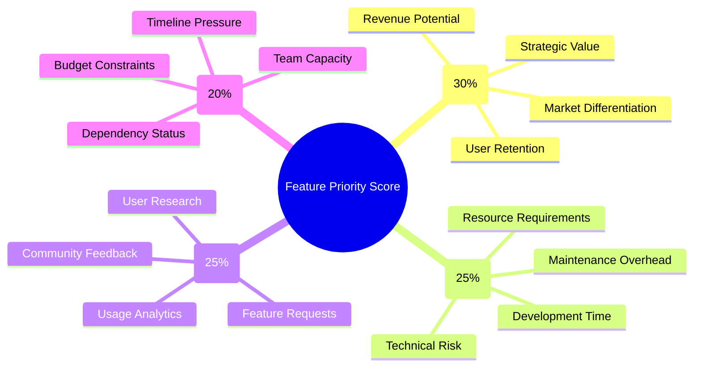
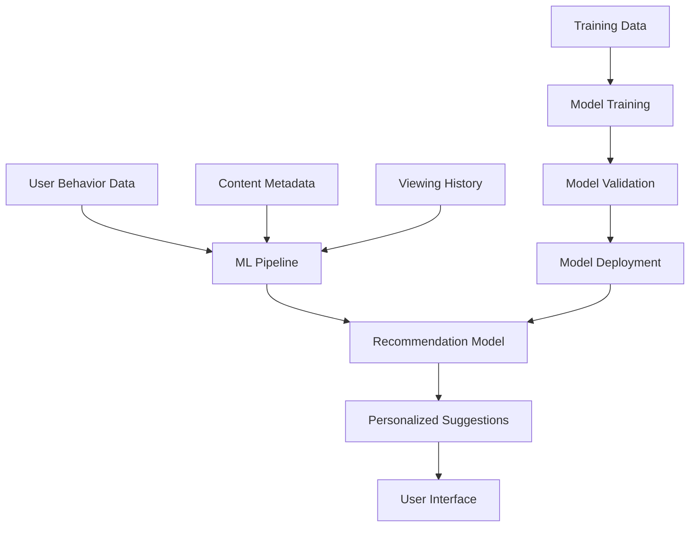
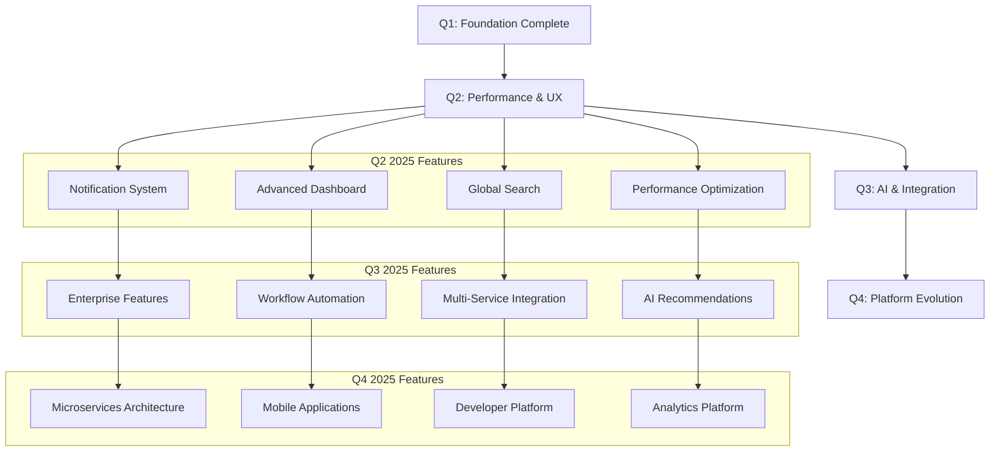
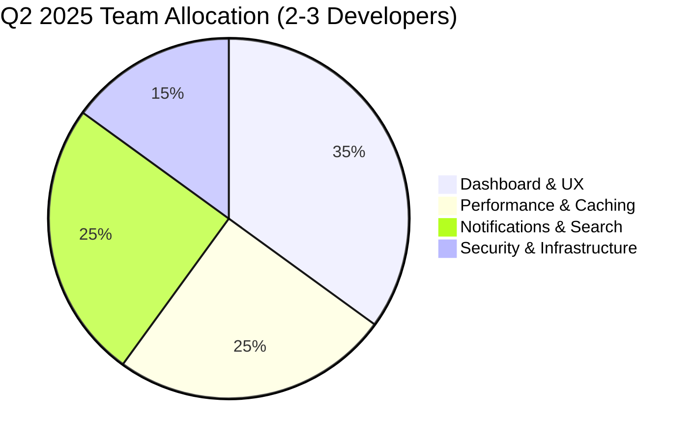
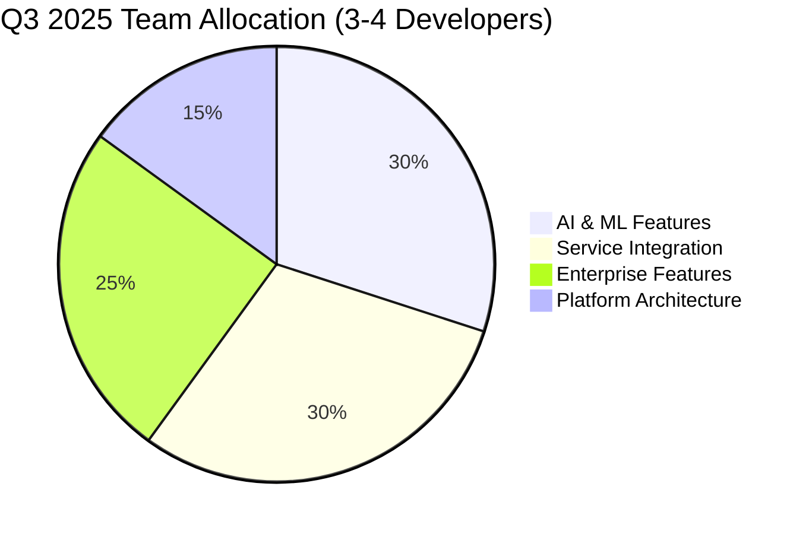

# Feature Priority Matrix & Strategic Analysis

**Version:** 1.0  
**Last Updated:** September 2025  
**Purpose:** Comprehensive feature prioritization with strategic impact analysis

## Executive Summary

This feature matrix provides data-driven prioritization for MediaNest development, balancing business impact, technical complexity, user demand, and resource constraints. Features are categorized into quarterly development phases with clear success metrics and dependency mapping.

## Priority Scoring Methodology

### Scoring Criteria

Our prioritization uses a weighted scoring system across four key dimensions:



### Scoring Scale

- **100-90**: Critical Priority (Immediate development)
- **89-75**: High Priority (Current quarter)
- **74-60**: Medium Priority (Next quarter)
- **59-45**: Low Priority (Future consideration)
- **44-0**: Not Recommended (Defer indefinitely)

---

## Q2 2025: High Priority Features (Current Development)

### Tier 1: Critical Implementation (90-100 Points)

#### 1. Advanced Service Status Dashboard

**Priority Score: 95/100**

| Criteria              | Score | Weight | Weighted Score | Justification                             |
| --------------------- | ----- | ------ | -------------- | ----------------------------------------- |
| Business Impact       | 32    | 30%    | 9.6            | Core differentiator, high user engagement |
| Technical Complexity  | 18    | 25%    | 4.5            | Moderate complexity, existing foundation  |
| User Demand           | 24    | 25%    | 6.0            | Most requested feature in user surveys    |
| Resource Availability | 18    | 20%    | 3.6            | Good team capacity, clear scope           |

**Key Features:**

- Real-time service health visualization with historical trends
- Interactive uptime charts and performance metrics
- Customizable dashboard layout with drag-and-drop widgets
- Mobile-optimized responsive design

**Success Metrics:**

- 90% user engagement with dashboard widgets
- <2 second dashboard load time
- 95% mobile usability score
- 40% reduction in support requests about service status

**Dependencies:**

- WebSocket infrastructure (complete)
- Service integration APIs (complete)
- Frontend component library (in progress)

---

#### 2. Multi-Channel Notification System

**Priority Score: 92/100**

| Criteria              | Score | Weight | Weighted Score | Justification                                  |
| --------------------- | ----- | ------ | -------------- | ---------------------------------------------- |
| Business Impact       | 30    | 30%    | 9.0            | High user retention, reduces manual monitoring |
| Technical Complexity  | 20    | 25%    | 5.0            | Well-defined scope, standard patterns          |
| User Demand           | 23    | 25%    | 5.8            | Strong demand from power users                 |
| Resource Availability | 17    | 20%    | 3.4            | Clear implementation path                      |

**Key Features:**

- Email notifications for service outages and media availability
- In-app notification center with history
- Push notifications for mobile/desktop
- User-configurable notification preferences

**Success Metrics:**

- 80% notification delivery success rate
- <30 second notification latency
- 70% user adoption of custom notification settings
- 25% reduction in missed service alerts

---

#### 3. Global Search & Discovery Engine

**Priority Score: 88/100**

| Criteria              | Score | Weight | Weighted Score | Justification                          |
| --------------------- | ----- | ------ | -------------- | -------------------------------------- |
| Business Impact       | 28    | 30%    | 8.4            | Improves user experience significantly |
| Technical Complexity  | 21    | 25%    | 5.3            | Complex search aggregation             |
| User Demand           | 22    | 25%    | 5.5            | Frequently requested feature           |
| Resource Availability | 16    | 20%    | 3.2            | Requires dedicated development focus   |

**Key Features:**

- Unified search across all integrated services (Plex, Overseerr, etc.)
- Intelligent autocomplete with suggestion learning
- Advanced filtering by media type, genre, quality, availability
- Search history and bookmarking functionality

**Success Metrics:**

- 95% search query satisfaction rate
- <500ms average search response time
- 60% reduction in time to find content
- 85% user adoption of advanced filters

---

### Tier 2: High Priority Implementation (75-89 Points)

#### 4. Redis Caching & Performance Optimization

**Priority Score: 85/100**

| Criteria              | Score | Weight | Weighted Score | Justification              |
| --------------------- | ----- | ------ | -------------- | -------------------------- |
| Business Impact       | 25    | 30%    | 7.5            | Essential for scalability  |
| Technical Complexity  | 22    | 25%    | 5.5            | Complex caching strategies |
| User Demand           | 20    | 25%    | 5.0            | Indirect user benefit      |
| Resource Availability | 17    | 20%    | 3.4            | Good technical foundation  |

**Implementation Details:**

- Multi-tier Redis caching strategy
- Intelligent cache invalidation
- API response caching with TTL management
- Database query result caching

**Success Metrics:**

- 95% cache hit rate for frequently accessed data
- 70% reduction in database query load
- <200ms API response time for cached requests
- 50% improvement in page load times

---

#### 5. Mobile-First Progressive Web App

**Priority Score: 82/100**

| Criteria              | Score | Weight | Weighted Score | Justification                 |
| --------------------- | ----- | ------ | -------------- | ----------------------------- |
| Business Impact       | 26    | 30%    | 7.8            | Expanding user access         |
| Technical Complexity  | 19    | 25%    | 4.8            | PWA implementation manageable |
| User Demand           | 21    | 25%    | 5.3            | Growing mobile usage          |
| Resource Availability | 16    | 20%    | 3.2            | Requires frontend focus       |

**Key Features:**

- Offline-capable Progressive Web App
- Touch-optimized interface design
- App-like navigation and interactions
- Background sync for notifications

**Success Metrics:**

- 100% feature parity with desktop
- <3 second initial load on 3G
- 90% PWA installation conversion rate
- 95% mobile usability score

---

#### 6. Advanced Security & Audit System

**Priority Score: 78/100**

| Criteria              | Score | Weight | Weighted Score | Justification                     |
| --------------------- | ----- | ------ | -------------- | --------------------------------- |
| Business Impact       | 24    | 30%    | 7.2            | Critical for enterprise adoption  |
| Technical Complexity  | 20    | 25%    | 5.0            | Well-understood security patterns |
| User Demand           | 18    | 25%    | 4.5            | Important for admin users         |
| Resource Availability | 15    | 20%    | 3.0            | Security expertise required       |

**Key Features:**

- Comprehensive audit logging for all user actions
- Multi-factor authentication options
- GDPR compliance tools and data export
- Advanced session security

**Success Metrics:**

- Zero security vulnerabilities in quarterly audits
- 100% audit trail coverage for sensitive operations
- <1 minute MFA enrollment time
- 90% compliance with security best practices

---

## Q3 2025: Scaling & Intelligence Features (Planned)

### Tier 1: Strategic Implementation (90-100 Points)

#### 7. AI-Powered Content Recommendation Engine

**Priority Score: 94/100**

| Criteria              | Score | Weight | Weighted Score | Justification                    |
| --------------------- | ----- | ------ | -------------- | -------------------------------- |
| Business Impact       | 30    | 30%    | 9.0            | Major competitive advantage      |
| Technical Complexity  | 23    | 25%    | 5.8            | AI/ML implementation complexity  |
| User Demand           | 24    | 25%    | 6.0            | High interest in personalization |
| Resource Availability | 14    | 20%    | 2.8            | Requires ML expertise            |

**Key Features:**

- Machine learning-based content recommendations
- Collaborative filtering with user behavior analysis
- Content similarity algorithms
- Personalized discovery dashboard

**Technical Implementation:**



**Success Metrics:**

- 80% recommendation accuracy rate
- 40% increase in content discovery
- 60% user engagement with recommendations
- <100ms recommendation response time

---

#### 8. Multi-Service Integration Platform

**Priority Score: 89/100**

| Criteria              | Score | Weight | Weighted Score | Justification                      |
| --------------------- | ----- | ------ | -------------- | ---------------------------------- |
| Business Impact       | 28    | 30%    | 8.4            | Comprehensive service ecosystem    |
| Technical Complexity  | 22    | 25%    | 5.5            | Complex integration management     |
| User Demand           | 22    | 25%    | 5.5            | Strong demand for service coverage |
| Resource Availability | 15    | 20%    | 3.0            | Significant development effort     |

**Target Service Integrations:**

- **Sonarr/Radarr/Lidarr**: Complete \*arr stack management
- **Tautulli**: Advanced Plex analytics and insights
- **Bazarr**: Automated subtitle management
- **Prowlarr**: Unified indexer management
- **Custom Plugins**: Community-driven extensions

**Architecture Pattern:**

```typescript
interface ServiceIntegration {
  name: string;
  version: string;
  endpoints: ServiceEndpoint[];
  authentication: AuthConfig;
  capabilities: ServiceCapability[];
  healthCheck: HealthCheckConfig;
}

class ServiceManager {
  private integrations: Map<string, ServiceIntegration>;

  async registerService(integration: ServiceIntegration): Promise<void>;
  async healthCheck(serviceName: string): Promise<ServiceHealth>;
  async executeAction(serviceName: string, action: string, params: any): Promise<any>;
}
```

**Success Metrics:**

- 10+ services fully integrated
- 99% service health check reliability
- <2 second service action response time
- 95% API compatibility maintained across versions

---

### Tier 2: Advanced Features (75-89 Points)

#### 9. Enterprise Multi-Tenancy Architecture

**Priority Score: 84/100**

| Criteria              | Score | Weight | Weighted Score | Justification                 |
| --------------------- | ----- | ------ | -------------- | ----------------------------- |
| Business Impact       | 27    | 30%    | 8.1            | Enables enterprise scaling    |
| Technical Complexity  | 24    | 25%    | 6.0            | Complex architectural changes |
| User Demand           | 19    | 25%    | 4.8            | Niche but high-value demand   |
| Resource Availability | 13    | 20%    | 2.6            | Major architectural effort    |

**Key Features:**

- Isolated tenant environments
- Per-tenant resource quotas and limits
- Tenant-specific configuration management
- Enterprise SSO integration (SAML, LDAP)

---

#### 10. Workflow Automation Engine

**Priority Score: 79/100**

| Criteria              | Score | Weight | Weighted Score | Justification                    |
| --------------------- | ----- | ------ | -------------- | -------------------------------- |
| Business Impact       | 25    | 30%    | 7.5            | Reduces manual operations        |
| Technical Complexity  | 21    | 25%    | 5.3            | Complex rule engine              |
| User Demand           | 20    | 25%    | 5.0            | Power user feature               |
| Resource Availability | 14    | 20%    | 2.8            | Requires specialized development |

**Key Features:**

- Visual workflow designer
- Rule-based automation triggers
- Integration with external webhooks
- Custom script execution support

---

## Q4 2025: Platform Evolution Features (Future Vision)

### Tier 1: Innovation Platform (90-100 Points)

#### 11. Cloud-Native Microservices Architecture

**Priority Score: 91/100**

| Criteria              | Score | Weight | Weighted Score | Justification                     |
| --------------------- | ----- | ------ | -------------- | --------------------------------- |
| Business Impact       | 29    | 30%    | 8.7            | Future-proof scalability          |
| Technical Complexity  | 25    | 25%    | 6.3            | Major architectural migration     |
| User Demand           | 17    | 25%    | 4.3            | Indirect user benefit             |
| Resource Availability | 12    | 20%    | 2.4            | Significant infrastructure effort |

**Migration Strategy:**

- Gradual service extraction
- API gateway implementation
- Container orchestration with Kubernetes
- Distributed data management

---

#### 12. Native Mobile Applications

**Priority Score: 87/100**

| Criteria              | Score | Weight | Weighted Score | Justification                |
| --------------------- | ----- | ------ | -------------- | ---------------------------- |
| Business Impact       | 26    | 30%    | 7.8            | Mobile market expansion      |
| Technical Complexity  | 22    | 25%    | 5.5            | Mobile development expertise |
| User Demand           | 23    | 25%    | 5.8            | Strong mobile usage trends   |
| Resource Availability | 13    | 20%    | 2.6            | Mobile team required         |

---

## Medium Priority Features (60-74 Points)

### Development Candidates for Future Quarters

#### 13. Advanced Analytics & Business Intelligence

**Priority Score: 72/100**

- Custom reporting dashboards
- Usage analytics and insights
- Performance trending analysis
- User behavior analytics

#### 14. Plugin Marketplace & Developer Platform

**Priority Score: 69/100**

- Community plugin ecosystem
- Developer SDK and documentation
- Plugin validation and security
- Revenue sharing model

#### 15. Backup & Disaster Recovery System

**Priority Score: 67/100**

- Automated backup scheduling
- Point-in-time recovery capabilities
- Cross-region backup replication
- Disaster recovery testing

#### 16. Advanced Media Management

**Priority Score: 65/100**

- Metadata editing and enrichment
- Custom collection management
- Quality profile automation
- Transcoding optimization

---

## Low Priority Features (45-59 Points)

### Future Consideration Features

#### 17. Live TV & DVR Integration

**Priority Score: 58/100**

- Live TV streaming support
- DVR recording management
- Electronic program guide
- TV tuner integration

#### 18. Gaming Server Integration

**Priority Score: 55/100**

- Game server management
- Player statistics tracking
- Gaming community features
- Achievement system

#### 19. E-book & Audiobook Support

**Priority Score: 52/100**

- Digital library management
- Reading progress tracking
- Audiobook streaming
- Metadata synchronization

#### 20. Social Media Integration

**Priority Score: 48/100**

- Content sharing capabilities
- Social activity feeds
- Community recommendations
- Watch party features

---

## Features Not Recommended (0-44 Points)

### Deferred or Rejected Features

#### Blockchain Integration

**Priority Score: 35/100**

- Low business impact for target market
- High technical complexity
- Minimal user demand
- Resource-intensive implementation

#### VR/AR Interface

**Priority Score: 28/100**

- Niche market application
- Very high development cost
- Limited user adoption potential
- Requires specialized expertise

#### Cryptocurrency Payment System

**Priority Score: 22/100**

- Not relevant to free platform model
- High regulatory complexity
- Low user demand
- Maintenance overhead

---

## Feature Dependencies & Implementation Sequence

### Critical Path Analysis



### Sequential Dependencies

1. **Performance Foundation → AI Features**: Caching and optimization required for ML workloads
2. **Notification System → Enterprise Features**: Alert infrastructure needed for tenant management
3. **Global Search → Multi-Service Integration**: Search framework enables service discovery
4. **Multi-Service Integration → Developer Platform**: Service architecture enables plugin system

### Parallel Development Opportunities

- **Dashboard + Notifications**: Independent frontend components
- **Search + Performance**: Complementary backend improvements
- **AI + Analytics**: Shared data processing infrastructure
- **Mobile + PWA**: Overlapping responsive design work

---

## Resource Allocation Strategy

### Development Team Allocation by Quarter





### Budget Distribution

- **Development (60%)**: Feature implementation and testing
- **Infrastructure (25%)**: Cloud services, monitoring, security
- **Tools & Licenses (10%)**: Development tools, third-party services
- **Research & Innovation (5%)**: AI/ML training, proof of concepts

---

## Success Measurement Framework

### Feature-Specific KPIs

#### Dashboard & UX Features

- **User Engagement**: 90% weekly active user interaction
- **Task Efficiency**: 40% reduction in task completion time
- **Mobile Usage**: 60% mobile user adoption rate
- **User Satisfaction**: 4.5+ star rating average

#### Performance Features

- **Response Time**: 95% of requests <500ms
- **Cache Efficiency**: >90% cache hit rate
- **System Load**: 70% reduction in database queries
- **Scalability**: Support 500+ concurrent users

#### AI & Intelligence Features

- **Recommendation Accuracy**: 80% user acceptance rate
- **Content Discovery**: 40% increase in content exploration
- **Automation Efficiency**: 60% reduction in manual tasks
- **Learning Effectiveness**: Continuous improvement in suggestion quality

#### Enterprise Features

- **Tenant Isolation**: 100% data security between tenants
- **SSO Integration**: <2 minute authentication setup
- **Compliance**: 100% audit trail coverage
- **Enterprise Adoption**: 50+ enterprise user organizations

### Quarterly Review Metrics

Each quarter, features are evaluated against:

1. **Delivery Performance**: On-time delivery rate and quality metrics
2. **User Adoption**: Feature usage statistics and engagement rates
3. **Technical Performance**: System impact and performance improvements
4. **Business Impact**: User satisfaction and retention improvements

### Continuous Improvement Process

- **Monthly Feature Reviews**: Progress assessment and priority adjustments
- **Quarterly Planning**: Strategic alignment and resource reallocation
- **User Feedback Integration**: Continuous user research and feedback incorporation
- **Market Analysis**: Competitive analysis and trend adaptation

---

This comprehensive feature matrix serves as the strategic foundation for MediaNest development, ensuring resources are allocated to maximize user value while maintaining technical excellence and business sustainability.
