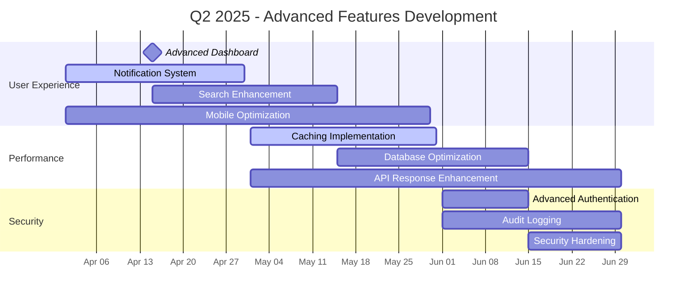
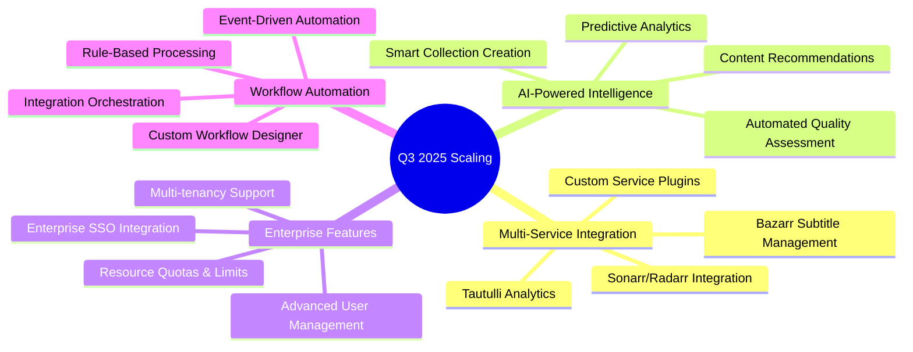
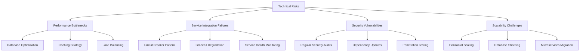

# MediaNest Development Roadmap

**Version:** 2.0  
**Last Updated:** September 2025  
**Status:** Active Development

## Executive Summary

MediaNest is transitioning from MVP to a mature, scalable media management platform. This comprehensive roadmap outlines our strategic development path through 2025 and beyond, building upon our solid foundation to deliver advanced features, enhanced performance, and enterprise-grade capabilities.

### Current Status (September 2025)

**Phase 0-1: Foundation Complete ✅**

- ✅ Core authentication with Plex OAuth
- ✅ Database schema and API structure
- ✅ Containerized deployment ready
- ✅ Basic security implementation

**Phase 2-3: Service Integration In Progress 🚧**

- ✅ Plex API integration
- ✅ Overseerr integration
- ✅ Uptime Kuma monitoring
- 🚧 YouTube download processing (80% complete)

**Next Focus: Advanced Features & Optimization**

## Vision & Strategic Goals

### 2025 Vision

Transform MediaNest into the definitive platform for personal media ecosystem management, serving as the central hub that seamlessly connects, monitors, and optimizes all media-related services.

### Key Strategic Objectives

1. **User Experience Excellence**: Intuitive, responsive interface requiring minimal learning curve
2. **Service Integration Mastery**: Seamless integration with 15+ media services by Q4 2025
3. **Performance Leadership**: Sub-500ms response times for 95% of operations
4. **Enterprise Readiness**: Support for 500+ concurrent users with multi-tenancy
5. **AI-Powered Intelligence**: Smart content discovery and automated management

## Quarterly Development Phases

```mermaid
timeline
    title MediaNest Development Timeline 2025

    section Q1 2025 : Foundation & Core
        Jan : Phase 0-1 Complete
            : Authentication & Database
            : Basic Service Integration
        Feb : Phase 2 Progress
            : Plex & Overseerr APIs
            : Monitoring Integration
        Mar : Phase 3 Launch
            : YouTube Downloads
            : MVP Release

    section Q2 2025 : Advanced Features
        Apr : User Experience Enhancement
            : Advanced Dashboard
            : Notification System
        May : Performance Optimization
            : Caching Strategies
            : Database Optimization
        Jun : Security Hardening
            : Advanced Auth Features
            : Audit Logging

    section Q3 2025 : Scaling & Intelligence
        Jul : Multi-Service Integration
            : Additional Media Services
            : Workflow Automation
        Aug : AI-Powered Features
            : Content Recommendations
            : Smart Categorization
        Sep : Enterprise Features
            : Multi-tenancy Support
            : Advanced Analytics

    section Q4 2025 : Innovation & Scale
        Oct : Cloud Integration
            : Backup & Sync
            : Distributed Deployment
        Nov : Mobile Experience
            : Progressive Web App
            : Native Mobile Apps
        Dec : Future Platform
            : Plugin Architecture
            : Community Features
```

## Current Phase Status

### Phase 4: Production Readiness 🚧 In Progress

**Target Completion:** October 2025  
**Current Progress:** 65%

#### ✅ Completed Components

- Base testing framework with Vitest
- API endpoint validation
- Security header implementation
- Error handling standardization
- Basic performance monitoring

#### 🚧 In Progress

- YouTube download processing (BullMQ integration)
- End-to-end testing with Playwright
- Load testing and optimization
- Production deployment configuration
- Security audit completion

#### 📋 Upcoming

- Advanced caching implementation
- Performance benchmarking
- Backup and recovery procedures
- Monitoring dashboard enhancement
- Documentation completion

---

## Detailed Phase Roadmap

### Q1 2025: Foundation & Core Features ✅ COMPLETE

**Duration:** January - March 2025  
**Team Size:** 1-2 developers  
**Budget Allocation:** Foundation Development

#### Key Deliverables

- ✅ Robust authentication system with Plex OAuth
- ✅ Scalable database architecture
- ✅ Core API framework with rate limiting
- ✅ Basic service integrations (Plex, Overseerr, Uptime Kuma)
- ✅ MVP user interface with real-time updates

#### Success Metrics

- ✅ 10-20 concurrent users supported
- ✅ <2 second page load times achieved
- ✅ Basic security audit passed
- ✅ All core features functional

---

### Q2 2025: Advanced Features & Optimization 🎯 CURRENT FOCUS

**Duration:** April - June 2025  
**Team Size:** 2-3 developers  
**Budget Allocation:** Feature Enhancement & Performance

#### April 2025: User Experience Enhancement



#### Key Features & Improvements

**Advanced Dashboard Experience**

- Real-time service health visualization with historical trends
- Customizable widget layout with drag-and-drop functionality
- Quick action shortcuts for common tasks
- System resource monitoring integration

**Enhanced Notification System**

- Multi-channel delivery (email, push, in-app)
- Smart notification grouping and filtering
- User preference management
- Integration with external notification services

**Performance & Optimization**

- Redis-based intelligent caching (95% cache hit rate target)
- Database query optimization (sub-100ms query times)
- CDN integration for static assets
- Background job processing optimization

#### Success Metrics

- **Performance**: 95% of requests <500ms response time
- **User Experience**: Task completion time reduced by 40%
- **Reliability**: 99.95% uptime excluding maintenance
- **Security**: Zero critical vulnerabilities

---

### Q3 2025: Scaling & Enterprise Features 🚀 PLANNED

**Duration:** July - September 2025  
**Team Size:** 3-4 developers  
**Budget Allocation:** Scaling Infrastructure & Enterprise Features

#### Strategic Focus Areas



#### July 2025: Multi-Service Integration

**Target:** Expand from 3 to 10+ integrated services

- **Sonarr/Radarr Integration**: Advanced media acquisition management
- **Tautulli Integration**: Comprehensive Plex analytics and insights
- **Bazarr Integration**: Automated subtitle management
- **Custom Plugin Architecture**: Community-driven service extensions

#### August 2025: AI-Powered Features

**Target:** Implement machine learning capabilities

- **Content Recommendation Engine**: ML-based content suggestions
- **Smart Auto-Categorization**: Intelligent content organization
- **Predictive Analytics**: Usage patterns and capacity planning
- **Natural Language Processing**: Voice/text command interface

#### September 2025: Enterprise Features

**Target:** Support enterprise-scale deployments

- **Multi-tenancy Architecture**: Isolated user organizations
- **Advanced Role Management**: Granular permission system
- **Resource Management**: Per-tenant quotas and limits
- **Enterprise Authentication**: SAML, LDAP, and OAuth2 providers

#### Success Metrics

- **Scale**: Support 500+ concurrent users
- **Integration**: 10+ services seamlessly integrated
- **Intelligence**: 80% accuracy in content recommendations
- **Enterprise**: Multi-tenant deployment ready

---

### Q4 2025: Innovation & Future Platform 🌟 VISION

**Duration:** October - December 2025  
**Team Size:** 4-5 developers  
**Budget Allocation:** Innovation & Platform Evolution

#### October 2025: Cloud & Distributed Architecture

- **Microservices Migration**: Service-oriented architecture
- **Cloud-Native Deployment**: Kubernetes, serverless functions
- **Distributed Caching**: Redis Cluster, global CDN
- **Backup & Disaster Recovery**: Automated backup strategies

#### November 2025: Mobile & Progressive Experience

- **Progressive Web App**: Offline-capable mobile experience
- **Native Mobile Apps**: iOS and Android applications
- **Mobile-Optimized Workflows**: Touch-first interface design
- **Cross-Platform Synchronization**: Seamless device switching

#### December 2025: Platform Ecosystem

- **Plugin Marketplace**: Community-driven extensions
- **Developer API**: Third-party integration platform
- **Community Features**: User-generated content and sharing
- **Advanced Analytics**: Business intelligence dashboard

---

## Feature Priority Matrix

### High Priority (Q2 2025)

| Feature                  | Business Impact | Technical Complexity | User Demand | Priority Score |
| ------------------------ | --------------- | -------------------- | ----------- | -------------- |
| Advanced Dashboard       | High            | Medium               | High        | 95             |
| Notification System      | High            | Medium               | High        | 92             |
| Performance Optimization | High            | High                 | Medium      | 88             |
| Search Enhancement       | Medium          | Low                  | High        | 85             |

### Medium Priority (Q3 2025)

| Feature                   | Business Impact | Technical Complexity | User Demand | Priority Score |
| ------------------------- | --------------- | -------------------- | ----------- | -------------- |
| AI Recommendations        | High            | High                 | Medium      | 82             |
| Multi-Service Integration | Medium          | High                 | High        | 78             |
| Mobile App                | Medium          | Medium               | High        | 75             |
| Workflow Automation       | Medium          | High                 | Medium      | 72             |

### Future Considerations (Q4 2025+)

| Feature                    | Business Impact | Technical Complexity | User Demand | Priority Score |
| -------------------------- | --------------- | -------------------- | ----------- | -------------- |
| Microservices Architecture | Low             | Very High            | Low         | 65             |
| Blockchain Integration     | Low             | Very High            | Low         | 45             |
| VR/AR Interface            | Low             | Very High            | Low         | 35             |

## Risk Assessment & Mitigation

### Technical Risks



### Risk Mitigation Strategies

1. **Performance Risks**

   - Continuous performance monitoring
   - Load testing at each milestone
   - Progressive caching implementation
   - Database query optimization

2. **Integration Risks**

   - Comprehensive API testing
   - Service mock implementations
   - Graceful degradation patterns
   - Regular integration health checks

3. **Security Risks**

   - Monthly security audits
   - Automated vulnerability scanning
   - Regular dependency updates
   - Penetration testing quarterly

4. **Team & Resource Risks**
   - Cross-training team members
   - Comprehensive documentation
   - Automated testing coverage
   - Regular backup procedures

## Success Metrics & KPIs

### User Experience Metrics

- **Page Load Time**: <500ms for 95% of requests
- **Task Completion Rate**: >90% success rate
- **User Satisfaction**: 4.5+ stars (5-star scale)
- **Mobile Experience**: 100% feature parity

### Technical Performance Metrics

- **System Uptime**: 99.95% availability
- **API Response Time**: <200ms average
- **Error Rate**: <0.1% of total requests
- **Cache Hit Rate**: >90% for cached content

### Business Impact Metrics

- **User Growth**: 300% increase by Q4 2025
- **Feature Adoption**: >70% for new features
- **Support Requests**: <2% of user base monthly
- **Development Velocity**: 20% faster release cycles

## Implementation Guidelines

### Development Standards

- **Code Quality**: 90%+ test coverage for critical paths
- **Security**: OWASP compliance, regular audits
- **Performance**: Sub-second response times
- **Documentation**: Comprehensive API and user docs

### Release Strategy

- **Monthly Releases**: Feature releases with backward compatibility
- **Weekly Patches**: Bug fixes and minor improvements
- **Quarterly Major**: Significant feature sets and architecture updates
- **Emergency Hotfixes**: Critical security or stability issues

### Quality Assurance

- **Automated Testing**: Unit, integration, and end-to-end tests
- **Manual Testing**: User acceptance and exploratory testing
- **Performance Testing**: Load and stress testing at scale
- **Security Testing**: Vulnerability scans and penetration testing

---

## Resource Requirements

### Development Team Evolution

- **Q2 2025**: 2-3 developers (current)
- **Q3 2025**: 3-4 developers (scaling features)
- **Q4 2025**: 4-5 developers (platform evolution)

### Infrastructure Scaling

- **Current**: Single-server Docker deployment
- **Q2 2025**: Load-balanced multi-server setup
- **Q3 2025**: Microservices on container orchestration
- **Q4 2025**: Cloud-native, globally distributed

### Budget Considerations

- **Development**: 60% of budget allocation
- **Infrastructure**: 25% of budget allocation
- **Security & Compliance**: 10% of budget allocation
- **Tools & Licenses**: 5% of budget allocation

---

## Next Steps & Immediate Actions

### Immediate Priorities (Next 30 Days)

1. **Complete YouTube Download Processing**: Finish BullMQ integration
2. **Performance Optimization**: Implement Redis caching layer
3. **Security Hardening**: Complete security audit remediation
4. **Documentation**: Update API documentation and user guides

### Short-term Goals (Next 90 Days)

1. **Advanced Dashboard**: Interactive service monitoring
2. **Notification System**: Multi-channel alert delivery
3. **Mobile Optimization**: Responsive design improvements
4. **Testing Infrastructure**: Comprehensive test suite

### Medium-term Objectives (6 Months)

1. **AI Features**: Content recommendation engine
2. **Multi-Service Integration**: Expand to 10+ services
3. **Enterprise Features**: Multi-tenancy support
4. **Performance**: Support 500+ concurrent users

---

This roadmap serves as a living document, updated quarterly based on user feedback, technical discoveries, and market opportunities. Our commitment is to deliver exceptional value while maintaining the stability and security that our users trust.
