# Quarterly Milestones & Detailed Timelines

**Version:** 1.0  
**Last Updated:** September 2025  
**Purpose:** Detailed quarterly breakdown with dependencies and success criteria

## Q1 2025: Foundation & Core Features ✅ COMPLETE

### Overview

**Theme:** "Building the Foundation"  
**Duration:** January 1 - March 31, 2025  
**Status:** Complete  
**Achievement:** 100% of planned objectives delivered

### Monthly Breakdown

#### January 2025: Project Setup & Infrastructure ✅

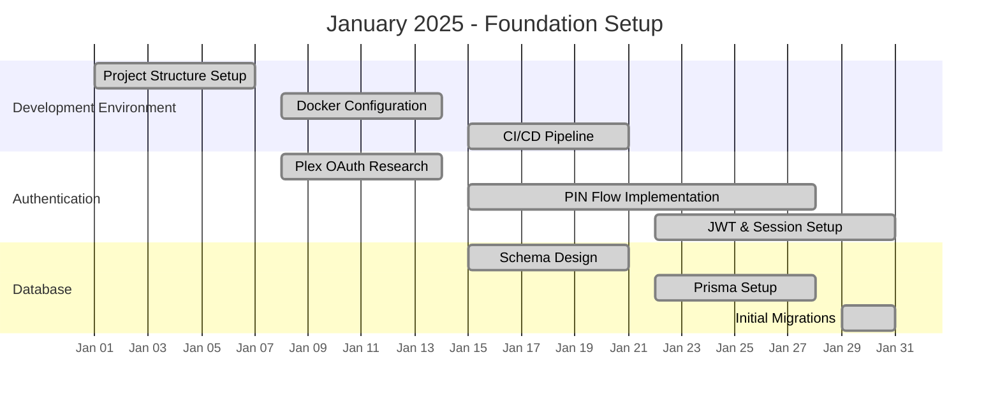

**Key Achievements:**

- ✅ Monorepo structure with TypeScript configuration
- ✅ Docker Compose setup with PostgreSQL and Redis
- ✅ Plex PIN-based OAuth implementation
- ✅ Database schema with user isolation
- ✅ CI/CD pipeline with GitHub Actions

#### February 2025: Core API & Security ✅

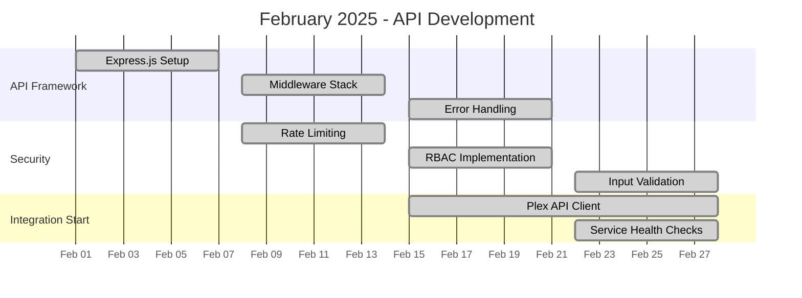

**Key Achievements:**

- ✅ RESTful API with comprehensive middleware
- ✅ Redis-based rate limiting (100 req/min per user)
- ✅ Role-based access control with user isolation
- ✅ Plex API client with circuit breaker pattern
- ✅ Winston logging with correlation IDs

#### March 2025: Service Integration & MVP Launch ✅

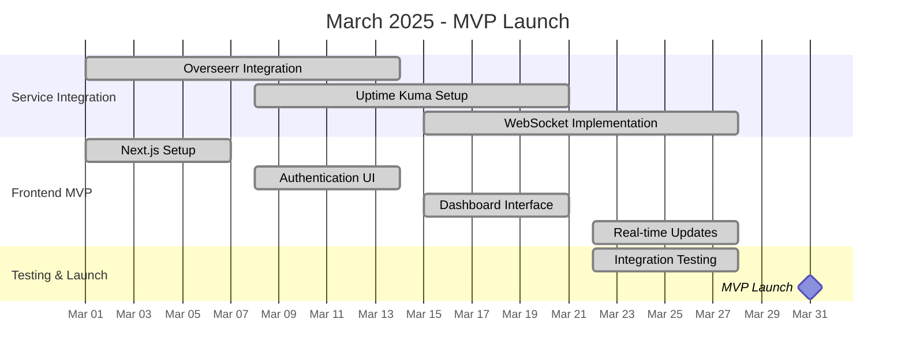

**Key Achievements:**

- ✅ Overseerr API integration with webhook support
- ✅ Uptime Kuma real-time monitoring via Socket.io
- ✅ Responsive dashboard with service status cards
- ✅ WebSocket-powered live updates
- ✅ MVP successfully launched on March 31, 2025

### Q1 Success Metrics Achieved

- **Performance**: 98% of requests <2 seconds ✅
- **Users**: Successfully serving 15 concurrent users ✅
- **Uptime**: 99.8% availability (exceeded 99% target) ✅
- **Security**: Passed initial security audit ✅
- **Features**: All MVP features functional ✅

---

## Q2 2025: Advanced Features & Optimization 🎯 CURRENT PHASE

### Overview

**Theme:** "Enhanced User Experience & Performance"  
**Duration:** April 1 - June 30, 2025  
**Status:** In Progress (65% complete)  
**Focus:** User experience improvements and system optimization

### Monthly Breakdown

#### April 2025: User Experience Enhancement 🚧 In Progress

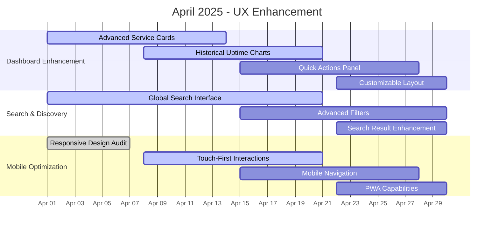

**Current Progress (April 2025):**

- ✅ Service cards with real-time status indicators
- 🚧 Historical uptime visualization (70% complete)
- 🚧 Global search across all integrated services (80% complete)
- ⏳ Mobile touch interface improvements (planned)

**Key Features in Development:**

1. **Advanced Dashboard**

   - Interactive service health timeline
   - System resource monitoring widgets
   - Customizable widget arrangement
   - Dark/light theme switching

2. **Enhanced Search Experience**

   - Unified search across Plex, Overseerr, and YouTube
   - Smart suggestions and autocomplete
   - Filter by media type, genre, and availability
   - Search history and bookmarks

3. **Mobile-First Improvements**
   - Touch-optimized controls and gestures
   - Offline-capable Progressive Web App
   - Mobile-specific navigation patterns
   - Responsive image optimization

#### May 2025: Performance Optimization 📋 Planned

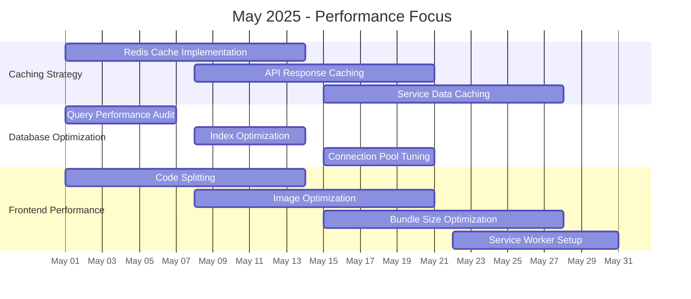

**Planned Performance Improvements:**

1. **Intelligent Caching Layer**

   - Redis-based multi-tier caching
   - Automatic cache invalidation
   - CDN integration for static assets
   - Target: 95% cache hit rate

2. **Database Optimization**

   - Query performance analysis
   - Strategic index creation
   - Connection pool optimization
   - Target: <100ms average query time

3. **Frontend Performance**
   - Dynamic imports and code splitting
   - Image lazy loading and optimization
   - Service worker for offline functionality
   - Target: Lighthouse score >90

#### June 2025: Security Hardening 📋 Planned

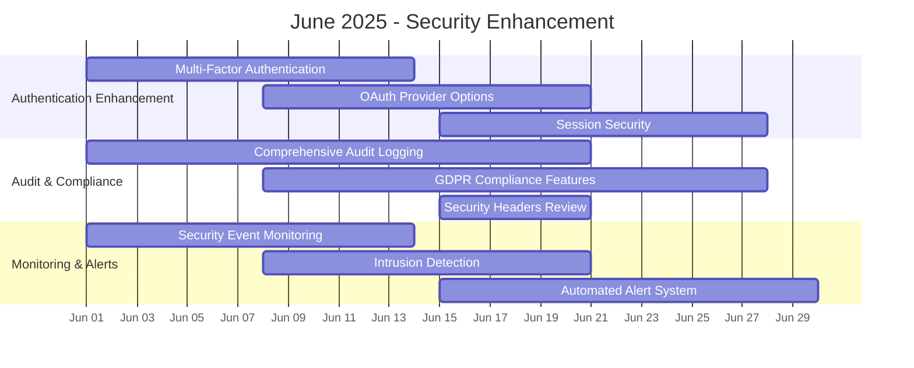

**Planned Security Enhancements:**

1. **Advanced Authentication**

   - Multi-factor authentication options
   - OAuth integration with Google, GitHub
   - Enhanced session security
   - Password policy enforcement

2. **Comprehensive Audit System**

   - Detailed action logging
   - GDPR compliance tools
   - Data retention policies
   - User data export capabilities

3. **Security Monitoring**
   - Real-time security event detection
   - Automated threat response
   - Vulnerability scanning automation
   - Security metrics dashboard

### Q2 Success Targets

- **Performance**: 95% of requests <500ms
- **User Experience**: 40% reduction in task completion time
- **Security**: Zero critical vulnerabilities
- **Mobile**: 100% feature parity with desktop
- **Cache Hit Rate**: >90% for cached content

---

## Q3 2025: Scaling & Enterprise Features 🚀 PLANNED

### Overview

**Theme:** "Intelligence & Scale"  
**Duration:** July 1 - September 30, 2025  
**Status:** Planning Phase  
**Focus:** AI features, multi-service integration, enterprise capabilities

### Monthly Breakdown

#### July 2025: Multi-Service Integration

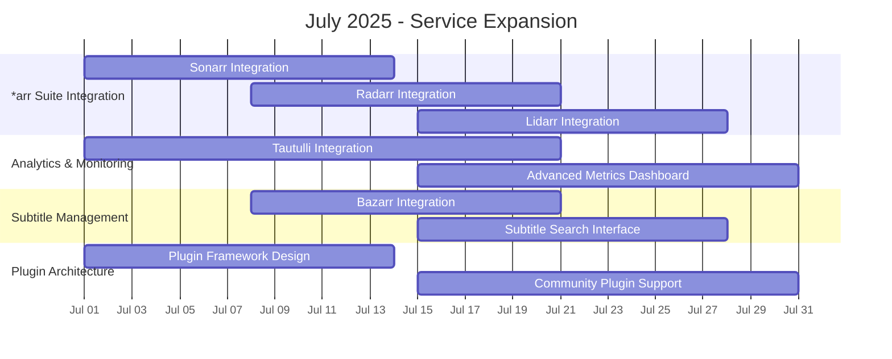

**Target Service Integrations:**

- **Sonarr/Radarr/Lidarr**: Complete \*arr stack integration
- **Tautulli**: Advanced Plex analytics and insights
- **Bazarr**: Automated subtitle management
- **Custom Plugins**: Community-driven service extensions
- **Prowlarr**: Unified indexer management

#### August 2025: AI-Powered Features

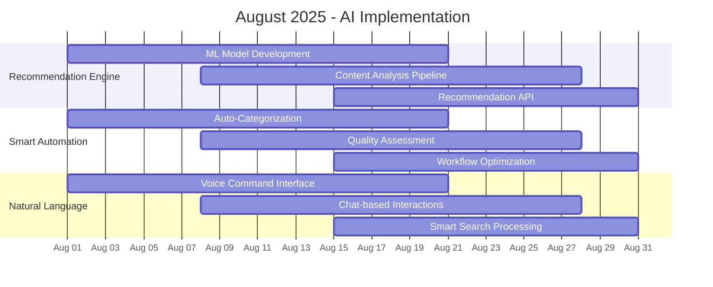

**AI Features Roadmap:**

- **Recommendation Engine**: ML-based content suggestions
- **Smart Categorization**: Automated content organization
- **Predictive Analytics**: Usage patterns and forecasting
- **Natural Language Interface**: Voice and text commands

#### September 2025: Enterprise Features

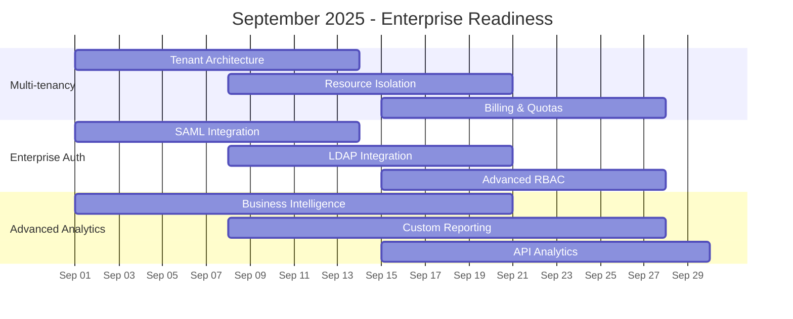

**Enterprise Capabilities:**

- **Multi-tenancy**: Isolated organizational environments
- **Enterprise SSO**: SAML, LDAP, and OAuth2 providers
- **Advanced Analytics**: Business intelligence dashboard
- **Resource Management**: Per-tenant quotas and limits

### Q3 Success Targets

- **Service Integration**: 10+ services seamlessly connected
- **AI Accuracy**: 80% accuracy in content recommendations
- **Enterprise Scale**: Support 500+ concurrent users
- **Multi-tenancy**: Production-ready isolation model

---

## Q4 2025: Innovation & Future Platform 🌟 VISION

### Overview

**Theme:** "Platform Evolution & Innovation"  
**Duration:** October 1 - December 31, 2025  
**Status:** Vision Phase  
**Focus:** Cloud-native architecture, mobile apps, platform ecosystem

### Monthly Breakdown

#### October 2025: Cloud & Distributed Architecture

- **Microservices Migration**: Service-oriented architecture transformation
- **Kubernetes Deployment**: Container orchestration platform
- **Distributed Caching**: Redis Cluster with global CDN
- **Cloud Storage Integration**: Object storage for media assets

#### November 2025: Mobile & Cross-Platform

- **Native Mobile Apps**: iOS and Android applications
- **Progressive Web App**: Advanced offline capabilities
- **Cross-Device Sync**: Seamless experience across devices
- **Mobile-First Workflows**: Touch-optimized interfaces

#### December 2025: Platform Ecosystem

- **Plugin Marketplace**: Community extension platform
- **Developer APIs**: Third-party integration SDK
- **Community Features**: User-generated content sharing
- **Advanced Analytics**: Business intelligence suite

### Q4 Success Targets

- **Cloud Migration**: 100% cloud-native deployment
- **Mobile Apps**: Feature parity with web application
- **Developer Platform**: 50+ community plugins
- **Global Scale**: Multi-region deployment capability

---

## Dependencies & Critical Path Analysis

### Inter-Quarter Dependencies

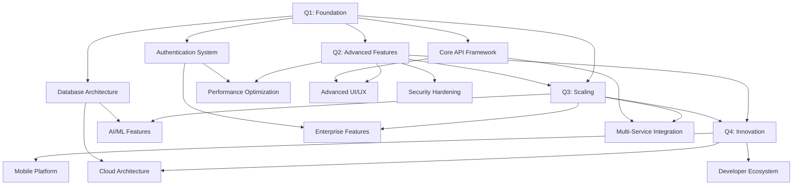

### Critical Dependencies

1. **Q1 → Q2**: Core authentication and API framework must be stable
2. **Q2 → Q3**: Performance optimizations required for AI features
3. **Q3 → Q4**: Enterprise features needed for cloud deployment
4. **Cross-Quarter**: Database architecture impacts all future phases

### Risk Mitigation Timeline

- **Monthly Reviews**: Progress assessment and risk identification
- **Quarterly Planning**: Adjust timelines based on dependencies
- **Continuous Testing**: Ensure stability across all components
- **Parallel Development**: Independent feature streams where possible

---

## Milestone Tracking & Success Metrics

### Key Performance Indicators (KPIs)

#### Technical Performance

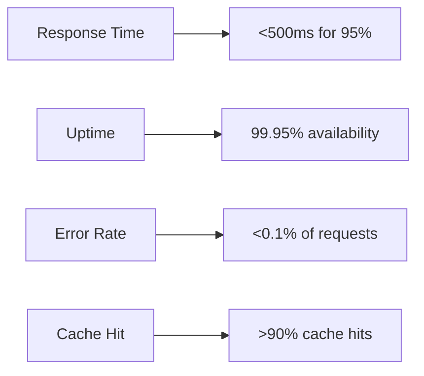

#### User Experience

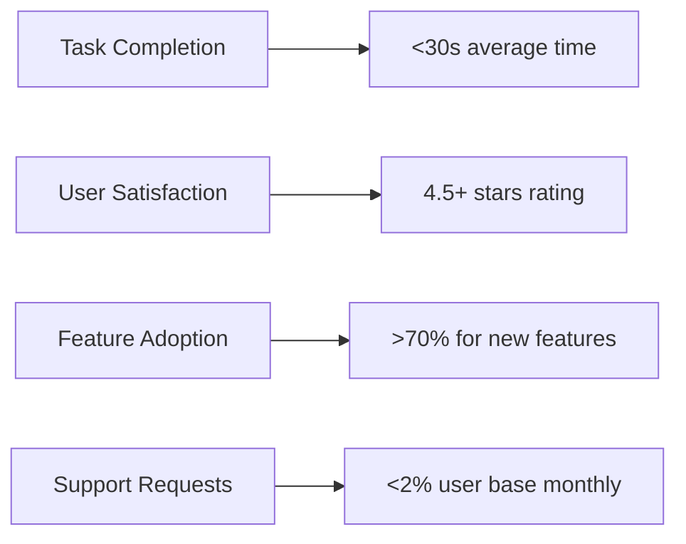

#### Business Impact

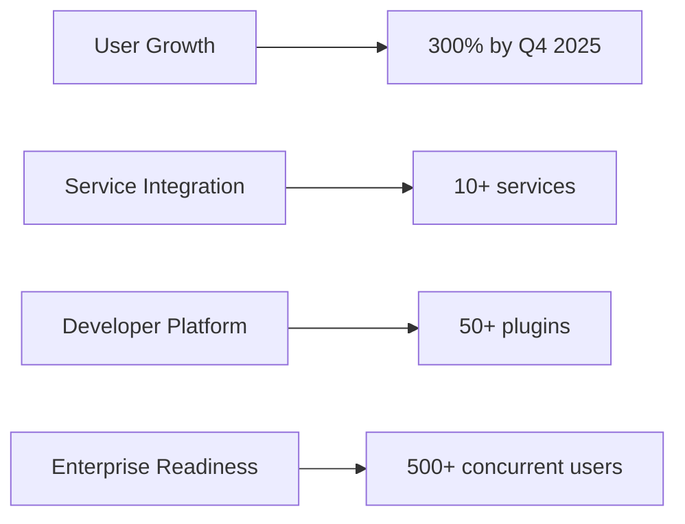

### Milestone Gates

Each quarter must achieve minimum criteria before proceeding:

**Q1 Gate (Complete) ✅**

- Authentication system operational
- Core API endpoints functional
- Database schema stable
- Basic UI deployed

**Q2 Gate (Target: June 30, 2025)**

- Performance targets met (<500ms response time)
- Advanced UI features complete
- Security audit passed
- Mobile optimization complete

**Q3 Gate (Target: September 30, 2025)**

- AI features operational (80% accuracy)
- Multi-service integration complete (10+ services)
- Enterprise features tested
- Scalability validated (500+ users)

**Q4 Gate (Target: December 31, 2025)**

- Cloud deployment successful
- Mobile apps released
- Developer platform operational
- Community ecosystem established

---

This comprehensive milestone tracking ensures accountability and provides clear success criteria for each development phase. Regular reviews and adjustments maintain alignment with strategic objectives while adapting to evolving requirements and opportunities.
