# Success Metrics & KPI Framework

**Version:** 1.0  
**Last Updated:** September 2025  
**Purpose:** Comprehensive success measurement framework for MediaNest development

## Executive Summary

This document establishes a comprehensive framework for measuring the success of MediaNest development across multiple dimensions including technical performance, user experience, business impact, and strategic alignment. These metrics guide decision-making and ensure continuous improvement throughout the development lifecycle.

## Success Measurement Philosophy

MediaNest's success is measured through a balanced scorecard approach that considers:

## Core KPI Categories

### 1. Technical Performance KPIs

#### System Performance Metrics

| Metric                         | Target                   | Current  | Measurement Method                 |
| ------------------------------ | ------------------------ | -------- | ---------------------------------- |
| **API Response Time**          | <200ms (95th percentile) | 180ms ✅ | Application Performance Monitoring |
| **Page Load Time**             | <2s (initial load)       | 1.8s ✅  | Real User Monitoring               |
| **Database Query Performance** | <100ms (average)         | 85ms ✅  | Query profiling                    |
| **Cache Hit Rate**             | >90%                     | 88% 🚧   | Redis monitoring                   |
| **System Uptime**              | 99.95%                   | 99.8% 🚧 | Infrastructure monitoring          |

#### Quality Metrics

| Metric                       | Target                | Current   | Measurement Method      |
| ---------------------------- | --------------------- | --------- | ----------------------- |
| **Test Coverage**            | >80% (critical paths) | 75% 🚧    | Automated testing tools |
| **Bug Escape Rate**          | <2% to production     | 1.5% ✅   | Issue tracking          |
| **Code Quality Score**       | >8.0/10               | 8.2/10 ✅ | SonarQube analysis      |
| **Security Vulnerabilities** | 0 critical            | 0 ✅      | Security scanning       |
| **Technical Debt Ratio**     | <15%                  | 12% ✅    | Code analysis tools     |

### 2. User Experience KPIs

#### User Satisfaction Metrics

#### Feature Adoption Metrics

| Feature Category         | Adoption Target | Current Rate | Success Criteria      |
| ------------------------ | --------------- | ------------ | --------------------- |
| **Core Dashboard**       | 95% of users    | 92% 🚧       | Daily active usage    |
| **Media Requests**       | 80% of users    | 85% ✅       | Weekly feature usage  |
| **YouTube Downloads**    | 60% of users    | 45% ⚠️       | Monthly feature usage |
| **Service Monitoring**   | 70% of users    | 78% ✅       | Feature engagement    |
| **Search Functionality** | 85% of users    | 82% 🚧       | Search query volume   |

### 3. Business Impact KPIs

#### Growth & Efficiency Metrics

| Business Metric                | Q1 Target          | Q2 Target           | Q3 Target           | Q4 Target           |
| ------------------------------ | ------------------ | ------------------- | ------------------- | ------------------- |
| **Monthly Active Users**       | 25                 | 40                  | 75                  | 150                 |
| **User Retention (30-day)**    | 85%                | 87%                 | 90%                 | 92%                 |
| **Feature Request Resolution** | 72 hours           | 48 hours            | 24 hours            | 12 hours            |
| **Development Velocity**       | 8 features/quarter | 12 features/quarter | 15 features/quarter | 20 features/quarter |

## Quarterly Success Milestones

### Q2 2025: Foundation Excellence 🎯 Current Focus

#### Primary Success Criteria

**Technical Excellence**

- ✅ API response time consistently <500ms
- 🚧 Cache hit rate >90% (currently 88%)
- 🚧 Zero critical security vulnerabilities
- ✅ Test coverage >75% for critical paths

**User Experience**

- 📋 User satisfaction score >4.5/5
- 🚧 Task completion rate >90%
- 📋 Mobile optimization score >95%
- 🚧 Feature adoption rate >70%

**Business Impact**

- 📋 40+ monthly active users
- 📋 Support requests <2% of user base
- 🚧 Feature delivery on schedule
- 📋 Documentation completeness >90%

#### Detailed Tracking Dashboard

```mermaid
graph TD
    subgraph Q2_Metrics [Q2 2025 Success Metrics]
        A[Performance: 85% Complete]
        B[UX Enhancement: 70% Complete]
        C[Security: 90% Complete]
        D[Features: 65% Complete]
    end

    subgraph Status_Indicators [Status Indicators]
        E[✅ On Track]
        F[🚧 In Progress]
        G[⚠️ At Risk]
        H[❌ Behind Schedule]
    end

    A --> E
    B --> F
    C --> E
    D --> F
```

### Q3 2025: Intelligence & Scale 🚀 Planned

#### Strategic Success Targets

**AI & Intelligence**

- ML recommendation accuracy >80%
- Content discovery increase >40%
- User engagement with AI features >60%
- Automated task completion >50%

**Multi-Service Integration**

- 10+ services successfully integrated
- Service health monitoring >99% accuracy
- Integration latency <2 seconds average
- API compatibility >95% maintained

**Enterprise Readiness**

- Multi-tenant architecture operational
- Enterprise SSO integration complete
- Compliance audit score >90%
- Scalability testing validated for 500+ users

### Q4 2025: Platform Excellence 🌟 Vision

#### Innovation Success Metrics

**Cloud-Native Architecture**

- Microservices migration >80% complete
- Auto-scaling operational
- Global deployment capability
- Cost optimization >30% improvement

**Developer Ecosystem**

- Plugin marketplace operational
- Developer SDK adoption >50 developers
- Community contributions >100 plugins
- API usage >10,000 requests/day

**Mobile Excellence**

- Native app feature parity 100%
- Mobile user adoption >60%
- App store rating >4.5/5
- Cross-platform sync reliability >99%

## Measurement Framework

### Data Collection Strategy

### Real-Time Monitoring Tools

#### Technical Monitoring Stack

- **Application Performance**: New Relic / DataDog
- **Infrastructure Monitoring**: Prometheus + Grafana
- **Log Aggregation**: ELK Stack (Elasticsearch, Logstash, Kibana)
- **Error Tracking**: Sentry for error monitoring
- **Security Monitoring**: OWASP ZAP + custom security dashboard

#### User Experience Monitoring

- **Real User Monitoring**: Google Analytics 4
- **Heat Maps & Session Recording**: Hotjar / FullStory
- **User Feedback**: In-app feedback widgets
- **A/B Testing**: Custom feature flag system
- **Support Analytics**: Zendesk analytics

### KPI Dashboard Design

## Success Measurement Methodology

### Weekly Performance Reviews

#### Technical Performance Review

**Every Monday, 9:00 AM**

1. **Performance Metrics Analysis**

   - API response times vs targets
   - Database performance trends
   - Cache efficiency analysis
   - System resource utilization

2. **Quality Metrics Assessment**

   - New bug reports and resolution rates
   - Test coverage changes
   - Code quality trends
   - Security scan results

3. **Action Items Generation**
   - Performance optimization tasks
   - Quality improvement initiatives
   - Security enhancement priorities

#### User Experience Review

**Every Wednesday, 2:00 PM**

1. **User Feedback Analysis**

   - Support ticket trends
   - User satisfaction scores
   - Feature request patterns
   - Community feedback themes

2. **Usage Analytics Review**

   - Feature adoption rates
   - User journey analysis
   - Task completion success rates
   - Mobile vs desktop usage patterns

3. **UX Improvement Planning**
   - Interface optimization priorities
   - User workflow enhancements
   - Documentation improvements

### Monthly Business Review

#### Strategic Alignment Assessment

**First Friday of each month**

### Quarterly Strategic Review

#### Comprehensive Success Evaluation

**Last week of each quarter**

1. **Quantitative Performance Analysis**

   - All KPI target vs actual comparison
   - Trend analysis and pattern identification
   - Performance prediction modeling
   - ROI calculation for major initiatives

2. **Qualitative Success Assessment**

   - User satisfaction deep dive
   - Team satisfaction and productivity
   - Market position evaluation
   - Strategic goal achievement review

3. **Forward-Looking Planning**
   - Next quarter target setting
   - Resource allocation optimization
   - Risk mitigation strategy updates
   - Innovation opportunity identification

## Success Communication Framework

### Stakeholder Reporting

#### Executive Summary Reports

**Monthly to leadership team**

- High-level KPI dashboard
- Strategic goal progress summary
- Risk and opportunity highlights
- Resource requirement updates

#### Technical Team Reports

**Weekly to development team**

- Performance metrics and trends
- Quality improvement opportunities
- Technical debt management
- Development velocity tracking

#### User Community Reports

**Quarterly to user community**

- Feature delivery updates
- Performance improvement highlights
- Community feedback implementation
- Future roadmap previews

### Success Celebration & Recognition

#### Achievement Milestones

## Continuous Improvement Process

### Success Metric Evolution

#### Quarterly Metric Review

- Evaluate relevance of current metrics
- Add new metrics for emerging priorities
- Retire outdated or irrelevant metrics
- Adjust targets based on capability growth

#### Feedback Integration

- User feedback on success perception
- Team feedback on metric usefulness
- Stakeholder input on business alignment
- Market feedback on competitive position

### Learning & Adaptation

#### Success Pattern Analysis

#### Failure Analysis & Recovery

- Root cause analysis for missed targets
- Process improvement implementation
- Prevention strategy development
- Recovery plan execution

---

## Risk Indicators & Early Warning System

### Performance Risk Indicators

| Risk Indicator               | Warning Threshold     | Critical Threshold  | Response Action                       |
| ---------------------------- | --------------------- | ------------------- | ------------------------------------- |
| **API Response Degradation** | >300ms average        | >500ms average      | Immediate performance investigation   |
| **Error Rate Increase**      | >1% of requests       | >2% of requests     | Error analysis and fix prioritization |
| **User Satisfaction Drop**   | <4.0/5 rating         | <3.5/5 rating       | UX improvement sprint initiation      |
| **Security Vulnerability**   | Medium severity found | High/Critical found | Security response protocol activation |

### Business Risk Indicators

| Risk Indicator                | Warning Threshold | Critical Threshold | Response Action                            |
| ----------------------------- | ----------------- | ------------------ | ------------------------------------------ |
| **User Churn Rate**           | >10% monthly      | >15% monthly       | User retention strategy activation         |
| **Feature Adoption Lag**      | <50% in 30 days   | <30% in 30 days    | Feature marketing and UX review            |
| **Support Request Spike**     | >150% of baseline | >200% of baseline  | Support escalation and root cause analysis |
| **Development Velocity Drop** | <75% of target    | <50% of target     | Resource allocation and process review     |

---

This comprehensive success metrics framework ensures MediaNest development maintains focus on delivering value across all dimensions of success while providing early warning systems for potential issues and clear celebration points for achievements.
