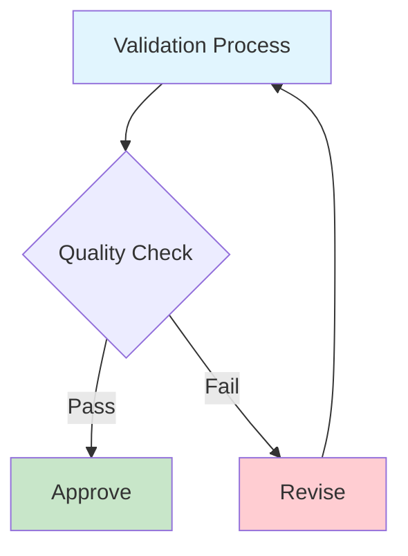

# Documentation Quality Checklist

This comprehensive checklist ensures consistent, high-quality documentation across MediaNest. Use this checklist for all documentation contributions, reviews, and quality assurance processes.

## 🎯 Content Quality Standards

### Information Architecture
- [ ] **Clear Purpose**: Document has a clear, single purpose
- [ ] **Target Audience**: Content is written for the intended audience
- [ ] **Logical Structure**: Information flows logically from general to specific
- [ ] **Complete Coverage**: All necessary information is included
- [ ] **Accurate Information**: All technical details are current and correct
- [ ] **Actionable Content**: Instructions are specific and actionable

### Writing Quality
- [ ] **Clear Language**: Uses simple, direct language
- [ ] **Consistent Tone**: Maintains professional, helpful tone throughout
- [ ] **Active Voice**: Prefers active voice over passive voice
- [ ] **Concise Writing**: Eliminates unnecessary words and redundancy
- [ ] **Proper Grammar**: Free of grammatical errors and typos
- [ ] **Technical Accuracy**: All code examples and commands are tested

## 📝 Markdown Standards

### Document Structure
- [ ] **H1 Title**: Document starts with a single H1 heading
- [ ] **Heading Hierarchy**: Headings follow logical hierarchy (no level skipping)
- [ ] **Table of Contents**: Long documents include navigation aids
- [ ] **Front Matter**: Includes appropriate metadata (if using)
- [ ] **Footer Information**: Includes last updated date and authorship

### Markdown Syntax
- [ ] **Valid Syntax**: Passes markdownlint validation
- [ ] **Consistent Formatting**: Uses consistent bullet points and numbering
- [ ] **Proper Tables**: Tables include headers and proper alignment
- [ ] **Code Blocks**: All code uses appropriate syntax highlighting
- [ ] **Line Length**: Lines don't exceed 100 characters (when practical)
- [ ] **Blank Lines**: Proper spacing between sections

```markdown
# Proper Heading Structure Example

## Main Section

Content paragraph with proper spacing.

### Subsection

- List item one
- List item two
- List item three

#### Sub-subsection

```javascript
// Code block with proper syntax highlighting
const example = "properly formatted";
```
```

## 🔗 Link Validation

### Internal Links
- [ ] **Relative Paths**: Uses relative paths for internal links
- [ ] **File Existence**: All linked files exist
- [ ] **Anchor Validity**: Fragment links point to valid headings
- [ ] **Case Sensitivity**: File names match case exactly
- [ ] **Path Format**: Uses forward slashes consistently

### External Links
- [ ] **Link Validity**: All external links are accessible
- [ ] **HTTPS Protocol**: Uses HTTPS when available
- [ ] **Target Attribute**: External links open in new tab when appropriate
- [ ] **Link Text**: Descriptive link text (not "click here")
- [ ] **Backup Links**: Critical external resources have alternatives noted

### Link Examples
```markdown
# Good Link Examples
[API Reference](../api/overview.md)
[GitHub Repository](https://github.com/kinginyellow/medianest){:target="_blank"}

# Bad Link Examples
[click here](file.md)
[API](http://insecure-link.com)
```

## 🖼️ Media and Assets

### Images and Diagrams
- [ ] **Alt Text**: All images have descriptive alt text
- [ ] **Appropriate Format**: Uses optimal image formats (SVG for diagrams)
- [ ] **File Size**: Images are optimized for web
- [ ] **Naming Convention**: Files use consistent naming patterns
- [ ] **Organization**: Images stored in appropriate directories
- [ ] **High DPI**: Support for high-resolution displays

### Mermaid Diagrams
- [ ] **Valid Syntax**: Diagrams render correctly
- [ ] **Theme Compatibility**: Works with light and dark themes
- [ ] **Responsive Design**: Scales appropriately on mobile
- [ ] **Accessibility**: Includes alt text and descriptions
- [ ] **Print Friendly**: Renders well in PDF exports



## 🔧 Technical Standards

### Code Examples
- [ ] **Syntax Highlighting**: All code blocks specify language
- [ ] **Working Examples**: Code examples are tested and functional
- [ ] **Complete Context**: Includes necessary imports/setup
- [ ] **Error Handling**: Shows proper error handling patterns
- [ ] **Comments**: Complex code includes explanatory comments
- [ ] **Security**: No hardcoded secrets or sensitive data

### API Documentation
- [ ] **Complete Parameters**: All parameters documented
- [ ] **Request Examples**: Includes sample requests
- [ ] **Response Examples**: Shows expected responses
- [ ] **Error Codes**: Documents error conditions
- [ ] **Authentication**: Specifies auth requirements
- [ ] **Rate Limits**: Documents any rate limiting

### Configuration Examples
```yaml
# Good configuration example
server:
  port: 3000
  host: "localhost"
  
database:
  url: "${DATABASE_URL}"  # Use environment variables
  pool_size: 10
```

## 📊 MkDocs Material Integration

### Theme Compatibility
- [ ] **Material Design**: Follows Material Design principles
- [ ] **Navigation Structure**: Proper navigation hierarchy
- [ ] **Search Integration**: Content is searchable
- [ ] **Mobile Responsive**: Works on mobile devices
- [ ] **Print Optimization**: Formats well for PDF export

### Feature Usage
- [ ] **Admonitions**: Uses appropriate callout boxes
- [ ] **Tabs**: Groups related content effectively
- [ ] **Code Annotations**: Uses inline code annotations
- [ ] **Content Tabs**: Organizes multi-format content
- [ ] **Social Cards**: Configured for social media sharing

### Admonition Examples
```markdown
!!! note "Important Information"
    This is critical information that users should know.

!!! warning "Potential Issues"
    Be careful when following these steps.

!!! tip "Pro Tip"
    This advanced technique can save time.
```

## ✅ Review Process Checklist

### Pre-Publication Review
- [ ] **Technical Accuracy**: All technical content reviewed by expert
- [ ] **Editorial Review**: Grammar and style reviewed
- [ ] **Link Testing**: All links manually tested
- [ ] **Mobile Testing**: Reviewed on mobile devices
- [ ] **Print Testing**: PDF export quality verified
- [ ] **Accessibility**: Screen reader compatibility checked

### Automated Validation
- [ ] **Spell Check**: Passes spell check validation
- [ ] **Link Check**: Passes automated link validation
- [ ] **Markdown Lint**: Passes markdownlint rules
- [ ] **MkDocs Build**: Builds without errors or warnings
- [ ] **Image Validation**: All images load correctly
- [ ] **Diagram Rendering**: All Mermaid diagrams render

### Version Control
- [ ] **Meaningful Commits**: Commit messages describe changes
- [ ] **Branch Strategy**: Follows documentation branching strategy
- [ ] **Pull Request**: Includes description of changes
- [ ] **Review Comments**: All review comments addressed
- [ ] **Change Log**: Updates documented in change log
- [ ] **Merge Strategy**: Clean merge without conflicts

## 🚀 Performance and SEO

### Page Performance
- [ ] **Load Time**: Pages load quickly
- [ ] **Image Optimization**: Images are compressed and optimized
- [ ] **Lazy Loading**: Large images use lazy loading
- [ ] **CDN Usage**: Static assets served from CDN
- [ ] **Caching**: Appropriate cache headers set

### SEO Optimization
- [ ] **Meta Descriptions**: Pages have descriptive meta tags
- [ ] **Title Tags**: Unique, descriptive page titles
- [ ] **Heading Structure**: Proper H1-H6 hierarchy
- [ ] **Semantic HTML**: Uses semantic HTML elements
- [ ] **Schema Markup**: Structured data where appropriate

## 🔒 Security and Privacy

### Information Security
- [ ] **No Secrets**: No passwords, API keys, or tokens exposed
- [ ] **Privacy Protection**: No personal information disclosed
- [ ] **Safe Examples**: Sample data uses fictional information
- [ ] **Link Security**: External links reviewed for safety
- [ ] **Download Safety**: Files scanned for malware

### GDPR Compliance
- [ ] **Data Collection**: Documents what data is collected
- [ ] **Privacy Notice**: Links to privacy policy
- [ ] **Cookie Consent**: Implements cookie consent management
- [ ] **Data Rights**: Documents user data rights
- [ ] **Contact Information**: Provides contact for privacy concerns

## 📈 Analytics and Maintenance

### Usage Analytics
- [ ] **Search Analytics**: Monitors internal search queries
- [ ] **Page Views**: Tracks most/least viewed content
- [ ] **User Feedback**: Collects and acts on user feedback
- [ ] **Performance Metrics**: Monitors page load times
- [ ] **Error Tracking**: Monitors for 404 errors

### Content Maintenance
- [ ] **Regular Review**: Content reviewed quarterly
- [ ] **Update Schedule**: Outdated content flagged for updates
- [ ] **Version Tracking**: Major changes documented
- [ ] **Archive Strategy**: Obsolete content properly archived
- [ ] **Redirect Management**: Broken links redirected appropriately

## 🎨 Style Guide Compliance

### Visual Design
- [ ] **Brand Consistency**: Follows MediaNest brand guidelines
- [ ] **Color Usage**: Uses approved color palette
- [ ] **Typography**: Follows typography standards
- [ ] **Spacing**: Consistent spacing and layout
- [ ] **Icons**: Uses consistent icon style

### Voice and Tone
- [ ] **Professional Tone**: Maintains professional voice
- [ ] **User-Focused**: Written from user's perspective
- [ ] **Helpful Attitude**: Provides supportive guidance
- [ ] **Consistent Terminology**: Uses standard terminology
- [ ] **Inclusive Language**: Uses inclusive, accessible language

## 🔄 Continuous Improvement

### Feedback Integration
- [ ] **User Feedback**: Regular user feedback collection
- [ ] **Analytics Review**: Monthly analytics review
- [ ] **Competitive Analysis**: Quarterly competitive review
- [ ] **Technology Updates**: Keeps up with MkDocs updates
- [ ] **Best Practices**: Incorporates industry best practices

### Quality Metrics
- [ ] **Quality Score**: Tracks overall quality metrics
- [ ] **User Satisfaction**: Measures user satisfaction
- [ ] **Task Completion**: Monitors task completion rates
- [ ] **Search Success**: Tracks search success rates
- [ ] **Error Rates**: Monitors and reduces error rates

---

## Quick Reference Commands

```bash
# Run complete quality check
./scripts/docs-quality-check.sh

# Validate markdown syntax
markdownlint docs/**/*.md

# Check links
markdown-link-check docs/**/*.md

# Build and test locally
mkdocs serve

# Run pre-commit hooks
pre-commit run --all-files
```

## Documentation Workflow

1. **Create/Edit** → Use this checklist during creation
2. **Self-Review** → Complete all relevant checklist items
3. **Automated Validation** → Run quality check script
4. **Peer Review** → Another team member reviews
5. **Final Check** → Automated CI/CD validation
6. **Publish** → Deploy to production documentation site

---

*This checklist should be updated regularly to reflect new standards and best practices. Last updated: [Current Date]*