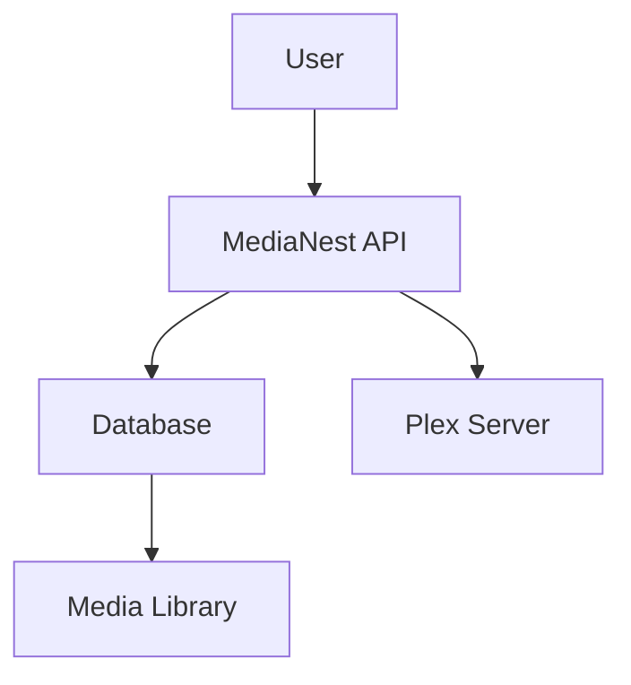

# MediaNest Documentation Style Guide

**Version:** 2.0.0  
**Last Updated:** September 9, 2025  
**Scope:** All MediaNest documentation and technical content

## Table of Contents

- [Overview](#overview)
- [Writing Style](#writing-style)
- [Markdown Standards](#markdown-standards)
- [Content Structure](#content-structure)
- [Code Documentation](#code-documentation)
- [Visual Elements](#visual-elements)
- [Accessibility Standards](#accessibility-standards)
- [Quality Assurance](#quality-assurance)

## Overview

This style guide establishes consistent standards for all MediaNest documentation to ensure clarity, accessibility, and professional presentation. All contributors must follow these guidelines when creating or editing documentation.

### Core Principles

1. **User-Centered**: Write for the reader's needs and skill level
2. **Clarity First**: Prioritize clear communication over technical jargon
3. **Consistent Format**: Use standardized formatting across all content
4. **Accessible Design**: Ensure content is accessible to all users
5. **Actionable Content**: Provide clear, actionable instructions
6. **Maintainable Structure**: Organize content for easy maintenance

## Writing Style

### Voice and Tone

- **Voice**: Professional, helpful, and direct
- **Tone**: Friendly but authoritative
- **Perspective**: Use second person ("you") for instructions
- **Tense**: Use present tense for current functionality

### Language Guidelines

#### Clear and Concise
```markdown
✅ Good: Click **Save** to store your changes.
❌ Avoid: You can click on the Save button in order to store the changes you have made.
```

#### Active Voice
```markdown
✅ Good: MediaNest automatically organizes your files.
❌ Avoid: Files are automatically organized by MediaNest.
```

#### Consistent Terminology
- Use the same term throughout documentation
- Define technical terms on first use
- Maintain a project glossary

## Markdown Standards

### File Structure

Every documentation file must include:

```markdown
# Page Title

Brief description of the page content.

## Table of Contents (for long pages)

- [Section 1](#section-1)
- [Section 2](#section-2)

## Content Sections

---

**Last Updated:** YYYY-MM-DD  
**Version:** X.X.X
```

### Heading Hierarchy

Use consistent heading levels:

```markdown
# H1: Page Title (one per page)
## H2: Major Sections
### H3: Subsections
#### H4: Minor Subsections (avoid if possible)
```

### Text Formatting

#### Emphasis
```markdown
- **Bold**: For UI elements, important terms, file names
- *Italic*: For emphasis, first-time technical terms
- `Code`: For inline code, commands, file paths
- ~~Strikethrough~~: For deprecated content
```

#### Lists
```markdown
<!-- Unordered lists -->
- Use hyphens for unordered lists
- Keep items parallel in structure
- Use sub-bullets when needed
  - Sub-item example
  - Another sub-item

<!-- Ordered lists -->
1. Use numbers for sequential steps
2. Write clear, actionable items
3. Include expected outcomes
```

### Code Blocks

#### Language Tags
Always specify language for syntax highlighting:

```markdown
```bash
# Shell commands
docker run medianest/medianest
```

```javascript
// JavaScript/TypeScript
const config = {
  apiUrl: 'https://api.medianest.com'
};
```

```yaml
# YAML configuration
version: '3.8'
services:
  medianest:
    image: medianest/medianest:latest
```

```json
{
  "success": true,
  "data": {
    "message": "API response example"
  }
}
```
```

#### Code Block Best Practices
- Include descriptive comments
- Show complete, working examples
- Use realistic data in examples
- Highlight important lines with annotations

### Links and References

#### Internal Links
```markdown
<!-- Relative paths for internal links -->
[Installation Guide](../installation/index.md)
[API Authentication](./authentication.md)

<!-- Anchor links for same-page sections -->
[See Configuration](#configuration)
```

#### External Links
```markdown
<!-- Open external links in new tab -->
[Docker Documentation](https://docs.docker.com/){:target="_blank"}
[GitHub Repository](https://github.com/medianest/medianest){:target="_blank"}
```

### Tables

#### Standard Table Format
```markdown
| Column 1 | Column 2 | Column 3 |
|----------|----------|----------|
| **Data** | `Code`   | Normal   |
| Value 1  | Value 2  | Value 3  |
```

#### Complex Tables
For complex data, use consistent alignment:

```markdown
| Parameter | Type | Required | Default | Description |
|-----------|------|----------|---------|-------------|
| `apiKey` | string | Yes | - | Your API authentication key |
| `timeout` | number | No | 30000 | Request timeout in milliseconds |
| `retries` | number | No | 3 | Number of retry attempts |
```

### Admonitions (Callouts)

Use MkDocs Material admonitions for important information:

```markdown
!!! note "Configuration Note"
    This configuration requires restart of the MediaNest service.

!!! warning "Breaking Change"
    This feature will be deprecated in version 3.0.

!!! danger "Security Warning"
    Never expose your API keys in client-side code.

!!! tip "Pro Tip"
    Use environment variables for sensitive configuration.

!!! info "Additional Information"
    See the [API Reference](./api/index.md) for complete details.

!!! example "Example Usage"
    ```bash
    docker run -e API_KEY=your_key medianest/medianest
    ```
```

### Images and Media

#### Image Standards
```markdown
<!-- Standard image with alt text -->


<!-- Image with description -->

*Figure 1: MediaNest system architecture showing component relationships*
```

#### Asset Organization
- Store images in `docs/assets/images/`
- Use descriptive file names
- Optimize images for web (< 500KB)
- Provide alt text for accessibility

## Content Structure

### Page Types

#### Index Pages
```markdown
# Section Name

Brief description of the section and its purpose.

## Quick Navigation

### [Subsection 1](./subsection1.md)
Description of what this subsection covers.

### [Subsection 2](./subsection2.md)
Description of what this subsection covers.

## Overview

Additional context and orientation information.
```

#### Tutorial Pages
```markdown
# How to [Task Name]

Learn how to [accomplish specific goal] in MediaNest.

## Prerequisites

- Requirement 1
- Requirement 2

## Step-by-Step Instructions

### Step 1: [Action]
Detailed instructions with expected outcomes.

### Step 2: [Action]
Continue with clear, sequential steps.

## Verification

How to confirm the task was completed successfully.

## Troubleshooting

Common issues and solutions.
```

#### Reference Pages
```markdown
# [Feature/API] Reference

Complete reference documentation for [specific feature].

## Overview

Brief description and use cases.

## Parameters/Options

| Parameter | Type | Description |
|-----------|------|-------------|
| ... | ... | ... |

## Examples

Practical examples with explanations.

## Related

Links to related documentation.
```

### Content Organization

#### Information Hierarchy
1. **Most Important First**: Lead with critical information
2. **Logical Flow**: Organize content in logical sequence
3. **Scannable Format**: Use headings, lists, and callouts
4. **Cross-References**: Link to related information

#### Page Length
- **Aim for**: 500-2000 words per page
- **Break up**: Long content into multiple pages
- **Use**: Table of contents for pages >1000 words

## Code Documentation

### API Documentation

#### Endpoint Documentation
```markdown
### GET /api/v1/media

Retrieve media items from the library.

#### Parameters

| Parameter | Type | Required | Description |
|-----------|------|----------|-------------|
| `page` | integer | No | Page number (default: 1) |
| `limit` | integer | No | Items per page (default: 20) |
| `search` | string | No | Search query |

#### Response

**Success (200 OK):**
```json
{
  "success": true,
  "data": [
    {
      "id": "media_123",
      "title": "Movie Title",
      "type": "movie"
    }
  ],
  "metadata": {
    "pagination": {
      "page": 1,
      "limit": 20,
      "total": 100
    }
  }
}
```

**Error (400 Bad Request):**
```json
{
  "success": false,
  "error": {
    "code": "INVALID_PARAMETERS",
    "message": "Invalid page number"
  }
}
```
```

### Configuration Examples

```markdown
#### Environment Variables

```env
# Database Configuration
DB_HOST=localhost
DB_PORT=5432
DB_NAME=medianest

# API Configuration
API_PORT=8080
JWT_SECRET=your_secret_here
```

#### Docker Compose

```yaml
version: '3.8'
services:
  medianest:
    image: medianest/medianest:latest
    ports:
      - "8080:8080"
    environment:
      - DB_HOST=postgres
      - API_PORT=8080
```
```

## Visual Elements

### Diagrams and Charts

#### Mermaid Diagrams
```markdown

```

#### Screenshots and UI Elements
- Use consistent browser/device frames
- Highlight relevant UI elements
- Include descriptive captions
- Keep screenshots current with latest UI

### Icons and Symbols

Use consistent emoji/icons for common elements:
- 🚀 Quick Start / Getting Started
- ⚡ Performance / Fast Operations
- 🔧 Configuration / Settings
- 🔐 Security / Authentication
- 📝 Documentation / Notes
- ⚠️ Warnings / Important
- ✅ Success / Completed
- ❌ Error / Failed
- 💡 Tips / Helpful Information

## Accessibility Standards

### Writing for Accessibility

1. **Clear Language**: Use simple, direct language
2. **Descriptive Links**: Use meaningful link text
3. **Alt Text**: Provide descriptive alt text for images
4. **Heading Structure**: Use proper heading hierarchy
5. **Color Independence**: Don't rely solely on color for meaning

### Technical Accessibility

#### Alt Text Examples
```markdown
<!-- Good alt text -->


<!-- Poor alt text -->

```

#### Link Text
```markdown
<!-- Good link text -->
Learn more about [MediaNest API authentication](./api/authentication.md).

<!-- Poor link text -->
[Click here](./api/authentication.md) for API information.
```

### Screen Reader Compatibility

- Use semantic HTML elements
- Provide descriptive headings
- Include skip links for long content
- Test with screen readers

## Quality Assurance

### Content Review Checklist

#### Before Publishing
- [ ] Spelling and grammar check completed
- [ ] Links tested and working
- [ ] Code examples tested
- [ ] Images display correctly
- [ ] Mobile responsive formatting
- [ ] Accessibility requirements met

#### Style Compliance
- [ ] Consistent heading hierarchy
- [ ] Proper markdown formatting
- [ ] Appropriate admonitions used
- [ ] Code blocks have language tags
- [ ] Alt text provided for images

#### Content Quality
- [ ] Information is accurate and current
- [ ] Instructions are clear and actionable
- [ ] Examples are realistic and working
- [ ] Cross-references are relevant
- [ ] Page fits intended purpose

### Maintenance Standards

#### Regular Updates
- Review quarterly for accuracy
- Update screenshots with UI changes
- Refresh code examples with new versions
- Validate external links

#### Version Control
- Use semantic versioning for style guide
- Document changes in changelog
- Maintain backwards compatibility
- Archive deprecated content appropriately

---

**Questions or Feedback?**  
Contact the documentation team via [GitHub Issues](https://github.com/medianest/medianest/issues) or [Discord](https://discord.gg/medianest).