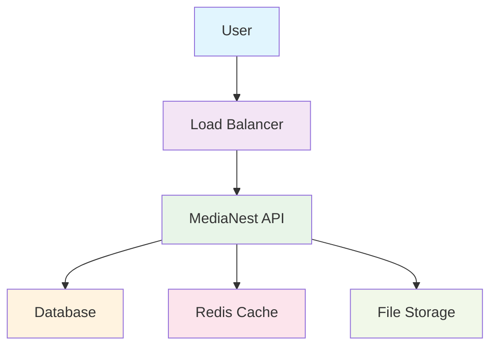
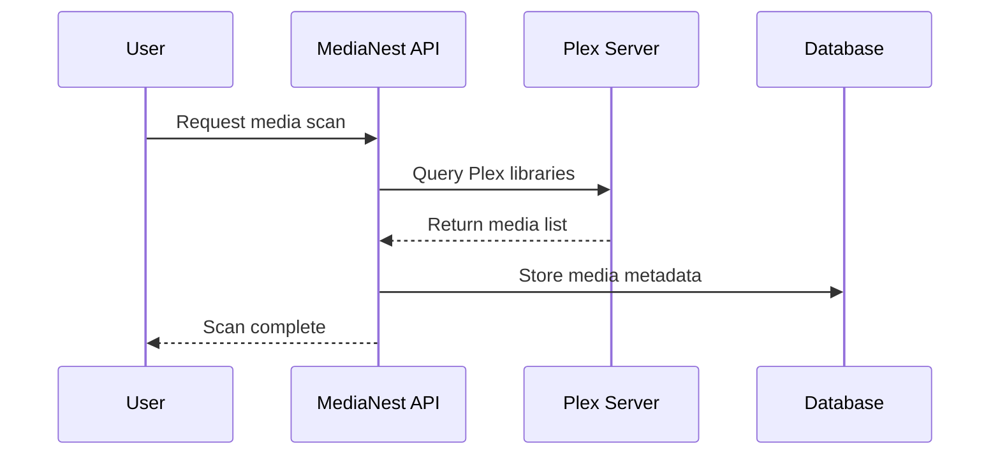
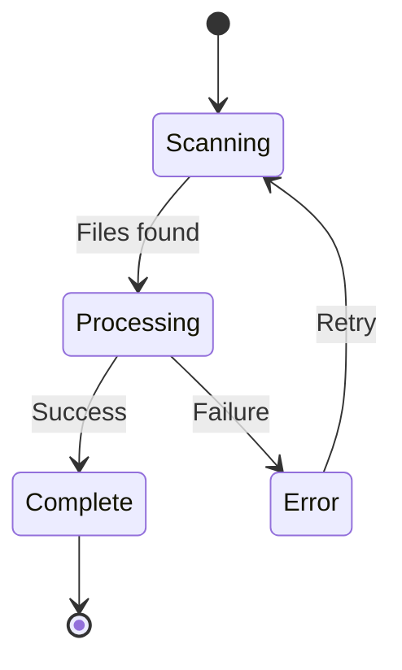

# MkDocs Material Standards for MediaNest

**Version:** 1.0.0  
**Last Updated:** September 9, 2025  
**Purpose:** Standardized usage of MkDocs Material theme features and components

## Overview

This document establishes standards for using MkDocs Material theme features consistently across all MediaNest documentation. It covers advanced components, formatting patterns, and best practices specific to the Material theme.

## Theme Configuration Standards

### Site Information
```yaml
# Required site metadata
site_name: MediaNest Documentation
site_url: https://docs.medianest.com
site_author: MediaNest Development Team
site_description: Complete documentation for MediaNest

# Repository integration
repo_name: MediaNest/MediaNest
repo_url: https://github.com/medianest/medianest
edit_uri: edit/develop/docs/
```

### Theme Features
```yaml
theme:
  name: material
  features:
    # Navigation enhancements
    - navigation.instant          # Fast page loading
    - navigation.instant.prefetch # Prefetch linked pages
    - navigation.tabs            # Top-level navigation tabs
    - navigation.tabs.sticky     # Sticky navigation tabs
    - navigation.sections        # Navigation sections
    - navigation.expand          # Expand navigation by default
    - navigation.path           # Show navigation path
    - navigation.top            # Back to top button
    
    # Content enhancements
    - content.code.copy         # Copy code button
    - content.code.select       # Select code blocks
    - content.code.annotate     # Code annotations
    - content.tabs.link         # Link content tabs
    - content.tooltips          # Hover tooltips
    
    # Search enhancements
    - search.highlight          # Highlight search terms
    - search.share             # Share search results
    - search.suggest           # Search suggestions
    
    # Table of contents
    - toc.follow               # Follow scroll in TOC
    - toc.integrate            # Integrate TOC in navigation
```

## Admonitions Standards

### Admonition Types and Usage

#### Note - General Information
```markdown
!!! note "Optional Title"
    Use for general information, tips, or additional context that supplements the main content.
    
    - Not critical to task completion
    - Provides helpful background
    - Clarifies concepts
```

#### Info - Additional Details
```markdown
!!! info "Version Information"
    Use for version-specific information, compatibility notes, or detailed explanations.
    
    This feature is available in MediaNest 2.0.0+
```

#### Tip - Helpful Suggestions
```markdown
!!! tip "Pro Tip"
    Use for best practices, optimization suggestions, or expert advice.
    
    Enable debug logging during development to troubleshoot issues faster.
```

#### Warning - Important Cautions
```markdown
!!! warning "Breaking Change"
    Use for important warnings, breaking changes, or actions that require caution.
    
    This configuration change requires a service restart and may cause brief downtime.
```

#### Danger - Critical Safety Information
```markdown
!!! danger "Security Risk"
    Use for security warnings, data loss risks, or critical safety information.
    
    Never commit API keys or secrets to version control. Use environment variables instead.
```

#### Example - Code Demonstrations
```markdown
!!! example "Example: Basic Configuration"
    Use for code examples, configuration samples, or step-by-step demonstrations.
    
    ```yaml
    medianest:
      database:
        host: localhost
        port: 5432
    ```
```

#### Abstract - Summary Information
```markdown
!!! abstract "Quick Summary"
    Use for summaries, overviews, or key takeaways.
    
    This section covers authentication setup, including OAuth configuration and token management.
```

#### Success - Positive Confirmation
```markdown
!!! success "Installation Complete"
    Use to confirm successful completion of tasks or positive outcomes.
    
    MediaNest is now running successfully at http://localhost:8080
```

#### Failure - Error Information
```markdown
!!! failure "Common Error"
    Use for error descriptions, troubleshooting, or failure scenarios.
    
    Connection refused errors typically indicate the database service is not running.
```

#### Bug - Known Issues
```markdown
!!! bug "Known Issue"
    Use for known bugs, limitations, or temporary workarounds.
    
    Media scanning may be slow on network drives. Consider using local storage for better performance.
```

#### Quote - Citations and References
```markdown
!!! quote "Official Documentation"
    Use for citations, quotes from external sources, or official statements.
    
    "MkDocs is a fast, simple and downright gorgeous static site generator..." - MkDocs Official Site
```

### Collapsible Admonitions
```markdown
??? note "Click to expand"
    Use collapsible admonitions for optional information that might clutter the main content.
    
    This content is hidden by default and only shown when clicked.

???+ tip "Expanded by default"
    Use the + modifier to show collapsible content by default.
    
    This content is visible by default but can be collapsed.
```

## Code Block Standards

### Language Specification
Always specify the programming language for proper syntax highlighting:

```markdown
```bash
# Shell commands and scripts
docker run medianest/medianest:latest
```

```javascript
// JavaScript/TypeScript
const config = {
  apiUrl: process.env.API_URL,
  timeout: 30000
};
```

```python
# Python scripts
import requests

response = requests.get('http://localhost:8080/api/v1/health')
print(response.json())
```

```yaml
# YAML configuration files
version: '3.8'
services:
  medianest:
    image: medianest/medianest:latest
```

```json
{
  "success": true,
  "data": {
    "message": "API response example"
  }
}
```

```sql
-- SQL queries
SELECT * FROM media_items 
WHERE created_at > NOW() - INTERVAL '7 days';
```

```dockerfile
# Dockerfile content
FROM node:18-alpine
WORKDIR /app
COPY package*.json ./
RUN npm ci --only=production
```

```nginx
# Nginx configuration
server {
    listen 80;
    server_name docs.medianest.com;
    return 301 https://$server_name$request_uri;
}
```
```

### Code Annotations
Use annotations to explain complex code:

```markdown
```yaml title="docker-compose.yml"
version: '3.8'
services:
  medianest:
    image: medianest/medianest:latest
    ports:
      - "8080:8080" # (1)
    environment:
      - DB_HOST=postgres # (2)
      - API_PORT=8080 # (3)
    depends_on:
      - postgres # (4)
      
  postgres:
    image: postgres:13
    environment:
      - POSTGRES_DB=medianest # (5)
```

1. Expose MediaNest web interface on port 8080
2. Database hostname for container networking
3. Internal API port configuration
4. Wait for PostgreSQL to start before starting MediaNest
5. Create MediaNest database automatically
```

### Code Block Titles
```markdown
```python title="authentication.py"
def authenticate_user(username, password):
    """Authenticate user with username and password."""
    # Implementation here
    pass
```

```bash title="Setup Script"
#!/bin/bash
# MediaNest installation script
set -e

echo "Installing MediaNest..."
docker pull medianest/medianest:latest
```
```

### Line Highlighting
```markdown
```python hl_lines="2 3"
def process_media(file_path):
    # These lines are highlighted
    if not os.path.exists(file_path):
        raise FileNotFoundError(f"File not found: {file_path}")
    
    return process_file(file_path)
```
```

### Line Numbers
```markdown
```python linenums="1"
#!/usr/bin/env python3
"""MediaNest API client example."""

import requests
import json

def main():
    response = requests.get('http://localhost:8080/api/v1/status')
    print(json.dumps(response.json(), indent=2))

if __name__ == '__main__':
    main()
```
```

## Content Tabs Standards

### Basic Content Tabs
```markdown
=== "Docker"
    
    ```bash
    docker run -d \
      --name medianest \
      -p 8080:8080 \
      medianest/medianest:latest
    ```

=== "Docker Compose"
    
    ```yaml
    version: '3.8'
    services:
      medianest:
        image: medianest/medianest:latest
        ports:
          - "8080:8080"
    ```

=== "Manual Installation"
    
    ```bash
    git clone https://github.com/medianest/medianest.git
    cd medianest
    npm install
    npm start
    ```
```

### Programming Language Tabs
```markdown
=== "JavaScript"
    
    ```javascript
    const response = await fetch('/api/v1/media', {
      headers: {
        'Authorization': `Bearer ${token}`
      }
    });
    const data = await response.json();
    ```

=== "Python"
    
    ```python
    import requests
    
    response = requests.get('/api/v1/media', headers={
        'Authorization': f'Bearer {token}'
    })
    data = response.json()
    ```

=== "cURL"
    
    ```bash
    curl -H "Authorization: Bearer $TOKEN" \
         http://localhost:8080/api/v1/media
    ```
```

### Platform-Specific Instructions
```markdown
=== "Linux"
    
    ```bash
    # Ubuntu/Debian
    sudo apt update
    sudo apt install docker.io docker-compose
    ```

=== "macOS"
    
    ```bash
    # Using Homebrew
    brew install docker docker-compose
    ```

=== "Windows"
    
    ```powershell
    # Using Chocolatey
    choco install docker-desktop
    ```
```

## Table Standards

### Basic Table Format
```markdown
| Parameter | Type | Required | Default | Description |
|-----------|------|----------|---------|-------------|
| `name` | string | **Yes** | - | Configuration name |
| `enabled` | boolean | No | `true` | Enable this feature |
| `timeout` | number | No | `30000` | Timeout in milliseconds |
```

### API Reference Tables
```markdown
| Endpoint | Method | Description | Auth Required |
|----------|--------|-------------|---------------|
| `/api/v1/media` | `GET` | List media items | ✅ Yes |
| `/api/v1/media/{id}` | `GET` | Get specific media | ✅ Yes |
| `/api/v1/health` | `GET` | Health check | ❌ No |
```

### Status and Progress Tables
```markdown
| Feature | Status | Version | Notes |
|---------|--------|---------|-------|
| Basic Authentication | ✅ Complete | 2.0.0 | Fully tested |
| OAuth Integration | 🚧 In Progress | 2.1.0 | Beta testing |
| LDAP Support | 📋 Planned | 2.2.0 | Design phase |
| SSO Integration | ❌ Not Started | TBD | Future release |
```

## Button and UI Element Standards

### Download Buttons
```markdown
[Download MediaNest](https://github.com/medianest/medianest/releases/latest){ .md-button .md-button--primary }

[View on GitHub](https://github.com/medianest/medianest){ .md-button }
```

### Navigation Buttons
```markdown
[← Previous: Installation](../installation/index.md){ .md-button }
[Next: Configuration →](../configuration/index.md){ .md-button .md-button--primary }
```

### Call-to-Action Buttons
```markdown
[Get Started Now](./quickstart.md){ .md-button .md-button--primary }
[Join Discord Community](https://discord.gg/medianest){ .md-button }
```

## Icon and Emoji Standards

### Section Icons
Use consistent icons for common sections:

- 🚀 **Getting Started / Quick Start**
- ⚡ **Performance / Fast Operations**
- 🔧 **Configuration / Settings**
- 🔐 **Security / Authentication**
- 📝 **Documentation / Notes**
- 💡 **Tips / Helpful Information**
- ⚠️ **Warnings / Important**
- ✅ **Success / Completed**
- ❌ **Error / Failed**
- 🐛 **Bugs / Issues**
- 📊 **Metrics / Analytics**
- 🎯 **Goals / Objectives**

### Status Indicators
```markdown
| Component | Status |
|-----------|--------|
| Web Interface | ✅ Operational |
| API Server | ✅ Operational |
| Database | ⚠️ Degraded |
| Background Jobs | ❌ Down |
| External Services | 🔄 Checking |
```

### Priority Indicators
```markdown
- 🔴 **Critical**: System down, data loss risk
- 🟡 **High**: Feature broken, user impact
- 🔵 **Medium**: Minor issues, workaround available
- 🟢 **Low**: Enhancement, future improvement
```

## Mermaid Diagram Standards

### System Architecture
```markdown

```

### Process Flow
```markdown

```

### State Diagrams
```markdown

```

## Search Optimization Standards

### Page Metadata
```markdown
---
title: Page Title for Search Results
description: Concise description that appears in search results
tags:
  - installation
  - docker
  - configuration
search:
  exclude: false
  boost: 1.0
---
```

### Search Keywords
Include relevant keywords naturally in content:

```markdown
# MediaNest Docker Installation Guide

This guide covers installing MediaNest using Docker containers. Docker installation provides the easiest setup method for MediaNest deployment.

## Docker Installation Steps

Follow these steps to install MediaNest with Docker:

1. **Download Docker** - Install Docker on your system
2. **Pull MediaNest Image** - Download the MediaNest container
3. **Run Container** - Start MediaNest service
```

### Section Tags
Use consistent tagging for better search organization:

```markdown
<!-- At the end of documents -->
---
**Tags:** installation, docker, setup, containers  
**Category:** Getting Started  
**Difficulty:** Beginner  
**Time Required:** 15 minutes
```

## Responsive Design Standards

### Mobile-Friendly Tables
For wide tables, use horizontal scrolling:

```markdown
<div class="result" markdown>

| Very Long Column Name | Another Long Column | Yet Another Column | More Data | Even More |
|-----------------------|--------------------|--------------------|-----------|-----------|
| Data | Data | Data | Data | Data |

</div>
```

### Image Responsiveness
```markdown
{ loading=lazy }
*MediaNest dashboard overview showing library statistics and recent activity*
```

### Code Block Responsiveness
Keep code lines under 80 characters when possible:

```markdown
```bash
# Good - fits on mobile
docker run -d --name medianest \
  -p 8080:8080 \
  medianest/medianest:latest

# Avoid - too long for mobile
docker run -d --name medianest -p 8080:8080 -v /very/long/path/to/media:/app/media -e VERY_LONG_ENVIRONMENT_VARIABLE_NAME=value medianest/medianest:latest
```
```

## Performance Standards

### Image Optimization
- **Format**: Use WebP for screenshots, SVG for diagrams
- **Size**: Maximum 500KB per image
- **Dimensions**: Maximum 1920px width
- **Compression**: Optimize for web delivery

### Page Load Optimization
- **Content Length**: 2000-5000 words per page
- **External Links**: Minimize external dependencies
- **Asset Loading**: Use lazy loading for images
- **Font Loading**: Optimize web font loading

## Accessibility Standards

### Screen Reader Support
```markdown
<!-- Good alt text -->


<!-- Poor alt text -->

```

### Keyboard Navigation
- Ensure all interactive elements are keyboard accessible
- Provide skip links for long content
- Use proper heading hierarchy
- Include focus indicators

### Color Accessibility
- Maintain 4.5:1 contrast ratio for normal text
- Maintain 3:1 contrast ratio for large text
- Don't rely solely on color to convey information
- Test with colorblind users in mind

## Version Control Standards

### File Organization
```
docs/
├── standards/                 # Documentation standards
│   ├── documentation-style-guide.md
│   ├── content-templates.md
│   ├── quality-checklist.md
│   └── mkdocs-material-standards.md
├── assets/
│   ├── images/               # Optimized images
│   ├── stylesheets/          # Custom CSS
│   └── javascripts/          # Custom JS
└── [content directories]/     # Organized by topic
```

### Change Management
- Document all changes in CHANGELOG.md
- Use semantic versioning for major updates
- Archive old versions appropriately
- Maintain backwards compatibility when possible

---

**Implementation Notes:**

1. **Gradual Adoption**: Implement these standards gradually across existing content
2. **Team Training**: Ensure all contributors understand these standards
3. **Automation**: Use linting and validation tools to enforce standards
4. **Regular Review**: Update standards quarterly based on usage and feedback
5. **User Testing**: Validate standards with actual user testing

For questions about MkDocs Material features, see the [official documentation](https://squidfunk.github.io/mkdocs-material/) or contact the documentation team.