# User Journey & Workflow Diagrams

This document outlines the key user journeys and workflows within MediaNest, showing step-by-step processes that users follow to accomplish their goals.

## New User Onboarding Journey

## Media Request Workflow

## YouTube Download Workflow

## Administrator Dashboard Workflow

```mermaid
graph LR
    subgraph "Admin Daily Workflow"
        subgraph "Morning Routine"
            LOGIN[🔑 Admin Login]
            CHECK_DASH[📊 Check Dashboard]
            REVIEW_ALERTS[⚠️ Review Alerts]
            CHECK_HEALTH[🏥 System Health]
        end

        subgraph "Request Management"
            PENDING_REQ[📋 Pending Requests]
            REVIEW_REQ[👁️ Review Details]
            APPROVE_REJ{✅❌ Approve/Reject}
            BATCH_ACTIONS[📦 Batch Operations]
        end

        subgraph "System Monitoring"
            SERVICE_STATUS[🔧 Service Status]
            PERFORMANCE[⚡ Performance Metrics]
            ERROR_LOGS[📝 Error Logs]
            USER_ACTIVITY[👥 User Activity]
        end

        subgraph "Maintenance Tasks"
            UPDATE_CONFIG[⚙️ Update Configuration]
            MANAGE_USERS[👤 User Management]
            BACKUP_CHECK[💾 Backup Status]
            CLEANUP_LOGS[🧹 Log Cleanup]
        end

        subgraph "End of Day"
            GENERATE_REPORTS[📈 Generate Reports]
            SCHEDULE_MAINT[🗓️ Schedule Maintenance]
            SECURITY_REVIEW[🛡️ Security Review]
            LOGOUT[🚪 Logout]
        end
    end

    LOGIN --> CHECK_DASH
    CHECK_DASH --> REVIEW_ALERTS
    REVIEW_ALERTS --> CHECK_HEALTH

    CHECK_HEALTH --> PENDING_REQ
    PENDING_REQ --> REVIEW_REQ
    REVIEW_REQ --> APPROVE_REJ
    APPROVE_REJ --> BATCH_ACTIONS

    BATCH_ACTIONS --> SERVICE_STATUS
    SERVICE_STATUS --> PERFORMANCE
    PERFORMANCE --> ERROR_LOGS
    ERROR_LOGS --> USER_ACTIVITY

    USER_ACTIVITY --> UPDATE_CONFIG
    UPDATE_CONFIG --> MANAGE_USERS
    MANAGE_USERS --> BACKUP_CHECK
    BACKUP_CHECK --> CLEANUP_LOGS

    CLEANUP_LOGS --> GENERATE_REPORTS
    GENERATE_REPORTS --> SCHEDULE_MAINT
    SCHEDULE_MAINT --> SECURITY_REVIEW
    SECURITY_REVIEW --> LOGOUT

    %% Styling
    classDef morning fill:#fff3e0,stroke:#f57c00
    classDef requests fill:#e8f5e8,stroke:#4caf50
    classDef monitoring fill:#e3f2fd,stroke:#2196f3
    classDef maintenance fill:#f3e5f5,stroke:#9c27b0
    classDef endday fill:#ffebee,stroke:#d32f2f

    class LOGIN,CHECK_DASH,REVIEW_ALERTS,CHECK_HEALTH morning
    class PENDING_REQ,REVIEW_REQ,APPROVE_REJ,BATCH_ACTIONS requests
    class SERVICE_STATUS,PERFORMANCE,ERROR_LOGS,USER_ACTIVITY monitoring
    class UPDATE_CONFIG,MANAGE_USERS,BACKUP_CHECK,CLEANUP_LOGS maintenance
    class GENERATE_REPORTS,SCHEDULE_MAINT,SECURITY_REVIEW,LOGOUT endday
```

## User Support & Troubleshooting Journey

## Mobile Access Patterns (Future Implementation)

```mermaid
graph TD
    subgraph "Mobile User Journey"
        MOBILE_ACCESS[📱 Access via Mobile]
        PWA_INSTALL{Install PWA?}
        BROWSER_USE[Use Mobile Browser]
        INSTALL_PWA[Install Progressive Web App]

        subgraph "Mobile Features"
            DASH_MOBILE[Mobile Dashboard]
            REQUEST_MOBILE[Request Media on Mobile]
            DOWNLOAD_MOBILE[Download Management]
            NOTIFICATIONS[Push Notifications]
        end

        subgraph "Offline Capabilities"
            CACHE_CONTENT[Cache Critical Content]
            OFFLINE_QUEUE[Queue Actions Offline]
            SYNC_ONLINE[Sync When Online]
        end

        MOBILE_ACCESS --> PWA_INSTALL
        PWA_INSTALL -->|Yes| INSTALL_PWA
        PWA_INSTALL -->|No| BROWSER_USE

        INSTALL_PWA --> DASH_MOBILE
        BROWSER_USE --> DASH_MOBILE

        DASH_MOBILE --> REQUEST_MOBILE
        DASH_MOBILE --> DOWNLOAD_MOBILE
        DASH_MOBILE --> NOTIFICATIONS

        REQUEST_MOBILE --> CACHE_CONTENT
        DOWNLOAD_MOBILE --> OFFLINE_QUEUE
        NOTIFICATIONS --> SYNC_ONLINE

        %% Styling
        classDef mobile fill:#e1f5fe,stroke:#0277bd,stroke-width:2px
        classDef feature fill:#e8f5e8,stroke:#4caf50,stroke-width:2px
        classDef offline fill:#fff3e0,stroke:#f57c00,stroke-width:2px

        class MOBILE_ACCESS,INSTALL_PWA,BROWSER_USE mobile
        class DASH_MOBILE,REQUEST_MOBILE,DOWNLOAD_MOBILE,NOTIFICATIONS feature
        class CACHE_CONTENT,OFFLINE_QUEUE,SYNC_ONLINE offline
    end
```

These user journey diagrams help understand the complete user experience within MediaNest, from initial onboarding through daily usage patterns. Each journey is designed to be intuitive while providing powerful media management capabilities.
