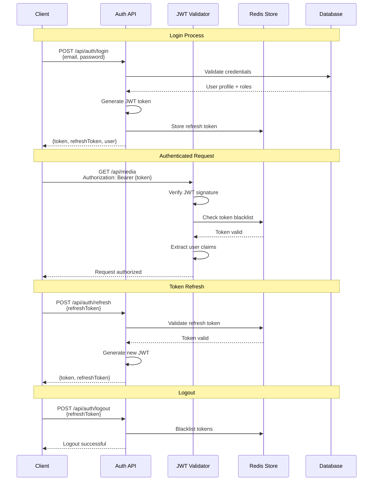
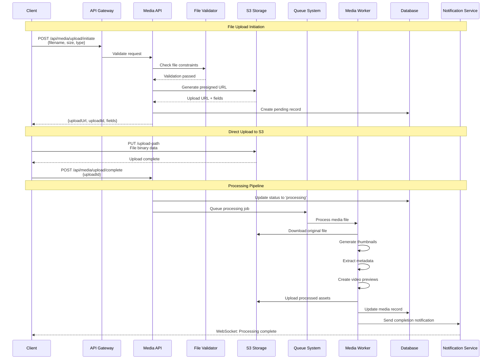
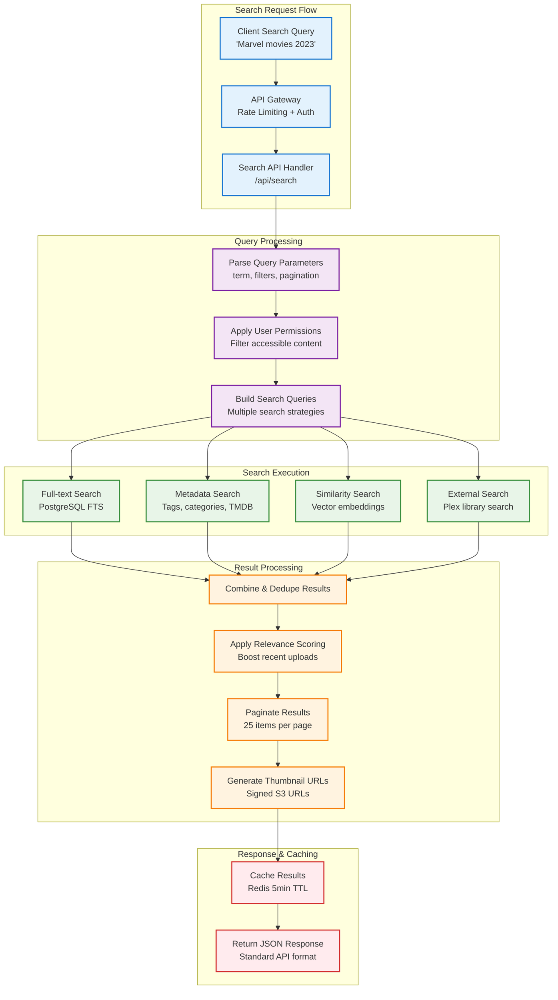
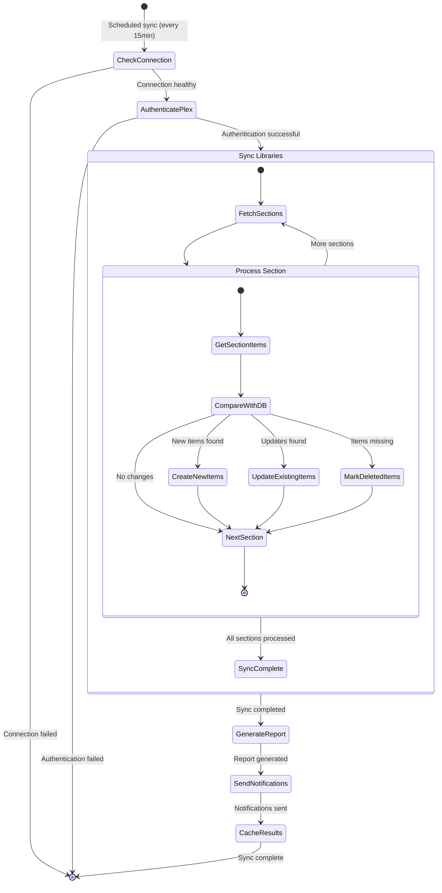
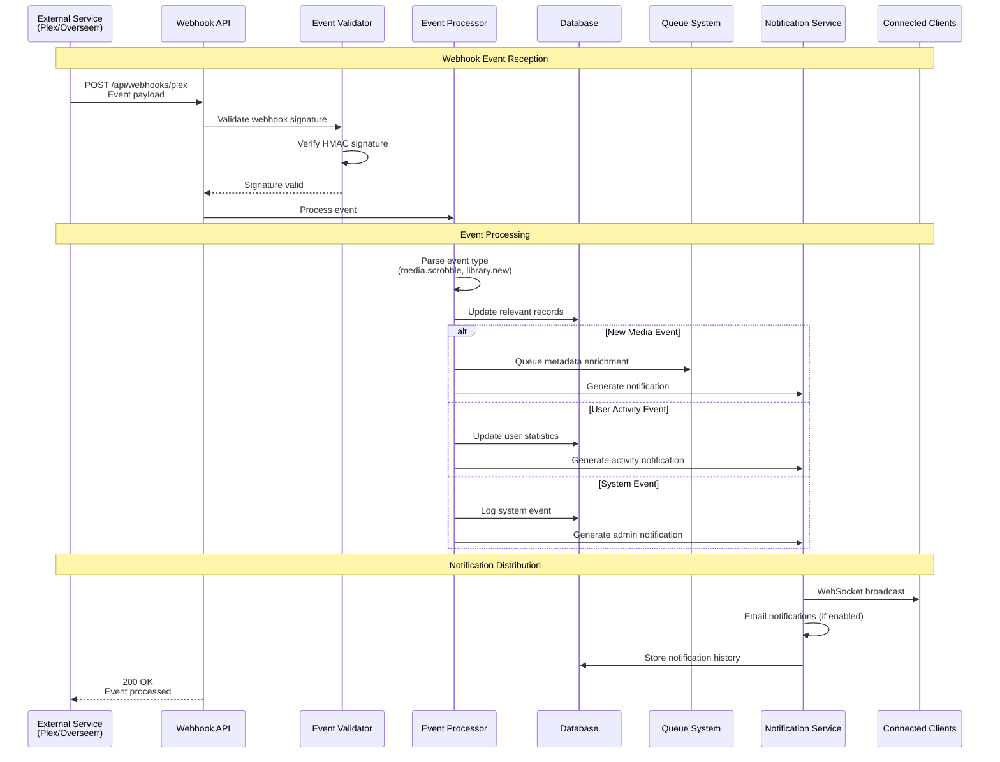
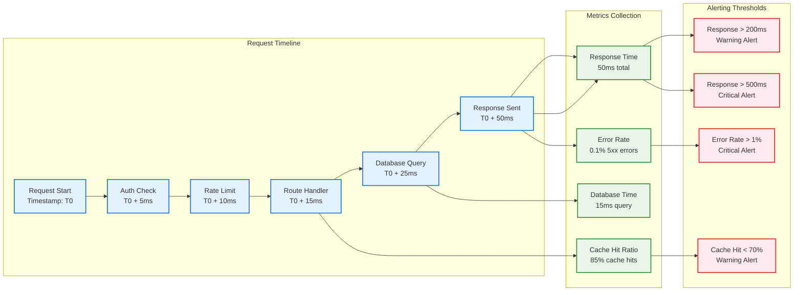
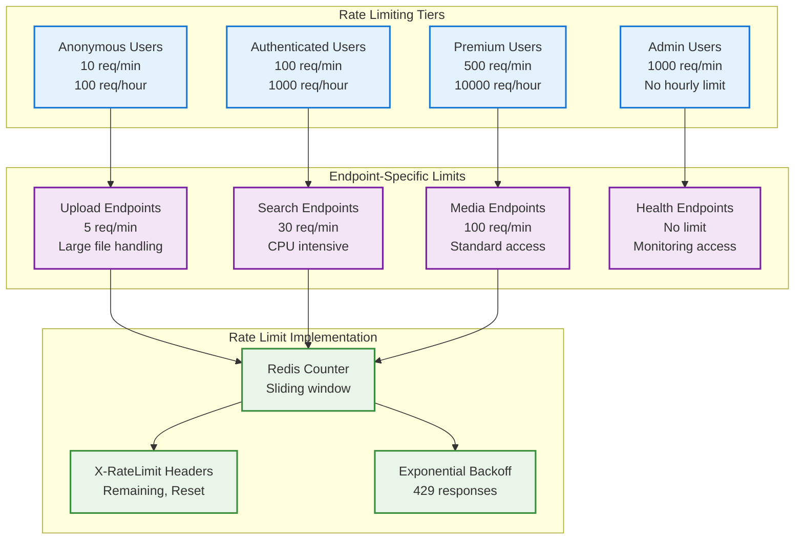
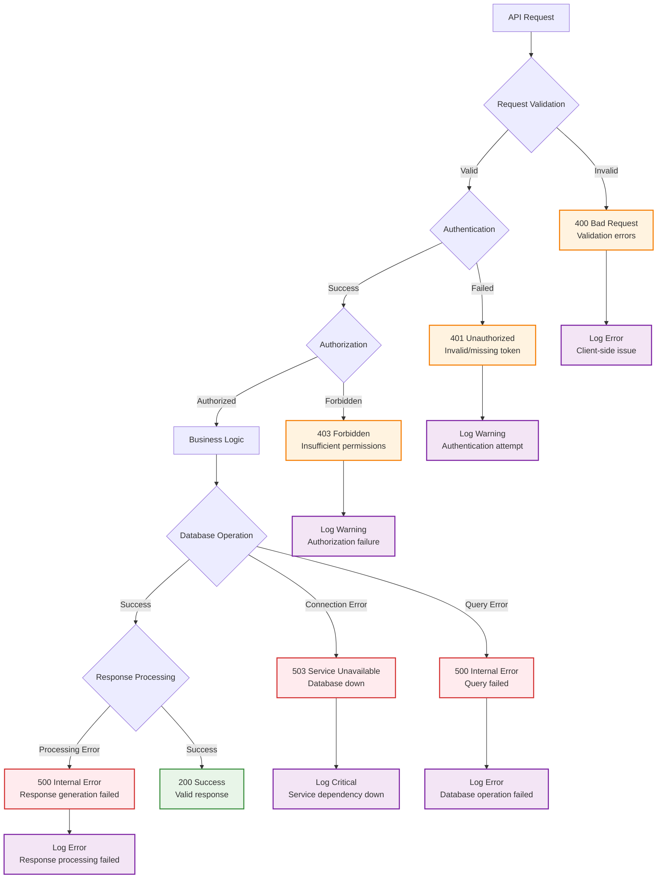

# MediaNest API Workflow Diagrams

## 🔌 API Architecture Overview

### API Gateway & Routing Structure

```mermaid
graph TB
    subgraph "Client Applications"
        WEB[Web Frontend<br/>Next.js]
        MOBILE[Mobile App<br/>React Native]
        CLI[CLI Client<br/>Node.js]
        THIRD[Third-party Apps<br/>External Integrations]
    end
    
    subgraph "API Gateway Layer"
        LB[Load Balancer<br/>Traefik/HAProxy]
        RATE[Rate Limiter<br/>Redis-based]
        AUTH[Authentication<br/>JWT Middleware]
        CORS[CORS Handler<br/>Origin Validation]
    end
    
    subgraph "API Routes & Handlers"
        subgraph "Core APIs"
            MEDIA_API[/api/media<br/>Media Management]
            USER_API[/api/users<br/>User Management]  
            AUTH_API[/api/auth<br/>Authentication]
            SEARCH_API[/api/search<br/>Search & Discovery]
        end
        
        subgraph "Integration APIs"
            PLEX_API[/api/integrations/plex<br/>Plex Media Server]
            OVERSEERR_API[/api/integrations/overseerr<br/>Request Management]
            WEBHOOK_API[/api/webhooks<br/>Event Callbacks]
        end
        
        subgraph "System APIs"
            HEALTH_API[/api/health<br/>Health Checks]
            METRICS_API[/api/metrics<br/>System Metrics]
            ADMIN_API[/api/admin<br/>Administration]
        end
    end
    
    subgraph "Business Logic Layer"
        MEDIA_SVC[Media Service]
        USER_SVC[User Service]
        INTEGRATION_SVC[Integration Service]
        NOTIFICATION_SVC[Notification Service]
    end
    
    subgraph "Data Access Layer"
        PG[(PostgreSQL<br/>Primary Data)]
        REDIS[(Redis<br/>Cache + Sessions)]
        S3[Object Storage<br/>Media Files]
    end
    
    %% Client connections
    WEB --> LB
    MOBILE --> LB
    CLI --> LB
    THIRD --> LB
    
    %% Gateway processing
    LB --> RATE
    RATE --> AUTH
    AUTH --> CORS
    
    %% Route distribution
    CORS --> MEDIA_API
    CORS --> USER_API
    CORS --> AUTH_API
    CORS --> SEARCH_API
    CORS --> PLEX_API
    CORS --> OVERSEERR_API
    CORS --> WEBHOOK_API
    CORS --> HEALTH_API
    CORS --> METRICS_API
    CORS --> ADMIN_API
    
    %% Service connections
    MEDIA_API --> MEDIA_SVC
    USER_API --> USER_SVC
    PLEX_API --> INTEGRATION_SVC
    OVERSEERR_API --> INTEGRATION_SVC
    WEBHOOK_API --> NOTIFICATION_SVC
    
    %% Data access
    MEDIA_SVC --> PG
    MEDIA_SVC --> REDIS
    MEDIA_SVC --> S3
    USER_SVC --> PG
    USER_SVC --> REDIS
    INTEGRATION_SVC --> REDIS
    
    %% Styling
    classDef client fill:#e3f2fd,stroke:#1976d2,stroke-width:2px
    classDef gateway fill:#f3e5f5,stroke:#7b1fa2,stroke-width:2px
    classDef api fill:#e8f5e8,stroke:#388e3c,stroke-width:2px
    classDef service fill:#fff3e0,stroke:#f57c00,stroke-width:2px
    classDef data fill:#ffebee,stroke:#d32f2f,stroke-width:2px
    
    class WEB,MOBILE,CLI,THIRD client
    class LB,RATE,AUTH,CORS gateway
    class MEDIA_API,USER_API,AUTH_API,SEARCH_API,PLEX_API,OVERSEERR_API,WEBHOOK_API,HEALTH_API,METRICS_API,ADMIN_API api
    class MEDIA_SVC,USER_SVC,INTEGRATION_SVC,NOTIFICATION_SVC service
    class PG,REDIS,S3 data
```

## 🔐 Authentication & Authorization Workflows

### JWT Authentication Flow



### Role-Based Access Control (RBAC)

```mermaid
graph TB
    subgraph "User Roles"
        GUEST[Guest User<br/>Limited Access]
        USER[Regular User<br/>Personal Media]
        ADMIN[Administrator<br/>Full System Access]
        SUPER[Super Admin<br/>System Management]
    end
    
    subgraph "Permission Matrix"
        subgraph "Media Permissions"
            READ_MEDIA[Read Media]
            UPLOAD_MEDIA[Upload Media]
            DELETE_MEDIA[Delete Media]
            ADMIN_MEDIA[Manage All Media]
        end
        
        subgraph "User Permissions"
            VIEW_PROFILE[View Profile]
            EDIT_PROFILE[Edit Profile]
            MANAGE_USERS[Manage Users]
            SYSTEM_SETTINGS[System Settings]
        end
        
        subgraph "Integration Permissions"
            VIEW_INTEGRATIONS[View Integrations]
            CONFIG_INTEGRATIONS[Configure Integrations]
            MANAGE_WEBHOOKS[Manage Webhooks]
        end
    end
    
    %% Permission assignments
    GUEST --> READ_MEDIA
    GUEST --> VIEW_PROFILE
    
    USER --> READ_MEDIA
    USER --> UPLOAD_MEDIA
    USER --> VIEW_PROFILE
    USER --> EDIT_PROFILE
    USER --> VIEW_INTEGRATIONS
    
    ADMIN --> READ_MEDIA
    ADMIN --> UPLOAD_MEDIA
    ADMIN --> DELETE_MEDIA
    ADMIN --> VIEW_PROFILE
    ADMIN --> EDIT_PROFILE
    ADMIN --> MANAGE_USERS
    ADMIN --> CONFIG_INTEGRATIONS
    ADMIN --> MANAGE_WEBHOOKS
    
    SUPER --> ADMIN_MEDIA
    SUPER --> MANAGE_USERS
    SUPER --> SYSTEM_SETTINGS
    SUPER --> CONFIG_INTEGRATIONS
    SUPER --> MANAGE_WEBHOOKS
    
    %% Styling
    classDef role fill:#e3f2fd,stroke:#1976d2,stroke-width:2px
    classDef media fill:#e8f5e8,stroke:#388e3c,stroke-width:2px
    classDef user fill:#f3e5f5,stroke:#7b1fa2,stroke-width:2px
    classDef integration fill:#fff3e0,stroke:#f57c00,stroke-width:2px
    
    class GUEST,USER,ADMIN,SUPER role
    class READ_MEDIA,UPLOAD_MEDIA,DELETE_MEDIA,ADMIN_MEDIA media
    class VIEW_PROFILE,EDIT_PROFILE,MANAGE_USERS,SYSTEM_SETTINGS user
    class VIEW_INTEGRATIONS,CONFIG_INTEGRATIONS,MANAGE_WEBHOOKS integration
```



## 📁 Media Management API Workflows

### File Upload Process



### Media Search & Discovery



## 🔗 Integration API Workflows

### Plex Integration Sync



### Webhook Event Processing



## 📊 API Performance & Monitoring

### Request Lifecycle Monitoring



### API Rate Limiting Strategy



## 🚨 Error Handling & Recovery

### API Error Response Flow



---

*These API workflow diagrams provide comprehensive insights into MediaNest's API architecture, ensuring efficient development, debugging, and integration processes.*