# MediaNest C4 Architecture Diagrams

This document provides comprehensive C4 model architecture diagrams for MediaNest, following the C4 model methodology for visualizing software architecture.

## Level 1: System Context Diagram

### System Landscape Overview

```mermaid
C4Context
    title MediaNest System Landscape

    Person(content_consumer, "Content Consumer", "Watches and discovers media content")
    Person(media_requester, "Media Requester", "Requests new media content")
    Person(system_admin, "System Administrator", "Manages system configuration and monitoring")
    Person(developer, "Developer", "Develops and maintains the platform")

    Enterprise_Boundary(medianest_enterprise, "MediaNest Enterprise") {
        System(medianest, "MediaNest Platform", "Advanced Media Management Platform with integrated request handling, YouTube downloads, and Plex integration")
        System(monitoring, "Monitoring System", "System observability and alerting platform")
        System(backup, "Backup System", "Data backup and disaster recovery system")
    }

    Enterprise_Boundary(media_ecosystem, "Media Ecosystem") {
        System_Ext(plex_server, "Plex Media Server", "Personal media streaming server")
        System_Ext(overseerr, "Overseerr", "Media request management and automation platform")
        System_Ext(sonarr, "Sonarr", "TV series management and automation")
        System_Ext(radarr, "Radarr", "Movie management and automation")
    }

    Enterprise_Boundary(content_sources, "Content Sources") {
        System_Ext(tmdb, "The Movie Database", "Movie and TV show metadata service")
        System_Ext(youtube, "YouTube", "Video sharing and streaming platform")
        System_Ext(torrents, "Torrent Networks", "P2P content distribution networks")
    }

    Enterprise_Boundary(infrastructure, "Infrastructure Services") {
        System_Ext(cloud_provider, "Cloud Provider", "Hosting and infrastructure services")
        System_Ext(cdn, "Content Delivery Network", "Global content distribution")
        System_Ext(email_service, "Email Service", "Transactional email delivery")
        System_Ext(sms_service, "SMS Service", "SMS notification delivery")
    }

    %% Primary user interactions
    Rel(content_consumer, medianest, "Browses and discovers content", "HTTPS")
    Rel(media_requester, medianest, "Submits media requests", "HTTPS")
    Rel(system_admin, medianest, "Configures and monitors", "HTTPS Admin Panel")
    Rel(system_admin, monitoring, "Views metrics and alerts", "HTTPS")
    Rel(developer, medianest, "Deploys and maintains", "CI/CD")

    %% MediaNest to Media Ecosystem
    Rel(medianest, plex_server, "Manages libraries and collections", "REST API, OAuth")
    Rel(medianest, overseerr, "Submits and tracks requests", "REST API, Webhooks")
    Rel(overseerr, sonarr, "Manages TV downloads", "REST API")
    Rel(overseerr, radarr, "Manages movie downloads", "REST API")

    %% Content source integrations
    Rel(medianest, tmdb, "Fetches metadata and artwork", "REST API")
    Rel(medianest, youtube, "Downloads playlists and videos", "API")
    Rel(sonarr, torrents, "Downloads TV content", "Various protocols")
    Rel(radarr, torrents, "Downloads movie content", "Various protocols")

    %% Infrastructure dependencies
    Rel(medianest, cloud_provider, "Hosted on", "Infrastructure")
    Rel(medianest, cdn, "Serves static content via", "HTTP/2")
    Rel(medianest, email_service, "Sends notifications via", "SMTP/API")
    Rel(medianest, sms_service, "Sends alerts via", "REST API")

    %% System to system relationships
    Rel(medianest, monitoring, "Sends metrics and logs to", "Prometheus/Grafana")
    Rel(medianest, backup, "Backed up by", "Automated backup")
    Rel(plex_server, medianest, "Sends webhook events to", "HTTP Webhooks")

    UpdateLayoutConfig($c4ShapeInRow="3", $c4BoundaryInRow="1")
```

## Level 2: Container Diagram

### MediaNest Container Architecture

```mermaid
C4Container
    title MediaNest Platform - Container Architecture

    Person(user, "Platform User", "Interacts with MediaNest for media management")

    System_Boundary(medianest_platform, "MediaNest Platform") {
        Container(spa, "Single Page Application", "React, Next.js, TypeScript", "Provides media management interface and real-time updates")
        Container(mobile_app, "Mobile Application", "React Native, TypeScript", "Mobile access to MediaNest features")
        Container(api_gateway, "API Gateway", "Kong/Istio Service Mesh", "API routing, authentication, rate limiting, and security")

        Container(web_server, "Web Server", "Nginx", "Serves static content, SSL termination, load balancing")
        Container(api_server, "API Application", "Express.js, Node.js, TypeScript", "Handles business logic, integrations, and data processing")
        Container(websocket_server, "WebSocket Server", "Socket.IO", "Real-time communication and notifications")
        Container(background_workers, "Background Workers", "Node.js, Bull Queue", "Asynchronous job processing for downloads and integrations")

        ContainerDb(primary_db, "Primary Database", "PostgreSQL 15", "Stores user data, media requests, system configuration")
        ContainerDb(cache_db, "Cache Database", "Redis 7", "Session storage, caching, pub/sub messaging")
        ContainerDb(search_db, "Search Database", "Elasticsearch", "Full-text search for media content")
        ContainerDb(time_series_db, "Metrics Database", "InfluxDB", "Performance metrics and monitoring data")

        Container(file_storage, "File Storage", "MinIO/S3", "Stores downloaded media files, thumbnails, logs")
        Container(backup_service, "Backup Service", "PostgreSQL Backup, Redis AOF", "Automated database backups and point-in-time recovery")
    }

    System_Boundary(monitoring_observability, "Monitoring & Observability") {
        Container(metrics_collector, "Metrics Collector", "Prometheus", "Collects and stores system metrics")
        Container(dashboard, "Monitoring Dashboard", "Grafana", "Visualizes metrics and system health")
        Container(log_aggregator, "Log Aggregator", "ELK Stack", "Centralizes and analyzes application logs")
        Container(error_tracker, "Error Tracking", "Sentry", "Captures and tracks application errors")
        Container(uptime_monitor, "Uptime Monitor", "Uptime Kuma", "External service monitoring and alerts")
        Container(apm, "Application Performance Monitoring", "New Relic/DataDog", "Deep application performance insights")
    }

    System_Ext(plex_server, "Plex Media Server", "Personal media server")
    System_Ext(overseerr, "Overseerr", "Media request automation")
    System_Ext(tmdb_api, "TMDB API", "Movie/TV metadata")
    System_Ext(youtube_api, "YouTube API", "Video platform integration")
    System_Ext(email_service, "Email Service", "Transactional emails")

    %% User interactions
    Rel(user, web_server, "Uses", "HTTPS")
    Rel(user, mobile_app, "Uses", "Mobile App")

    %% Web tier
    Rel(web_server, spa, "Serves", "HTTPS")
    Rel(web_server, api_gateway, "Proxies API requests to", "HTTP")
    Rel(spa, api_gateway, "Makes API calls to", "HTTPS/REST")
    Rel(spa, websocket_server, "Connects to", "WebSocket/WSS")
    Rel(mobile_app, api_gateway, "Makes API calls to", "HTTPS/REST")

    %% API tier
    Rel(api_gateway, api_server, "Routes requests to", "HTTP/gRPC")
    Rel(api_server, websocket_server, "Triggers notifications via", "Internal API")
    Rel(api_server, background_workers, "Queues jobs to", "Redis Queue")

    %% Data tier
    Rel(api_server, primary_db, "Reads/Writes", "PostgreSQL Protocol")
    Rel(api_server, cache_db, "Caches/Sessions", "Redis Protocol")
    Rel(api_server, search_db, "Searches", "REST API")
    Rel(background_workers, primary_db, "Updates job status", "PostgreSQL Protocol")
    Rel(background_workers, file_storage, "Stores files", "S3 API")
    Rel(websocket_server, cache_db, "Pub/Sub", "Redis Protocol")

    %% External integrations
    Rel(api_server, plex_server, "Manages libraries", "REST API")
    Rel(api_server, overseerr, "Submits requests", "REST API")
    Rel(api_server, tmdb_api, "Fetches metadata", "REST API")
    Rel(background_workers, youtube_api, "Downloads content", "API")
    Rel(api_server, email_service, "Sends notifications", "SMTP/API")

    %% Monitoring
    Rel(api_server, metrics_collector, "Sends metrics", "HTTP")
    Rel(background_workers, metrics_collector, "Sends metrics", "HTTP")
    Rel(websocket_server, log_aggregator, "Sends logs", "HTTP")
    Rel(api_server, error_tracker, "Reports errors", "HTTP")
    Rel(metrics_collector, dashboard, "Provides data", "PromQL")
    Rel(metrics_collector, time_series_db, "Stores metrics", "InfluxDB Protocol")
    Rel(uptime_monitor, api_server, "Health checks", "HTTP")

    %% Backup
    Rel(backup_service, primary_db, "Backs up", "pg_dump")
    Rel(backup_service, cache_db, "Backs up", "Redis AOF")
    Rel(backup_service, file_storage, "Backs up", "S3 Sync")

    UpdateLayoutConfig($c4ShapeInRow="3", $c4BoundaryInRow="1")
```

## Level 3: Component Diagram - API Application

### API Application Internal Architecture

```mermaid
C4Component
    title MediaNest API Application - Component Architecture

    Container(spa, "Web Application", "React/Next.js", "User interface")
    Container(mobile_app, "Mobile App", "React Native", "Mobile interface")
    Container(websocket_server, "WebSocket Server", "Socket.IO", "Real-time communication")

    Container_Boundary(api_application, "API Application") {
        Component(api_gateway_internal, "Internal API Gateway", "Express Gateway", "Request routing and middleware orchestration")

        Component(auth_controller, "Authentication Controller", "Express Controller", "Handles login, logout, token management")
        Component(media_controller, "Media Controller", "Express Controller", "Media request lifecycle management")
        Component(plex_controller, "Plex Controller", "Express Controller", "Plex server integration endpoints")
        Component(dashboard_controller, "Dashboard Controller", "Express Controller", "System statistics and user dashboards")
        Component(admin_controller, "Admin Controller", "Express Controller", "Administrative functions and system configuration")
        Component(youtube_controller, "YouTube Controller", "Express Controller", "YouTube download management")
        Component(health_controller, "Health Controller", "Express Controller", "System health checks and status")
        Component(webhook_controller, "Webhook Controller", "Express Controller", "External webhook processing")

        Component(auth_service, "Authentication Service", "Service Class", "JWT tokens, OAuth flows, session management")
        Component(media_service, "Media Service", "Service Class", "Media request workflow and business logic")
        Component(plex_service, "Plex Service", "Service Class", "Plex API integration and library management")
        Component(cache_service, "Cache Service", "Service Class", "Multi-tier caching and invalidation")
        Component(notification_service, "Notification Service", "Service Class", "Multi-channel notification delivery")
        Component(search_service, "Search Service", "Service Class", "Full-text search and indexing")
        Component(youtube_service, "YouTube Service", "Service Class", "YouTube API integration and downloads")
        Component(health_service, "Health Service", "Service Class", "System monitoring and diagnostics")
        Component(audit_service, "Audit Service", "Service Class", "Activity logging and compliance")
        Component(integration_service, "Integration Service", "Service Class", "External API coordination")

        Component(user_repository, "User Repository", "Repository Class", "User data access and management")
        Component(media_repository, "Media Repository", "Repository Class", "Media request data operations")
        Component(youtube_repository, "YouTube Repository", "Repository Class", "Download job data management")
        Component(service_repository, "Service Repository", "Repository Class", "Service status and configuration")
        Component(notification_repository, "Notification Repository", "Repository Class", "Notification history and preferences")
        Component(audit_repository, "Audit Repository", "Repository Class", "System audit and compliance logs")
        Component(cache_repository, "Cache Repository", "Repository Class", "Cache operations and management")

        Component(middleware_stack, "Middleware Stack", "Express Middleware", "Cross-cutting concerns pipeline")
        Component(validation_middleware, "Validation Middleware", "Joi/Zod Schemas", "Request/response validation")
        Component(auth_middleware, "Authentication Middleware", "JWT Middleware", "Token validation and user context")
        Component(rate_limit_middleware, "Rate Limiting Middleware", "Express Rate Limit", "API usage throttling")
        Component(security_middleware, "Security Middleware", "Helmet.js", "Security headers and protection")
        Component(logging_middleware, "Logging Middleware", "Winston/Pino", "Request/response logging")
        Component(error_middleware, "Error Handling Middleware", "Express Error Handler", "Centralized error processing")

        Component(event_bus, "Internal Event Bus", "EventEmitter/Bull", "Inter-component communication")
        Component(job_scheduler, "Job Scheduler", "Bull Queue", "Background job management")
        Component(circuit_breaker, "Circuit Breaker", "Opossum", "External service failure protection")
    }

    ContainerDb(postgres, "PostgreSQL", "Primary database")
    ContainerDb(redis, "Redis", "Cache and sessions")
    ContainerDb(elasticsearch, "Elasticsearch", "Search index")

    System_Ext(plex_server, "Plex Media Server", "Media server")
    System_Ext(overseerr, "Overseerr", "Request automation")
    System_Ext(tmdb, "TMDB API", "Metadata service")
    System_Ext(youtube, "YouTube API", "Video platform")

    %% External requests
    Rel(spa, api_gateway_internal, "Makes API calls", "HTTPS/REST")
    Rel(mobile_app, api_gateway_internal, "Makes API calls", "HTTPS/REST")

    %% Middleware pipeline
    Rel(api_gateway_internal, middleware_stack, "Processes requests through")
    Rel(middleware_stack, security_middleware, "Security processing")
    Rel(middleware_stack, rate_limit_middleware, "Rate limiting")
    Rel(middleware_stack, auth_middleware, "Authentication")
    Rel(middleware_stack, validation_middleware, "Validation")
    Rel(middleware_stack, logging_middleware, "Logging")

    %% Controller routing
    Rel(middleware_stack, auth_controller, "Routes auth requests")
    Rel(middleware_stack, media_controller, "Routes media requests")
    Rel(middleware_stack, plex_controller, "Routes Plex requests")
    Rel(middleware_stack, dashboard_controller, "Routes dashboard requests")
    Rel(middleware_stack, admin_controller, "Routes admin requests")
    Rel(middleware_stack, youtube_controller, "Routes YouTube requests")
    Rel(middleware_stack, health_controller, "Routes health requests")
    Rel(middleware_stack, webhook_controller, "Routes webhook requests")

    %% Controller to service
    Rel(auth_controller, auth_service, "Uses")
    Rel(media_controller, media_service, "Uses")
    Rel(plex_controller, plex_service, "Uses")
    Rel(dashboard_controller, cache_service, "Uses")
    Rel(dashboard_controller, search_service, "Uses")
    Rel(admin_controller, health_service, "Uses")
    Rel(admin_controller, audit_service, "Uses")
    Rel(youtube_controller, youtube_service, "Uses")
    Rel(health_controller, health_service, "Uses")
    Rel(webhook_controller, integration_service, "Uses")

    %% Service to repository
    Rel(auth_service, user_repository, "Uses")
    Rel(auth_service, cache_repository, "Uses")
    Rel(media_service, media_repository, "Uses")
    Rel(media_service, user_repository, "Uses")
    Rel(plex_service, service_repository, "Uses")
    Rel(youtube_service, youtube_repository, "Uses")
    Rel(notification_service, notification_repository, "Uses")
    Rel(audit_service, audit_repository, "Uses")
    Rel(search_service, cache_repository, "Uses")
    Rel(health_service, service_repository, "Uses")

    %% Repository to database
    Rel(user_repository, postgres, "Queries", "SQL")
    Rel(media_repository, postgres, "Queries", "SQL")
    Rel(youtube_repository, postgres, "Queries", "SQL")
    Rel(service_repository, postgres, "Queries", "SQL")
    Rel(notification_repository, postgres, "Queries", "SQL")
    Rel(audit_repository, postgres, "Queries", "SQL")
    Rel(cache_repository, redis, "Operations", "Redis Protocol")

    %% Search integration
    Rel(search_service, elasticsearch, "Searches", "REST API")
    Rel(media_service, search_service, "Indexes content")

    %% Event and job processing
    Rel(media_service, event_bus, "Publishes events")
    Rel(youtube_service, job_scheduler, "Queues jobs")
    Rel(notification_service, event_bus, "Subscribes to events")
    Rel(event_bus, websocket_server, "Triggers notifications")

    %% External service integration
    Rel(plex_service, circuit_breaker, "Protected calls")
    Rel(circuit_breaker, plex_server, "API calls", "REST API")
    Rel(integration_service, overseerr, "API calls", "REST API")
    Rel(media_service, tmdb, "Metadata requests", "REST API")
    Rel(youtube_service, youtube, "Video operations", "API")

    %% Error handling
    Rel(auth_controller, error_middleware, "Error propagation")
    Rel(media_controller, error_middleware, "Error propagation")
    Rel(plex_controller, error_middleware, "Error propagation")
    Rel(dashboard_controller, error_middleware, "Error propagation")
    Rel(admin_controller, error_middleware, "Error propagation")
    Rel(youtube_controller, error_middleware, "Error propagation")

    UpdateLayoutConfig($c4ShapeInRow="4", $c4BoundaryInRow="1")
```

## Level 4: Code Diagram - Authentication Service

### Authentication Service Internal Structure

```mermaid
C4Component
    title Authentication Service - Detailed Code Architecture

    Container_Boundary(auth_service_detail, "Authentication Service") {
        Component(auth_facade, "AuthenticationFacade", "Service Facade", "Main authentication orchestration")

        Component(jwt_service, "JWTService", "Token Service", "JWT token generation, validation, and rotation")
        Component(oauth_service, "OAuthService", "OAuth Provider", "Plex OAuth integration and token exchange")
        Component(session_service, "SessionService", "Session Manager", "User session lifecycle management")
        Component(password_service, "PasswordService", "Password Manager", "Password hashing, validation, and reset")
        Component(device_service, "DeviceService", "Device Manager", "Device registration and fingerprinting")
        Component(rate_limiter, "RateLimiterService", "Rate Limiter", "Authentication attempt rate limiting")
        Component(audit_logger, "AuditLogger", "Security Auditor", "Authentication event logging")

        Component(token_validator, "TokenValidator", "Validator", "JWT signature and expiration validation")
        Component(credential_validator, "CredentialValidator", "Validator", "User credential validation")
        Component(device_fingerprinter, "DeviceFingerprinter", "Security Component", "Browser/device fingerprinting")
        Component(session_analyzer, "SessionAnalyzer", "Analytics", "Session behavior analysis")

        Component(auth_repository, "AuthRepository", "Data Access", "Authentication data operations")
        Component(session_repository, "SessionRepository", "Data Access", "Session data persistence")
        Component(device_repository, "DeviceRepository", "Data Access", "Device registration data")
        Component(rate_limit_repository, "RateLimitRepository", "Data Access", "Rate limiting data")

        Component(auth_cache, "AuthCache", "Cache Layer", "Authentication data caching")
        Component(session_cache, "SessionCache", "Cache Layer", "Active session caching")
        Component(token_blacklist, "TokenBlacklist", "Security Cache", "Revoked token management")
    }

    ContainerDb(postgres_users, "User Database", "PostgreSQL", "User accounts and credentials")
    ContainerDb(redis_auth, "Auth Cache", "Redis", "Sessions and temporary auth data")

    System_Ext(plex_oauth, "Plex OAuth Provider", "External OAuth service")
    Container(notification_service, "Notification Service", "Internal service", "User notifications")
    Container(audit_service, "Audit Service", "Internal service", "System audit logging")

    %% Main facade coordination
    Rel(auth_facade, jwt_service, "Manages tokens")
    Rel(auth_facade, oauth_service, "OAuth flows")
    Rel(auth_facade, session_service, "Session management")
    Rel(auth_facade, password_service, "Password operations")
    Rel(auth_facade, device_service, "Device tracking")
    Rel(auth_facade, rate_limiter, "Rate limiting")
    Rel(auth_facade, audit_logger, "Security logging")

    %% Service internal dependencies
    Rel(jwt_service, token_validator, "Token validation")
    Rel(jwt_service, token_blacklist, "Revocation check")
    Rel(oauth_service, credential_validator, "Credential validation")
    Rel(session_service, device_fingerprinter, "Device identification")
    Rel(session_service, session_analyzer, "Behavior analysis")
    Rel(device_service, device_fingerprinter, "Fingerprint generation")

    %% Repository layer
    Rel(jwt_service, auth_repository, "Token storage")
    Rel(session_service, session_repository, "Session persistence")
    Rel(device_service, device_repository, "Device data")
    Rel(rate_limiter, rate_limit_repository, "Rate limit data")

    %% Cache layer
    Rel(jwt_service, auth_cache, "Token caching")
    Rel(session_service, session_cache, "Session caching")
    Rel(token_validator, token_blacklist, "Blacklist check")
    Rel(rate_limiter, auth_cache, "Rate limit caching")

    %% Data persistence
    Rel(auth_repository, postgres_users, "User queries", "SQL")
    Rel(session_repository, postgres_users, "Session storage", "SQL")
    Rel(device_repository, postgres_users, "Device data", "SQL")
    Rel(rate_limit_repository, postgres_users, "Rate limits", "SQL")

    %% Cache operations
    Rel(auth_cache, redis_auth, "Cache operations", "Redis")
    Rel(session_cache, redis_auth, "Session cache", "Redis")
    Rel(token_blacklist, redis_auth, "Blacklist storage", "Redis")

    %% External integrations
    Rel(oauth_service, plex_oauth, "OAuth flow", "OAuth 2.0")
    Rel(audit_logger, audit_service, "Audit events", "Internal API")
    Rel(session_service, notification_service, "Session alerts", "Internal API")

    %% Security flows
    Rel(credential_validator, password_service, "Password verification")
    Rel(session_analyzer, audit_logger, "Suspicious activity")
    Rel(device_fingerprinter, session_analyzer, "Device behavior")
    Rel(token_validator, session_service, "Token session link")

    UpdateLayoutConfig($c4ShapeInRow="3", $c4BoundaryInRow="1")
```

## Deployment Architecture Diagram

### Production Deployment View

```mermaid
C4Deployment
    title MediaNest Production Deployment Architecture

    Deployment_Node(user_devices, "User Devices", "Various platforms") {
        Container(web_browser, "Web Browser", "Chrome, Firefox, Safari", "User interface access")
        Container(mobile_app, "Mobile App", "iOS/Android", "Native mobile access")
    }

    Deployment_Node(cdn, "Content Delivery Network", "CloudFlare/AWS CloudFront") {
        Container(edge_cache, "Edge Cache", "Static content cache", "Global content distribution")
        Container(ddos_protection, "DDoS Protection", "Traffic filtering", "Attack mitigation")
    }

    Deployment_Node(load_balancer, "Load Balancer", "AWS ALB/NGINX Plus") {
        Container(ssl_termination, "SSL Termination", "TLS 1.3 endpoints", "Certificate management")
        Container(traffic_router, "Traffic Router", "Intelligent routing", "Request distribution")
    }

    Deployment_Node(kubernetes_cluster, "Kubernetes Cluster", "AWS EKS/GKE") {
        Deployment_Node(web_tier, "Web Tier Pods", "NGINX containers") {
            Container(nginx_pod1, "NGINX Pod 1", "Static serving", "Web server instance")
            Container(nginx_pod2, "NGINX Pod 2", "Static serving", "Web server instance")
        }

        Deployment_Node(api_tier, "API Tier Pods", "Node.js containers") {
            Container(api_pod1, "API Pod 1", "Express.js application", "Business logic instance")
            Container(api_pod2, "API Pod 2", "Express.js application", "Business logic instance")
            Container(api_pod3, "API Pod 3", "Express.js application", "Business logic instance")
        }

        Deployment_Node(worker_tier, "Worker Tier Pods", "Background processing") {
            Container(worker_pod1, "Worker Pod 1", "Download processor", "Background job worker")
            Container(worker_pod2, "Worker Pod 2", "Media processor", "Background job worker")
        }

        Deployment_Node(websocket_tier, "WebSocket Tier", "Real-time communication") {
            Container(ws_pod1, "WebSocket Pod 1", "Socket.IO server", "Real-time notifications")
            Container(ws_pod2, "WebSocket Pod 2", "Socket.IO server", "Real-time notifications")
        }
    }

    Deployment_Node(database_tier, "Database Tier", "Managed database services") {
        Deployment_Node(postgres_cluster, "PostgreSQL Cluster", "AWS RDS/Google Cloud SQL") {
            ContainerDb(postgres_primary, "PostgreSQL Primary", "Write operations", "Main database")
            ContainerDb(postgres_replica1, "PostgreSQL Replica 1", "Read operations", "Read replica")
            ContainerDb(postgres_replica2, "PostgreSQL Replica 2", "Read operations", "Read replica")
        }

        Deployment_Node(redis_cluster, "Redis Cluster", "ElastiCache/MemoryStore") {
            ContainerDb(redis_master, "Redis Master", "Write operations", "Cache master")
            ContainerDb(redis_slave1, "Redis Slave 1", "Read operations", "Cache replica")
            ContainerDb(redis_slave2, "Redis Slave 2", "Read operations", "Cache replica")
        }

        Deployment_Node(search_cluster, "Elasticsearch Cluster", "Managed search service") {
            ContainerDb(es_master, "ES Master Node", "Cluster coordination", "Search master")
            ContainerDb(es_data1, "ES Data Node 1", "Data storage/search", "Search node")
            ContainerDb(es_data2, "ES Data Node 2", "Data storage/search", "Search node")
        }
    }

    Deployment_Node(storage_tier, "Storage Tier", "Object storage") {
        Container(file_storage, "Object Storage", "AWS S3/GCS", "Media file storage")
        Container(backup_storage, "Backup Storage", "Glacier/Coldline", "Long-term backups")
        Container(log_storage, "Log Storage", "S3/GCS", "Application logs")
    }

    Deployment_Node(monitoring_tier, "Monitoring Infrastructure", "Observability stack") {
        Container(prometheus, "Prometheus", "Metrics collection", "Time-series database")
        Container(grafana, "Grafana", "Metrics visualization", "Monitoring dashboards")
        Container(elk_stack, "ELK Stack", "Log aggregation", "Log analysis platform")
        Container(jaeger, "Jaeger", "Distributed tracing", "Request tracing")
    }

    Deployment_Node(external_services, "External Services", "Third-party integrations") {
        System_Ext(plex_server, "Plex Media Server", "Self-hosted media server")
        System_Ext(overseerr, "Overseerr", "Media request automation")
        System_Ext(tmdb_api, "TMDB API", "Movie/TV metadata")
        System_Ext(youtube_api, "YouTube API", "Video platform")
    }

    %% User traffic flow
    Rel(web_browser, edge_cache, "HTTPS requests", "443")
    Rel(mobile_app, edge_cache, "HTTPS requests", "443")

    %% CDN to load balancer
    Rel(edge_cache, ssl_termination, "HTTPS", "443")
    Rel(ddos_protection, traffic_router, "Filtered traffic", "80/443")

    %% Load balancer to Kubernetes
    Rel(traffic_router, nginx_pod1, "HTTP", "80")
    Rel(traffic_router, nginx_pod2, "HTTP", "80")
    Rel(ssl_termination, api_pod1, "HTTP", "8080")
    Rel(ssl_termination, api_pod2, "HTTP", "8080")
    Rel(ssl_termination, api_pod3, "HTTP", "8080")

    %% WebSocket connections
    Rel(web_browser, ws_pod1, "WebSocket", "3000")
    Rel(mobile_app, ws_pod2, "WebSocket", "3000")

    %% API to databases
    Rel(api_pod1, postgres_primary, "SQL", "5432")
    Rel(api_pod2, postgres_replica1, "SQL", "5432")
    Rel(api_pod3, postgres_replica2, "SQL", "5432")

    Rel(api_pod1, redis_master, "Redis", "6379")
    Rel(api_pod2, redis_slave1, "Redis", "6379")
    Rel(api_pod3, redis_slave2, "Redis", "6379")

    Rel(api_pod1, es_data1, "HTTP", "9200")
    Rel(api_pod2, es_data2, "HTTP", "9200")

    %% Workers to external services
    Rel(worker_pod1, file_storage, "S3 API", "HTTPS")
    Rel(worker_pod2, file_storage, "S3 API", "HTTPS")
    Rel(api_pod1, plex_server, "REST API", "32400")
    Rel(api_pod2, overseerr, "REST API", "5055")
    Rel(api_pod3, tmdb_api, "REST API", "HTTPS")
    Rel(worker_pod1, youtube_api, "API", "HTTPS")

    %% Monitoring connections
    Rel(api_pod1, prometheus, "Metrics", "9090")
    Rel(api_pod2, prometheus, "Metrics", "9090")
    Rel(api_pod3, prometheus, "Metrics", "9090")
    Rel(prometheus, grafana, "PromQL", "3000")

    %% Database replication
    Rel(postgres_primary, postgres_replica1, "Streaming replication", "5432")
    Rel(postgres_primary, postgres_replica2, "Streaming replication", "5432")
    Rel(redis_master, redis_slave1, "Replication", "6379")
    Rel(redis_master, redis_slave2, "Replication", "6379")

    %% Backup flows
    Rel(postgres_primary, backup_storage, "Automated backups", "HTTPS")
    Rel(file_storage, backup_storage, "Cross-region replication", "HTTPS")

    UpdateLayoutConfig($c4ShapeInRow="2", $c4BoundaryInRow="1")
```

These C4 model diagrams provide a comprehensive view of MediaNest's architecture at multiple levels of detail, from the high-level system context down to individual service components. The diagrams follow C4 modeling best practices and are optimized for MKDocs Material rendering with interactive features.
