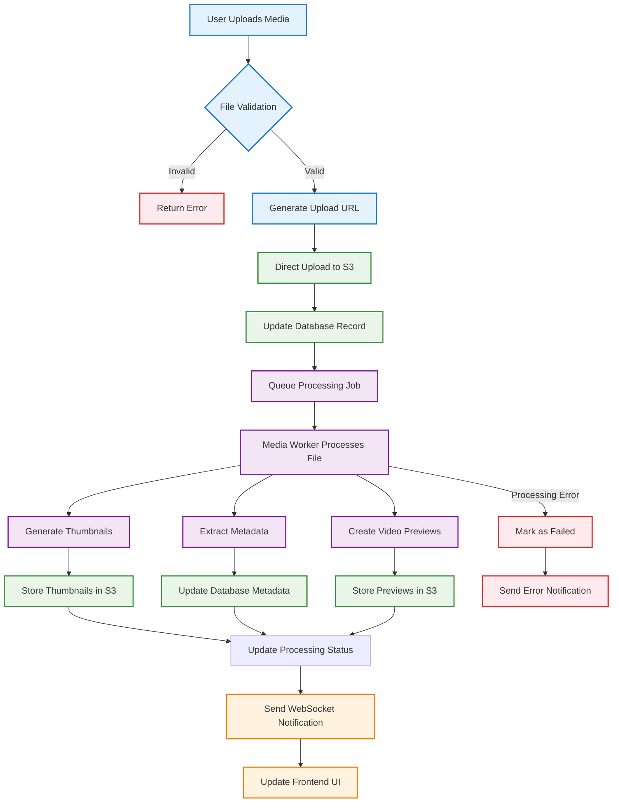
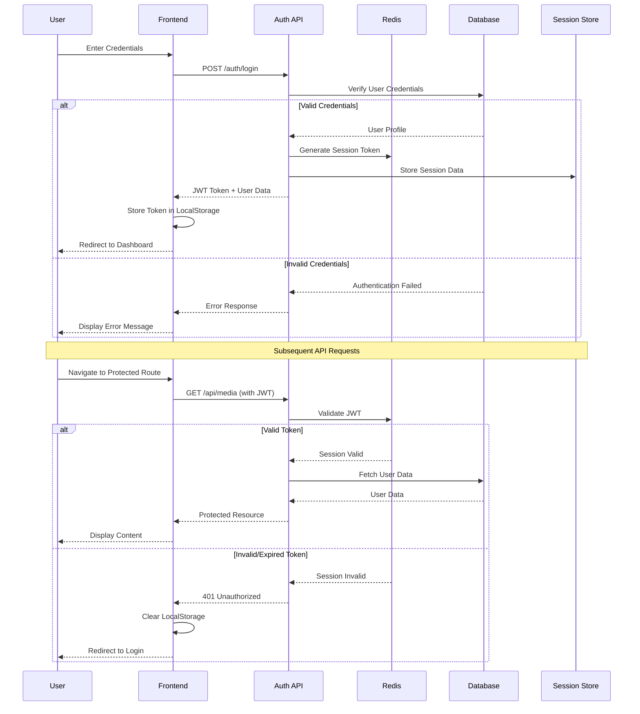
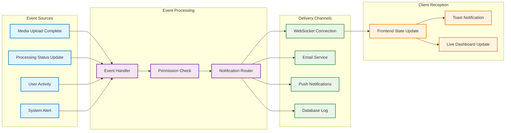
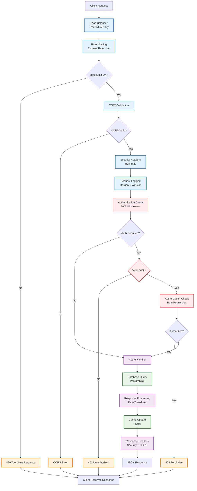
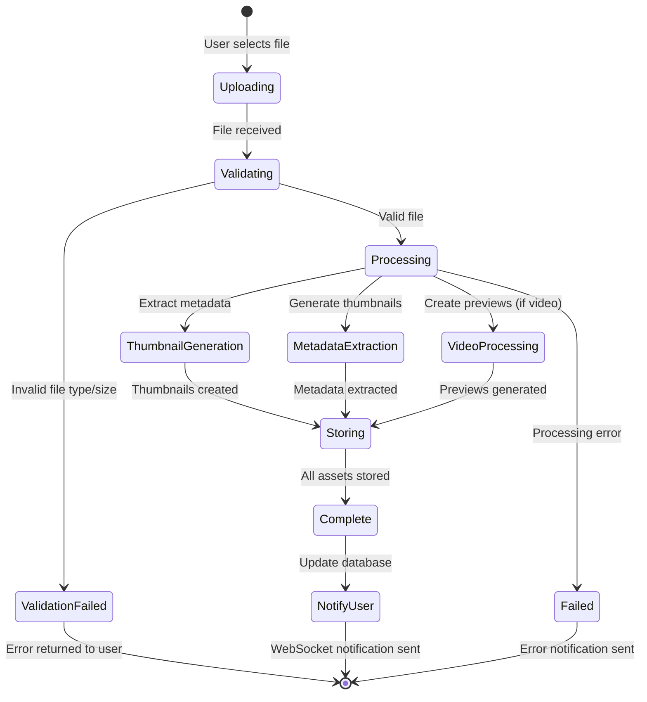
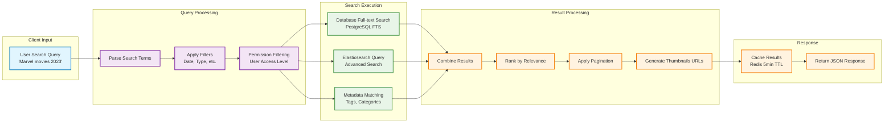
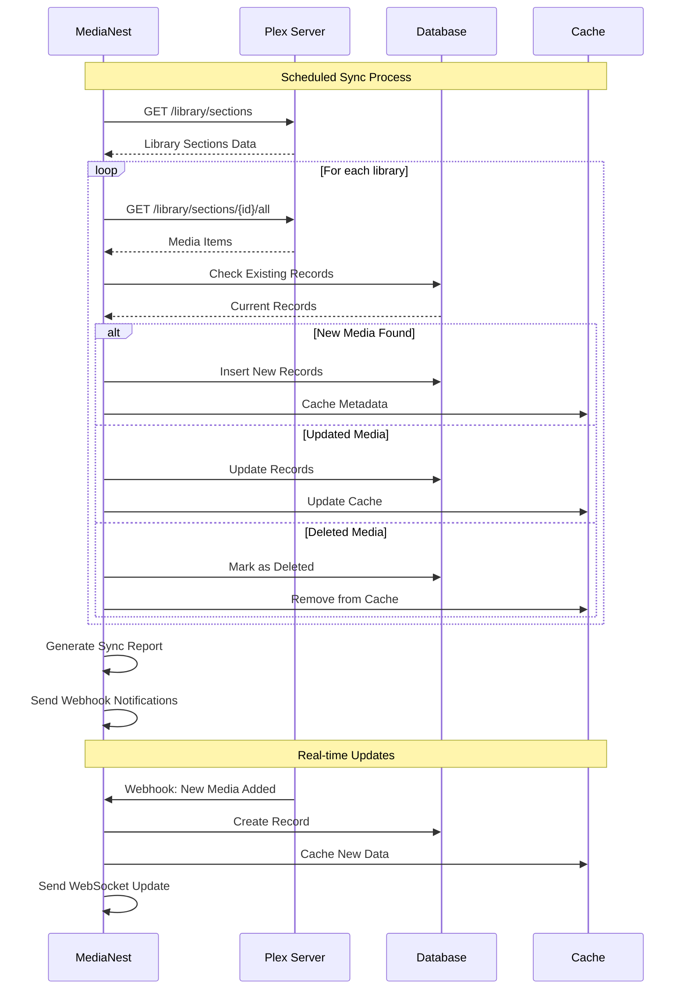
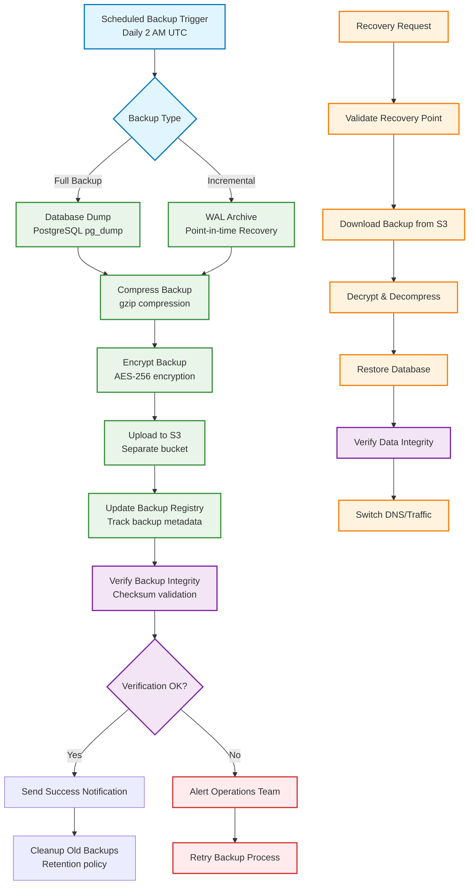

# MediaNest Data Flow Diagrams

## 📊 Core Data Flow Patterns

### 1. Media Upload & Processing Flow



### 2. User Authentication Flow



### 3. Real-time Notification System



## 🔄 API Request Lifecycle

### Standard API Request Flow



## 📁 File Management Data Flow

### File Upload Process



### File Access & Security Flow

```mermaid
graph TB
    subgraph "Client Request"
        A[User Requests File<br/>/api/files/123]
    end
    
    subgraph "Authentication Layer"
        B[Verify JWT Token]
        C[Check User Permissions]
        D[Validate File Ownership]
    end
    
    subgraph "File Resolution"
        E[Database Lookup<br/>File Metadata]
        F[Generate Signed URL<br/>S3/Storage]
        G[Apply Access Controls]
    end
    
    subgraph "Response Handling"
        H[Cache Response<br/>Redis TTL]
        I[Security Headers]
        J[Return File URL/Data]
    end
    
    A --> B
    B --> C
    C --> D
    D --> E
    E --> F
    F --> G
    G --> H
    H --> I
    I --> J
    
    %% Error paths
    B -->|Invalid Token| K[401 Unauthorized]
    C -->|No Permission| L[403 Forbidden]
    D -->|Not Owner| M[404 Not Found]
    E -->|File Not Found| N[404 Not Found]
    
    %% Styling
    classDef auth fill:#ffebee,stroke:#d32f2f,stroke-width:2px
    classDef resolution fill:#e8f5e8,stroke:#388e3c,stroke-width:2px
    classDef response fill:#e3f2fd,stroke:#1976d2,stroke-width:2px
    classDef error fill:#fff3e0,stroke:#f57c00,stroke-width:2px
    
    class B,C,D auth
    class E,F,G resolution  
    class H,I,J response
    class K,L,M,N error
```

## 🔍 Search & Discovery Flow

### Search Request Processing



## 🔗 External Integration Data Flow

### Plex Integration Sync



## 💾 Backup & Recovery Data Flow

### Automated Backup Process



---

*These data flow diagrams illustrate the core operational patterns within MediaNest, ensuring transparency in system behavior and facilitating debugging and optimization efforts.*