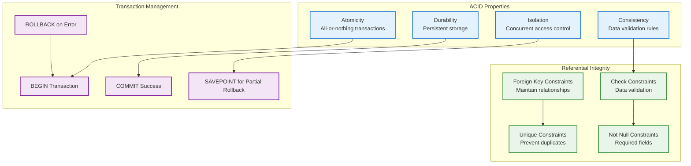
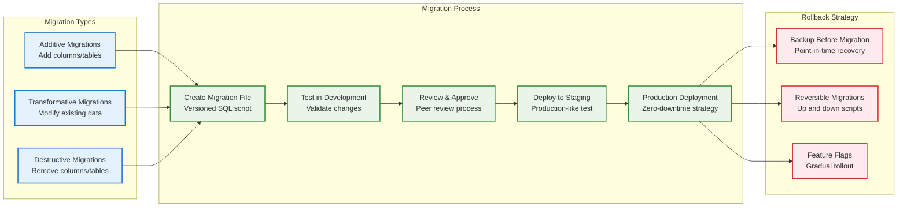
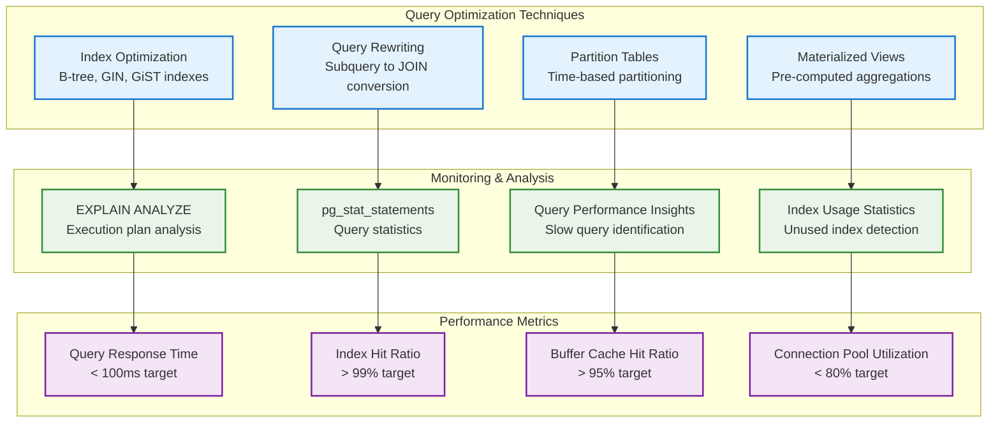
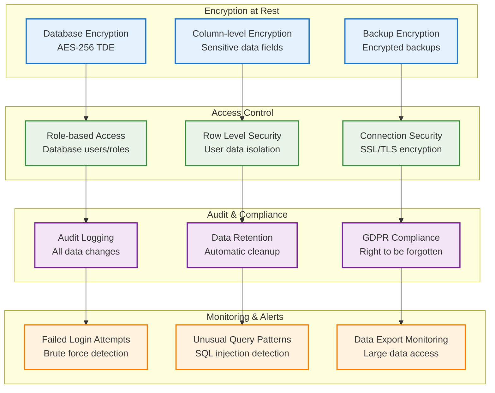
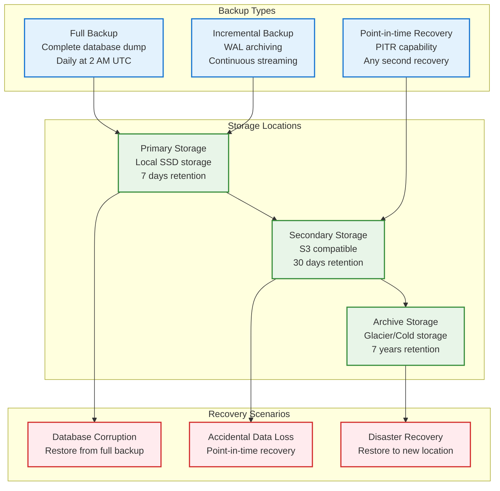

# MediaNest Database Schema Diagram

## 🗄️ Entity Relationship Diagram (ERD)

### Core Database Schema

```mermaid
erDiagram
    users {
        uuid id PK
        varchar email UK
        varchar password_hash
        varchar first_name
        varchar last_name
        varchar avatar_url
        enum role "guest,user,admin,super_admin"
        jsonb preferences
        timestamp created_at
        timestamp updated_at
        timestamp last_login
        boolean email_verified
        varchar verification_token
        boolean active
        jsonb metadata
    }
    
    user_sessions {
        uuid id PK
        uuid user_id FK
        varchar token_hash
        varchar refresh_token_hash
        inet ip_address
        varchar user_agent
        timestamp created_at
        timestamp expires_at
        boolean active
        jsonb metadata
    }
    
    media_items {
        uuid id PK
        uuid owner_id FK
        varchar filename
        varchar original_filename
        varchar mime_type
        bigint file_size
        varchar storage_path
        varchar thumbnail_path
        varchar preview_path
        enum status "uploading,processing,ready,error"
        jsonb metadata
        jsonb processing_info
        varchar checksum_md5
        varchar checksum_sha256
        timestamp created_at
        timestamp updated_at
        timestamp processed_at
        text description
        jsonb tags
        enum visibility "private,shared,public"
        integer download_count
        uuid parent_id FK
        integer version
    }
    
    collections {
        uuid id PK
        uuid owner_id FK
        varchar name
        text description
        varchar slug UK
        jsonb settings
        enum visibility "private,shared,public"
        varchar cover_image_path
        integer item_count
        timestamp created_at
        timestamp updated_at
        jsonb metadata
        boolean featured
        integer sort_order
    }
    
    collection_items {
        uuid id PK
        uuid collection_id FK
        uuid media_item_id FK
        integer position
        timestamp added_at
        uuid added_by FK
        jsonb metadata
    }
    
    sharing_permissions {
        uuid id PK
        uuid resource_id
        varchar resource_type "media_item,collection,user"
        uuid shared_with FK
        uuid shared_by FK
        enum permission_type "view,download,edit,admin"
        timestamp created_at
        timestamp expires_at
        boolean active
        varchar access_token
        jsonb metadata
    }
    
    media_metadata {
        uuid id PK
        uuid media_item_id FK
        varchar provider "tmdb,tvdb,imdb,local"
        varchar external_id
        jsonb data
        timestamp fetched_at
        timestamp expires_at
        float confidence_score
        boolean verified
        varchar language
        jsonb raw_response
    }
    
    processing_jobs {
        uuid id PK
        uuid media_item_id FK
        varchar job_type "thumbnail,preview,metadata,transcode"
        enum status "pending,running,completed,failed,cancelled"
        jsonb input_data
        jsonb output_data
        text error_message
        integer attempts
        timestamp created_at
        timestamp started_at
        timestamp completed_at
        integer priority
        varchar worker_id
        jsonb progress_info
    }
    
    plex_items {
        uuid id PK
        uuid media_item_id FK
        varchar plex_id
        varchar library_section_id
        varchar plex_type "movie,show,season,episode,track,album"
        varchar plex_key
        varchar plex_rating_key
        jsonb plex_metadata
        timestamp last_synced
        boolean active
        varchar plex_server_id
        varchar plex_guid
        timestamp plex_added_at
        timestamp plex_updated_at
    }
    
    integrations {
        uuid id PK
        varchar name UK
        varchar type "plex,overseerr,uptime_kuma"
        jsonb config
        boolean enabled
        enum status "connected,disconnected,error"
        timestamp last_sync
        text last_error
        timestamp created_at
        timestamp updated_at
        varchar api_key_hash
        varchar webhook_secret
        jsonb sync_stats
        integer retry_count
    }
    
    webhooks {
        uuid id PK
        uuid integration_id FK
        varchar event_type
        jsonb payload
        varchar signature
        inet source_ip
        enum status "received,processing,processed,failed"
        text error_message
        timestamp received_at
        timestamp processed_at
        integer retry_count
        jsonb metadata
    }
    
    notifications {
        uuid id PK
        uuid user_id FK
        varchar type "info,success,warning,error"
        varchar category "media,system,integration,user"
        varchar title
        text message
        jsonb data
        boolean read
        enum delivery_method "websocket,email,push"
        timestamp created_at
        timestamp read_at
        timestamp expires_at
        varchar action_url
        jsonb metadata
    }
    
    audit_logs {
        uuid id PK
        uuid user_id FK
        varchar action
        varchar resource_type
        uuid resource_id
        jsonb old_values
        jsonb new_values
        inet ip_address
        varchar user_agent
        timestamp created_at
        varchar correlation_id
        jsonb context
        enum severity "low,medium,high,critical"
    }
    
    api_keys {
        uuid id PK
        uuid user_id FK
        varchar name
        varchar key_hash
        varchar prefix
        jsonb scopes
        timestamp created_at
        timestamp last_used_at
        timestamp expires_at
        boolean active
        inet last_ip
        integer usage_count
        jsonb metadata
    }
    
    cache_entries {
        varchar key PK
        text value
        timestamp expires_at
        timestamp created_at
        varchar namespace
        jsonb metadata
        integer size_bytes
    }
    
    %% Relationships
    users ||--o{ user_sessions : "has"
    users ||--o{ media_items : "owns"
    users ||--o{ collections : "owns"
    users ||--o{ sharing_permissions : "shares_with"
    users ||--o{ sharing_permissions : "shares_from"
    users ||--o{ collection_items : "adds"
    users ||--o{ notifications : "receives"
    users ||--o{ audit_logs : "performs"
    users ||--o{ api_keys : "owns"
    
    media_items ||--o{ collection_items : "belongs_to"
    media_items ||--o{ media_metadata : "has"
    media_items ||--o{ processing_jobs : "requires"
    media_items ||--o{ plex_items : "syncs_with"
    media_items ||--|| media_items : "has_parent"
    
    collections ||--o{ collection_items : "contains"
    
    integrations ||--o{ webhooks : "receives"
    integrations ||--o{ plex_items : "manages"
```



## 📊 Database Design Principles

### 1. **Data Consistency & Integrity**



### 2. **Indexing Strategy**

```sql
-- Primary Indexes (Performance-Critical)
CREATE INDEX CONCURRENTLY idx_media_items_owner_created 
ON media_items(owner_id, created_at DESC);

CREATE INDEX CONCURRENTLY idx_media_items_status_type 
ON media_items(status, mime_type);

CREATE INDEX CONCURRENTLY idx_media_metadata_external_id 
ON media_metadata(provider, external_id);

-- Full-Text Search Indexes
CREATE INDEX CONCURRENTLY idx_media_items_search 
ON media_items USING gin(to_tsvector('english', 
    coalesce(original_filename, '') || ' ' || 
    coalesce(description, '') || ' ' || 
    coalesce(tags::text, '')));

-- Composite Indexes for Common Queries
CREATE INDEX CONCURRENTLY idx_collection_items_collection_position 
ON collection_items(collection_id, position);

CREATE INDEX CONCURRENTLY idx_user_sessions_user_active_expires 
ON user_sessions(user_id, active, expires_at) 
WHERE active = true;

-- Partial Indexes for Specific Use Cases
CREATE INDEX CONCURRENTLY idx_processing_jobs_pending 
ON processing_jobs(created_at, priority) 
WHERE status IN ('pending', 'running');

CREATE INDEX CONCURRENTLY idx_webhooks_unprocessed 
ON webhooks(received_at) 
WHERE status IN ('received', 'processing');
```

## 🔄 Data Migration Patterns

### Schema Evolution Strategy



### Example Migration: Adding Media Versioning

```sql
-- Migration: 20240309_add_media_versioning.sql
BEGIN;

-- Add versioning columns to media_items
ALTER TABLE media_items 
ADD COLUMN parent_id UUID REFERENCES media_items(id),
ADD COLUMN version INTEGER DEFAULT 1,
ADD COLUMN is_latest_version BOOLEAN DEFAULT true;

-- Create index for version queries
CREATE INDEX CONCURRENTLY idx_media_items_parent_version 
ON media_items(parent_id, version) WHERE parent_id IS NOT NULL;

-- Create function to manage versioning
CREATE OR REPLACE FUNCTION update_media_version()
RETURNS TRIGGER AS $$
BEGIN
    -- Update previous version to not be latest
    IF NEW.parent_id IS NOT NULL THEN
        UPDATE media_items 
        SET is_latest_version = false 
        WHERE parent_id = NEW.parent_id AND id != NEW.id;
        
        -- Set version number
        NEW.version = COALESCE(
            (SELECT MAX(version) + 1 
             FROM media_items 
             WHERE parent_id = NEW.parent_id), 1);
    END IF;
    
    RETURN NEW;
END;
$$ LANGUAGE plpgsql;

-- Create trigger
CREATE TRIGGER trg_media_version_update
    BEFORE INSERT OR UPDATE ON media_items
    FOR EACH ROW
    EXECUTE FUNCTION update_media_version();

COMMIT;
```

## 📈 Performance Optimization

### Query Performance Analysis



### Table Partitioning Strategy

```sql
-- Partition audit_logs by month for performance
CREATE TABLE audit_logs_partitioned (
    LIKE audit_logs INCLUDING ALL
) PARTITION BY RANGE (created_at);

-- Create monthly partitions
CREATE TABLE audit_logs_202403 PARTITION OF audit_logs_partitioned
FOR VALUES FROM ('2024-03-01') TO ('2024-04-01');

CREATE TABLE audit_logs_202404 PARTITION OF audit_logs_partitioned
FOR VALUES FROM ('2024-04-01') TO ('2024-05-01');

-- Create function to automatically create monthly partitions
CREATE OR REPLACE FUNCTION create_monthly_partition(table_name TEXT, start_date DATE)
RETURNS VOID AS $$
DECLARE
    partition_name TEXT;
    end_date DATE;
BEGIN
    partition_name := table_name || '_' || to_char(start_date, 'YYYYMM');
    end_date := start_date + INTERVAL '1 month';
    
    EXECUTE format('CREATE TABLE IF NOT EXISTS %I PARTITION OF %I 
                   FOR VALUES FROM (%L) TO (%L)',
                   partition_name, table_name || '_partitioned',
                   start_date, end_date);
END;
$$ LANGUAGE plpgsql;
```

## 🔒 Security & Compliance

### Data Security Implementation



### Row Level Security (RLS) Example

```sql
-- Enable RLS on media_items table
ALTER TABLE media_items ENABLE ROW LEVEL SECURITY;

-- Policy: Users can only see their own media items
CREATE POLICY media_items_owner_policy ON media_items
    FOR ALL TO authenticated_users
    USING (owner_id = current_user_id())
    WITH CHECK (owner_id = current_user_id());

-- Policy: Shared media items are visible to recipients
CREATE POLICY media_items_shared_policy ON media_items
    FOR SELECT TO authenticated_users
    USING (
        id IN (
            SELECT resource_id 
            FROM sharing_permissions 
            WHERE resource_type = 'media_item' 
            AND shared_with = current_user_id()
            AND active = true
            AND (expires_at IS NULL OR expires_at > now())
        )
    );

-- Policy: Admin users can see all media items
CREATE POLICY media_items_admin_policy ON media_items
    FOR ALL TO admin_users
    USING (true);
```

## 🗄️ Backup & Recovery Strategy

### Backup Architecture



### Automated Backup Script

```bash
#!/bin/bash
# PostgreSQL Backup Script with S3 Upload

DB_NAME="medianest"
BACKUP_DIR="/var/backups/postgresql"
S3_BUCKET="medianest-backups"
TIMESTAMP=$(date +"%Y%m%d_%H%M%S")
BACKUP_FILE="${DB_NAME}_backup_${TIMESTAMP}.sql.gz"

# Create backup directory if it doesn't exist
mkdir -p $BACKUP_DIR

# Perform database backup
pg_dump $DB_NAME | gzip > "$BACKUP_DIR/$BACKUP_FILE"

# Verify backup integrity
if [ $? -eq 0 ]; then
    echo "Backup successful: $BACKUP_FILE"
    
    # Upload to S3
    aws s3 cp "$BACKUP_DIR/$BACKUP_FILE" "s3://$S3_BUCKET/daily/"
    
    # Clean up old local backups (keep last 7 days)
    find $BACKUP_DIR -name "*.sql.gz" -mtime +7 -delete
    
    # Log success
    echo "$(date): Backup completed successfully" >> /var/log/backup.log
else
    echo "Backup failed!" >&2
    echo "$(date): Backup failed" >> /var/log/backup.log
    exit 1
fi
```

---

*This database schema diagram provides a comprehensive view of MediaNest's data architecture, ensuring scalable, secure, and performant data management.*