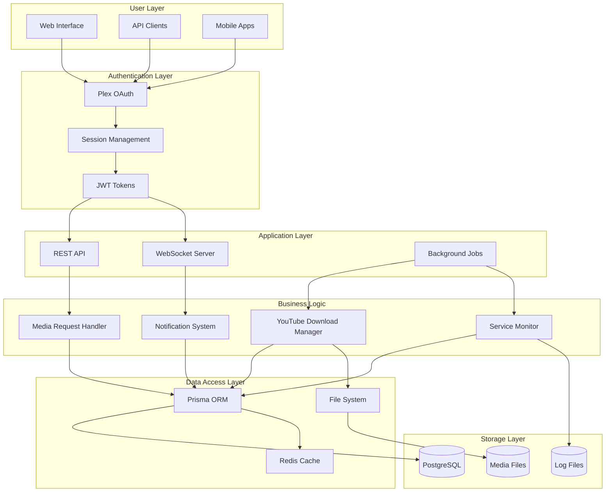

# Database Schema Visualization

This document provides comprehensive visual documentation of the MediaNest database schema, including entity relationships, data flows, and indexing strategies.

## Entity Relationship Diagram

Complete database schema showing all entities and their relationships:

## Data Flow Architecture

Shows how data flows through the system from user interactions to storage:

## Indexing Strategy Visualization

Database performance optimization through strategic indexing:

## Query Performance Patterns

Optimized query patterns for common operations:

## Data Lifecycle Management

How data flows through its lifecycle in the system:

## Database Security Model

Security layers and access controls:

## Schema Migration Strategy

Version control and migration approach:

## Performance Monitoring Dashboard

Key metrics for database health monitoring:

## Backup and Recovery Architecture

Data protection and disaster recovery strategy:

## Database Connection Architecture

Connection management and pooling strategy:

This comprehensive database documentation ensures optimal performance, security, and maintainability of the MediaNest data layer.