# Deployment Architecture Visualization

This document provides comprehensive visual documentation of MediaNest's deployment architecture, infrastructure topology, and operational workflows.

## Production Infrastructure Overview

High-level view of the complete production environment:

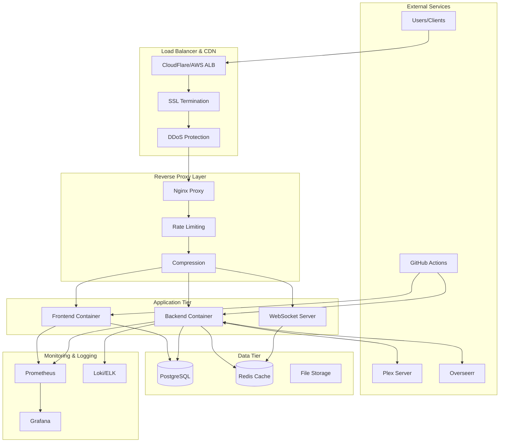

## Docker Container Architecture

Container orchestration and service relationships:

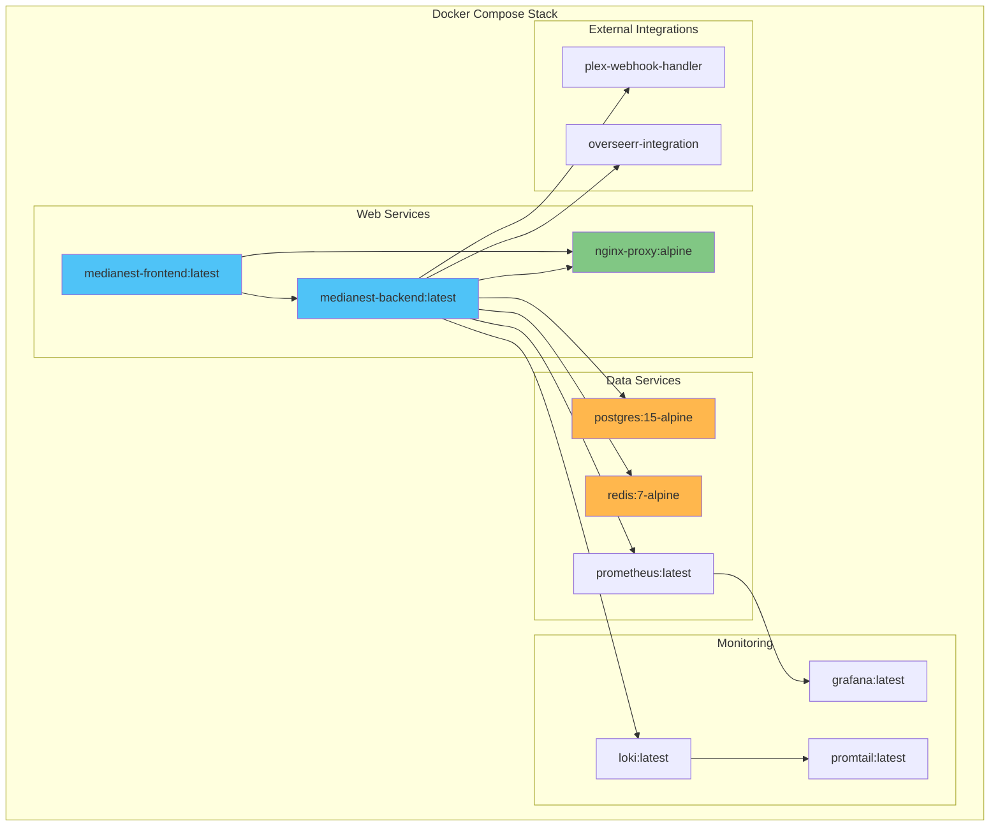

## Production Docker Compose Architecture

Simplified production deployment with Docker Compose providing enterprise-grade features:

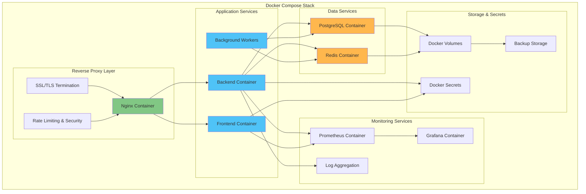

## Network Architecture

Network topology and security boundaries:

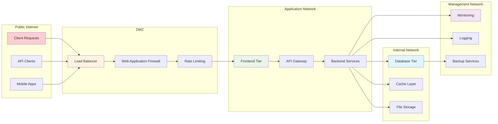

## CI/CD Pipeline Architecture

Automated deployment pipeline from development to production:

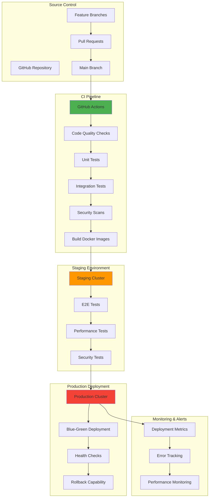

## High Availability Architecture

Redundancy and failover mechanisms:

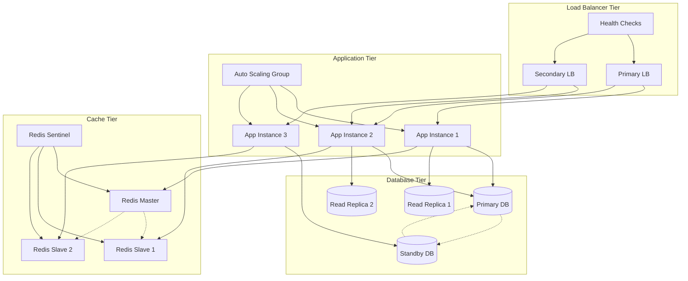

## Security Architecture

Security layers and access controls:

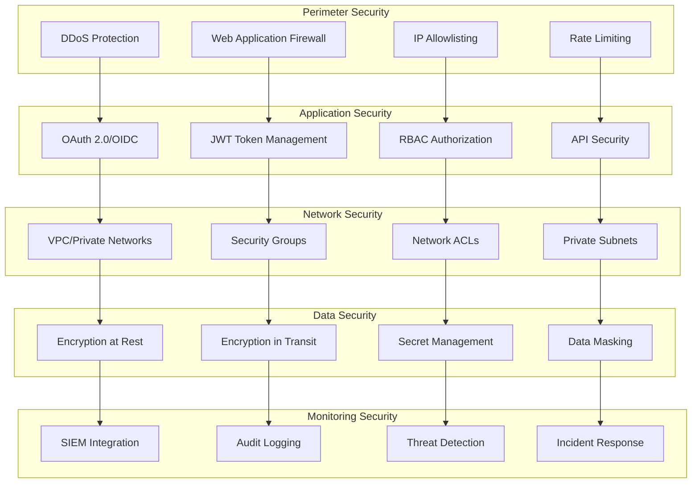

## Disaster Recovery Architecture

Backup and recovery strategy:

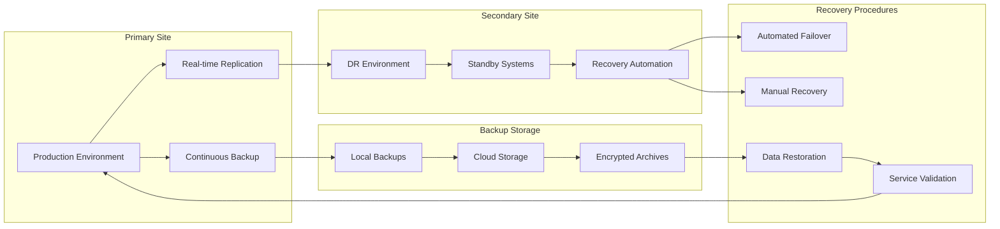

## Monitoring and Observability Stack

Comprehensive monitoring and alerting infrastructure:

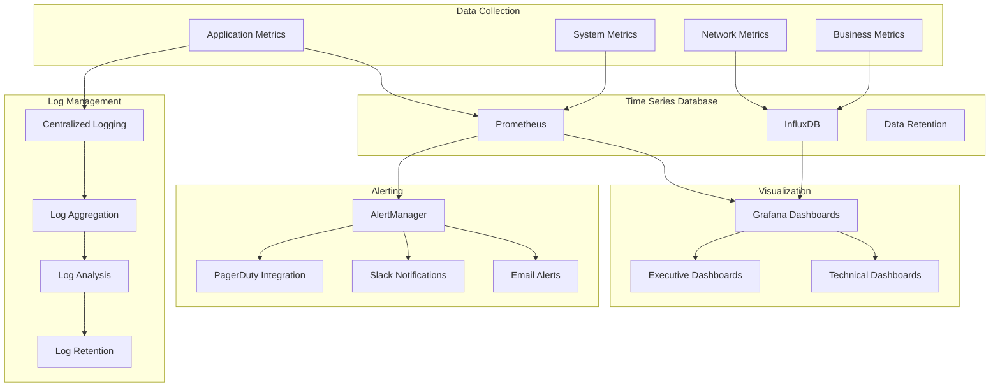

## Scalability Architecture

Auto-scaling and performance optimization:

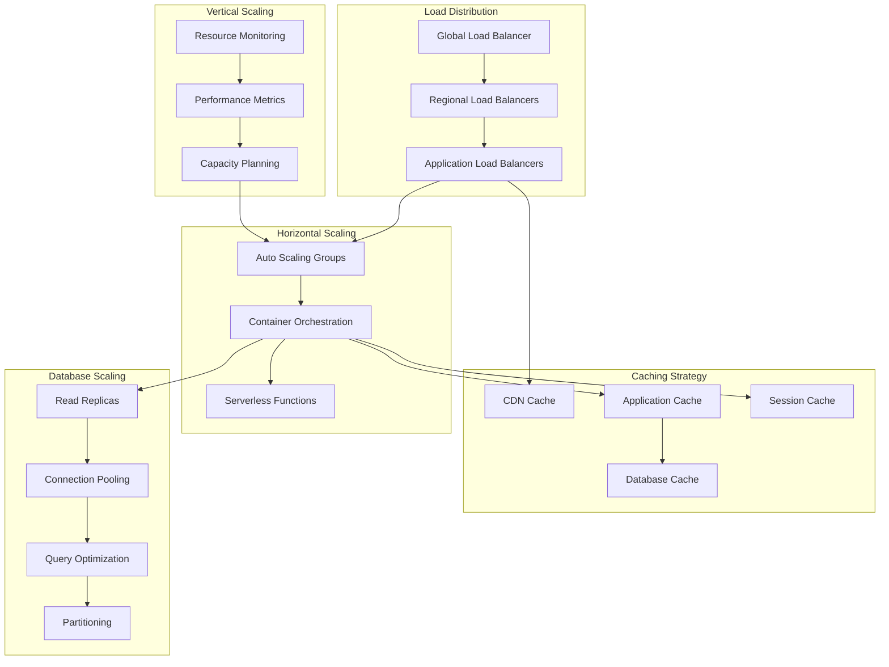

## Development Environment Architecture

Local development and testing setup:

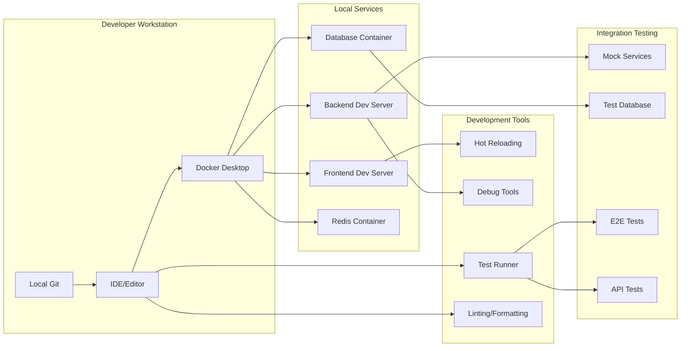

This comprehensive deployment architecture ensures scalable, secure, and maintainable infrastructure for MediaNest across all environments.
