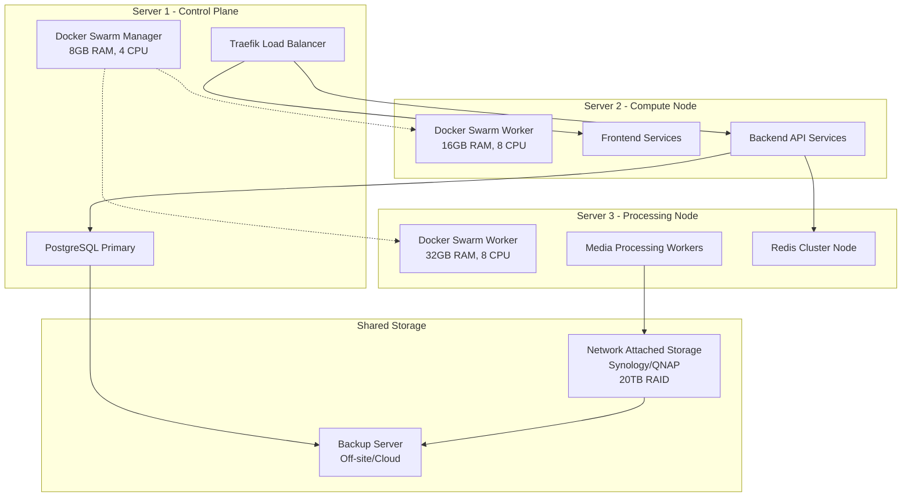
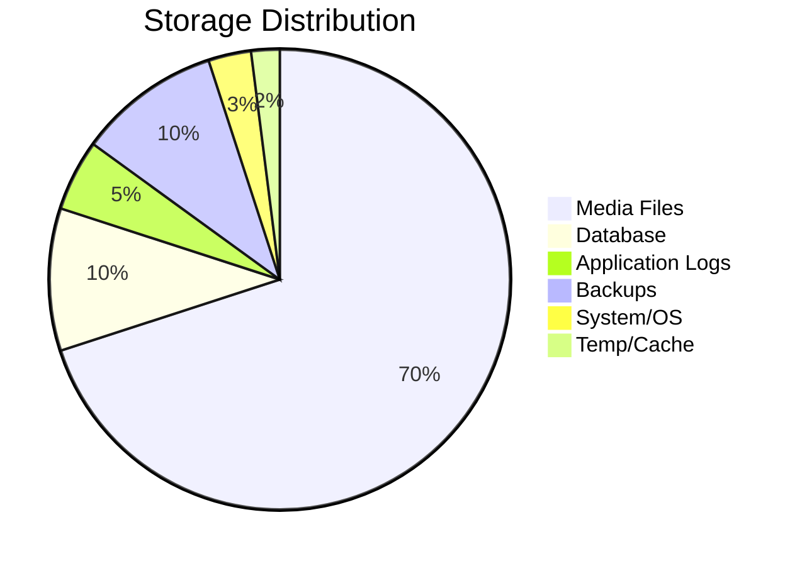

# MediaNest Deployment Topology

## 🏗️ Production Deployment Architecture

### Docker Swarm Cluster Topology

```mermaid
graph TB
    subgraph "External Traffic"
        INTERNET[Internet Traffic]
        CDN[CloudFlare CDN<br/>Static Assets]
    end
    
    subgraph "Edge Layer"
        LB1[Load Balancer 1<br/>Traefik Manager]
        LB2[Load Balancer 2<br/>Traefik Worker]
    end
    
    subgraph "Docker Swarm Cluster"
        subgraph "Manager Nodes"
            MGR1[Manager Node 1<br/>Primary Swarm Leader<br/>4 CPU, 8GB RAM]
            MGR2[Manager Node 2<br/>Swarm Manager<br/>4 CPU, 8GB RAM] 
            MGR3[Manager Node 3<br/>Swarm Manager<br/>4 CPU, 8GB RAM]
        end
        
        subgraph "Worker Nodes"
            WRK1[Worker Node 1<br/>App Services<br/>8 CPU, 16GB RAM]
            WRK2[Worker Node 2<br/>App Services<br/>8 CPU, 16GB RAM]
            WRK3[Worker Node 3<br/>Media Processing<br/>8 CPU, 32GB RAM]
            WRK4[Worker Node 4<br/>Database Node<br/>4 CPU, 16GB RAM, SSD]
        end
    end
    
    subgraph "Service Distribution"
        subgraph "Frontend Services"
            FE1[medianest-frontend<br/>Replica 1]
            FE2[medianest-frontend<br/>Replica 2]
            FE3[medianest-frontend<br/>Replica 3]
        end
        
        subgraph "Backend Services"
            BE1[medianest-backend<br/>Replica 1]
            BE2[medianest-backend<br/>Replica 2] 
            BE3[medianest-backend<br/>Replica 3]
        end
        
        subgraph "Processing Services"
            PROC1[medianest-worker<br/>Media Processing]
            PROC2[medianest-worker<br/>Thumbnail Gen]
        end
        
        subgraph "Data Services"
            PG_PRIMARY[(PostgreSQL Primary<br/>Write Operations)]
            PG_REPLICA1[(PostgreSQL Replica 1<br/>Read Operations)]
            PG_REPLICA2[(PostgreSQL Replica 2<br/>Read Operations)]
            REDIS_1[(Redis Node 1<br/>Cache Master)]
            REDIS_2[(Redis Node 2<br/>Cache Replica)]
            REDIS_3[(Redis Node 3<br/>Cache Replica)]
        end
    end
    
    subgraph "External Storage"
        S3[S3 Compatible Storage<br/>MinIO Cluster<br/>Media Files + Backups]
    end
    
    subgraph "Monitoring Stack"
        PROMETHEUS[Prometheus<br/>Metrics Collection]
        GRAFANA[Grafana<br/>Visualization]
        ALERTMANAGER[AlertManager<br/>Alert Routing]
    end
    
    %% Traffic Flow
    INTERNET --> CDN
    INTERNET --> LB1
    INTERNET --> LB2
    
    CDN --> FE1
    CDN --> FE2
    CDN --> FE3
    
    LB1 --> BE1
    LB1 --> BE2
    LB2 --> BE2
    LB2 --> BE3
    
    %% Service Placement
    MGR1 --> LB1
    MGR2 --> LB2
    
    WRK1 --> FE1
    WRK1 --> BE1
    WRK2 --> FE2
    WRK2 --> BE2
    WRK3 --> FE3
    WRK3 --> BE3
    WRK3 --> PROC1
    WRK3 --> PROC2
    WRK4 --> PG_PRIMARY
    
    MGR1 --> PG_REPLICA1
    MGR2 --> PG_REPLICA2
    MGR3 --> REDIS_1
    WRK1 --> REDIS_2
    WRK2 --> REDIS_3
    
    %% Data Flow
    BE1 --> PG_PRIMARY
    BE2 --> PG_REPLICA1
    BE3 --> PG_REPLICA2
    
    BE1 --> REDIS_1
    BE2 --> REDIS_2
    BE3 --> REDIS_3
    
    PROC1 --> S3
    PROC2 --> S3
    
    %% Monitoring
    PROMETHEUS --> BE1
    PROMETHEUS --> BE2
    PROMETHEUS --> BE3
    PROMETHEUS --> PG_PRIMARY
    PROMETHEUS --> REDIS_1
    GRAFANA --> PROMETHEUS
    ALERTMANAGER --> PROMETHEUS
    
    %% Styling
    classDef manager fill:#e3f2fd,stroke:#1976d2,stroke-width:3px
    classDef worker fill:#f3e5f5,stroke:#7b1fa2,stroke-width:2px
    classDef frontend fill:#e8f5e8,stroke:#388e3c,stroke-width:2px
    classDef backend fill:#fff3e0,stroke:#f57c00,stroke-width:2px
    classDef database fill:#ffebee,stroke:#d32f2f,stroke-width:2px
    classDef storage fill:#e1f5fe,stroke:#0277bd,stroke-width:2px
    classDef monitoring fill:#f9fbe7,stroke:#689f38,stroke-width:2px
    
    class MGR1,MGR2,MGR3 manager
    class WRK1,WRK2,WRK3,WRK4 worker
    class FE1,FE2,FE3 frontend
    class BE1,BE2,BE3,PROC1,PROC2 backend
    class PG_PRIMARY,PG_REPLICA1,PG_REPLICA2,REDIS_1,REDIS_2,REDIS_3 database
    class S3 storage
    class PROMETHEUS,GRAFANA,ALERTMANAGER monitoring
```



## 🔄 Service Placement & Constraints

### Node Placement Strategy

```yaml
# Docker Swarm Service Constraints
services:
  medianest-frontend:
    deploy:
      replicas: 3
      placement:
        constraints:
          - node.role == worker
          - node.labels.type == compute
        preferences:
          - spread: node.labels.az  # Spread across availability zones
      resources:
        limits:
          memory: 512M
          cpus: '0.5'
        reservations:
          memory: 256M
          cpus: '0.25'

  medianest-backend:
    deploy:
      replicas: 3
      placement:
        constraints:
          - node.role == worker
          - node.labels.type == compute
      resources:
        limits:
          memory: 1G
          cpus: '1.0'
        reservations:
          memory: 512M
          cpus: '0.5'

  medianest-worker:
    deploy:
      replicas: 2
      placement:
        constraints:
          - node.labels.type == processing
      resources:
        limits:
          memory: 4G
          cpus: '2.0'

  postgres-primary:
    deploy:
      replicas: 1
      placement:
        constraints:
          - node.labels.type == database
          - node.labels.storage == ssd
      resources:
        limits:
          memory: 4G
          cpus: '2.0'

  redis-cluster:
    deploy:
      replicas: 3
      placement:
        preferences:
          - spread: node.id
```

## 🌐 Network Architecture

### Overlay Network Topology

```mermaid
graph TB
    subgraph "External Networks"
        PUB[Public Internet<br/>0.0.0.0/0]
    end
    
    subgraph "Docker Swarm Networks"
        subgraph "Frontend Network (frontend-net)"
            LB[Load Balancer<br/>10.0.1.0/24]
            FE_SERVICES[Frontend Services<br/>10.0.1.10-20]
        end
        
        subgraph "Backend Network (backend-net)"  
            API_SERVICES[Backend API<br/>10.0.2.0/24]
            WORKER_SERVICES[Processing Workers<br/>10.0.2.50-60]
        end
        
        subgraph "Database Network (database-net)"
            PG_CLUSTER[PostgreSQL Cluster<br/>10.0.3.0/24]
            REDIS_CLUSTER[Redis Cluster<br/>10.0.3.50-60]
        end
        
        subgraph "Storage Network (storage-net)"
            S3_GATEWAY[S3 Gateway<br/>10.0.4.0/24]
        end
        
        subgraph "Monitoring Network (monitor-net)"
            METRICS[Prometheus/Grafana<br/>10.0.5.0/24]
        end
    end
    
    %% Network connections
    PUB --> LB
    LB --> FE_SERVICES
    FE_SERVICES --> API_SERVICES
    API_SERVICES --> PG_CLUSTER
    API_SERVICES --> REDIS_CLUSTER
    WORKER_SERVICES --> S3_GATEWAY
    WORKER_SERVICES --> REDIS_CLUSTER
    
    %% Monitoring connections (can access all networks)
    METRICS -.-> API_SERVICES
    METRICS -.-> PG_CLUSTER
    METRICS -.-> REDIS_CLUSTER
    
    %% Styling
    classDef external fill:#ffebee,stroke:#d32f2f,stroke-width:2px
    classDef frontend fill:#e8f5e8,stroke:#388e3c,stroke-width:2px
    classDef backend fill:#e3f2fd,stroke:#1976d2,stroke-width:2px
    classDef database fill:#f3e5f5,stroke:#7b1fa2,stroke-width:2px
    classDef storage fill:#fff3e0,stroke:#f57c00,stroke-width:2px
    classDef monitoring fill:#f9fbe7,stroke:#689f38,stroke-width:2px
    
    class PUB external
    class LB,FE_SERVICES frontend  
    class API_SERVICES,WORKER_SERVICES backend
    class PG_CLUSTER,REDIS_CLUSTER database
    class S3_GATEWAY storage
    class METRICS monitoring
```

### Network Security Rules

| Network | Ingress Rules | Egress Rules |
|---------|--------------|--------------|
| **frontend-net** | Port 80/443 from Internet | Port 3001 to backend-net |
| **backend-net** | Port 3001 from frontend-net | Port 5432 to database-net<br/>Port 6379 to database-net<br/>Port 443 to Internet (APIs) |
| **database-net** | Port 5432 from backend-net<br/>Port 6379 from backend-net | None (isolated) |
| **storage-net** | None | Port 443 to Internet (S3) |
| **monitor-net** | Port 3000 from mgmt subnet | All networks (metrics collection) |

## 🏠 Homelab Deployment Options

### Option 1: Single Server Setup (Recommended for < 100 users)

```mermaid
graph TB
    subgraph "Physical Server"
        subgraph "System Resources"
            CPU[16 CPU Cores<br/>AMD Ryzen/Intel i7]
            RAM[64GB RAM<br/>DDR4-3200]
            STORAGE[2TB NVMe SSD<br/>System + Database]
            HDD[8TB HDD Array<br/>Media Storage]
        end
        
        subgraph "Docker Compose Stack"
            TRAEFIK[Traefik Reverse Proxy<br/>:80, :443]
            FRONTEND[MediaNest Frontend<br/>:3000]
            BACKEND[MediaNest Backend<br/>:3001]
            POSTGRES[PostgreSQL 15<br/>:5432]
            REDIS[Redis 7<br/>:6379]
            WORKER[Media Worker<br/>Background Jobs]
        end
        
        subgraph "External Mounts"
            MEDIA_VOL[/mnt/media<br/>Media Files]
            BACKUP_VOL[/mnt/backup<br/>Database Backups]
        end
    end
    
    subgraph "Network Configuration"
        ROUTER[Home Router<br/>Port Forwarding]
        DOMAIN[Dynamic DNS<br/>medianest.yourdomain.com]
        SSL[Let's Encrypt<br/>Automatic SSL]
    end
    
    %% Connections
    ROUTER --> TRAEFIK
    TRAEFIK --> FRONTEND
    TRAEFIK --> BACKEND
    BACKEND --> POSTGRES
    BACKEND --> REDIS
    BACKEND --> WORKER
    WORKER --> MEDIA_VOL
    POSTGRES --> BACKUP_VOL
    DOMAIN --> ROUTER
    SSL --> TRAEFIK
```

### Option 2: Multi-Server Cluster (Recommended for > 100 users)



## 🚀 Deployment Strategies

### Blue-Green Deployment

```mermaid
stateDiagram-v2
    [*] --> BlueActive: Initial deployment
    
    state "Blue Environment" as BlueActive {
        [*] --> BlueServing: Users accessing Blue
        BlueServing --> BlueServing: Normal operation
    }
    
    state "Green Environment" as GreenStandby {
        [*] --> GreenDeploying: New version deployment
        GreenDeploying --> GreenTesting: Deployment complete
        GreenTesting --> GreenReady: Tests passed
    }
    
    BlueActive --> Switching: Deploy new version
    GreenStandby --> Switching: Green environment ready
    
    state "Traffic Switch" as Switching {
        [*] --> ValidateGreen: Health checks
        ValidateGreen --> UpdateLoadBalancer: Green is healthy
        UpdateLoadBalancer --> MonitorSwitch: Route traffic to Green
        MonitorSwitch --> SwitchComplete: Monitor metrics
    }
    
    Switching --> GreenActive: Switch successful
    Switching --> BlueActive: Rollback on failure
    
    state "Green Environment" as GreenActive {
        [*] --> GreenServing: Users accessing Green
        GreenServing --> GreenServing: Normal operation
    }
    
    state "Blue Environment" as BlueStandby {
        [*] --> BlueStandby: Previous version on standby
    }
    
    GreenActive --> [*]: Deployment complete
    BlueStandby --> [*]: Old version cleanup
```

### Rolling Update Strategy

```mermaid
gantt
    title MediaNest Rolling Deployment Timeline
    dateFormat X
    axisFormat %M:%S
    
    section Pre-deployment
    Health Checks        :milestone, m1, 0, 0
    Backup Database      :active, pre1, 0, 30
    Validate Images      :active, pre2, 0, 15
    
    section Service Updates
    Update Backend (1/3) :active, be1, 30, 60
    Update Backend (2/3) :active, be2, 45, 75
    Update Backend (3/3) :active, be3, 60, 90
    
    Update Frontend (1/3):active, fe1, 75, 105
    Update Frontend (2/3):active, fe2, 90, 120
    Update Frontend (3/3):active, fe3, 105, 135
    
    section Verification
    Smoke Tests          :active, test1, 135, 150
    Load Testing         :active, test2, 150, 180
    
    section Completion
    Update Complete      :milestone, m2, 180, 180
```



## 📊 Resource Planning

### Capacity Planning Matrix

| User Count | CPU Cores | RAM (GB) | Storage (TB) | Network (Mbps) |
|------------|-----------|----------|--------------|----------------|
| **1-50** | 8 | 16 | 2 | 100 |
| **51-200** | 16 | 32 | 5 | 500 |
| **201-500** | 32 | 64 | 10 | 1000 |
| **501-1000** | 64 | 128 | 20 | 2000 |
| **1000+** | 128+ | 256+ | 50+ | 5000+ |

### Storage Requirements



### Performance Benchmarks

| Metric | Target | Acceptable | Action Required |
|--------|--------|------------|-----------------|
| **API Response Time** | < 100ms | < 200ms | > 500ms |
| **Page Load Time** | < 2s | < 3s | > 5s |
| **File Upload Speed** | > 50MB/s | > 25MB/s | < 10MB/s |
| **Search Response** | < 50ms | < 100ms | > 200ms |
| **CPU Utilization** | < 70% | < 85% | > 90% |
| **Memory Usage** | < 80% | < 90% | > 95% |
| **Disk I/O Wait** | < 10% | < 20% | > 30% |

---

*This deployment topology ensures high availability, scalability, and performance for MediaNest installations across various infrastructure scales.*