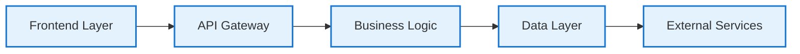
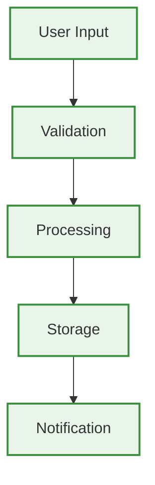
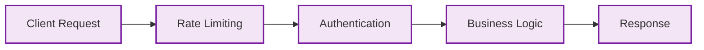
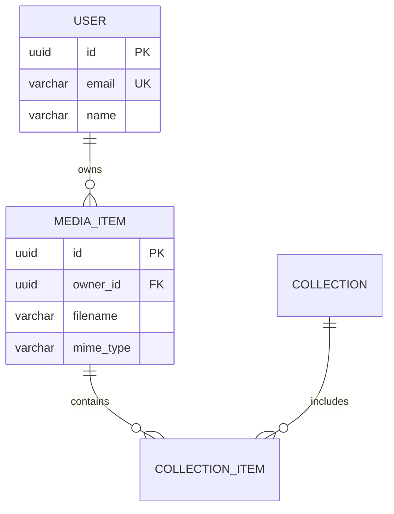
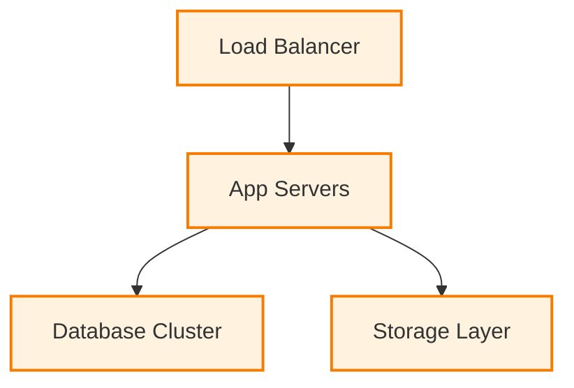
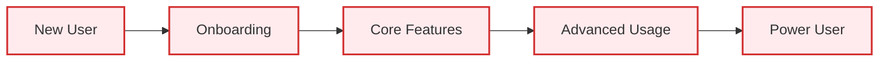
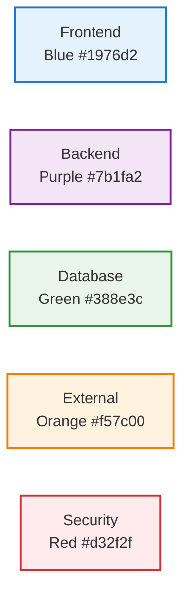

# Visual Documentation Overview

## 📊 Comprehensive System Visualization

Welcome to MediaNest's visual documentation center. This section provides comprehensive diagrams, flowcharts, and visual aids to help you understand the system architecture, data flows, and user interactions within the MediaNest platform.

### 🎯 Documentation Purpose

Visual documentation serves multiple audiences:

- **Developers**: Understand system architecture and integration points
- **System Administrators**: Plan deployments and troubleshoot issues  
- **Product Managers**: Analyze user journeys and optimize workflows
- **Stakeholders**: Gain high-level understanding of platform capabilities

## 📋 Available Visual Documentation

### 🏗️ [System Architecture Diagram](system-architecture-diagram.md)

**High-level overview of MediaNest's complete system architecture**

**Key Topics Covered:**
- Multi-tier application architecture
- Service communication patterns
- Security and authentication layers
- Performance and scalability design
- Infrastructure orchestration with Docker Swarm

---

### 🔄 [Data Flow Diagrams](data-flow-diagrams.md)

**Detailed visualization of data movement throughout the system**

**Key Topics Covered:**
- Media upload and processing workflows
- Real-time notification system
- Search and discovery data flow
- Authentication and session management
- External integration synchronization

---

### 🔌 [API Workflow Diagrams](api-workflow-diagrams.md)

**Complete API architecture and request lifecycle visualization**

**Key Topics Covered:**
- API gateway and routing structure
- Authentication and authorization flows
- Media management API workflows
- Integration API patterns
- Error handling and monitoring

---

### 🗄️ [Database Schema Diagram](database-schema-diagram.md)

**Comprehensive entity relationship diagram and data model**

**Key Topics Covered:**
- Complete entity relationship diagram
- Data consistency and integrity rules
- Indexing strategy and performance optimization
- Security and compliance implementation
- Backup and recovery architecture

---

### 🚀 [Deployment Topology](deployment-topology.md)

**Infrastructure architecture and deployment strategies**

**Key Topics Covered:**
- Docker Swarm orchestration architecture
- Network topology and security
- Homelab and production deployment options
- Resource planning and capacity management
- High availability and disaster recovery

---

### 👤 [User Journey Flowcharts](user-journey-flowcharts.md)

**User experience flows and interaction patterns**

**Key Topics Covered:**
- User persona mapping and journey analysis
- Onboarding and first-time user experience
- Core workflow optimization
- Mobile user experience patterns
- Engagement and retention strategies

## 🛠️ Diagram Technologies Used

### Mermaid.js Integration

All diagrams are created using **Mermaid.js** for:
- **Version Control**: Diagrams are stored as text in Git
- **Consistency**: Standardized styling and formatting
- **Maintainability**: Easy updates and modifications
- **Accessibility**: Screen reader compatible
- **Integration**: Native support in MkDocs Material

### Diagram Types Supported

| Diagram Type | Use Case | Example |
|--------------|----------|---------|
| **Flowchart** | Process flows, decision trees | User workflows, system processes |
| **Sequence Diagram** | Interaction patterns | API calls, authentication flows |
| **Entity Relationship** | Database design | Schema relationships, data models |
| **State Diagram** | System states | User sessions, processing states |
| **Gantt Chart** | Project timelines | Deployment schedules, development phases |
| **Pie Chart** | Data distribution | Resource usage, user demographics |
| **Graph** | Network topology | System architecture, service relationships |

## 📱 Responsive Design

All visual documentation is optimized for:

- **Desktop Viewing**: Full-featured diagrams with detailed annotations
- **Tablet Experience**: Touch-friendly navigation and zoom controls
- **Mobile Display**: Simplified views with expandable sections
- **Print Compatibility**: High-quality PDF export support

## 🎨 Design System

### Color Coding Standards

### Typography & Accessibility

- **High Contrast**: WCAG AAA compliant color combinations
- **Clear Labeling**: Descriptive text for all diagram elements
- **Consistent Styling**: Unified visual language across all diagrams
- **Scalable Text**: Readable at all zoom levels

## 🔄 Maintenance & Updates

### Version Control
- All diagrams are stored in Git for version tracking
- Changes are documented in commit messages
- Peer review process for diagram updates

### Regular Updates
- Architecture changes trigger diagram updates
- Quarterly review of user journey accuracy
- Performance metrics integrated into visual displays

### Community Contributions
- Fork the repository to suggest diagram improvements
- Submit pull requests for new visual documentation
- Report issues with diagram accuracy or accessibility

---

## 🚀 Getting Started

1. **Browse by Category**: Use the navigation menu to explore specific diagram types
2. **Interactive Features**: Click on diagram elements for detailed explanations
3. **Export Options**: Generate PDF or PNG versions for presentations
4. **Provide Feedback**: Help us improve with your suggestions and corrections

**Next Steps:**
- Start with [System Architecture](system-architecture-diagram.md) for a high-level overview
- Dive into [User Journey Maps](user-journey-flowcharts.md) for UX insights
- Explore [Database Schema](database-schema-diagram.md) for data modeling details

---

*Visual documentation is maintained by the MediaNest development team and community contributors. Last updated: {{ git_revision_date_localized }}*