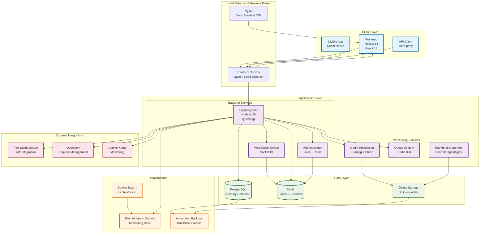
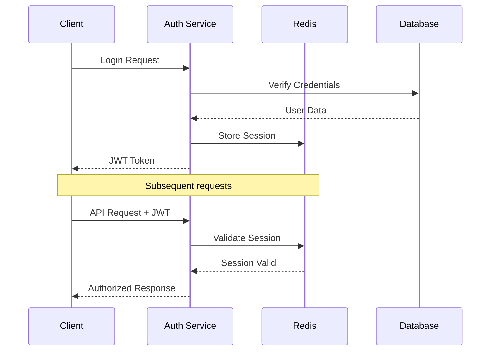

# MediaNest System Architecture

## High-Level Architecture Overview



## Architecture Principles

### 🏗️ **Microservices Architecture**
- **Separation of Concerns**: Each service handles a specific domain
- **Independent Scaling**: Services can scale based on load
- **Fault Isolation**: Service failures don't cascade

### 🔒 **Security First**
- **Defense in Depth**: Multiple security layers
- **Principle of Least Privilege**: Minimal required permissions
- **Zero Trust Network**: Verify every connection

### 📈 **Performance & Scalability**
- **Horizontal Scaling**: Add more instances as needed
- **Caching Strategy**: Multi-tier caching with Redis
- **Asynchronous Processing**: Non-blocking operations

### 🔧 **Operational Excellence**
- **Infrastructure as Code**: Docker & Docker Compose
- **Monitoring & Alerting**: Comprehensive observability
- **Automated Recovery**: Self-healing systems

## Component Responsibilities

| Component | Purpose | Technology | Scaling Strategy |
|-----------|---------|------------|------------------|
| **Frontend** | User Interface & Experience | Next.js 14, React 18, TypeScript | CDN + Edge Caching |
| **API Gateway** | Request routing, rate limiting | Express.js, Helmet, CORS | Horizontal (Load Balancer) |
| **Authentication** | User auth, session management | JWT, Redis, bcryptjs | Stateless + Redis clustering |
| **Media Processing** | Video/image processing | FFmpeg, Sharp | Queue-based horizontal |
| **Database** | Data persistence | PostgreSQL 15+ | Read replicas, connection pooling |
| **Cache Layer** | Performance optimization | Redis 7+ | Redis Cluster, persistence |
| **Object Storage** | Media file storage | S3-compatible | Built-in redundancy |

## Data Flow Patterns

### 🔄 **Request-Response Pattern**
```
Client → Load Balancer → API → Database → Response
```

### 📨 **Event-Driven Pattern**
```
API → Queue → Worker → Processing → Notification
```

### 🔄 **Real-time Updates**
```
Backend Event → WebSocket → Client Update
```

## Security Architecture

### 🛡️ **Authentication Flow**


### 🔐 **Data Protection Layers**
1. **Transport**: TLS 1.3 encryption
2. **Application**: Input validation, sanitization
3. **Database**: Encrypted at rest, connection encryption
4. **Session**: Secure JWT tokens, Redis session store

## Performance Characteristics

### ⚡ **Response Time Targets**
- **API Endpoints**: < 100ms (95th percentile)
- **Media Upload**: < 5s for 100MB files
- **Search Queries**: < 50ms
- **Page Load**: < 2s (First Contentful Paint)

### 📊 **Scalability Metrics**
- **Concurrent Users**: 1000+ simultaneous
- **File Storage**: Unlimited (S3 scaling)
- **Database**: 10TB+ with read replicas
- **Processing Queue**: 100+ jobs/minute

## Deployment Architecture

### 🐳 **Docker Swarm Orchestration**
```yaml
Services:
  - medianest-frontend (3 replicas)
  - medianest-backend (3 replicas)  
  - medianest-worker (2 replicas)
  - postgres (1 primary + 2 read replicas)
  - redis (3-node cluster)
  - traefik (2 replicas)
```

### 📈 **Auto-scaling Triggers**
- **CPU Usage**: > 70% for 5 minutes
- **Memory Usage**: > 80% for 3 minutes
- **Queue Depth**: > 100 pending jobs
- **Response Time**: > 200ms average

## Integration Points

### 🔌 **External Services**
- **Plex**: Media library sync, metadata enrichment
- **Overseerr**: Content request management
- **Uptime Kuma**: Infrastructure monitoring
- **Third-party APIs**: Metadata providers (TMDB, TVDB)

### 📡 **Webhook System**
- **Media Events**: Upload, processing completion
- **User Events**: Registration, role changes  
- **System Events**: Health checks, alerts

## Disaster Recovery

### 💾 **Backup Strategy**
- **Database**: Point-in-time recovery (PITR)
- **Media Files**: Incremental backups to secondary storage
- **Configuration**: Version-controlled infrastructure

### 🔄 **Recovery Procedures**
- **RTO (Recovery Time Objective)**: < 15 minutes
- **RPO (Recovery Point Objective)**: < 5 minutes data loss
- **Automated Failover**: Health check-based switching

---

*This architecture supports the MediaNest platform's core mission of providing scalable, secure, and performant media management capabilities.*