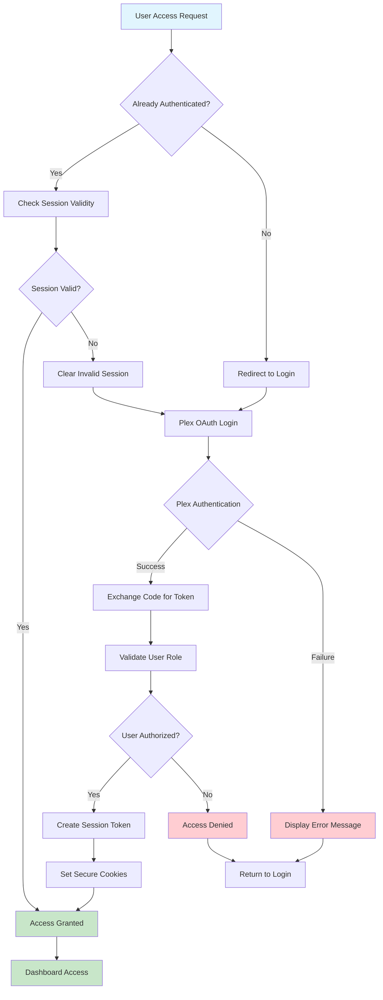
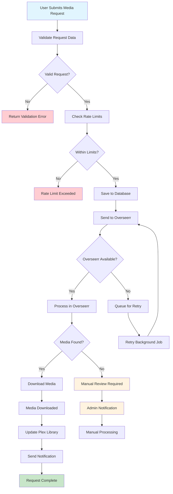
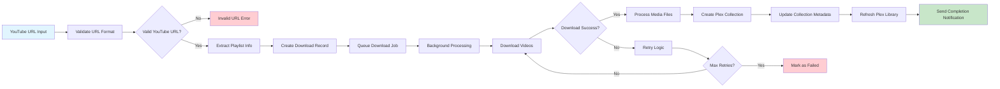
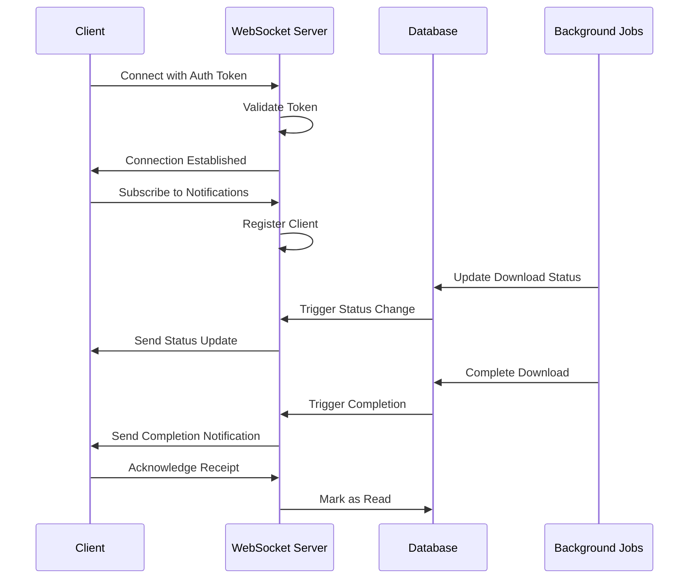
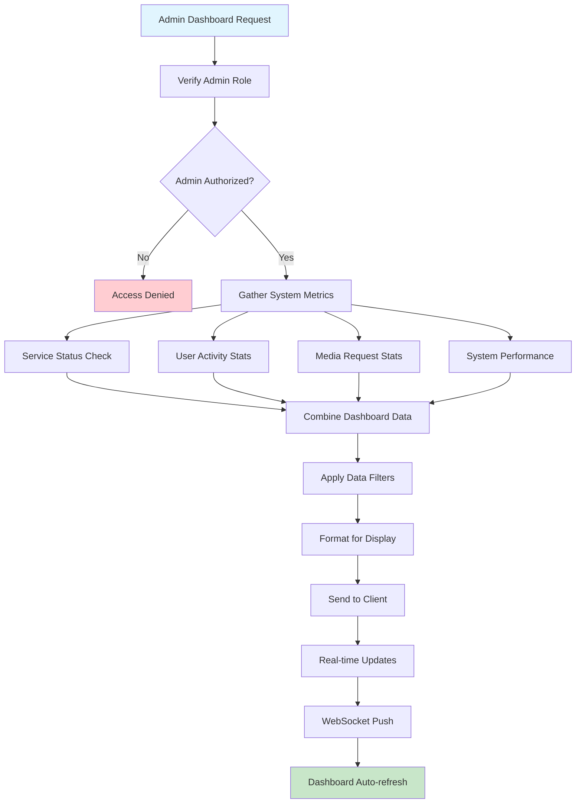
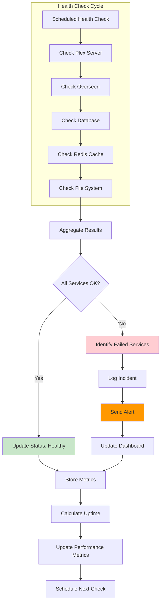
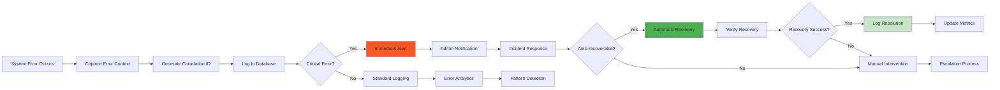
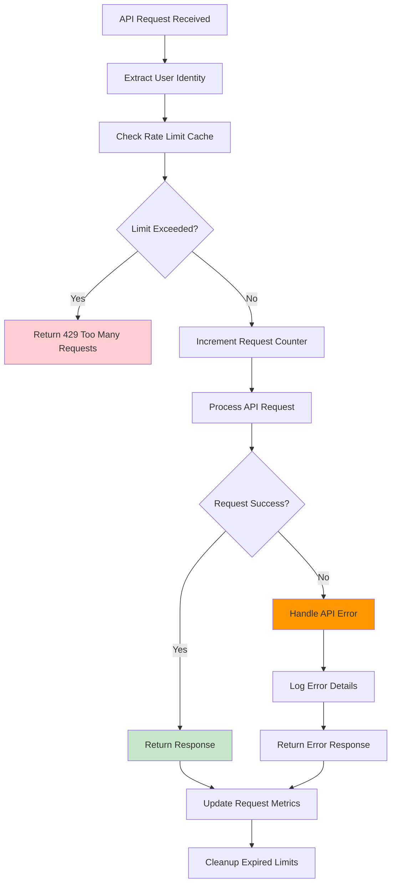

# Interactive System Flow Diagrams

This document provides comprehensive, interactive Mermaid diagrams depicting key system flows in MediaNest. These diagrams are designed for MKDocs Material compatibility and include detailed user journeys, authentication flows, and media request processes.

## User Authentication Flow

The authentication flow integrates with Plex OAuth and includes session management with security features:

## Media Request Processing Flow

This diagram shows the complete flow from user request to media availability in Plex:

## YouTube Download Workflow

MediaNest supports YouTube playlist downloads with Plex collection integration:

## WebSocket Real-time Communication

Real-time updates for download progress and system status:

## Admin Dashboard Data Flow

Administrative dashboard showing system metrics and user management:

## Service Health Monitoring Flow

Continuous monitoring of external services and system health:

## Error Handling and Recovery

Comprehensive error handling with logging and recovery mechanisms:

## API Rate Limiting Flow

Protect APIs with intelligent rate limiting and user management:

## Diagram Interaction Notes

These diagrams support the following interactive features in MKDocs Material:

1. **Click Navigation**: Click on nodes to jump to relevant documentation sections
2. **Zoom and Pan**: Use mouse/touch to explore detailed flows
3. **Responsive Design**: Diagrams adapt to different screen sizes
4. **Print Optimization**: High-quality rendering for documentation exports
5. **Accessibility**: Screen reader compatible with proper alt text

## Technical Implementation

- **Mermaid Version**: 10.x compatible
- **Theme Integration**: Uses Material Design color palette
- **Performance**: Lazy loading for complex diagrams
- **Validation**: Automated syntax checking in CI/CD pipeline

## Diagram Maintenance

- Update diagrams when system architecture changes
- Validate syntax with `mermaid-cli` in pre-commit hooks
- Review quarterly for accuracy and relevance
- Coordinate updates with code changes through GitOps workflow

For detailed implementation of each flow, refer to the corresponding API documentation and technical specifications.