# MediaNest User Journey Flowcharts

## 👤 User Personas & Journey Maps

### Primary User Personas

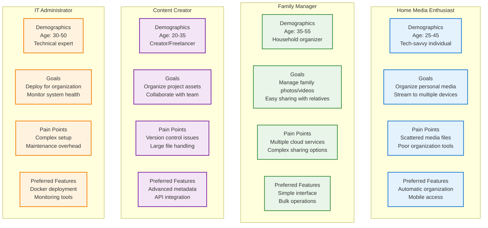

## 🚀 Initial User Onboarding Journey

### First-Time User Experience

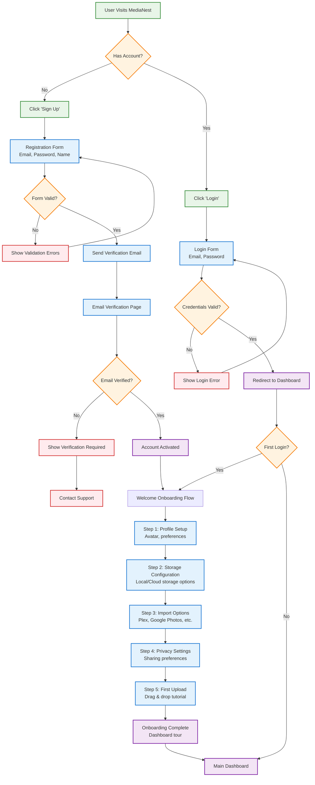

### Onboarding Success Metrics

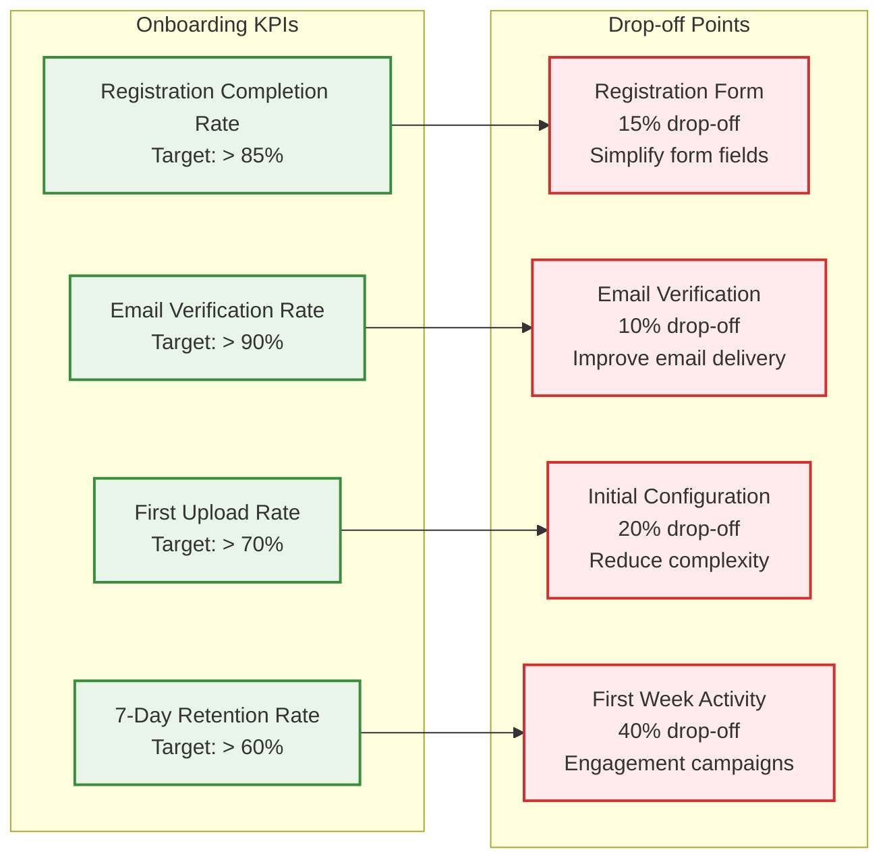

## 📁 Core User Workflows

### Media Upload & Management Journey

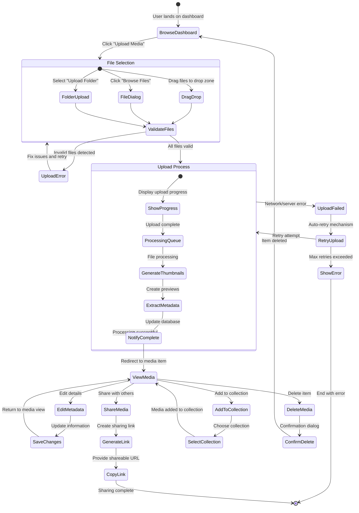

### Collection Management Workflow

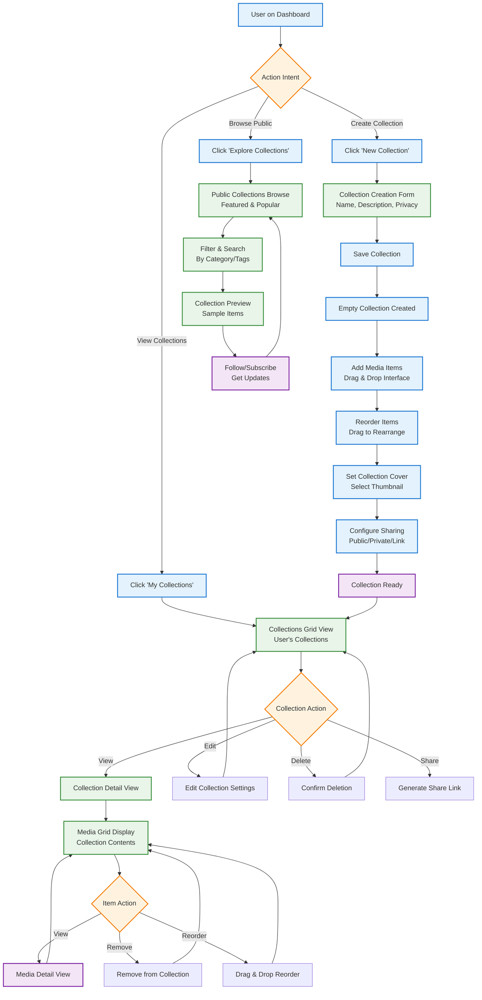

## 🔍 Search & Discovery Journey

### Search User Experience Flow

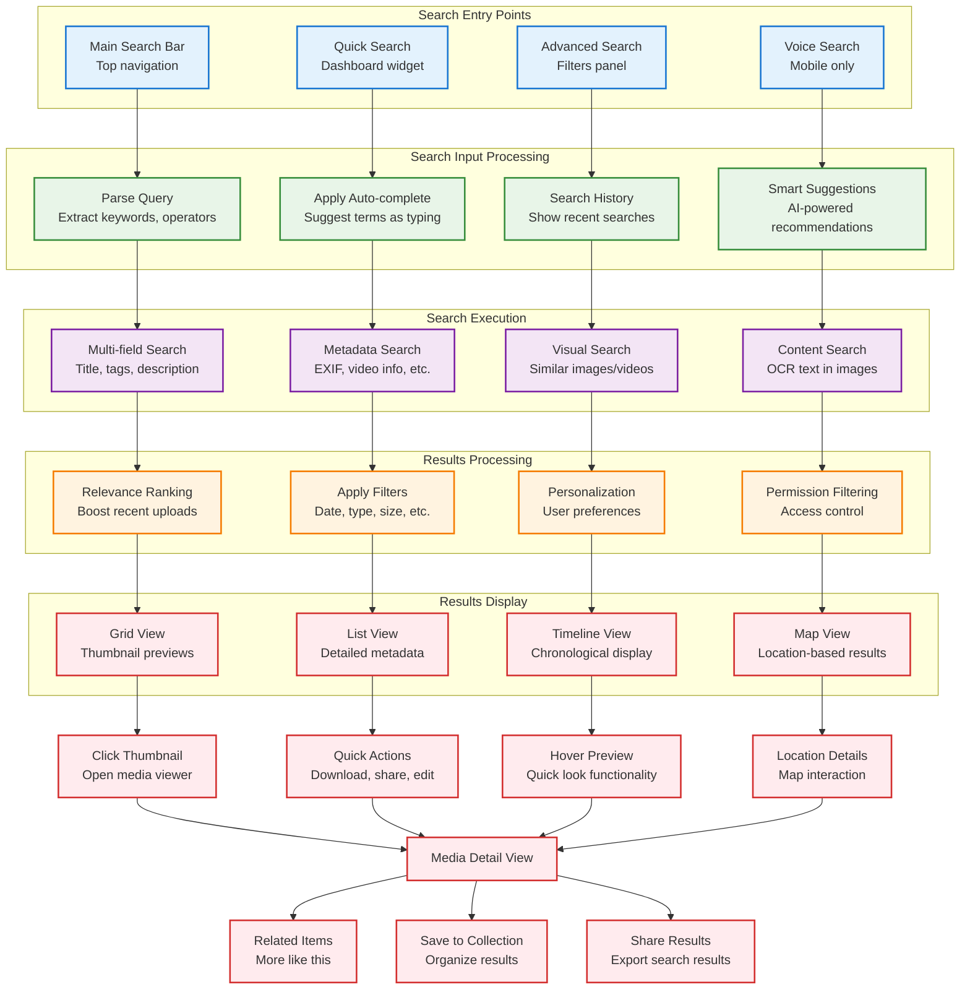

### Search Performance & User Satisfaction

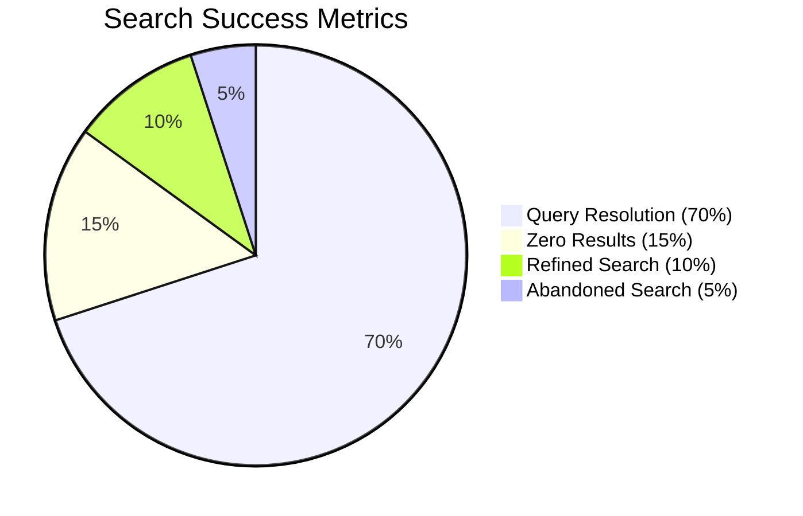

## 👥 Sharing & Collaboration Workflows

### Content Sharing Journey

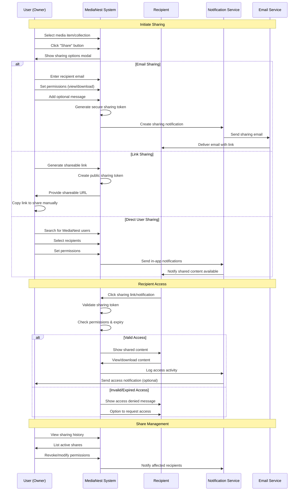

### Collaboration Features User Flow

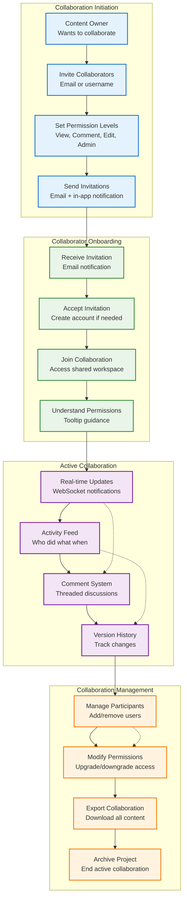

## 📱 Mobile User Experience Journey

### Mobile App User Flow

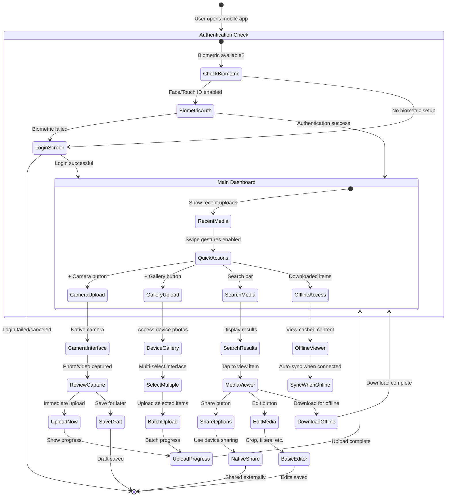

### Mobile-Specific Features

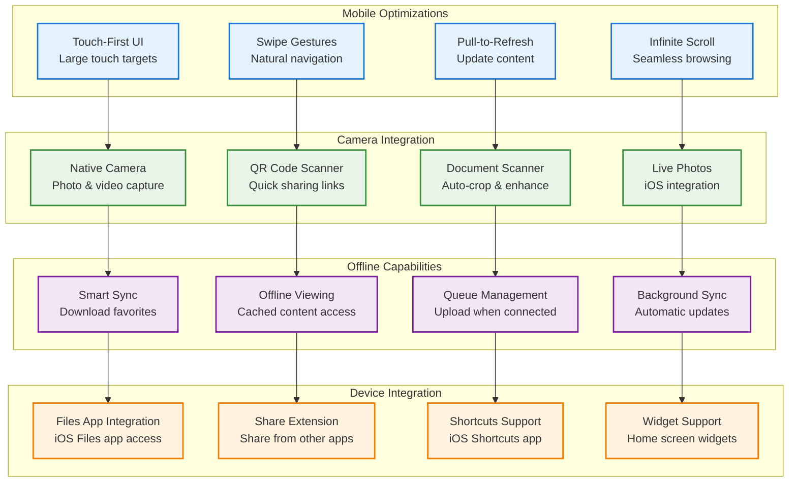

## 🎯 User Engagement & Retention Strategies

### Engagement Touchpoints

```mermaid
journey
    title User Engagement Journey
    section Week 1: New User
      Welcome Email          : 5: User
      First Upload Tutorial  : 4: User
      Mobile App Download    : 3: User
      
    section Week 2: Active Usage
      Collection Creation    : 4: User
      Sharing First Item     : 5: User
      Plex Integration       : 3: User
      
    section Month 1: Power User
      Advanced Search Use    : 4: User
      API Key Generation     : 2: User
      Community Participation: 3: User
      
    section Month 3: Advocate
      Feature Feedback       : 5: User
      Referral Program       : 4: User
      Beta Feature Testing   : 5: User
```

### User Success Metrics Dashboard

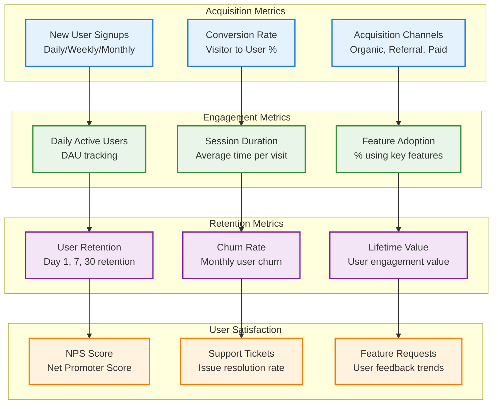

---

*These user journey flowcharts provide deep insights into MediaNest user experiences, enabling data-driven improvements to user satisfaction and platform adoption.*