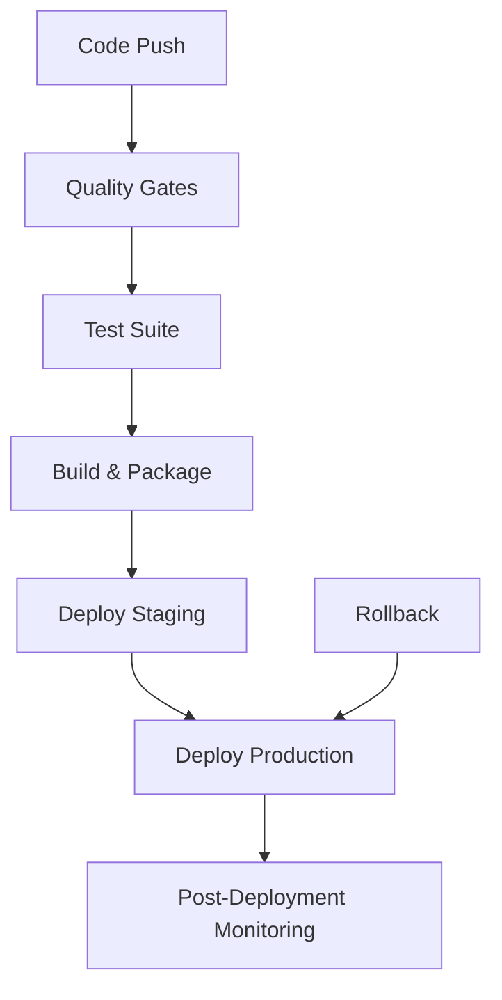

# 🚀 MediaNest Deployment Automation Guide

## Overview

This guide provides comprehensive documentation for the MediaNest CI/CD pipeline automation system, designed for production-ready deployments with advanced quality gates, security monitoring, and automated rollback capabilities.

## 📋 Table of Contents

- [Pipeline Architecture](#pipeline-architecture)
- [Quality Gates](#quality-gates)
- [Deployment Stages](#deployment-stages)
- [Monitoring & Alerts](#monitoring--alerts)
- [Rollback Procedures](#rollback-procedures)
- [Local Development](#local-development)
- [Troubleshooting](#troubleshooting)

## 🏗️ Pipeline Architecture

### GitHub Actions Workflows

#### 1. Production CI/CD Pipeline (`.github/workflows/ci-cd-production.yml`)

**Triggers:**

- Push to `main` or `develop` branches
- Pull requests to `main`
- Manual workflow dispatch

**Stages:**



#### 2. Security Monitoring (`.github/workflows/security-monitoring.yml`)

- Continuous security scanning
- Dependency vulnerability detection
- Code security analysis
- Container security validation

#### 3. Performance Monitoring (`.github/workflows/performance-monitoring.yml`)

- Bundle size analysis
- Build performance benchmarking
- Lighthouse performance audits
- Runtime performance testing

#### 4. Automated Rollback (`.github/workflows/automated-rollback.yml`)

- Emergency rollback procedures
- Pre-rollback validation
- Post-rollback monitoring
- Incident reporting

## 🎯 Quality Gates

### Quality Gate Thresholds

| Metric                   | Threshold    | Action on Failure |
| ------------------------ | ------------ | ----------------- |
| TypeScript Errors        | ≤ 5 errors   | Block deployment  |
| Critical Vulnerabilities | ≤ 5 critical | Block deployment  |
| Test Coverage            | ≥ 80%        | Block deployment  |
| Build Time               | ≤ 2 minutes  | Warning/Block     |
| Bundle Size              | ≤ 2MB        | Warning           |
| Lighthouse Performance   | ≥ 90%        | Warning           |

### Quality Gate Commands

```bash
# Run all quality gates locally
npm run ci:quality-gates

# Individual quality checks
npm run type-check          # TypeScript validation
npm run lint                # Code linting
npm run lint:security       # Security linting
npm run test:coverage       # Test coverage
npm run security:audit      # Dependency audit
```

## 🚀 Deployment Stages

### 1. Quality Gates Stage

**Purpose:** Validate code quality before deployment
**Checks:**

- TypeScript compilation
- ESLint validation
- Prettier formatting
- Security scanning

**Configuration:**

- Max TypeScript errors: 5
- Max critical vulnerabilities: 5
- Zero ESLint errors required

### 2. Test Suite Stage

**Test Types:**

- **Unit Tests:** Component and utility function testing
- **Integration Tests:** API and service integration validation
- **End-to-End Tests:** Full application workflow testing

**Matrix Strategy:**

```yaml
strategy:
  matrix:
    test-type: [unit, integration, e2e]
```

### 3. Build & Package Stage

**Features:**

- Multi-platform Docker builds (AMD64, ARM64)
- Build time monitoring
- Container security scanning
- SBOM generation
- SLSA provenance

**Optimization:**

- Docker layer caching
- Multi-stage builds
- BuildKit optimizations

### 4. Deployment Stages

#### Staging Deployment

- **Trigger:** Push to `develop` branch
- **Environment:** staging.medianest.com
- **Features:**
  - Smoke tests
  - Performance validation
  - Integration testing

#### Production Deployment

- **Trigger:** Push to `main` branch or manual dispatch
- **Environment:** medianest.com
- **Strategy:** Blue-Green deployment
- **Features:**
  - Pre-deployment checks
  - Traffic switching
  - Rollback capability

### 5. Post-Deployment Monitoring

- Health check validation
- Performance monitoring setup
- Alert configuration
- Notification sending

## 📊 Monitoring & Alerts

### Health Checks

```bash
# Local health check
npm run health:check

# Staging health check
npm run deploy:staging

# Production health check
npm run deploy:production
```

### Performance Benchmarking

```bash
# Run performance benchmark
npm run performance:benchmark

# Analyze bundle size
npm run analyze:bundle

# Full performance analysis
npm run analyze:full
```

### Monitoring Stack

- **Prometheus:** Metrics collection
- **Grafana:** Visualization and dashboards
- **Loki:** Log aggregation
- **Traefik:** Load balancing and SSL

## 🔄 Rollback Procedures

### Automatic Rollback Triggers

- Deployment failure
- Health check failures
- Performance degradation
- Security incidents

### Manual Rollback

```bash
# Emergency rollback workflow
gh workflow run automated-rollback.yml \
  -f rollback_target=last-stable \
  -f environment=production \
  -f reason=critical-bug
```

### Rollback Types

1. **Last Stable:** Roll back to last successful deployment
2. **Specific Commit:** Roll back to specific commit SHA
3. **Previous Release:** Roll back to previous tagged release

### Post-Rollback Monitoring

- 15-minute monitoring period
- Health check validation
- Performance verification
- Incident reporting

## 🛠️ Local Development

### Prerequisites

```bash
# Install dependencies
npm install

# Install security plugins
npm install --save-dev eslint-plugin-security
```

### Development Workflow

```bash
# Start development server
npm run dev

# Run quality checks
npm run ci:quality-gates

# Run tests
npm run test:coverage

# Build for production
npm run build
```

### Docker Development

```bash
# Build development image
docker build -t medianest-frontend:dev .

# Build production image
docker build -t medianest-frontend:prod -f Dockerfile.prod .

# Run with Docker Compose
docker-compose -f docker-compose.production.yml up
```

## 🔧 Configuration

### Environment Variables

#### Required Production Variables

```env
# Application
NODE_ENV=production
NEXT_TELEMETRY_DISABLED=1

# Database
DATABASE_URL=postgresql://...

# Authentication
AUTH_SECRET=...
AUTH_GITHUB_ID=...
AUTH_GITHUB_SECRET=...

# Monitoring
GRAFANA_ADMIN_PASSWORD=...
ACME_EMAIL=admin@medianest.com
```

#### GitHub Secrets

- `GITHUB_TOKEN` (automatic)
- `GRAFANA_ADMIN_PASSWORD`
- `CODECOV_TOKEN`
- `SLACK_WEBHOOK_URL`
- `SEMGREP_APP_TOKEN`

### Workflow Configuration

#### Manual Deployment

```yaml
workflow_dispatch:
  inputs:
    environment:
      description: 'Target environment'
      required: true
      type: choice
      options: [staging, production]
    skip_tests:
      description: 'Skip test suite'
      type: boolean
      default: false
```

## 🚨 Troubleshooting

### Common Issues

#### Build Failures

```bash
# Check TypeScript errors
npm run type-check

# Fix linting issues
npm run lint:fix

# Clear build cache
npm run clean && npm run build
```

#### Test Failures

```bash
# Run tests in watch mode
npm run test:watch

# Run specific test file
npm test -- auth.test.ts

# Update test snapshots
npm test -- --update-snapshots
```

#### Deployment Failures

1. Check GitHub Actions logs
2. Verify environment variables
3. Check external service status
4. Run local health checks

#### Security Issues

```bash
# Run security audit
npm run security:audit

# Fix vulnerability
npm audit fix

# Update dependencies
npm update
```

### Performance Issues

```bash
# Analyze bundle size
npm run analyze:bundle

# Run performance benchmark
npm run performance:benchmark

# Check build performance
npm run build:performance
```

## 📈 Best Practices

### Code Quality

1. Maintain test coverage above 80%
2. Keep TypeScript errors below 5
3. Run security audits regularly
4. Use semantic commit messages

### Deployment

1. Always deploy to staging first
2. Monitor deployments for 15 minutes
3. Keep rollback procedures ready
4. Update documentation regularly

### Security

1. Rotate secrets regularly
2. Scan for vulnerabilities daily
3. Monitor security alerts
4. Use least privilege principles

### Performance

1. Monitor bundle size growth
2. Keep build times under 2 minutes
3. Optimize critical rendering path
4. Use performance budgets

## 📚 Additional Resources

- [Next.js Deployment Documentation](https://nextjs.org/docs/deployment)
- [GitHub Actions Documentation](https://docs.github.com/en/actions)
- [Docker Best Practices](https://docs.docker.com/develop/dev-best-practices/)
- [Security Scanning with Semgrep](https://semgrep.dev/docs/)

## 🤝 Contributing

1. Follow the quality gates before submitting PRs
2. Update documentation for new features
3. Test deployment procedures thoroughly
4. Monitor performance impacts

---

**Support:** For deployment issues, create an issue using the [Deployment Issue Template](.github/ISSUE_TEMPLATE/deployment-issue.md)
